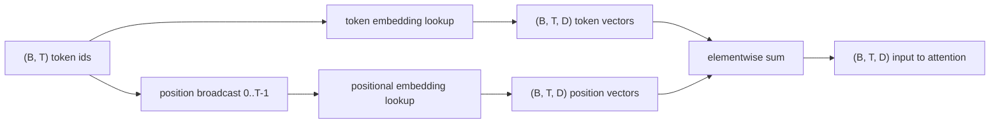
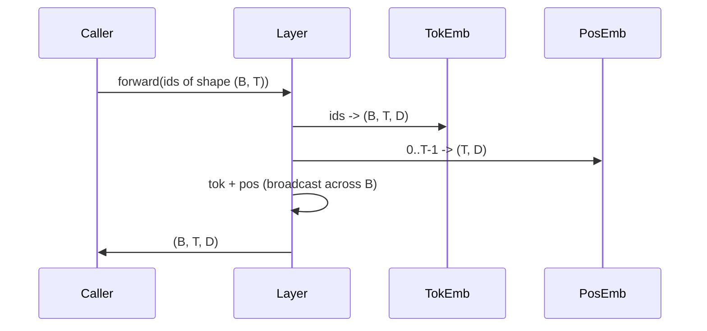

# 词元与位置嵌入

> Id 是整数。模型需要向量。两者之间隔着两张查找表，而位置表的选择决定了模型能学到什么。

**Type:** Build
**Languages:** Python
**Prerequisites:** Phase 04 课程、Phase 07 transformer 课程、本阶段的第 30 和 31 课
**Time:** 约 90 分钟

## 学习目标
- 构建一个词元嵌入查找表，将词表 id 映射为稠密向量。
- 构建一个按位置索引的可学习位置嵌入查找表。
- 构建一个按位置索引、无参数的固定正弦位置嵌入。
- 将词元嵌入和位置嵌入组合为 transformer 块的单一输入。
- 对比可学习嵌入与正弦嵌入在长度泛化和参数量上的差异。

```figure
cc-embedding-lookup
```

## 框架

模型与词元 id 的第一次接触，是在词元嵌入矩阵中进行一次行查找。该矩阵每个词表 id 对应一行，每个模型维度对应一列。查找返回一个向量，模型的其余部分将其视为该 id 的含义。反向传播只更新前向传播中用到的行。随着训练进行，这些行的几何结构会学会在各个方向上编码相似性。

词元 id 本身没有顺序。模型需要第二个信号来告诉它位置一与位置十七是不同的。这个信号有两种主流选择：可学习位置嵌入（第二张查找表，每个位置一行）和固定正弦位置嵌入（一个没有参数的数学公式）。这个选择是有后果的。可学习表是一个参数，且受限于模型训练时的最大上下文长度。正弦表在理论上无参数，公式可以延伸到任意位置，但本课的 `SinusoidalPositionalEmbedding` 在 `max_context_length` 处预先计算了一张固定表，其 `forward` 会抛出超过该上限的异常；因此两个模块在这里都强制执行了最大上下文长度。即使表足够大可以索引，模型在超出训练长度时仍可能表现不佳。

本课构建这两种嵌入，并将它们与词元嵌入组合，作为下一课注意力块的单一输入。

## 形状契约

嵌入阶段的输入是一批形状为 `(B, T)` 的词元 id。输出是形状为 `(B, T, D)` 的张量，其中 `D` 是模型维度。每个批次元素具有相同的上下文长度 `T`。每个位置具有相同的向量维度 `D`。



组合方式是求和，而不是拼接。求和使 `D` 在整个网络中保持不变，并让模型能够在逐特征的基础上决定在每个层中是词元含义还是位置占主导。

## 词元嵌入矩阵

词元嵌入是一个形状为 `(V, D)` 的参数张量，其中 `V` 是词表大小。PyTorch 将其暴露为 `nn.Embedding(V, D)`。初始化时，条目从一个小的高斯分布中抽取，传统上均值为零，对 transformer 规模的模型标准差约为 `0.02`。确切的初始化方式不如保持跨运行一致重要。

前向传播就是一次索引操作。PyTorch 通过收集行，将 `(B, T)` int64 的 id 映射为 `(B, T, D)` 浮点数。反向传播只将梯度累积到前向传播中被触碰的行。从未出现在批次中的两行在该步骤收到的梯度为零。

一个细微之处。词元嵌入和模型末端的输出投影常常共享权重（权重绑定）。发生这种情况时，每次反向传播都会通过输出侧触及嵌入的每一行。本课将两者暴露为独立模块，但在完整模型中，同一个矩阵可以同时扮演这两个角色。

## 可学习位置嵌入

可学习位置嵌入是第二张形状为 `(max_context_length, D)` 的 `nn.Embedding`。查找以位置 id `0, 1, 2, ..., T-1` 为键。前向传播将该位置向量沿批次维度广播。

可学习表的缺点是，如果模型只在位置 `T-1` 以内训练过，就无法查询位置 `T`。那一行不存在。使用这种方案的生产级 decoder-only 模型将最大上下文长度固化在架构中，并拒绝处理更长的输入。

## 正弦位置嵌入

正弦位置嵌入是一个从位置到向量的函数。位置 `p` 和特征 `i` 生成

```python
angle = p / (10000 ** (2 * (i // 2) / D))
emb[p, 2k]     = sin(angle)
emb[p, 2k + 1] = cos(angle)
```

该函数没有参数。每个位置都有唯一的向量。波长在特征维度上按几何级数变化，因此较低的维度编码粗粒度位置，较高的维度编码细粒度位置。

由 `sin` 和 `cos` 的选择共同得出的性质是：位置 `p + k` 处的向量是位置 `p` 处向量的线性函数。这为注意力层提供了一条学习相对位置偏移的便捷路径。模型不需要单独的参数来表达“向后看五个词元”。

本课在构造时一次性计算完整的正弦表，并在前向传播时对它进行索引。

## 组合

输入管线按顺序做三件事。读取词元 id。查找词元向量。加上位置向量。返回和。



求和步骤中的广播操作将 `(T, D)` 位置张量沿批次维度复制。PyTorch 会自动处理这一点，因为位置张量在 unsqueeze 之后形状为 `(1, T, D)`。

## 对比分析

本课在相同输入上运行两种变体，并打印两个诊断信息。

第一个是参数量。可学习变体在词元嵌入之上增加了 `max_context_length * D` 个参数。正弦变体增加零个。

第二个是相邻位置嵌入之间的余弦相似度。正弦变体具有平滑且可预测的衰减，因为该函数是连续的。可学习变体在初始化时具有接近随机的相似度，因为各行是独立抽取的。训练之后，可学习变体通常会发展出类似平滑结构，但它必须从数据中发现这种结构。

## 本课不做的事

它不构建旋转位置编码（RoPE）或 AliBi。这些是生产级 transformer 中的现代选择。它们都遵循与这里的嵌入相同的形状契约（对形状为 `(B, T, D)` 的向量施加位置相关的变换），但它们应用于注意力投影步骤而不是输入端。下一课构建注意力块，其中一个可选扩展是在那里将旋转编码融入 query-key 投影。

它不训练嵌入。训练需要一个损失，损失需要模型输出，模型输出需要注意力和一个 LM head。那是下一课以及再下一课的内容。

## 如何阅读代码

`main.py` 定义了三个模块。`TokenEmbedding` 封装了 `nn.Embedding(V, D)`。`LearnedPositionalEmbedding` 封装了 `nn.Embedding(L, D)`。`SinusoidalPositionalEmbedding` 预计算表并将其作为 buffer 暴露。`EmbeddingComposer` 将词元嵌入和位置嵌入绑在一起。底部的演示打印形状、参数量和相邻位置相似度诊断。`code/tests/test_embeddings.py` 中的测试固定了形状、广播行为、参数量以及正弦公式。

运行演示。然后将模型维度 `D` 从 64 改为 32，观察正弦波长带如何变化。