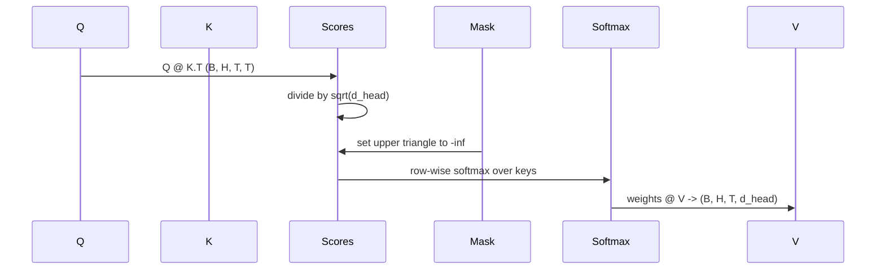

# 多头自注意力

> 一次线性投影,三种视图,H 个并行头,一个掩码。这就是模型实际使用的注意力模块。

**Type:** Build
**Languages:** Python
**Prerequisites:** Phase 04 课程,Phase 07 transformer 课程,本阶段的第 30 到 32 课
**Time:** ~90 minutes

## 学习目标
- 将批量化 Query/Key/Value 投影实现为一个拆分成 H 个头的单一线性层。
- 以正确的归一化和 dtype 处理来计算缩放点积注意力。
- 应用因果掩码,防止某个位置关注未来的位置。
- 检查固定输入下的每个头的注意力权重,并推理每个头在关注什么。
- 在一个玩具任务上训练一个小型注意力模块,观察损失随各头特化而下降。

```figure
cap-multihead-attention
```

## 整体框架

注意力是这样一种函数:让一个 token 的表示从同一序列中的其他 token 拉取信息。自注意力意味着 query、key 和 value 全部派生自同一个输入。多头意味着投影被拆分为 H 个并行的注意力问题,其输出被拼接后再投影回去。

高效的实现模式是:一个线性层从 `D` 投影到 `3 * D`,切片成三个视图,再重塑为每个大小为 `D // H` 的 H 个头。矩阵乘法、softmax 和加权和都以批量张量操作完成,从而让各个头在加速器上并行运行。

本课构建这个模块。它还加入了因果掩码,使同样的代码可以作为仅解码器语言模型中的注意力层使用。下一课将该模块堆叠成完整的 transformer,再下一课对其进行训练。

## 形状约定

输入是 `(B, T, D)`。输出是 `(B, T, D)`。掩码是 `(T, T)` 或可广播到该形状。在模块内部,中间张量的形状为 `(B, H, T, d_head)`,其中 `d_head = D // H`。约束是 `D % H == 0`。

```mermaid
flowchart LR
    A["(B, T, D) input"] --> B[Linear D -> 3D]
    B --> C["split into Q, K, V"]
    C --> D["reshape to (B, H, T, d_head)"]
    D --> E["scores = Q @ K.T / sqrt(d_head)"]
    E --> F[apply causal mask]
    F --> G[softmax over keys]
    G --> H["context = weights @ V"]
    H --> I["reshape to (B, T, D)"]
    I --> J[output Linear D -> D]
    J --> K["(B, T, D) output"]
```



两个线性层(QKV 投影和输出投影)是模块中唯一的参数。掩码、softmax、矩阵乘法和重塑全部不含参数。

## QKV 拆分

朴素的实现有三个独立的线性层,分别用于 Q、K 和 V。高效的实现只有一个输出 `3 * D` 个特征再拆分结果的层。两者在数学上等价,因为用 `(D, D)` 权重做三次独立的矩阵乘法,恰好等价于用由它们堆叠而成的一个 `(3D, D)` 权重做一次矩阵乘法。

高效版本更快,因为加速器只需启动一次矩阵乘法而不是三次。它也更容易初始化,因为三个子矩阵位于同一个参数张量中,可以一起初始化。

## 头的重塑

拆分之后,Q、K、V 中的每一个都是 `(B, T, D)`。为了把它变成 H 个并行注意力问题,我们重塑为 `(B, T, H, d_head)`,再转置为 `(B, H, T, d_head)`。这样头维度就紧挨着批维度,PyTorch 会把每个头的注意力当作跨 `B * H` 个独立实例的批量操作。

d_head 维度保持在最后一维,使分数矩阵乘法 `Q @ K.transpose(-2, -1)` 在该维度上收缩。结果是 `(B, H, T, T)` 的逐头注意力分数。

## 缩放

分数在 softmax 之前要除以 `sqrt(d_head)`。如果没有这个缩放,点积会随 `d_head` 增长而增长,把 softmax 推入一个几乎全部概率质量集中在某一项、其余项趋近于零的区域。该区域的梯度极小,学习会停滞。除以 `sqrt(d_head)` 可以让分数的方差在不同头大小下大致恒定。

## 因果掩码

仅解码器语言模型在预测下一个 token 时只能以过去为条件。掩码就是用来强制这一点的。具体而言,在 softmax 之前,`(T, T)` 分数矩阵中对角线之上的每个条目都会被替换为负无穷。经过 softmax 后,这些位置的权重变为零。



我们在构造时把掩码注册为 buffer,这样它与模型位于同一设备上,并且不属于梯度图。掩码覆盖该模块会见到的最大上下文长度。在前向传播时,我们切片其左上角的 `(T, T)` 部分。

## 输出投影

在得到逐头上下文向量 `(B, H, T, d_head)` 之后,我们转置回 `(B, T, H, d_head)`,重塑为 `(B, T, D)`,再应用最终的 `(D, D)` 线性投影。输出投影让模型能够混合各个头。没有它,H 个头只能通过后面的层重新组合,该模块就会受到人为限制。

## 注意力权重检查

本课在前向传播上暴露了一个 `return_weights=True` 标志。设置后,模块会在返回输出的同时返回形状为 `(B, H, T, T)` 的逐头注意力权重。演示会在一个短输入上打印某个头权重的热力图,让你能看到因果三角结构和每个位置的注意力焦点。

在训练好的模型中,不同的头学到不同的模式。有些头关注紧邻的前一个 token。有些头关注序列的开头。有些头的注意力几乎均匀分布。这个检查钩子就是做这类可解释性工作的入口。

## 训练演示

`main.py` 底部的演示把注意力模块接到一个极小的 LM head 上,并在一个重复任务上训练整体。输入的每一行是一个跨上下文复制的单一随机 id。目标是输入右移一位后的结果,因此模型必须学会下一个 token 与前一个 token 相同。损失是交叉熵。在 H=4、D=32、T=12、词表为 64 的设置下,损失从随机水平(约 `log(64) ~ 4.16`)在 CPU 上经过三个 epoch 降到远低于 `1.0`。

演示的重点不是训练一个有用的模型。重点是确认梯度流经模块的每一个部分,并且各个头能在一个答案显而易见的问题上学到东西。

## 本课不做什么

它不添加前馈模块。真实模型中的 transformer 层是注意力之后接一个两层 MLP,每部分周围有残差连接和 layer norm。下一课会加入这些。

它不实现 rotary 或 AliBi 位置编码。两者都在同一模块的 QKV 投影步骤处应用,但它们是一个独立的教学单元。这里构建的模块通过在矩阵乘法之前变换 Q 和 K,即可与二者兼容。

它不实现用于推理的 KV cache。跨前向传播缓存 key 和 value 是让自回归解码变快的优化。它会改变 K 和 V 张量的形状约定,但不改变 Q 的。它属于推理课的内容。

## 如何阅读代码

`main.py` 定义了 `MultiHeadSelfAttention`。该类包含两个线性层和一个注册的掩码 buffer。前向传播依次执行:投影、重塑、打分、掩码、softmax、加权、重塑、再次投影。底部的演示构建一个小模型,将注意力与 token 嵌入、位置嵌入和一个 LM head 包装在一起,在一个复制任务上训练三个 epoch,并打印损失曲线和逐头注意力热力图。`code/tests/test_attention.py` 中的测试固定了形状约定、因果性、softmax 性质、头拆分性质以及梯度流。

运行演示。然后把 `n_heads` 从 4 增加到 8(保持 `d_model=32`,即 `d_head=4`),观察热力图的变化。