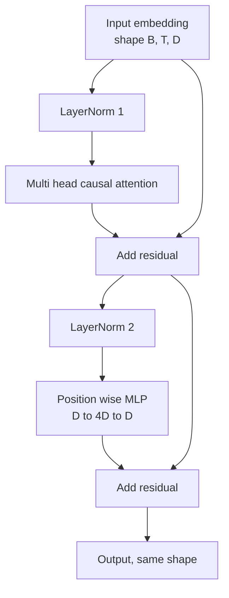
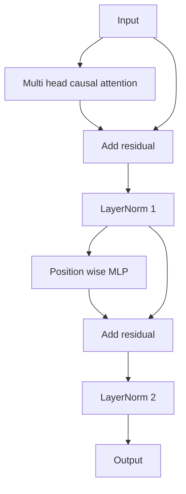

# 从零实现 Transformer 块

> 单个块是所有现代解码器 LLM 的基本单元。层归一化、多头注意力、残差、MLP、残差。Pre-LN 变体无需预热即可稳定训练。Post-LN 变体是原始论文所采用的方案。本课并排构建这两种变体，并展示在常见学习率下哪一种能在 12 层堆叠中保持训练稳定。

**Type:** Build
**Languages:** Python
**Prerequisites:** 阶段 19 第 30 至 33 课（分词器、嵌入、注意力数学、批量数据加载器）
**Time:** 约 90 分钟

## 学习目标

- 用四个活动部件在 PyTorch 中构建 transformer 块：LayerNorm、多头因果注意力、残差连接、逐位置 MLP。
- 以两种配置（pre-LN 和 post-LN）放置 LayerNorm，并解释为什么其中一种无需预热即可稳定训练。
- 在多头注意力内部实现因果掩码，使 token `i` 无法看到 token `j > i`。
- 在 12 层堆叠中跟踪两种变体的梯度流动，并避免含糊地解读结果。
- 在下一课组装 1.24 亿参数的 GPT 时，将该块作为即插即用单元复用。

## 问题所在

Transformer 就是一个块的不断重复。如果块写错一次，再重复十二次，你交付的就是一个在第一个 epoch 就发散的模型，或者一个后续全程需要预热技巧的模型。本课中你将看到的两种失败模式并不罕见。它们会在学习者第一次天真地堆叠块时出现。其一是注意力层看到了未来。其二是 LayerNorm 放在了无法在深层驯服残差信号的位置。

一旦你看清了问题，修复就是机械性的。这个块恰好有两条残差路径和两个归一化位置。正确选择位置后，堆叠的其余部分只是记录工作。

## 概念

每个仅解码器的 transformer 块都是一个函数，接受形状为 `(batch, sequence, embedding)` 的张量并返回相同形状的张量。内部由两个子层完成工作。



这是 pre-LN 变体。LayerNorm 位于残差分支内部、子层之前。残差连接将未归一化的信号向前传递。

post-LN 变体将 LayerNorm 移到残差相加之后。



形状完全相同，训练行为却不同。使用 post-LN 时，沿残差路径回传的梯度必须经过 LayerNorm。在十二层深度和学习率 `3e-4` 下，该梯度衰减得足够快，以至于需要预热调度。Pre-LN 使残差路径保持未归一化，因此梯度可以干净地传播到嵌入层。正因如此，从 GPT-2 开始的模型都采用 pre-LN 配置。

### 因果多头注意力

注意力子层将输入以三种方式投影为 query、key、value 张量。每个张量从 `(B, T, D)` 重塑为 `(B, H, T, D/H)`，其中 `H` 是头数。缩放点积注意力对每个头计算 `softmax(Q K^T / sqrt(d_k))`，将上三角掩码为负无穷，通过 softmax 应用掩码，然后乘以 `V`。各头的输出拼接回单个 `(B, T, D)` 张量，再做一次投影。掩码是使模型具有因果性的唯一部件。忘记掩码，你训练出的模型就是在作弊。

### MLP

逐位置 MLP 将同一个两层网络独立地应用于每个 token。隐藏层宽度是嵌入宽度的四倍，激活函数是 GELU，第二个线性层之后接一个 dropout。在 MLP 内部，token 之间不相互交流。所有 token 混合都发生在注意力中。

### 残差连接的两重作用

它们使梯度路径在深度方向上成为相加性的，从而在十二层中保持梯度范数不失控。它们还让每个块学习对当前表示的相加性更新，而非完全替换。这两种效应就是块能扩展的原因。

```figure
cc-transformer-block
```

## 动手构建

`code/main.py` 实现：

- `class LayerNorm`，带可学习的缩放和偏移、eps 参数，按每个 token 向量应用。
- `class MultiHeadAttention`，带 `num_heads`、`head_dim = d_model // num_heads`、融合的 QKV 投影、注册的因果掩码、注意力 dropout 和残差 dropout。
- `class FeedForward`，带两个线性层、GELU 激活、dropout。
- `class TransformerBlock`，带一个在两种变体之间切换的 `pre_ln` 标志。
- 一个演示，构建一个 6 层 pre-LN 堆叠和一个 6 层 post-LN 堆叠，输入相同，并打印 (a) 输出形状，(b) 一次反向传播后嵌入处的梯度范数。

运行它：

```bash
python3 code/main.py
```

输出：两个堆叠的形状检查、并排的梯度范数。在相同学习率下，pre-LN 堆叠的嵌入梯度比 post-LN 堆叠大几个数量级，这就是 pre-LN 无需预热即可训练的实证信号。

## 技术栈

- `torch`，用于张量运算、autograd 和 `nn.Module` 相关的机制。
- 无 `transformers`，无预训练权重。该块从基本原语实现。

## 实际生产中的模式

三种模式能将教科书式的块变为可交付的东西。

**融合 QKV 投影。** 三个独立的线性层需要三次内核启动和三次矩阵乘法。一个宽度为 `3 * d_model` 的线性层一次启动即可完成同样的工作，然后沿最后一个轴拆分输出。融合路径在每个加速器上更快，并且与 GPT-2、LLaMA 和 Mistral 的参考实现所采用的方案一致。

**注册因果掩码缓冲区。** 掩码仅取决于最大上下文长度。在构造时用 `register_buffer` 分配一次，每次前向传播时切出活动窗口，从而省去每次调用的分配。忘记这一点会使掩码在长上下文中成为分配器的热点。

**Dropout 放两处，而非三处。** Dropout 应位于注意力 softmax 之后（注意力 dropout）和 MLP 第二个线性层之后（残差 dropout）。在残差本身上加 dropout 会破坏让梯度在深层流动的相加恒等性。一些早期实现搞错了这一点，并以脆弱的训练付出了代价。

## 使用场景

- 本课的块无需修改即可直接接入第 35 课的 GPT 组装。
- Pre-LN 变体是所有现代开放权重 LLM 使用的方案。Post-LN 变体是 2017 年原始注意力论文使用的方案。了解两者就足以读懂你将遇到的任何解码器架构。
- 将 GELU 换成 SiLU，你就得到了 LLaMA 家族的激活函数。将 LayerNorm 换成 RMSNorm，你就得到了 LLaMA 家族的归一化。骨架相同。

## 练习

1. 为块中的每个线性层添加 `bias=False` 标志。现代开放权重 LLM 的线性层不带偏置。测量在一个 12 层 768 维模型中你能节省多少参数。
2. 将 `nn.LayerNorm` 替换为手写的 RMSNorm，并验证输出形状不变。
3. 添加一个标志，将第一个头的注意力权重作为 `(B, T, T)` 张量返回。绘制上三角以确认其在 softmax 后为零。
4. 构建一个健全性检查：将带有 `H=6` 的 `(2, 16, 384)` 张量输入两种变体，并断言当权重以相同方式初始化且 dropout 置零时，前向输出不同（例如，`not torch.allclose`）。

## 关键术语

| 术语 | 人们怎么说 | 实际含义 |
|------|-----------------|------------------------|
| Pre-LN | "Pre norm" | LayerNorm 位于残差分支内部、每个子层之前；残差携带未归一化的信号 |
| Post-LN | "Post norm" | LayerNorm 位于残差相加之后；2017 年论文所采用的方案，且需要预热 |
| Causal mask | "Triangle mask" | 注意力 logits 的上三角被设为负无穷，使得当 j 大于 i 时 token i 无法读取 token j |
| Fused QKV | "Combined projection" | 一个宽度为 3D 的线性层，代替三个宽度为 D 的线性层；一次内核启动，一次矩阵乘法 |
| Residual stream | "Skip connection" | 自上而下流经每个块的未归一化张量；每个块向其添加内容 |

## 延伸阅读

- 阶段 7 第 02 课（从零实现自注意力），了解本块底层的注意力数学。
- 阶段 7 第 05 课（完整 transformer），了解同一骨架的编码器-解码器版本。
- 阶段 10 第 04 课（预训练 mini GPT），了解本块所接入的训练流程。
- 阶段 19 第 35 课（本赛道），将十二个这样的块堆叠成一个 GPT 模型。