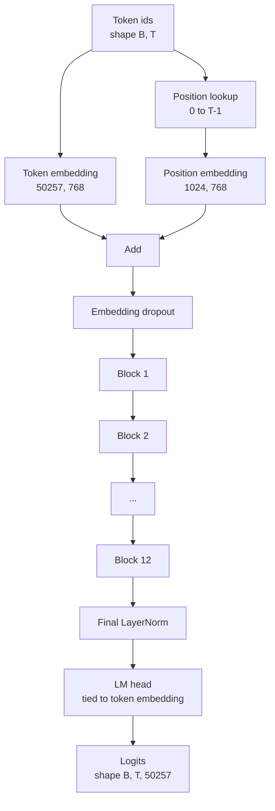
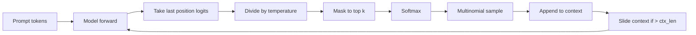

# GPT 模型组装

> 十二个块堆叠起来，加上一个词元嵌入、一个可学习的位置嵌入、一个最终的 LayerNorm，以及一个权重绑定的语言模型头。这就是完整的 1.24 亿参数 GPT 模型。本课将这些组件组装成一个可运行的类，统计参数量以确认模型与参考的 124M 形状一致，并使用多项式采样、温度和 top-k 生成文本。

**Type:** Build
**Languages:** Python
**Prerequisites:** 第 19 阶段第 30 到 34 课
**Time:** ~90 分钟

## 学习目标

- 将第 34 课的 transformer 块组装成完整的 GPT 模型：词元嵌入、位置嵌入、N 个块、最终 LayerNorm、语言模型头。
- 复现 1.24 亿参数的配置：词表 50257,上下文 1024,嵌入维度 768,十二个头，十二层。
- 将语言模型头的权重与词元嵌入绑定，并解释为什么在这个规模下这样做可以节省约 3800 万参数。
- 使用多项式采样、温度缩放和 top-k 截断从提示词生成文本，并通过滑动窗口保持上下文长度。
- 对照 124M 目标测量参数量和前向传播开销。

## 问题

transformer 块本身什么都做不了。你需要把词元 id 转换为向量，混入位置信息，把它们送入堆叠结构，再投影回词表 logits。遗漏这四个步骤中的任何一个，模型要么无法前向传播，要么位置信息发生漂移，要么无法输出。

模型的形状也很重要。参考的 GPT-2 small 是 1.24 亿参数，精确对应上面的配置。这些数字并非魔法。词表 50257 乘以嵌入维度 768 就是词元表。位置 1024 乘以 768 就是位置表。十二个块，每个约 700 万参数，共 8400 万。最终的头通过权重绑定复用词元表。把这些加起来就得到 1.24 亿。如果构建的模型参数量与参考值不符，说明你的接线出了问题。

## 概念



词元 id 变成词元向量。位置 id 变成位置向量。两者相加后送入堆叠结构。最终的 LayerNorm 是块之外唯一在每种现代变体中都保留的组件。LM 头复用词元嵌入矩阵，这就是权重绑定的含义。

### 权重绑定

词元嵌入的形状是 `(vocab, d_model)`。语言模型头需要从 `d_model` 投影回 `vocab`。两者互为转置。绑定两者意味着字面意义上使用同一个参数张量，用两次。在词表 50257、d_model 768 的情况下，该矩阵有 3800 万参数。不绑定，你要付两次。绑定后只需付一次，而且还能得到稍微更干净的梯度信号，因为嵌入和头会一起更新。

### 位置嵌入是可学习的，不是正弦的

GPT-2 采用可学习的位置嵌入。位置表是一个形状为 `(1024, 768)` 的参数张量。模型在每次前向传播时查找位置 0 到 T-1,并将查找结果加到词元嵌入上。这是最简单的位置方案(RoPE、ALiBi、T5 相对偏置是替代方案)，也是 124M 参考所使用的方案。

### 生成：温度、top-k、多项式

生成是自回归的。在每一步，模型在每个位置返回整个词表上的 logits。你只取最后一个位置，除以温度，可选地将除 top k 之外的所有 logits 掩蔽为负无穷，用 softmax 得到概率，然后从结果分布中采样一个词元。



三个旋钮，三种不同行为。温度接近零时坍缩为贪心。温度为一时匹配模型的自然分布。top-k 为一时是贪心。top-k 为四十时过滤长尾。组合很重要；下一课的训练将使用生成作为定性的评估信号。

```figure
cc-gpt-assembly
```

## 动手实现

`code/main.py` 实现：

- `class GPTModel` 包含 124M 默认值的 dataclass: `vocab_size=50257`、`context_length=1024`、`d_model=768`、`num_heads=12`、`num_layers=12`、`mlp_expansion=4`、`dropout=0.1`、`use_bias=True`、`weight_tying=True`。
- `class GPTModel` 包含词元嵌入、位置嵌入、嵌入 dropout、十二个 `TransformerBlock`、最终 LayerNorm,以及一个 `lm_head`,当标志被设置时与词元嵌入绑定。
- 一个 `count_parameters` 辅助函数，返回唯一的参数数量(因此在计数时尊重权重绑定)。
- 一个 `generate` 函数，实现温度、top-k、多项式采样和滑动窗口上下文。
- 一个演示：构建模型，将参数量与参考的 124M 并排打印，并从固定提示词生成一段短序列，端到端地展示整个流程。

运行它：

```bash
python3 code/main.py
```

输出：参数量与 124M 参考值并列，从随机提示词生成的词元 id,以及绑定开启时 LM 头与词元嵌入共享存储的确认信息。

为了让演示保持快速，脚本还会端到端运行一个微型配置(`d_model=64`、`num_layers=2`),并内联打印生成的词元序列。124M 配置会被构建，但只执行其参数统计和一次前向传播。

## 技术栈

- `torch` 用于张量运算、autograd 和模块基础设施。
- `code/main.py` 在本地重新实现第 34 课的相同块模式。

## 生产环境中的常见模式

三个模式决定了模型是“能跑”还是“能上线”。

**将残差投影初始化得较小。** 注意力的输出投影和 MLP 的第二个线性层都直接输入残差加法。如果这些层使用与其他线性层相同的标准差初始化，残差流会随深度增长，并把最终的 LayerNorm 推入过热区间。对这两个投影，将标准差按 `1 / sqrt(2 * num_layers)` 缩放；这样残差流在十二层中保持在合理范围内。

**缓存位置 id 张量，不要重复计算。** `torch.arange(T)` 在每次前向传播时都会分配新的内存。在 `__init__` 中为最大上下文一次性分配，每次调用时切出前 T 项，从而跳过内存分配的往返开销。

**在参数级别绑定权重，而不仅仅是复制。** 设置 `lm_head.weight = token_embedding.weight` 会共享张量；复制则不会。优化器需要更新一个参数，autograd 图需要一次累加。如果你复制，头会逐渐偏离嵌入，权重绑定就毫无价值。

## 使用它

- 本课的模型类与下一课训练的模型形状相同。
- 用 RoPE 替换可学习的位置嵌入，无需改动块或头，就能得到 LLaMA 家族。
- 用 SiLU 替换 GELU、用 RMSNorm 替换 LayerNorm,就能得到 LLaMA 家族的其余改动。
- 生成函数适用于任何 logits 来源，不仅限于本模型。你可以从第 37 课的预训练 GPT-2 文件中提取 logits,并复用同一个生成循环。

## 练习

1. 解除 LM 头与词元嵌入的绑定，重新统计参数。验证差值为 50257 乘以 768 = 3800 万。
2. 将可学习的位置嵌入替换为构造时计算的正弦表。确认模型仍能前向传播，且参数量减少 786,432。
3. 在生成中添加一个 `greedy=True` 标志，跳过采样并选择 argmax。确认序列在多次运行中是确定性的。
4. 添加一个 `repetition_penalty` 旋钮，在 softmax 之前将提示词或已生成历史中任何词元的 logit 除以一个常数。在固定提示词上展示大于一的值会减少输出中的重复次数。
5. 在 `top_k` 旁边添加 `top_p`(nucleus)采样。用两行代码检查被保留词元的概率之和超过 `top_p`。

## 关键术语

| 术语 | 人们怎么说 | 实际含义 |
|------|-----------------|------------------------|
| 权重绑定 | "Tied embeddings" | LM 头与词元嵌入共享同一个参数张量；节省 vocab 乘以 d_model 个参数，并与 GPT-2 参考一致 |
| 位置嵌入 | "Learned positions" | 一个形状为 (context length, d_model) 的独立表，加到词元向量上；端到端学习 |
| 滑动窗口上下文 | "Context cap" | 当提示词加生成词元超过上下文长度时，丢弃最旧的词元，使活动窗口不超限 |
| Top-k 采样 | "K truncation" | 保留值最高的 K 个 logits,其余掩蔽为负无穷，对剩余部分做 softmax |
| 温度 | "Sampling temperature" | 在 softmax 之前将 logits 除以 T;T 小于 1 使分布更尖锐，T 等于 1 保持自然分布，T 大于 1 使分布更平坦 |

## 延伸阅读

- 第 19 阶段第 34 课，本模型堆叠的块。
- 第 19 阶段第 36 课，使用交叉熵损失驱动本模型的训练循环。
- 第 19 阶段第 37 课，将预训练 GPT-2 权重加载到这个精确的架构中。
- 第 7 阶段第 07 课(GPT 因果语言建模)，下一个词元预测的数学原理。
- 第 10 阶段第 04 课(预训练 mini GPT),同一架构的原始训练流程。