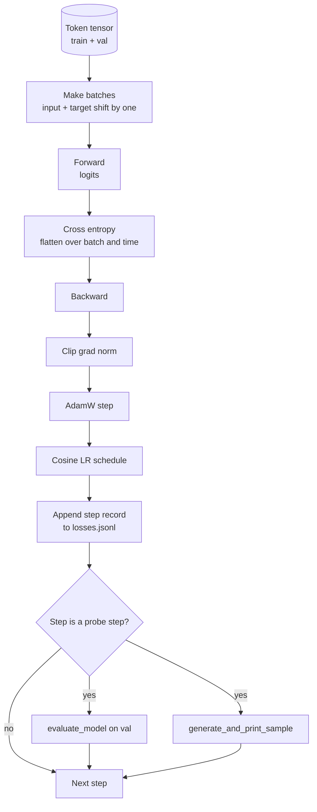

# 训练循环与评估

> 不做测量的循环就是撒谎的循环。本课构建驱动 GPT 模型的训练循环：带权重衰减分组的 AdamW、预热加余弦学习率调度、一个 `calc_loss_batch` 辅助函数、在留出数据上的 `evaluate_model` 评估、每 K 步一次的 `generate_and_print_sample` 定性探针，以及一个之后可以绘图的 JSONL 损失日志。同样的骨架可以训练你今后构建的每一个解码器 LLM。

**Type:** Build
**Languages:** Python
**Prerequisites:** Phase 19 lessons 30 to 35
**Time:** ~90 minutes

## 学习目标

- 构建一个训练循环，以正确的输入与目标对齐方式计算下一个词元预测的交叉熵损失。
- 配置 AdamW，使权重衰减只作用于权重张量，而不作用于 LayerNorm 或偏置张量。
- 实现带线性预热和余弦衰减的学习率调度，并读取学习率随时间的变化。
- 使用 `evaluate_model` 在留出数据划分上评估，确保评估损失在不同运行之间可比较。
- 每 K 步用 `generate_and_print_sample` 生成一个定性样本，在损失曲线察觉之前捕获发散。
- 将每步损失持久化到 JSONL，以便重新加载、绘图，并将训练日志作为交付物。

## 问题所在

一个只打印损失而不做其他事情的训练脚本会在三个方面失效。它无法告诉你损失下降是否有正确的原因（模型可能只是过拟合训练集而没有真正学到东西）。它无法告诉你发散是否开始（损失可能尖峰一步后恢复，也可能尖峰一步后崩溃）。它无法告诉你模型学到了什么（损失是一个标量；生成样本是一段文字）。除非循环进行测量，否则这三种失败都会隐藏起来。

本课的循环从三个方面进行测量。每一步在训练批次上的损失。每 K 步在留出批次上的损失。每 K 步从一个固定提示生成的续写文本。训练日志写入 JSONL，这份产物就是循环的证词。

## 概念



两个不直观的部分是损失对齐和 AdamW 衰减分组。

### 损失对齐

模型在每个位置预测下一个词元。如果输入批次是词元 `[t0, t1, t2, t3]`，目标批次必须是 `[t1, t2, t3, t4]`。交叉熵在扁平形状 `(batch * seq, vocab)` 上对扁平目标 `(batch * seq,)` 计算。忘记错位，你训练的就是模型预测它自己，这会收敛到零损失却学不到任何有用的东西。

### AdamW 衰减分组

权重衰减只正则化权重张量，而不作用于归一化缩放参数或偏置。把衰减施加在 LayerNorm 的缩放参数上会缓慢地把缩放推向零并破坏归一化。把衰减施加在偏置上在数学上无害，但浪费算力。标准分组是：矩阵形状的张量（线性权重、嵌入表）应用衰减，而看起来像缩放或偏移的张量不应用。

### 预热加余弦调度

预热在几百步内把学习率从零爬升到目标值，让优化器状态有时间填充。余弦衰减在剩余步骤中把学习率降回接近零，使最后阶段以较小的步长微调权重。这一组合是开源权重 LLM 训练中最常见的调度，因为它消除了前一千步和后一千步中大部分脆弱的时刻。

### 留出评估

`evaluate_model` 从验证划分运行固定数量的批次，累积损失，除以批次数，然后返回。无梯度。无 dropout。在相同种子和相同划分下，这个数字在各次运行之间可复现。把留出损失与训练损失并列报告，就是发现过拟合的方法。

### 定性采样作为早期信号

一个训练损失漂亮下降但生成样本全都是同一个词元的模型是坏的。一个损失曲线看似平坦但生成样本逐渐凝练成连贯词语的模型是在学习的。定性探针比读完整条曲线更快，并能捕获标量遗漏的模式。

```figure
cap-training-loop
```

## 动手构建

`code/main.py` 实现：

- `make_batches(token_ids, batch_size, context_length)`，把长词元张量切分为输入与目标对。
- `calc_loss_batch(model, inputs, targets)`，前向、展平并返回标量交叉熵。
- `evaluate_model(model, val_loader, max_batches)`，在无梯度模式下迭代固定数量的验证批次并返回平均损失。
- `generate_and_print_sample(model, prompt, max_new_tokens)`，在固定提示上运行第 35 课的生成函数并打印结果。
- `build_param_groups(model, weight_decay)`，生成 AdamW 的两组参数列表。
- `cosine_with_warmup(step, warmup_steps, total_steps, max_lr, min_lr)`，返回给定步骤的学习率。
- `train(...)`，运行循环、持久化 `outputs/losses.jsonl`，并每 `eval_every` 步打印评估损失和一个样本。
- 一个演示：在合成数据上训练一个极小模型少量步数，写入 JSONL 日志，并在探针点打印评估损失和一个样本。该演示在 CPU 上的运行时间远少于一分钟。

运行它：

```bash
python3 code/main.py
```

输出：每步损失行、每个探针步的评估损失、每个探针步的一个生成样本，以及一个最终的 `outputs/losses.jsonl`，可以按行用 `json.loads` 加载。

## 技术栈

- `torch` 用于自动微分、优化器和模块。
- `main.py` 在本地重新实现第 35 课的 `GPTModel` 及相关模块。

## 生产环境中的常见模式

以下三种模式把教科书式的循环变成可以过夜运行的东西。

**梯度范数裁剪不可妥协。** 一个坏批次（异常数据、学习率尖峰、数值边界情况）会产生巨大的梯度，毁掉数小时的训练。在 `backward` 之后、`step` 之前使用 `torch.nn.utils.clip_grad_norm_(params, max_norm=1.0)` 可以让优化器保持在安全范围内。裁剪值是一个自由参数；1 是能在大多数设置下存活的默认值。

**可恢复的 JSONL 日志，而非 pickle 状态。** 每步损失以 `{"step": int, "train_loss": float, "lr": float}` 行记录在 JSONL 中是持久的：任何崩溃都会留下可读的产物，你可以 grep，可以用三十行 Python 绘图，还可以通过读取最后一步来恢复训练。pickle 状态把你绑定到生成该文件的确切模块布局上，在重构时非常脆弱。

**评估批次来自固定切片。** 验证词元在脚本启动时被切分成批次，而不是即时切分。可复现性依赖于各次运行之间评估批次完全相同；否则，比较两次运行的评估损失所度量的更像批次洗牌而非模型本身。

## 使用场景

- 本课的循环与在真实数据上训练 124M 模型使用的是同一个骨架。把合成词元张量换成 `datasets` 风格的加载器，循环无需改动即可运行。
- JSONL 日志是把一次训练运行变成证据的交付物。下一课会用它来比较一个新训练的检查点与一个预训练的检查点。
- 定性样本探针是标量损失无法替代的兜底手段。

## 练习

1. 添加 `weight_decay_groups()` 单元测试，确认缩放和偏置参数落入无衰减组，线性与嵌入权重落入有衰减组。
2. 用一个小文本文件的字节替换合成随机词元，让演示在可读的内容上训练。验证生成样本使用的字符确实出现在该文件中。
3. 给余弦调度添加一个 `min_lr` 下限，设为 `max_lr` 的 10%，并重新绘图。
4. 在 JSONL 日志之外，每 `eval_every` 步保存一个检查点。添加一个 `resume_from` 标志，用于重新加载模型状态和优化器状态。
5. 在损失旁边记录每步吞吐量（词元/秒），并确认它保持在稳定区间内。

## 关键术语

| 术语 | 人们怎么说 | 实际含义 |
|------|-----------------|------------------------|
| 损失对齐 | "错位一格" | 输入词元位于位置 0..T-1，目标词元位于位置 1..T；交叉熵在扁平形状上计算 |
| 衰减分组 | "两个组" | AdamW 对矩阵形状的张量施加权重衰减，对缩放或偏置张量不施加 |
| 预热 | "爬升" | 学习率在固定步数内从零爬升到目标值，让优化器状态得以填充 |
| 评估批次 | "留出批次" | 验证词元张量的固定切片，在脚本启动时切分一次，每次探针使用完全相同的批次 |
| 定性探针 | "样本打印" | 每 K 步从固定提示生成一小段文本并打印，以捕获单靠损失会隐藏的失败模式 |

## 延伸阅读

- Phase 19 lesson 35，了解本循环驱动的模型。
- Phase 19 lesson 37，了解把预训练权重加载到同一模型中。
- Phase 10 lesson 04（mini GPT 预训练），了解在真实数据上的完整流程。
- Phase 10 lesson 10（评估），了解超越交叉熵损失的更广泛评估面。