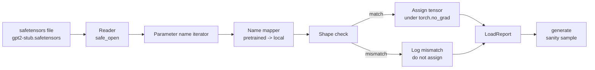

# 加载预训练权重

> 从零训练一个 1.24 亿参数的模型是一项预算决策；加载一个公开发布的 checkpoint 不过是寻常的一个周二。本课从 safetensors 文件中加载预训练的 GPT-2 风格权重，载入第 35 课中完全相同的架构，逐条讲解参数名称映射，并通过一次生成续写做合理性检查以证明加载成功。无需网络、无需第三方加载器、没有晦涩的魔法。

**Type:** Build
**Languages:** Python
**Prerequisites:** Phase 19 第 30 至 36 课
**Time:** 约 90 分钟

## 学习目标

- 使用 `safetensors` Python 库读取 safetensors 文件，并查看张量名称和形状。
- 将每个预训练参数名称映射到第 35 课 GPT 模型中的对应参数。
- 处理公开发布的 GPT-2 权重与本课程模型之间两种不同的命名约定：`wte/wpe/h.N.attn.c_attn/c_proj` 和 `mlp.c_fc/c_proj` 与本地命名的 `tok_embed/pos_embed/blocks.N.attn.qkv/out_proj` 和 `mlp.fc1/fc2`。
- 在任何权重赋值发生之前，检测并拒绝形状不匹配的情况，并给出清晰的错误信息。
- 使用加载的权重生成一段简短续写，确认这些 token 来自加载后的分布，而非随机初始化的分布。

## 问题所在

公开发布的权重并不是为你的架构打包的。它们沿用的是原始实现所使用的名称。预训练文件中包含形状为 `(2304, 768)` 的 `transformer.h.0.attn.c_attn.weight`；而你的模型期望的是形状为 `(2304, 768)` 的 `blocks.0.attn.qkv.weight`（这是同一矩阵在不同布局约定下的形式），或者你的模型使用 `nn.Linear`，它以转置形式存储该矩阵。同一个参数会以三种微妙不同的身份出现（名称、形状、字节布局），加载器必须将这三者全部协调一致。

盲目复制的加载器会把正确的张量放到错误的位置，你会得到一个生成胡言乱语的模型。当形状不同时拒绝复制却什么都不记录的加载器，会让你去猜测哪个张量没能加载到位。本课的加载器是显式的：每次赋值都有日志，每个形状都做检查，并用一个 `LoadReport` 汇总命中、缺失和形状不匹配的情况，让你能读懂发生了什么。

## 概念



名称映射器只是一个从字符串到字符串的函数。形状检查就是一个 if。赋值操作在 `torch.no_grad()` 内部进行，因此 autograd 不会追踪这次加载。报告记录每个名称的结果。

### GPT-2 命名约定

公开发布的 GPT-2 权重使用如下名称：

| 预训练名称 | 形状 | 含义 |
|-----------------|-------|---------|
| `wte.weight` | (50257, 768) | Token 嵌入 |
| `wpe.weight` | (1024, 768) | 位置嵌入 |
| `h.N.ln_1.weight` | (768,) | 第 N 个 block 的 LayerNorm 1 缩放 |
| `h.N.ln_1.bias` | (768,) | 第 N 个 block 的 LayerNorm 1 偏移 |
| `h.N.attn.c_attn.weight` | (768, 2304) | 融合 QKV 线性权重 |
| `h.N.attn.c_attn.bias` | (2304,) | 融合 QKV 线性偏置 |
| `h.N.attn.c_proj.weight` | (768, 768) | 注意力输出投影 |
| `h.N.attn.c_proj.bias` | (768,) | 注意力输出投影偏置 |
| `h.N.ln_2.weight` | (768,) | LayerNorm 2 缩放 |
| `h.N.ln_2.bias` | (768,) | LayerNorm 2 偏移 |
| `h.N.mlp.c_fc.weight` | (768, 3072) | MLP fc1 权重 |
| `h.N.mlp.c_fc.bias` | (3072,) | MLP fc1 偏置 |
| `h.N.mlp.c_proj.weight` | (3072, 768) | MLP fc2 权重 |
| `h.N.mlp.c_proj.bias` | (768,) | MLP fc2 偏置 |
| `ln_f.weight` | (768,) | 最终 LayerNorm 缩放 |
| `ln_f.bias` | (768,) | 最终 LayerNorm 偏移 |

有两个需要提前计划的意外情况。`c_attn`、`c_proj`、`c_fc` 这些线性层存储的矩阵相对于 `nn.Linear.weight` 所期望的形式是转置的。加载器在赋值时进行转置。LM head 完全不在文件中；模型依赖与 `wte` 的权重绑定，因此一旦 `wte` 加载完成，head 就通过别名方式设置好了。

### 本地命名约定

本课程的模型使用描述性名称：

| 本地名称 | 含义 |
|------------|---------|
| `tok_embed.weight` | Token 嵌入 |
| `pos_embed.weight` | 位置嵌入 |
| `blocks.N.ln1.scale` | 第 N 个 block 的 LayerNorm 1 缩放 |
| `blocks.N.ln1.shift` | LayerNorm 1 偏移 |
| `blocks.N.attn.qkv.weight` | 融合 QKV |
| `blocks.N.attn.qkv.bias` | 融合 QKV 偏置 |
| `blocks.N.attn.out_proj.weight` | 注意力输出投影 |
| `blocks.N.attn.out_proj.bias` | 输出投影偏置 |
| `blocks.N.ln2.scale` | LayerNorm 2 缩放 |
| `blocks.N.ln2.shift` | LayerNorm 2 偏移 |
| `blocks.N.mlp.fc1.weight` | MLP fc1 |
| `blocks.N.mlp.fc1.bias` | MLP fc1 偏置 |
| `blocks.N.mlp.fc2.weight` | MLP fc2 |
| `blocks.N.mlp.fc2.bias` | MLP fc2 偏置 |
| `final_ln.scale` | 最终 LayerNorm 缩放 |
| `final_ln.shift` | 最终 LayerNorm 偏移 |

映射是一个固定的函数。本课将其以 dict 的形式提供，由加载器遍历。

### 桩测试夹具

真实的 GPT-2 权重有 0.5 GB。本课的演示不会下载它们；它在首次运行时生成一个小的 safetensors 夹具，采用与 GPT-2 完全一致的命名约定，形状对应一个 12-block 模型，d_model 为 192 而非 768。这个夹具具备正确的结构，可以覆盖加载器中的每一条代码路径。把夹具换成真实文件，加载器无需任何修改即可工作。

```figure
cc-weight-remap
```

## 动手实现

`code/main.py` 实现了：

- 第 35 课 `GPTModel` 的一个小型复刻，使本课自成一体。
- `make_pretrained_to_local(num_layers)`，用于展开逐层的条目。
- `load_safetensors(model, path)`，它遍历名称、进行映射、检查形状、转置 conv1d 风格的权重，并在 `torch.no_grad()` 下完成赋值。返回一个 `LoadReport`。
- `make_stub_safetensors(path, cfg)`，它以完全一致的预训练命名约定生成夹具文件。
- 一个演示：首次运行时创建 `outputs/gpt2-stub.safetensors`，构建一个全新模型，从随机初始化状态捕获一段生成续写，加载桩模型，再捕获一段续写，打印两者，并验证二者不同（即加载确实改变了模型）。

运行它：

```bash
python3 code/main.py
```

输出内容：夹具路径、逐名称的加载日志、一个 `LoadReport` 汇总、加载前的一段续写、加载后的一段续写，以及一个形状不匹配错误——该错误来自注入到夹具中的一个故意设置的错误张量，用于覆盖失败路径。

## 技术栈

- `safetensors` 用于磁盘上的文件格式和流式读取器。
- `torch` 用于模型和赋值运算。
- 不使用 `transformers`，不使用 `huggingface_hub`，不进行网络调用。

## 生产环境中的常见模式

有三个模式能让加载器在你面对并非由你创建的权重时依然可靠。

**在任何赋值之前始终先验证文件。** 打开文件，列出每个张量的名称、dtype 和形状，运行完整的映射并进行形状检查，只有全部成功后才开始赋值。加载了一半的模型是静默失败的机器。

**用源名称和目标名称记录每一次赋值。** 当出现异常情况时，日志能告诉你哪个张量落在了哪里；否则你就只能去读十六进制转储。本课中的 `LoadReport` dataclass 会追踪 `loaded`、`missing`、`unexpected` 和 `shape_mismatch` 列表，并在最后打印一份汇总。

**LM head 是权重绑定的别名，而不是单独的副本。** 在加载 `tok_embed` 之后设置 `model.lm_head.weight = model.tok_embed.weight` 是标准做法。把嵌入矩阵复制到一个新的 `lm_head.weight` 参数中会破坏绑定，并悄悄地使参数数量翻倍。

## 使用它

- 该加载器适用于任何使用预训练命名约定的 safetensors 文件。真实的 GPT-2 文件（small / medium / large / xl）无需修改代码即可使用；仅模型配置不同。
- 只要更新名称映射，同样的模式可以扩展到 LLaMA、Mistral、Qwen 权重。形状检查和报告保持完全一致。
- 加载后的合理性生成是一道快速关卡：如果加载后的样本看起来和加载前的样本一样，说明加载没有改变模型，这意味着映射悄悄地漏掉了每一个张量。

## 练习

1. 给加载器添加一个 `dtype` 参数，在赋值时把每个张量转换为目标 dtype（`bfloat16`、`float16`、`float32`）。确认一个 `float32` 模型可以降级为 `bfloat16` 并且仍然能正常生成。
2. 添加一个 `expected_layers` 参数，当 checkpoint 的 `h.N` 索引与模型的 `num_layers` 不匹配时拒绝加载。
3. 将加载器接入第 35 课的生成函数，产生两个并排的样本：一个来自随机初始化，一个来自加载的夹具。
4. 添加一个导出路径：使用预训练命名约定将当前模型状态写入一个全新的 safetensors 文件。对加载器做往返测试，确认报告中形状不匹配的数量为零。
5. 扩展 `NAME_MAP` 以处理 LLaMA 命名约定（无偏置、RMSNorm、融合 qkv 布局），并在你自己生成的 LLaMA 桩夹具上重新运行加载器。

## 关键术语

| 术语 | 人们的说法 | 实际含义 |
|------|-----------------|------------------------|
| 名称映射 | "键重映射" | 从预训练张量名称到本地参数名称的函数；通常是一个字面 dict，每个层索引一条，通过循环展开 |
| 形状不匹配 | "形状错误" | 预训练张量在映射后的名称下存在，但其维度与本地参数不一致；加载器拒绝赋值并记录这一对名称 |
| 加载时转置 | "Conv1d 布局" | 公开发布的 GPT-2 以 nn.Linear 所期望形式的转置存储注意力和 MLP 投影；加载器在赋值时进行转置 |
| 权重绑定别名 | "共享 LM head" | 设置 model.lm_head.weight = model.tok_embed.weight，使 head 与嵌入共享存储；正因如此，head 不在文件中 |
| 加载报告 | "覆盖率汇总" | 一个小型 dataclass，追踪 loaded、missing、unexpected 和 shape_mismatch 列表；打印它就能判断加载是否成功 |

## 延伸阅读

- Phase 19 第 35 课，介绍接收这些权重的架构。
- Phase 19 第 36 课，介绍生成相同形状 checkpoint 的训练循环。
- Phase 10 第 11 课（量化），介绍在内存紧张时如何处理加载的权重。
- Phase 10 第 13 课（构建完整的 LLM 流水线），介绍围绕加载和推理的完整生命周期。