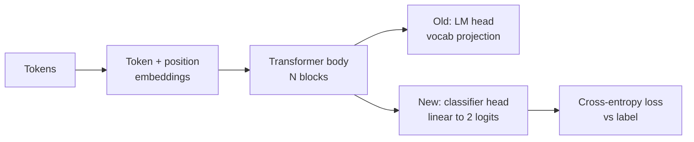
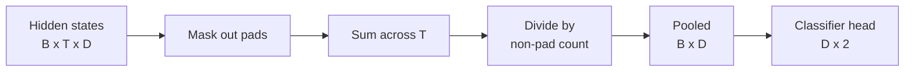
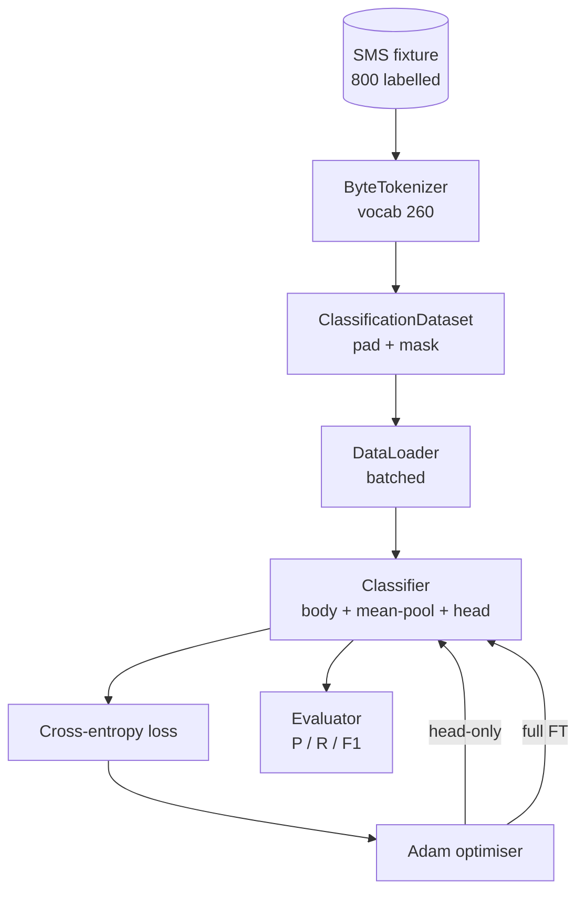

# 毕业课第 38 课：通过更换头部进行分类器微调

> Track B 的第一个毕业项目。预训练语言模型是一叠自注意力块，末端接一个 token 预测头。当你想做垃圾短信与正常短信分类时，头部是错的，但主体大体是对的。本课将头部拆下来，把一个二分类线性层接到池化表示上，并用两种不同方式训练分类器：仅训练最后一层，以及全量微调。评估指标是在留出集上的精确率、召回率和 F1。你将了解每种策略能带来什么、代价是什么。

**Type:** Build
**Languages:** Python (torch, numpy)
**Prerequisites:** Phase 19 lessons 30-37 (NLP LLM 方向：分词器、嵌入表、注意力块、Transformer 主体、预训练循环、检查点保存、生成、困惑度)
**Time:** ~90 分钟

## 学习目标

- 在不重新初始化主体的情况下，将语言模型头部替换为分类头部。
- 实现两种训练方案：冻结主体（仅训练头部）和全量微调，共享同一个训练循环。
- 构建一个感知分词器的数据管线，完成填充、掩码处理以及注意力输出的池化。
- 从原始 logits 计算精确率、召回率、F1 和混淆矩阵。
- 思考参数量、训练时间和性能上限之间的权衡。

## 问题

你在一个通用语料库上预训练了一个小型 Transformer。输出头将最后的隐状态投影到一个 1000 token 的词表。现在你手上有 800 条标注为垃圾短信或正常短信的 SMS 消息，想要一个二分类器。有三种可选方案。

错误的做法是在 800 个样本上从零训练一个新分类器。预训练模型的主体已经编码了有用的结构：词的同一性、位置、简单共现关系。把它扔掉会浪费构建它所消耗的算力。

两种正确做法是：冻结主体只换头部，以及更换头部并让主体可训练。仅头部训练速度快、几乎不占内存，而且在这么少的数据上很少过拟合。全量微调更慢，在小数据上可能过拟合，但当下游领域偏离预训练语料时能达到更高的准确率。

本课两种都构建，让你能在同一测试环境上对比它们。

## 概念



模型是一个函数 `f_theta(tokens) -> hidden_states`。头部是一个函数 `g_phi(hidden) -> logits`。更换头部意味着保留 `theta` 并替换 `g_phi`。主体的参数是昂贵的部分。头部只是一个线性层。

两组可训练参数很重要：

- `theta`（主体）：每个注意力块包含数万个权重。
- `phi`（头部）：`hidden_dim * num_classes` 个权重加一个偏置。

在仅头部训练中，你对 `phi` 计算梯度，而对 `theta` 置零。PyTorch 允许通过对主体参数设置 `requires_grad=False` 来实现这一点。优化器就只看到头部，主体保持冻结。

在全量微调中，你让梯度流回整个堆栈。主体的权重为拟合分类目标而漂移。风险是小数据上的灾难性遗忘：主体的预训练知识会被过拟合噪声冲刷掉。

## 池化问题

分类器需要每个序列一个向量，而不是每个 token 一个向量。三种常见选择：

- **均值池化**：在序列上对隐状态取平均，并按注意力掩码加权。
- **CLS 池化**：在序列前添加一个特殊 token，只使用它的输出。这是 BERT 的做法。
- **末 token 池化**：使用最后一个非填充 token。这是 GPT 类分类器的做法。

本课使用带显式注意力掩码加权的均值池化。它最简单，在不同序列长度下信号稳定，并且不需要预训练 CLS token。



## 数据

800 条 SMS 消息，均衡分布为 400 条垃圾短信和 400 条正常短信，由 `code/main.py` 确定性地生成。生成器使用固定种子，挑选模板并替换槽位填充内容，生成 5 到 25 个 token 长的消息。真实数据集有本测试环境不具备的噪声。这个测试环境的意义在于可复现性。

数据按 80/20 划分：640 条训练，160 条测试。划分是分层的，因此测试集保持 50/50 的均衡。一个均衡比例已知的留出集让精确率和召回率可以作为可信的数字来解读。

## 指标

二分类，以类别 1 为正类（垃圾短信）。计数如下：

- `TP`：预测为垃圾短信，实际是垃圾短信。
- `FP`：预测为垃圾短信，实际是正常短信。
- `FN`：预测为正常短信，实际是垃圾短信。
- `TN`：预测为正常短信，实际是正常短信。

三个核心指标：

- `precision = TP / (TP + FP)`。在被标记为垃圾短信的消息中，实际是垃圾短信的比例是多少？
- `recall = TP / (TP + FN)`。在真实的垃圾短信中，模型标记出了多少比例？
- `F1 = 2 * P * R / (P + R)`。两者的调和平均数。

混淆矩阵将四个计数打印为 2x2 网格。演示程序对两种训练方案都将其输出到 stdout。

```figure
cap-classifier-head-swap
```

## 架构



主体是一个刻意做得很小的 Transformer：词表 260，隐藏维度 64，4 个头，2 个块，最大序列长度 32。它足够小，两种训练方案都能在 CPU 上九十秒内收敛。本课不对其进行预训练；而是由 `pretrain_quick` 辅助函数在同一测试环境的文本上做五个 epoch 的 LM 训练，给主体一个非平凡的起点。这使本课保持自包含。

## 你将构建什么

实现是一个 `main.py` 加一个测试模块（`code/tests/test_main.py`）。

1. `ByteTokenizer`：将字节映射为 id，保留一个填充 id。
2. `Block`：一个带多头注意力和前馈层的 Transformer 块。Pre-norm。
3. `LMBody`：token + 位置嵌入，外加一叠块。返回隐状态。
4. `MeanPool`：在序列轴上做掩码加权平均。
5. `Classifier`：主体、池化、线性头部。主体在两种方案中是同一实例。
6. `freeze_body` 和 `unfreeze_body`：切换主体参数上的 `requires_grad`。
7. `train_classifier`：一个共享循环。接受模型和针对当前可训练参数组配置的优化器。
8. `evaluate`：在测试集上运行并返回 `Metrics(precision, recall, f1, confusion)`。
9. `run_demo`：先对主体做短暂预训练，然后训练并评估仅头部方案，再评估全量微调，打印两份报告并以零退出。

## 为什么对比很重要

仅头部方案通常训练更快，且欠拟合得更平缓。在这个测试环境上，仅头部训练二十个 epoch 后，通常可以看到精确率接近 0.9，召回率接近 0.85。全量微调耗时约为其三倍，最终结果因随机种子不同而在两者之间相差几个点以内。

本课不选出赢家。它教你解读数字和代价。在 800 个样本和一个微小主体的情况下，仅头部是正确选择。在 80,000 个样本和一个更大的主体的情况下，全量微调开始显出优势。你从本课带走的契约是 API：同一个 `train_classifier` 函数处理两者，切换只需一次调用。

## 进阶目标

- 增加第三种方案，只解冻最后一个块。这有时称为部分微调。它比全量微调成本低，比仅头部学得多。
- 增加学习率调度器。头部使用余弦调度、主体使用较小的恒定学习率，是常见的生产环境配置。
- 将均值池化替换为可学习的注意力池化：一个带单个可学习查询的小注意力层。在较长序列上这通常优于均值池化。

实现给了你挂钩。测试固定了契约。数字由你来推动。