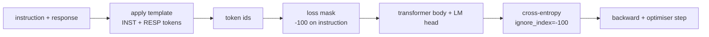
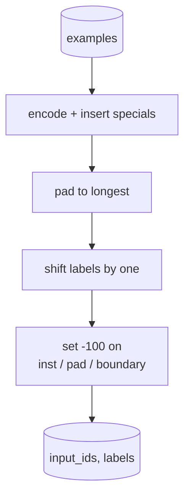
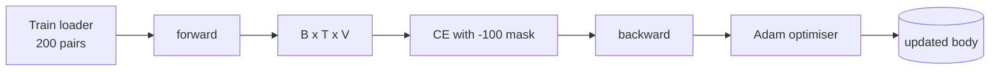

# 毕业课 第 39 课：通过监督微调进行指令微调

> 预训练的基础模型可以延续一个序列，但无法遵循指令。监督微调是解决这一问题的最小改动：给模型提供“指令-期望响应”成对的样例，并训练模型主体预测响应的 token。关键在于，损失只应统计响应部分，而不是指令部分。本课构建一个 Alpaca 风格的 SFT 训练循环，使用自定义 collate 函数将指令 token 掩码为 `ignore_index=-100`，在 200 个指令-响应对上训练，并在留出集上用精确匹配进行评估。

**Type:** Build
**Languages:** Python (torch, numpy)
**Prerequisites:** Phase 19 lessons 30-37 (NLP LLM track: tokenizer, embedding table, attention block, transformer body, pre-training loop, checkpointing, generation, perplexity)
**Time:** ~90 minutes

## 学习目标

- 将成对的指令-响应数据格式化为带有显式边界 token 的单个因果序列。
- 构建一个 collate 函数，掩码指令 token，使交叉熵只统计响应 token。
- 在 SFT 目标下训练一个微型 transformer 主体，并观察评估指标的变化。
- 实现尊重响应开始边界的贪心解码和温度采样生成。
- 在生成的补全上计算留出集精确匹配。

## 问题所在

在下一个 token 预测上训练的基础模型完全不知道什么是指令。给它字符串 `"What is the capital of France?"`，它会续写这个问题或编造一个新句子。模型具备语言能力，却没有格式契约。

SFT 契约是一个字符串模板。每个训练样例都变成包含三个区域的单个序列：

```text
<INST> What is the capital of France? <RESP> The capital of France is Paris.
```

边界 token 是训练时保留的特殊 token。模型学到 `<RESP>` 之后的所有内容都是响应，而响应正是被评估的对象。基础模型的下一个 token 目标仍然适用；只是训练语料中的每个样例都具有这种形状。

但有一个陷阱。如果你把整个序列喂给普通的交叉熵损失，你实际上也在训练模型预测指令 token。指令是给定的。你希望这些位置上的梯度为零。解决方案就是掩码。

## 核心概念



`ignore_index` 是 `torch.nn.functional.cross_entropy` 的一个特性。任何等于 `ignore_index` 的目标位置贡献零损失和零梯度。PyTorch 中的约定是 `-100`。collate 函数为每个样例构建两个张量：`input_ids`（完整序列）和 `labels`（`input_ids` 的副本，其中指令位置被覆盖为 `-100`）。

模型在前向传播中看到整个序列；注意力可以关注指令。损失只统计响应 token。这正是你想要的：以指令为条件，预测响应。

## 数据

`main.py` 中以确定性的方式生成了两百个指令-响应对。它们涵盖六种任务类型：

- 事实性单问（X 的首都）
- 算术
- 列表提取
- 一句话总结
- 代码（print、sort）
- 定义

每个任务都有一个模板化指令和一个确定性响应。这是刻意简化的。精确匹配很脆弱，而本课使用的固定数据集中正确答案是某个特定字符串。真实的 SFT 数据集需要模糊的指标；但原理完全相同。

数据划分为 160 个训练样本和 40 个测试样本。测试集覆盖全部六种任务类型，因此可以按类别报告精确匹配。

## 分词与填充

分词器是字节级的，带有三个保留的特殊 token：

- `INST_ID = 256`：标记指令区域的开始。
- `RESP_ID = 257`：标记指令与响应之间的边界。
- `PAD_ID = 258`：用于变长批次的填充。

序列为 `[INST] inst_bytes [RESP] resp_bytes [PAD]*`。collate 函数：

1. 对每个样例进行分词。
2. 将批次中的每个样例填充到批次中最长序列的长度。
3. 构建 `labels` = `input_ids` 向右移一位（因果语言模型目标），其中：
   - 指令区域替换为 `-100`。
   - 填充区域替换为 `-100`。
   - `RESP_ID` 边界位置本身替换为 `-100`（你不训练模型预测边界 token；它预测的是其后跟随的内容）。



移位是标准的因果技巧：`input_ids` 的位置 `i` 预测位置 `i+1`，因此使用 `labels[i] = input_ids[i+1]`（输入去掉最后一个位置，目标去掉第一个位置）。掩码在移位之后应用，以落在正确的位置上。

## 训练



训练循环是标准的 PyTorch SFT 循环。Adam，学习率大约在 3e-4 到 1e-3 之间，在这个固定数据集上训练十到二十个 epoch，不使用调度器。模型足够小（隐藏层 96，2 个 block，最大长度 64），可以在 CPU 上两分钟内训练到收敛。

每五个 epoch，循环会在留出集上运行一个小型评估并打印精确匹配。观察精确匹配从第一个 epoch 的 0.0 提升到第十五个 epoch 的 0.85 左右，正是本课的价值所在：你可以看到模型同时学习格式和答案。

## 生成

在评估时，模型获得指令前缀 `[INST] inst_bytes [RESP]`，并生成 token，直到以下任一条件满足：

- 序列达到 `max_len`，或者
- 模型触发特殊的停止启发式：两个连续的句末字节（`.`、`!`、`?`）。

本课提供贪心解码以及一个可选的温度采样器。精确匹配使用贪心解码，因为温度采样会使指标具有随机性。真实系统通常先采样，再进行模糊评判；该流水线在第 41 课。

## 精确匹配评估

精确匹配是最严格的文本指标。预测的响应字符串经过归一化（转小写、去除首尾空白、压缩连续空格），并与同样归一化的参考响应进行比较。每个样例的指标为 1 或 0。总指标为平均值。

真实的 SFT 流水线会用 token 级 F1（第 41 课）和评判模型来补充精确匹配。精确匹配仍然有用，因为它毫无歧义；如果它给出 0.7，就意味着恰好 70% 的测试指令逐字符产生了黄金响应。

```figure
cc-sft-loss-mask
```

## 你将构建的内容

实现是一个 `main.py` 加上测试。

1. `InstructionTokenizer`：带保留特殊 token 的字节级编码器。可编码指令前缀或完整的指令-响应对。
2. `make_dataset`：用固定种子跨六种任务类型生成 200 对数据。
3. `SFTDataset`：为每个样例返回 `(input_ids, labels)`，掩码已预先处理。
4. `sft_collate`：动态填充，构建批次张量，并在指令和填充位置设置 `-100`。
5. `TinyGPT`：transformer 主体加上共享或非共享权重的 LM head。
6. `train_sft`：SFT 循环，带每个 epoch 的评估钩子。
7. `generate`：从前缀开始进行因果解码，贪心或采样，带停止启发式。
8. `exact_match`：归一化后的字符串比较，返回 `[0, 1]` 中的浮点数。
9. `run_demo`：构建数据，训练二十个 epoch，评估，打印按类别的细分结果，成功时以零退出。

## 为什么掩码如此重要

没有掩码时，损失会把指令 token 当作目标。模型会学习预测指令。这是不同的目标，并且会以两种方式产生更差的模型。第一，模型容量被浪费在重建用户总是提供的输入上。第二，响应损失在梯度总和中的占比变小，因为在大多数批次中指令 token 的数量超过响应 token；优化器在你关心的部分上的有效学习率低于你的预期。掩码不是润色；它就是目标本身。

## 进阶目标

- 添加学习率预热加余弦衰减。SFT 对学习率的敏感度高于预训练。
- 添加逐 token 的损失记录，并绘制整个训练过程中的损失曲线。注意早期 epoch 由模板 token（`<RESP>`、常见前缀）主导，而后期 epoch 由真正的答案 token 主导。
- 将评估扩展到 BLEU-1 或 chrF。精确匹配会低估那些产生同一答案的不同措辞的模型。
- 添加多轮格式的聊天模板，并在包含追问的固定数据集上训练。

本实现为你提供了格式契约、掩码和循环。从基础模型到指令遵循模型的目标函数改变，只是一个 collate 函数。