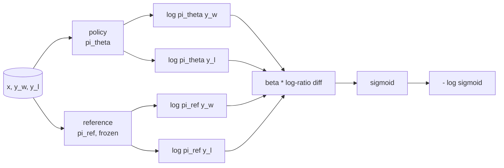
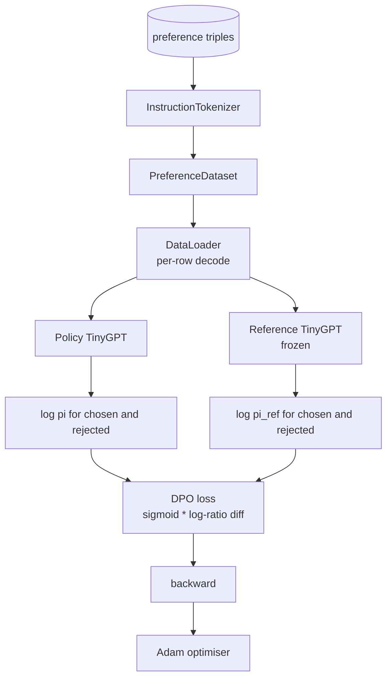

# 毕业课第 40 课：从零实现直接偏好优化（DPO）

> 奖励模型与 PPO 是经典的 RLHF 技术栈。DPO 将整个技术栈压缩为一个单一的监督损失，直接基于偏好对拟合策略。本节课从奖励差恒等式推导 DPO 损失，提供一个可运行的参考模型加策略模型，计算逐 token 的对数概率，并在一个由选定（chosen）与被拒绝（rejected）补全组成的偏好数据集上训练一个微型 transformer。测试固定了损失的数学与梯度方向，使你确信实现与论文一致。

**Type:** Build
**Languages:** Python (torch, numpy)
**Prerequisites:** Phase 19 lessons 30-37（NLP LLM 方向：分词器、嵌入表、注意力块、transformer 主体、预训练循环、检查点、生成、困惑度）
**Time:** 约 90 分钟

## 学习目标

- 将 DPO 损失推导为缩放对数比之差的 sigmoid，并将其与隐式奖励联系起来。
- 构建参考模型 + 策略模型对，参考模型冻结、策略可训练。
- 在两个模型下计算序列级对数概率，并屏蔽提示（prompt）token。
- 在 `(prompt, chosen, rejected)` 三元组上训练策略，观察选定的对数概率相对于被拒绝的对数概率上升。
- 用测试固定损失数学、梯度符号以及参考不变性等行为。

## 问题

你有一个 SFT 模型。它能遵循指令，但输出质量参差不齐；有些补全清晰，有些则啰嗦或错误。你还有一个小型偏好对数据集：对于同一个提示，人类把一个补全标记为选定（chosen），另一个标记为被拒绝（rejected）。

经典的 RLHF 方案是两阶段流水线：先在偏好数据上训练奖励模型，再用 PPO 针对奖励优化策略。这可行但代价高昂：PPO 期间内存中需要两个模型，需要 KL 控制让策略靠近参考模型，当奖励模型脆弱时还会出现奖励破解（reward hacking）。

DPO 用一个单一的监督损失取代这两个阶段。奖励模型从不显式存在。策略直接在偏好对上训练，并带有朝向 SFT 参考模型的显式 KL 惩罚。在 Bradley-Terry 偏好模型下解相同，代码量却少得多。

## 概念

从 Bradley-Terry 模型出发。给定提示 `x` 和两个补全 `y_w`（选定）与 `y_l`（被拒绝），人类偏好 `y_w` 的概率为

```text
P(y_w > y_l | x) = sigmoid( r(x, y_w) - r(x, y_l) )
```

其中 `r` 是某个潜在奖励函数。RLHF 先从偏好拟合 `r`，然后训练策略 `pi` 在 KL 锚定下最大化 `r`：

```text
max_pi   E_{x, y~pi} [ r(x, y) ] - beta * KL(pi || pi_ref)
```

DPO 的推导观察到：在该目标下最优策略 `pi*` 有以 `r` 表示的闭式解：

```text
pi*(y | x) = (1/Z(x)) * pi_ref(y | x) * exp( r(x, y) / beta )
```

对 `r` 重新整理：

```text
r(x, y) = beta * ( log pi*(y | x) - log pi_ref(y | x) ) + beta * log Z(x)
```

`log Z(x)` 项对 `y_w` 和 `y_l` 是相同的（它只依赖 `x`，不依赖 `y`），因此在计算偏好差时相消：

```text
r(x, y_w) - r(x, y_l) = beta * ( log pi_theta(y_w|x) - log pi_ref(y_w|x)
                                - log pi_theta(y_l|x) + log pi_ref(y_l|x) )
```

代入 Bradley-Terry 的 sigmoid 并在偏好对上取负对数似然：

```text
L_DPO(theta) = - E_{(x, y_w, y_l)} [
  log sigmoid( beta * ( log pi_theta(y_w|x) - log pi_ref(y_w|x)
                       - log pi_theta(y_l|x) + log pi_ref(y_l|x) ) )
]
```

这就是损失。它是每个样本上一个标量的 sigmoid，由四个对数概率计算得出。没有单独的奖励模型。没有 PPO。损失中没有 KL 项；KL 约束已内建于闭式推导之中。



## 梯度的符号

在任何训练运行之前，这是一个有用的合理性检查。对 `log pi_theta(y_w | x)` 求梯度：

```text
d L_DPO / d log pi_theta(y_w | x) = - beta * (1 - sigmoid(z))
```

其中 `z` 是 sigmoid 的自变量。它对所有 `z` 都为负，这意味着：提高策略对选定补全的对数概率会降低损失。对称地，对 `log pi_theta(y_l | x)` 的梯度为正：提高被拒绝对数概率会增加损失。训练把选定往上推、被拒绝往下压。参考模型是冻结的；它不移动。

## 数据

本课附带十二个偏好三元组。每个都是 `(prompt, chosen, rejected)`。选定补全简短而精确；被拒绝的则啰嗦、跑题或错误。这些对覆盖与第 39 课相同的任务类型（大小写、算术、列表），因此从 SFT 基座出发的策略有一个合理的起点。

这个数据集刻意很小。在生产中，DPO 运行在数万个偏好对上；这里的目的在于让损失数学与训练循环在微型数据集上端到端跑通，并让选定与被拒绝对数概率的差距明显增大。

## 参考不变性

DPO 实现必须谨慎处理参考模型。参考模型是原地冻结的 SFT 模型。有三个性质必须成立：

- 参考参数永不接收梯度。
- 参考对数概率在各轮之间永不改变。
- 策略以与参考相同的权重开始。（最优的 `theta` 是参考加上一个可学习的更新；把策略初始化为参考的副本是定义良好的起点。）

实现通过以下方式强制这些性质：

- 在前向传播中用 `torch.no_grad()` 包裹参考模型。
- 对每个参考参数设置 `requires_grad=False`。
- 在构建参考模型之后，通过 `policy.load_state_dict(reference.state_dict())` 构建策略。

```figure
cap-dpo-preference
```

## 架构



模型与第 39 课使用的 TinyGPT 相同（decoder-only、因果、字节分词器）。参考与策略共享架构；策略的权重在训练中偏离参考，而参考保持不变。

## 你将构建什么

实现是一个 `main.py` 外加测试。

1. `InstructionTokenizer`：带 `INST` 和 `RESP` 特殊 token 的字节分词器。与第 39 课形状相同。
2. `TinyGPT`：decoder-only transformer。与第 39 课形状相同，因此即使你跳过了第 39 课，本课也自成一体。
3. `make_preferences`：返回十二个 `(prompt, chosen, rejected)` 三元组。
4. `sequence_log_prob`：给定模型、提示前缀和补全，返回补全部分的下一个 token 对数概率之和（不含提示位置的贡献）。
5. `dpo_loss`：接收四个对数概率与 `beta`，返回逐样本损失张量以及用于日志记录的隐式奖励差。
6. `train_dpo`：逐轮循环，在策略与参考下计算选定和被拒绝对数概率，应用损失，并执行 Adam 步进。
7. `evaluate_margins`：返回任意时刻策略下选定与被拒绝对数概率的平均差值。
8. `run_demo`：通过少量预热预训练构建参考与策略，复制权重，训练三十步，打印每步的损失与差值，成功时以零退出。

## 为什么 DPO 有效

在 Bradley-Terry 偏好模型下，DPO 在数学上与 RLHF 等价，差别仅在奖励的参数化方式。隐式奖励 `r(x, y) = beta * (log pi(y|x) - log pi_ref(y|x))` 在相差一个 `x` 的函数的意义下可由偏好识别，而该函数在差值中相消。闭式策略让你可以跳过显式的奖励模型。KL 约束是结构性强制的：`pi` 偏离 `pi_ref` 会使对数比变大，sigmoid 随之饱和，从而在策略移动过远时阻尼梯度。参考模型就是你的安全网。

## 进阶目标

- 给对数概率之和添加长度归一化：除以补全长度。长度偏置是 DPO 已知的失败模式：模型会偏好更短的补全，因为它们的对数概率在绝对值上更大。
- 添加损失的 IPO 变体：把 sigmoid + log 替换为 `(z - 1)^2`。在数据集上比较收敛情况。
- 添加一个标签平滑参数，在硬性的选定-被拒绝标签与均匀的 0.5 之间插值。
- 用更小更便宜的模型替换参考模型（知识蒸馏风格）。

实现为你提供了损失、参考不变性与训练循环。数学才是本课的核心，代码让数学变得具体。