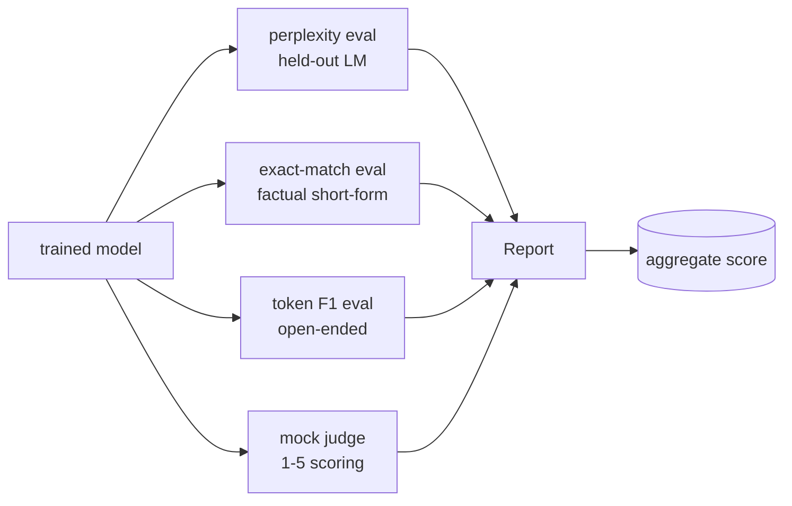
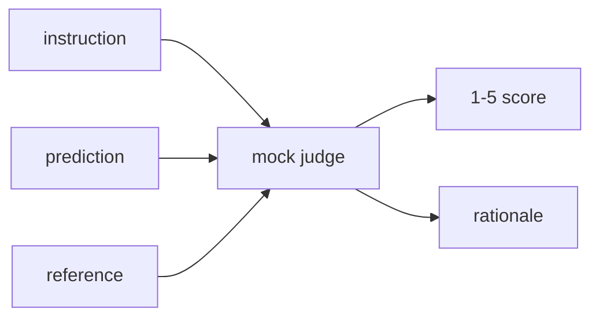
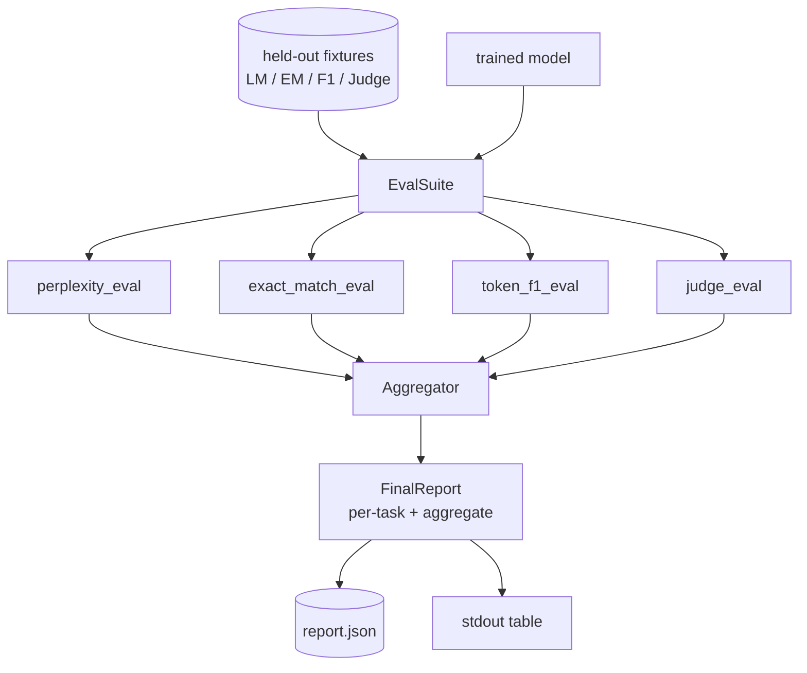

# 毕业设计课 41：完整评估流水线

> 训练是你可以通过损失曲线监控的部分。评估则是你必须自己设计的部分。本课构建一个统一的评估流水线，它接收任意已训练的语言模型，对其运行四个异构评估，将结果汇总为按任务的报告，并提供一个本地 mock LLM-as-judge，使整个循环无需联网即可运行。这四个评估覆盖了每个上线模型所需的维度：语言建模（困惑度）、短答案正确性（exact-match）、开放式相似度（token F1）和定性评分（judge）。

**Type:** Build
**Languages:** Python (torch, numpy)
**Prerequisites:** 第 19 阶段第 30-37 课（NLP LLM 路线：tokenizer、embedding table、attention block、transformer body、预训练循环、checkpointing、生成、困惑度）
**Time:** 约 90 分钟

## 学习目标

- 在一个微型 transformer 上，使用 masked-token 统计方法计算 held-out 困惑度。
- 对短答案事实性提示运行 exact-match 评估。
- 在归一化条件下，计算预测字符串与参考字符串之间的 token 级 F1。
- 构建一个本地 mock LLM-as-judge，对模型输出进行 1-5 分评分。
- 将四个评估汇总为一份带按任务明细的加权报告。

## 问题所在

单一指标永远无法描述一个语言模型。困惑度只说明模型对语言分布的拟合程度，却不说明它能否回答问题。exact-match 说明模型是否产出了标准答案字符串，但会惩罚正确的改写。token F1 容忍改写，却会被内容错误但词汇重叠的输出欺骗。LLM-as-judge 能捕捉定性维度，但代价高昂且具有随机性。

你真正想要的流水线包含全部四个评估。每个评估覆盖其他评估遗漏的维度，每个都在为该指标专门构造的 held-out 数据子集上运行。最终报告并排展示按任务的数值和一个聚合分数，让审阅者一眼就能看出模型在做哪些取舍。

本课将在一个文件中端到端地构建这条流水线。

## 核心概念



每个评估都是从 `(model, dataset) -> EvalResult` 出发的函数。结果携带指标值、供检查用的逐样本细节，以及用于聚合的名称。流水线用一个配置把它们组合起来，该配置指定运行哪些评估以及如何加权。

## 困惑度，正确的计数方式

困惑度是 `exp(mean negative log-likelihood per token)`。实现中有两个陷阱：

- 平均必须基于真实的 token 位置，而不是 batch * sequence。padding token 必须从分母中排除，否则困惑度会显得比实际更好。
- 模型预测下一个 token，因此位置 `i` 的 logits 预测位置 `i+1` 的 token。这里的 off-by-one 错误是静默的：损失仍然正常下降，但指标已变得毫无意义。

该评估计算每个 batch 在非 padding 位置上的 `-log p(token)` 总和以及每个 batch 的 token 数，最后再做除法。这比对每个 batch 的困惑度取平均（会低估短序列的权重）在数值上更安全，并且与教科书定义一致。

## exact-match，带归一化

评测框架在比较之前对预测和参考都做归一化：

- 转小写。
- 去除首尾空白。
- 将内部连续空白折叠为单个空格。
- 若双方仅差在标点，则去掉末尾终止标点（`.`、`!`、`?`）。

归一化让 exact-match 在实践中可用。模型回答 `"Paris"` 是对的；回答 `"Paris."` 也对；回答 `"  paris  "` 也对。但该指标仍要求答案在归一化后是同一个字符串。

## token F1，正确的做法

token F1 是在 token 词袋上计算的 precision 和 recall 的调和平均。步骤：

1. 归一化预测和参考（规则与 exact-match 相同）。
2. 将各自切分为 token 列表（按空白切分）。
3. 计算多重集交集。
4. Precision = `intersection_count / len(pred_tokens)`。Recall = `intersection_count / len(ref_tokens)`。F1 = 调和平均。

若预测和参考都为空，F1 为 1（空匹配）。若只有一方为空，F1 为 0。此模式与 SQuAD 评估参考实现一致，能在改写下产生稳定的数值。

## 本地 Mock LLM-as-Judge

真正的 judge 是 API 背后的前沿模型。本课中 judge 必须离线运行。mock judge 是一个确定性评分器，接收指令、模型预测和参考，返回 `{1, 2, 3, 4, 5}` 中的分数以及一行理由。评分规则是显式的：

- 归一化后的预测等于归一化后的参考，得 5。
- 预测与参考之间的 token F1 至少为 0.8，得 4。
- token F1 在 `[0.5, 0.8)` 中，得 3。
- token F1 在 `[0.2, 0.5)` 中，得 2。
- 其余情况得 1。

这不是真正的 judge，但它具有正确的接口。以后只需修改一个函数即可换成真实模型。流水线并不关心这一点。



## 聚合

聚合值是归一化评估分数的加权平均。每个评估以 `[0, 1]` 的形式报告自己的数值：

- 困惑度：归一化为 `1 / (1 + log(perplexity))`。困惑度为 1 映射到 1，无穷大映射到 0。
- exact-match：本身就是 `[0, 1]`。
- token F1：本身就是 `[0, 1]`。
- judge：除以 5。

权重可配置。默认配比为困惑度 0.2、exact-match 0.3、token F1 0.3、judge 0.2。权重的选择是产品决策；本课暴露这个旋钮，供你实验。

```figure
cg-eval-quadrant
```

## 架构



`EvalSuite` 是一个轻量编排器。每个单独的评估都是一个自由函数，接收 `(model, tokenizer, dataset, config)` 并返回一个 `EvalResult`。`Aggregator` 收集结果并生成最终报告。演示代码打印表格并写出一个 JSON 副本，供下游 CI 摄取。

## 你将构建的内容

实现是一个 `main.py` 加上测试。

1. `TinyGPT`：与第 38-40 课相同的 decoder-only 架构，包含它使本课可独立运行。
2. `InstructionTokenizer`：带 INST / RESP / PAD 特殊符号的字节级 tokeniser。
3. 四组固定数据：一个 LM 语料库、一个 EM 集合、一个 F1 集合和一个 judge 集合。每组二十个样本，确定性生成。
4. `perplexity_eval`：返回 `EvalResult`，包含困惑度值和逐 token 损失直方图。
5. `exact_match_eval`：返回平均 EM 和逐样本记录。
6. `token_f1_eval`：返回平均 token F1 和逐样本记录。
7. `mock_judge` 和 `judge_eval`：逐样本分数和理由，以及整个集合的平均分数。
8. `Aggregator.normalise`：每个评估的归一化规则。
9. `Aggregator.aggregate`：加权平均和组装好的报告。
10. `run_demo`：短暂训练一个微型模型，运行全部四个评估，打印报告表格并写出 JSON，成功时以零退出。

## 如何阅读报告

报告有三层。最上层是聚合分数。其下是四个按评估的数值。再往下是供诊断用的逐样本明细。CI 失败的运行通常只需要聚合分数，但追查回归的审阅者需要逐样本明细，以查看模型在哪些输入上出错了。

JSON 转储使用稳定的键，使 CI 仪表盘可以跨版本绘制趋势线。美化打印的表格则是给训练运行后盯着终端看的人类准备的。

## 拓展目标

- 增加一个校准评估：模型的 softmax 概率是否与其准确率匹配？按置信度对预测分桶，并报告每个桶的经验准确率。
- 增加一个鲁棒性评估：为每个样本标注扰动类型（typo、paraphrase、distractor），并报告每种扰动的指标下降幅度。
- 用 HTTP 调用背后的真实模型替换 mock judge。函数签名不变。
- 增加按任务权重学习：不使用固定权重，而是拟合权重以匹配模型间的目标偏好顺序。

本实现提供了四个评估、聚合器和报告。真实的评估流水线会在此基础上叠加更多维度；但模式保持不变：每个评估一个函数，一个聚合器，一份报告。