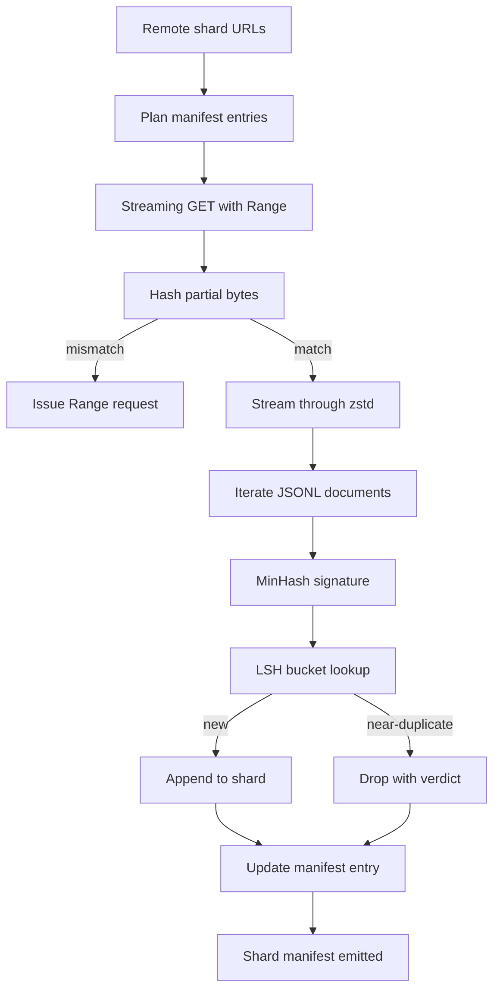

# 大规模语料库下载器

> 训练语言模型在第一次前向传播之前很早就开始了。语料库必须先落到磁盘上，完成解压、去重，并且可寻址，还要在网络在 4% 时断开之前就把断点续传方案准备好。本课构建一个流式下载器：拉取压缩分片，用 Zstandard 即时解压，通过 MinHash 加局部敏感哈希（LSH）对近重复文档进行指纹识别，并写出管线其余部分可以信赖的分片清单（manifest）。

**Type:** Build
**Languages:** Python
**Prerequisites:** Phase 19 lessons 30-37
**Time:** ~90 minutes

## 学习目标

- 使用 `urllib` 流式读取远程分片，并用 `zstandard` 解压，而不把整个文件缓冲在内存中。
- 通过对已验证的字节偏移发起 HTTP `Range` 请求来恢复中断的下载。
- 为每个文档构建 MinHash 签名，并用 LSH 分桶，使近重复文档发生碰撞。
- 输出包含内容哈希、字节大小、文档数量和去重判定结果的分片清单。

## 问题所在

第一次在 200 GB 语料库上训练时，网络在 41% 处断开，脚本以一个 `urllib` 异常退出。第二次在 78% 处断开。到 99% 时你已经重写了三次循环。从第一分钟起就必须为两类失败做设计：部分下载的恢复和重复文档的移除。两者都有众所周知的解决方案；两者却常常被跳过，因为管线最初只是单行的 `requests.get` 调用，后来才长出了獠牙。

恢复是一个 HTTP 问题。服务器必须支持 `Range`，客户端必须对照磁盘上的记录跟踪已验证的偏移量，而且该偏移量必须在进程崩溃后仍然存活。如果偏移量和文件哪怕相差一个字节，恢复的下载就会写入垃圾数据，语料库以一种只有在分词阶段才暴露出来的方式被损坏。

去重是一个签名问题。精确哈希去重会漏掉近重复：同一篇 Wikipedia 文章带着三种不同的模板页脚出现，同一个代码文件带着不同的许可证头，同一篇博客文章的每个链接上都带有一个追踪参数。MinHash 加 LSH 能以亚线性代价捕获这些。代价是每个文档一个签名，每个签名一次桶查询。

## 核心概念



### 使用 `urllib` 进行流式处理

标准库的 `urllib.request.urlopen` 返回一个文件类对象。把它包进 `zstandard.ZstdDecompressor().stream_reader` 中，字节就从网络流经解压器进入文档迭代器，而压缩分片和解压后的分片都不会完整地驻留在内存中。唯一的内存开销是行缓冲区、当前文档的 MinHash 签名以及 LSH 索引。

### 使用 `Range` 实现断点续传

下载器为每个分片写两个文件：分片本身和一个 `.partial.json` 检查点。检查点记录 `verified_bytes`、`expected_size`、`sha256_prefix`（对前 `verified_bytes` 字节计算），以及源 URL。启动时，下载器读取检查点，对磁盘上的字节重新计算 `sha256_prefix`，只有在重算的哈希匹配时才恢复下载。如果哈希不对，就丢弃部分文件，从字节零重新开始下载。静默损坏是不可能的，因为已验证的字节是被检查过的，而不是假定的。

### MinHash 加 LSH

MinHash 在固定空间内估计两个集合的 Jaccard 相似度。对文档而言，集合是其文本的 shingle（重叠 n-gram）。签名是 `k` 个最小哈希值，每个独立哈希函数一个。Jaccard 相似度为 `s` 的两个文档，在签名的任一单个分量上达成一致的概率是 `s`。

然后 LSH 把这 `k` 个分量分成 `b` 个 band，每个 band `r` 行，其中 `k = b * r`。两个文档至少在一个 band 中碰撞的概率是 `1 - (1 - s^r)^b`，这在 `s` 的取值附近形成一个锐利的阈值，而 `(b, r)` 正是你调节的参数。典型语料库去重的阈值是 `s = 0.8`，LSH 研究文献用 `k = 128`、`b = 32`、`r = 4` 达到这一阈值。

### 分片清单作为契约

下载器唯一持久的输出是清单。清单为每个分片保存：URL、解压后的字节数、文档数、去重后的唯一文档数，以及最终分片文件的 sha256。下游分词读取的是清单，而不是目录列表。如果某个分片缺失或其 sha256 不对，清单会告知下一阶段拒绝启动。清单是"数据已下载"与"数据已下载且已验证"之间的分界线。

```figure
cap-corpus-downloader
```

## 构建它

`code/main.py` 实现了：

- `ShardPlanner` - 读取分片 URL 列表并生成计划中的清单条目。
- `StreamingDownloader` - 打开一个带可选 `Range` 的 `urllib` 流，写入临时文件，每处理一个 chunk 就更新 `.partial.json` 检查点，并在恢复时验证 sha256 前缀。
- `ZstdDocIterator` - 用 `zstandard.ZstdDecompressor` 包装文件类流，每行产出一个文档。
- `MinHasher` - 使用固定的一组哈希种子，为字符串生成 `k` 个分量的签名。
- `LSHIndex` - 按 band 对签名分桶并报告碰撞。
- `Dedup` - 组合哈希器和索引，为每个文档标注 `keep` 或 `near_duplicate`，以及碰撞对应的分片 id。
- `ManifestWriter` - 汇总每个分片的统计信息并写出 `manifest.json`。

文件底部的演示会在磁盘上构建一个小型合成语料库，用 `zstandard` 压缩它，通过 `file://` URL 下载，执行去重，并打印清单。

运行它：

```bash
python3 code/main.py
```

脚本以零退出并打印清单摘要。

## 生产模式

四个模式可以把本课扩展到真实语料库。

**先写检查点再写数据。** 在字节被追加到分片之前，`.partial.json` 必须先被 `fsync`。否则断电会颠倒顺序：分片字节在磁盘上，检查点里却没有，下次恢复时它相信自己拥有的已验证字节数比实际的少，重复的后缀字节会损坏文件。先写检查点，再写数据。这与预写日志（write-ahead log）是同一种纪律。

**分片化的 LSH 索引。** 在 200 GB 规模下，覆盖整个语料库的单一 LSH 索引装不进内存。按第一个 band 的哈希对 LSH 索引分区，把分区存储在磁盘上，新签名只需查询它将落入的那个分区。代价是每个文档多一次磁盘读取；好处是 LSH 索引不再是一个硬性的内存上限。

**墓碑标记，而非删除。** 被丢弃的重复文档在清单中记录，判定结果为 `near_duplicate`，并附上与其碰撞的文档所在分片的 id。直接删除会丢失重复文档与其保留副本之间的关联。墓碑标记保留了审计线索，并允许下游处理在阈值上改变主意。

**清单中的每分片 sha256，外加清单本身的 sha256。** 清单本身也有一个内容哈希。下游阶段在信任每分片条目之前先验证清单哈希。没有这一层，清单就是静默的攻击面：能编辑单个文件的攻击者可以损坏整条管线。

## 使用它

生产模式：

- **每次 CI 运行都要支持恢复。** CI 运行器是临时的。下载器必须假设每次运行都是全新磁盘，并从缓存或远程恢复。`--cache-dir` 是一个一等公民的标志。
- **在分词之前去重。** 分词代价高昂。对同一文档运行两次分词，是为同一条损失曲线付出双倍代价。去重位于分词的上游，而不是下游。
- **清单作为合并门禁。** 训练运行从固定的 commit 读取清单 sha256。新的数据集版本需要新的清单 commit。代码与数据之间的关联靠的是 git，而不是口口相传。

## 发布它

`outputs/skill-corpus-downloader.md` 在真实项目中会描述哪些 URL 供给下载器、检查点目录如何布局、去重使用什么 shingle 宽度和 `(k, b, r)` 三元组，以及清单在版本控制中的位置。本课交付的是引擎。

## 练习

1. 添加一个 `--shingle-width` 标志，并测量宽度为 3、5、9 时去重判定如何变化。为你选择的默认值辩护。
2. 通过嗅探魔数（magic bytes），在 zstd 之外增加 gzip 支持。下载器不应要求调用者指定编解码器。
3. 添加一个 `--resume-only` 模式：如果找不到检查点就拒绝开始全新下载。这在 CI 中很有用，可防止某次运行意外重新拉取 200 GB。
4. 把 LSH 索引移到 shelf 或 sqlite 文件中，并测量其与内存版本的吞吐量对比。
5. 在启动时添加清单 sha256 检查。如果磁盘上的清单与 `manifest.lock` 中的清单哈希不一致，下载器应当以失败方式关闭。

## 关键术语

| 术语 | 人们怎么说 | 实际含义 |
|------|-----------------|------------------------|
| 分片（Shard） | "一个文件" | 语料库的一个自包含切片，带有自己的 sha256，用作恢复和去重的单元 |
| MinHash 签名 | "指纹" | 一个 `k` 分量的集合略图，每个分量是对集合做一次独立哈希的最小值 |
| LSH band | "桶" | 一组 `r` 个签名分量，用作碰撞检测的单个桶键 |
| 已验证字节 | "恢复偏移量" | 磁盘上 sha256 前缀与检查点匹配的字节；唯一安全的恢复起点 |
| 清单 | "索引" | 下载器产出的唯一持久记录，包括内容哈希 |

## 延伸阅读

- [RFC 7233](https://datatracker.ietf.org/doc/html/rfc7233) - HTTP Range 请求，即断点续传协议
- [Zstandard 格式规范](https://datatracker.ietf.org/doc/html/rfc8478) - 使流式解压安全的帧格式
- [MinHash](https://en.wikipedia.org/wiki/MinHash) - 本课使用的签名族
- [Locality-sensitive hashing](https://en.wikipedia.org/wiki/Locality-sensitive_hashing) - 去重阈值背后的 banding 方案
- Phase 19 · 43 - 下载器所供给的 HDF5 分词语料库
- Phase 19 · 44 - 在该语料库上训练的 cosine 调度
- Phase 19 · 45 - 消费该调度的 AMP 循环