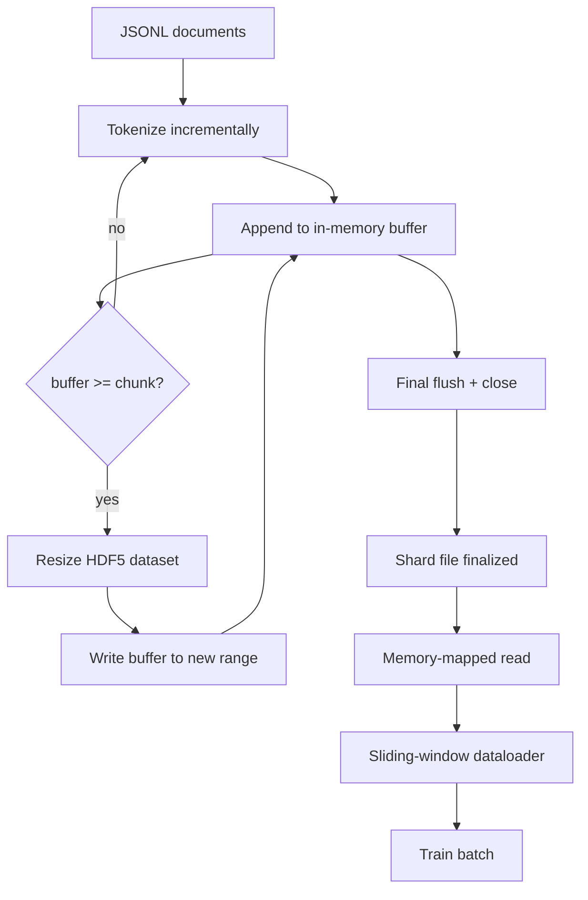

# HDF5 分词语料库

> 下载的语料库必须以训练器能够以线速流式读取的布局存放。磁盘上的 JSONL 无法承受 16 个 dataloader worker。带可调整大小、分块整数数据集的 HDF5 可以。本课构建流式分词写入可调整大小的 HDF5 数据集、跨多个文件的分片写入、训练时的内存映射读取，以及一个能按正确打包规则生成定长序列的滑动窗口 dataloader。

**Type:** Build
**Languages:** Python
**Prerequisites:** 第 19 阶段第 30-37 课
**Time:** 约 90 分钟

## 学习目标

- 将文档流式写入可调整大小的 HDF5 整数数据集，并采用确定性的分块方式。
- 将写入分片到多个 HDF5 文件，使故障影响有界且可并行。
- 通过 HDF5 基于页缓存 (page cache) 的分块布局读回 token，使 dataloader 仅在组装 batch 时拷贝进 batch 缓冲区。
- 实现一个滑动窗口 dataloader，按显式打包规则生成定长训练序列。

## 问题所在

现代语言模型训练运行以每秒数十万样本的速度、跨数十个 worker 读取 token。磁盘上的 JSONL 在第一次冷缓存页错误时就崩溃：JSON 解析器慢、文档边界不可寻址，且要定位"第 4,217,884 个样本"需要扫描整个文件。即使是压缩良好的 Parquet 也不合适，因为训练器要的不是列，而是一个支持 O(1) 随机访问的扁平 token 流。

HDF5 合适，因为它提供一个分块、可调整大小、仅含整数的 数据集，其块在读取时对页缓存友好。训练器请求 `tokens[3,200,000 : 3,200,8192]` 的一个切片，HDF5 将请求的超切片 (hyperslab) 从页缓存拷贝到新分配的 NumPy 数组中。代价是每个 worker 一个打开的文件句柄和块大小的页缓存占用，与解码 JSONL 的开销相比可以忽略不计。

构建上的难点在于让写入端保持严谨。可调整大小的数据集很容易被误用：一次写一个文档，HDF5 文件会碎片化到不可用的程度；一次 resize 后写入所有文档，进程死亡会丢失整个分片。正确的纪律是先缓冲再扩展 (buffer-then-extend)，缓冲区大小与块大小匹配，并采用分片写入将工作负载拆分到多个文件，使崩溃至多丢失一个分片。

## 核心概念



### 正确使用可调整大小的 HDF5

token 数据集以 `maxshape=(None,)` 创建，并使用固定的 `chunks=(chunk_size,)`。写入通过将 token 缓冲到长度为 `chunk_size` 的 NumPy 数组中进行。当缓冲区填满时，数据集恰好扩展 `chunk_size`，缓冲区被写入新的区间。分片结束时，残余缓冲区写入最后一个部分区间。除最后一次写入外，每次写入都是连续且块对齐的；读取方被告知按分片 HDF5 属性中记录的 `token_count` 进行截断。

### 分片写入

单个 HDF5 文件是单点故障。流水线并行写入分片：第 19 阶段第 42 课的每个输入分片产生一个 HDF5 输出分片。一个 `shards.json` 索引按分片记录文件路径、token 数、文档数，以及对 token 计算的 sha256。训练器读取 `shards.json` 来计算全局偏移并校验语料库。

### 内存映射读取

训练时每个 worker 以 `swmr=True` 模式打开其负责的 HDF5 文件并请求 `tokens[start:stop]`。HDF5 的分块布局使得一旦块变热 (hot)，读取就由页缓存支持。worker 从不将整个文件物化到内存：切片被拷贝进 dataloader 的 batch 缓冲区，dataloader 再在组装 batch 时将其拷入固定内存 (pinned memory) 的训练张量。热路径上每次块切换只有一次系统调用；其余都是 RAM 访问。

### 滑动窗口 dataloader

dataloader 是唯一知道训练序列长度的阶段。它在全局 token 流中选取随机起始索引，读取 `window_size + 1` 个 token，并返回 `(input, target) = (tokens[:-1], tokens[1:])`。文档边界不被强制：一个窗口可能跨越两个文档，中间有显式的 `boundary_token_id`，使模型学会使用分隔符。这是标准的打包规则；也是初学者容易遗忘的规则，其结果是语料库中 8% 是边界 token，92% 是自然文本。

```figure
cc-hdf5-corpus
```

## 动手构建

`code/main.py` 实现了：

- `Tokenizer` - 一个字节级确定性分词器，对演示而言足够了。接口是 `encode(text) -> list[int]` 和 `vocab_size`。
- `HDF5ShardWriter` - 打开一个可调整大小的整数数据集，将 token 缓冲到块大小，按固定步长 resize 并写入，在关闭时将 `token_count` 和 `sha256` 记录为 HDF5 属性。
- `ShardedTokenizationPipeline` - 迭代输入文档，将其路由到写入器，并输出一个 `shards.json` 索引。
- `MmapTokenStore` - 打开分片文件进行内存映射读取，计算全局偏移，暴露单个 `get_slice(start, stop)` API。
- `SlidingWindowDataloader` - 从全局流中选取随机窗口并生成 `(input_ids, target_ids)` NumPy 数组。

文件底部的演示构建一个小型内存语料库，分词写入两个分片，通过内存映射打开它们，运行 dataloader 10 个 batch，并打印每个 batch 的形状和校验和。

运行：

```bash
python3 code/main.py
```

脚本以零退出码退出并打印 batch 校验和。

## 生产模式

四个模式可将本课扩展到真实的训练运行。

**块大小等于典型读取量。** 训练器每个样本读取 `window_size + 1` 个 token。将 HDF5 块设为 `window_size` 的倍数，读取就与页缓存对齐。块不匹配会使吞吐量减半，因为每个样本会触及两个块。

**token 数存在属性中，而不是数据集里。** 数据集的末尾切片可能是部分填充的，因为块大小不能整除文档边界。将真实的 `token_count` 作为 HDF5 属性存储在数据集上，让读取器按该值截断。否则读取器会越过末尾读到零填充的 token，模型会学会预测零。

**带并行校验的分片 sha256。** 每个分片都有自己的基于 token 字节的 sha256。训练器可以在训练开始前并行校验所有分片。错误的 sha256 会让运行早早失败，而不是在十六小时后的第三个 epoch 才失败。

**两侧都启用 `swmr=True`，写入器使用 `libver="latest"`。** 单写者多读者 (SWMR) 模式要求写入器以 `libver="latest"` 打开，预先创建所有数据集，然后设置 `file.swmr_mode = True`。此后写入器必须在每次 resize 后调用 `dataset.flush()`，使读取器 worker（以 `swmr=True` 打开）看到一致的数据。跳过 `libver="latest"` 或在结构变更后才启用 SWMR 是"文件被锁定"失败的常见原因。

## 使用方式

生产模式：

- **每个源分片一个 HDF5。** 下载器（第 42 课）每个 URL 输出一个分片；分词（本课）每个源分片输出一个 HDF5。1:1 的映射使断点续传和部分失败恢复变得简单。
- **边界 token id。** 边界 token 是分词器词表的一部分，也是 dataloader 注入的唯一 token。如果模型应当忽略边界 token，训练损失会将其掩蔽；否则模型会学会将其用作序列分隔符。
- **以 `shards.json` 作为事实来源。** 添加新分片意味着写入 HDF5、计算其 sha256 并追加一条记录。训练器在启动时读取该文件一次，从不触碰目录列表。

## 上线交付

`outputs/skill-hdf5-tokenized-corpus.md` 在真实项目中会描述哪个分词器供给流水线、什么块大小匹配训练器的窗口、`shards.json` 存放在版本控制的位置，以及 dataloader worker 如何跨文件分片。本课交付的是引擎。

## 练习

1. 给 HDF5 写入器添加 `--compression gzip` 标志，并在演示语料库上测量吞吐量代价。为你选择的默认值辩护。
2. 给滑动窗口 dataloader 添加确定性种子，并验证相同种子的两次运行产生相同的 batch。
3. 添加一个 `--validate` 模式：读取每个分片，对其 token 重新计算 sha256，并与 `shards.json` 比对。CI 应在训练开始前运行此检查。
4. 比较块大小等于、二分之一倍和两倍窗口大小时的 dataloader 吞吐量。报告页缓存效应。
5. 添加一个 `--max-document-tokens` 标志，在写入时截断过长的文档。与在读取时再做决定相比，为这一取舍辩护。

## 关键术语

| 术语 | 人们的说法 | 实际含义 |
|------|-----------------|------------------------|
| 可调整大小的数据集 | "只追加" | 一个带有 `maxshape=(None,)` 的 HDF5 数据集，通过按块大小步长调用 `resize` 增长 |
| 分块布局 | "HDF5 的存储方式" | 固定大小的磁盘页，内核可以内存映射，dataloader 可以连续读取 |
| `swmr` 模式 | "边写边读" | 单写者多读者模式，使 dataloader worker 可以安全地共享文件 |
| 分片索引 | "shards.json" | 所有 token 分片的持久索引，含偏移量和内容哈希 |
| 滑动窗口 | "训练样本" | 全局 token 流的定长切片，训练器将其与偏移一位的目标配对 |

## 延伸阅读

- [HDF5 分块文档](https://support.hdfgroup.org/documentation/hdf5/latest/hdf5_chunking.html) - 本课使用的分块、可调整大小的数据集布局
- [h5py 用户指南](https://docs.h5py.org/en/stable/) - HDF5 的 Python 绑定
- [NumPy 内存映射](https://numpy.org/doc/stable/reference/generated/numpy.memmap.html) - HDF5 通过 h5py 暴露的读取端原语
- Phase 19 · 42 - 本课对其输出进行分词的下载器
- Phase 19 · 44 - 消费此 dataloader 的余弦调度
- Phase 19 · 45 - 包裹训练步的 AMP 循环