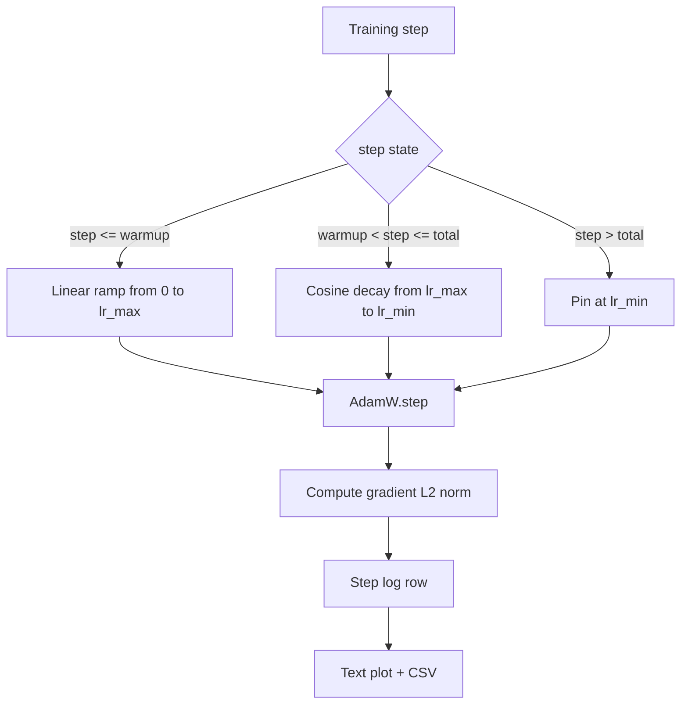

# 余弦学习率调度与线性预热

> 学习率调度是仅次于损失函数的第二重要的决策。AdamW 配合余弦衰减和线性预热是现代语言模型训练的默认选择，因为它使模型在最脆弱的前一千次更新中保持较小的有效步长，随后爬升至配置的峰值，再平滑地衰减回接近零。本课将构建该调度，绘制其随训练步数变化的曲线，将梯度范数与调度并排记录，并验证该调度严格遵守预热、峰值和衰减边界。

**Type:** Build
**Languages:** Python
**Prerequisites:** Phase 19 lessons 30-37
**Time:** ~90 minutes

## 学习目标

- 实现一个连接到带线性预热的余弦学习率调度的 AdamW 优化器。
- 在任意步数下精确计算调度的值，且在多次运行之间不产生浮点漂移。
- 将梯度 L2 范数与学习率并排记录，使训练健康状况可观察。
- 将调度渲染为肉眼可读的文本图和任何工具都能消费的 CSV。

## 问题所在

训练的前一千次更新是最危险的。此时模型的权重仍接近初始化状态。优化器的二阶矩运行估计尚未稳定。梯度范数大且充满噪声。如果学习率在这些更新中处于峰值，模型要么直接发散，要么陷入一个永远无法摆脱的损失平台期。两个众所周知的修复手段是梯度裁剪（Phase 19 lesson 45 的主题）以及一个从小值开始并逐渐爬升的学习率调度。

带预热的余弦调度有三个区域。从第 0 步到第 `warmup_steps` 步，学习率从零线性缩放到配置的峰值 `lr_max`。从第 `warmup_steps` 步到第 `total_steps` 步，学习率遵循余弦曲线的上半部分，从 `lr_max` 衰减到 `lr_min`。在 `total_steps` 之后，学习率被固定在 `lr_min`，这样配置错误而超出的训练器不会无声地脱离调度。

构建上的难点在于调度很容易出现差一错误。这种差一错误会在训练运行六小时后显现出来——在模型开始过拟合的时刻学习率偏高或偏低 1%，除非在边界处对调度进行穷举测试，否则这一点无法察觉。

## 概念



### 预热公式

对于 `[0, warmup_steps]` 中满足 `warmup_steps > 0` 的 `step`，学习率为 `lr_max * step / warmup_steps`。退化情况 `warmup_steps = 0` 被视为“无预热”：调度在第 0 步直接从 `lr_max` 开始，并立即进入余弦衰减。某些测试工具会传入 `warmup_steps = 0`，以检查调度仍能产生可用的曲线。

### 余弦公式

对于 `(warmup_steps, total_steps]` 中的 `step`，学习率为 `lr_min + 0.5 * (lr_max - lr_min) * (1 + cos(pi * progress))`，其中 `progress = (step - warmup_steps) / max(1, total_steps - warmup_steps)`。在 `step = warmup_steps` 处余弦求值为 `cos(0) = 1`，得到 `lr_max`，与预热终点完全吻合。在 `step = total_steps` 处余弦求值为 `cos(pi) = -1`，得到 `lr_min`，与衰减终点完全吻合。

两个端点处的连续性并非偶然。这正是调度被实现为覆盖 `step` 的单一函数、而不是拼接三个不同函数的原因。拼接式的调度在 `lr_max` 第一次被修改时就会丢失一个边界。

### 总步数之后的下限

对于 `step > total_steps`，学习率保持在 `lr_min`。契约是明确的：调度不报错、不外推；它固定在下限处，并让训练器记录一条警告。需要延长训练的训练器应修改调度的 `total_steps`，而不是修改循环。

### 梯度范数与学习率并排记录

调度只是训练健康状况的一半，梯度范数是另一半。训练循环在每一步都记录两者。发散的训练运行会先在梯度范数上表现出尖峰，然后才反映到损失上；调优良好的预热使范数随学习率线性上升；过于激进的峰值则表现为预热结束后范数持续偏高。磁盘上的数据集是 `step, lr, grad_l2_norm, loss`。CSV 是唯一持久的记录。

```figure
cap-cosine-warmup
```

## 动手构建

`code/main.py` 实现：

- `CosineWithWarmup` - 基于所配置调度的无状态函数 `lr(step) -> float`。
- `TrainState` - 将模型、一个 `AdamW` 优化器和该调度封装为单一的分步函数。
- `TrainState.step` - 执行一次前向传播、一次反向传播，记录梯度 L2 范数，并对优化器应用 `lr(step)`。
- `plot_schedule_ascii` - 将调度渲染为肉眼可读的文本图。
- `write_schedule_csv` - 每步输出一行记录，包含学习率。

文件底部的演示会构建一个微小的 `nn.Linear` 模型，在固定的输入批次上训练 20 步，并打印每步的学习率、梯度范数和损失。调度还会被渲染为文本图，供视觉上的合理性检查。

运行它：

```bash
python3 code/main.py
```

脚本以零状态退出，并打印逐步训练日志以及调度图。

## 生产模式

以下四种模式将调度提升为生产级工件。

**调度存放在配置中，而不是代码里。** 训练器从提交到 git 的 YAML 或 JSON 配置中读取 `warmup_steps`、`total_steps`、`lr_max`、`lr_min`。调度是可复现的，因为配置按内容寻址；调度是可审计的，因为配置是 PR diff 的一部分。

**步数计数器是单调的，并与 epoch 解耦。** 某些框架在数据集分片或 dataloader 重启时会混淆步数与 epoch。调度应从训练器的检查点读取 `global_step`，而不是从本地计数器读取。恢复的运行能从正确的调度位置继续，因为步数计数器是持久化的轴。

**运行目录中的调度图。** 每次训练运行都会将 `outputs/lr_schedule.png`（在本课中为文本图）写入其运行目录。审阅者只需浏览目录即可对调度做合理性检查，无需重新运行任何东西。这能在 PR 阶段捕获配置错误的调度这类 bug。

**日志行模式固定不变。** `step, lr, grad_l2_norm, loss`，严格按此顺序。下游的 notebook 或仪表盘依赖该模式；在不升级版本号的情况下重命名一列会使所有现有仪表盘失效。

## 使用它

生产模式：

- **先扫峰值，再扫其他任何超参。** `lr_max` 是最敏感的旋钮。先在小模型上扫它；最优的 `lr_max` 与模型规模呈弱相关，因此小模型的扫参是强先验。
- **预热是总步数的比例，而不是绝对步数。** 一个 2 亿步的运行若只预热 2000 步，几乎立即到达峰值；一个 20000 步的运行若用相同的预热数，则预热占总步数的 10%。将预热配置为比例（典型值：1-3%），使调度随训练时长缩放。
- **`lr_min` 特意非零。** 设为 `lr_max` 的 10% 的下限可让优化器在漫长尾段继续学习。`lr_min = 0` 的调度会产生一条图上看起来很棒的训练曲线，以及一个实际上尚未训练完成的模型。

## 交付它

在真实项目中，`outputs/skill-cosine-warmup.md` 会描述哪个配置承载了调度、全局计数器从训练器的哪一步读取，以及什么 `lr_max` 扫参产出了部署的值。本课交付的是引擎本身。

## 练习

1. 添加调度的逆平方根变体，并在 200 步的玩具训练运行上比较两者。哪条曲线产生更低的最终损失？
2. 添加一个 `--restart` 标志，在 `total_steps / 2` 处增加第二次预热。论证预热重启在玩具运行上是改善还是有害。
3. 添加一个验证调度连续性的单元测试：对于 `[0, total_steps]` 中的每一步，差值 `|lr(step+1) - lr(step)|` 以 `lr_max / warmup_steps` 为界。
4. 将调度接入一个 `torch.optim.lr_scheduler.LambdaLR`，使其能与框架代码组合。本课使用的是普通的分步函数；这个包装器改变了什么？
5. 添加一个 `--plot-png` 标志，通过 `matplotlib` 写出真实图像。论证对于 CI 运行而言，本课的文本图和 PNG 哪个是更好的默认选择。

## 关键术语

| 术语 | 人们的说法 | 实际含义 |
|------|-----------------|------------------------|
| 预热 | "慢启动" | 在前 `warmup_steps` 次更新中从零到 `lr_max` 的线性爬升 |
| 余弦衰减 | "平滑下降" | 在剩余步数中从 `lr_max` 到 `lr_min` 的上半余弦曲线 |
| 下限 | "训练结束后" | 调度超过 `total_steps` 后固定在的 `lr_min` 值 |
| 梯度范数 | "梯度的 L2" | 拼接后的梯度向量的欧几里得范数，每步记录 |
| 全局步数 | "调度的轴" | 一个能在重启后存活并驱动调度的单调步数计数器 |

## 延伸阅读

- [Loshchilov and Hutter, SGDR: Stochastic Gradient Descent with Warm Restarts (arXiv 1608.03983)](https://arxiv.org/abs/1608.03983) - 余弦调度的参考论文
- [Loshchilov and Hutter, Decoupled Weight Decay Regularization (arXiv 1711.05101)](https://arxiv.org/abs/1711.05101) - AdamW 的参考论文
- [PyTorch torch.optim.lr_scheduler](https://docs.pytorch.org/docs/stable/optim.html#how-to-adjust-learning-rate) - 分步函数如何与框架调度器组合
- Phase 19 · 42 - 本调度所消费语料的下载器
- Phase 19 · 43 - 与调度共同演化的 dataloader
- Phase 19 · 45 - 梯度裁剪与 AMP，训练循环中的下一层