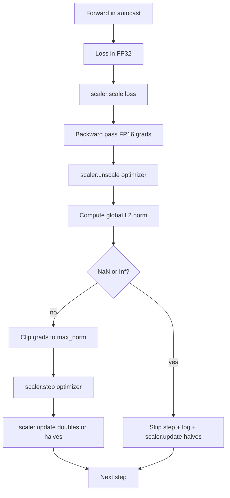

# 梯度裁剪与混合精度

> 上一课的优化器和调度器假设梯度是正常的。但通常并非如此。一个坏批次就能使梯度范数飙高三个数量级。混合精度训练通过在损失侧引入 FP16 溢出进一步放大了这个问题。本课构建生产级训练不可或缺的两条安全带：将梯度裁剪到配置的全局 L2 范数，以及一个带有 autocast 和 GradScaler 的混合精度循环——它能检测 NaN 和 Inf、干净地跳过该步，并记录缩放因子以便事后分析。

**Type:** Build
**Languages:** Python
**Prerequisites:** Phase 19 lessons 30-37
**Time:** ~90 minutes

## 学习目标

- 计算所有参数梯度的全局 L2 范数，并在超过配置阈值时就地裁剪。
- 用 autocast 加 GradScaler 包装训练步，使 FP16 的前向和反向传播能在溢出中幸存。
- 检测损失或梯度中的 NaN 和 Inf，跳过优化器步，并记录跳过事件。
- 每步报告 GradScaler 的缩放因子，使连续多次跳过立即可见。

## 问题

昨天运行良好的训练，在损失曲线上于第 8,217 步突然垂直飙升。罪魁祸首是一个梯度范数为 4,200 的批次——此前峰值的二十倍。不裁剪的话，优化器会应用一步操作，抹掉模型此前一小时内学到的所有东西。而使用范数 1.0 的全局 L2 裁剪，同一批次只贡献一个单位范数的更新；损失保持在趋势线上；训练得以幸存。

混合精度训练通过用 FP16 计算前向传播和大部分反向传播，将吞吐量提高 2-3 倍。代价是 FP16 的指数范围很窄。一个在 FP16 中溢出的典型梯度会求值为 Inf,随后在各层中传播为 NaN,并在下一次优化器步时把所有权重都设为 NaN。PyTorch 的 GradScaler 通过在反向传播前将损失乘以一个较大的缩放因子、并在优化器步前将梯度除以同一因子来解决这个问题。如果在反缩放时任何梯度为 Inf 或 NaN,缩放器会跳过该步并将缩放因子减半；如果此前 N 步都正常，缩放器将因子加倍。在整个训练过程中，因子会收敛到 FP16 范围所允许的最高值。

构建的难点在于正确地把两者连接起来。在反缩放前裁剪，阈值作用在缩放后的梯度上；在反缩放后裁剪，则操作顺序对 GradScaler 很重要。正确的顺序是：`scaler.scale(loss).backward()`,然后 `scaler.unscale_(optimizer)`,然后 `clip_grad_norm_`,然后 `scaler.step(optimizer)`,然后 `scaler.update()`。任何其他顺序都会产生一个静默失效的循环。

## 概念



### 全局 L2 范数

全局 L2 范数是拼接后的梯度向量的欧几里得范数，而不是逐参数的范数。PyTorch 将其实现为 `torch.nn.utils.clip_grad_norm_(parameters, max_norm)`。该函数返回裁剪前的范数，以便本课能同时记录自然值和裁剪后的值——这是诊断“我们每一步都在裁剪”所必需的。

### autocast 和 GradScaler

`torch.amp.autocast(device_type)` 是一个上下文管理器，它选择性地以 FP16 运行符合条件的操作(大多数矩阵乘法类操作)。`torch.amp.GradScaler(device_type)` 是一个辅助工具，它在反向传播前缩放损失，并在优化器步前对梯度进行反向缩放。二者是配套设计的；只使用其中一个而不使用另一个，是测试应当捕获的配置错误。

本课使用 CPU autocast,因为这是 CI 中运行的环境；将 `device_type="cpu"` 改为 `device_type="cuda"`,同样的模式可以原封不动地迁移到 CUDA。CPU 上的 GradScaler 是一个占位实现(CPU autocast 默认已经以 BF16 运行，不需要损失缩放)，但本课包含了调用点，使接线与 GPU 循环完全一致。

### NaN 和 Inf 检测

检测发生在两个地方。首先，在反向传播之前用 `torch.isfinite` 检查损失本身；Inf 或 NaN 的损失不会产生有用的梯度，因此直接跳过而不进入优化器。其次，在 `scaler.unscale_(optimizer)` 之后，本课用 `has_non_finite_grad(...)` 扫描反缩放后的梯度，并将任何 Inf 或 NaN 视为跳过。这两项检查合在一起，覆盖了前向传播和反向传播两种失败模式。

### 缩放因子诊断

缩放因子是 GradScaler 的内部状态。本课每步读取 `scaler.get_scale()`,并将其与学习率和梯度范数一起记录。健康的运行显示缩放因子以 2 的幂攀升，直到在 `2^17` 或 `2^18` 附近饱和。行为异常的运行显示因子在高值和低值之间振荡——这是模型梯度有时在范围内、有时不在的信号。不记录日志的话，这个诊断是不可见的。

```figure
grad-clip-monitor
```

## 动手构建

`code/main.py` 实现了：

- `clip_global_l2_norm` - 对 `torch.nn.utils.clip_grad_norm_` 的一个包装，同时返回裁剪前和裁剪后的范数。
- `has_non_finite_grad` - 一个扫描梯度中 NaN 和 Inf 的辅助函数。
- `AmpTrainState` - 包装一个模型、一个 `AdamW` 优化器、一个 GradScaler 和一个 autocast 设备。暴露一个 `step(inputs, targets)`,运行完整的裁剪、缩放和 NaN 跳过流水线。
- `StepLog` 和 `SkipLog` - 结构化的每步记录。
- 一个演示：训练一个小的 `nn.Linear` 模型 20 步，在第 5 步向梯度注入一个 Inf 以触发跳过路径，并打印生成的日志。

运行它：

```bash
python3 code/main.py
```

脚本以零退出，并打印一个每步日志，每行标记为 `STEP` 或 `SKIP`;其中至少有一行是 `SKIP`。

## 生产模式

四种模式将该循环提升为生产级训练步。

**跳过计数器应当是告警，而不只是一行日志。** 每次训练中出现少量跳过步是健康的。每个 epoch 出现数百次跳过则是硬性告警：模型处于 FP16 无法承受的状态，循环正在静默失效。本课跟踪一个 1,000 步的滚动跳过率，在生产环境中，当比率超过 5% 时就会发出告警。

**裁剪阈值放在配置中。** `max_norm = 1.0` 是现代语言模型训练的默认值。先在小模型上扫描它；较大的阈值让模型能从真正困难的批次中恢复；较小的阈值限制了最坏情况，代价是损失曲线更嘈杂。该阈值应与第 44 课的调度器放在同一个 YAML 或 JSON 配置中。

**范数日志与调度器一起写入 CSV。** CSV 的列为 `step, lr, grad_l2_pre_clip, grad_l2_post_clip, loss, skipped, skip_reason, scaler_scale`。审阅者打开文件，就能在一行中看到调度器、梯度情况、缩放因子和跳过结果(及其原因)。把列拆分到多个文件中，是导致分析错位的常见原因。

**`scaler.update()` 每步都要运行，即使跳过。** 在正常步上，缩放器读取其无 Inf 计数器、递增它，并可能将因子加倍。在跳过步上，缩放器将因子减半并重置计数器。在跳过路径上忘记 `update()`,就是产生“缩放因子从未变化”这一现象的 bug。

## 使用

生产模式：

- **Autocast 设备与优化器设备匹配。** GPU 训练用 `torch.amp.autocast(device_type="cuda")`;CPU 用 `torch.amp.autocast(device_type="cpu")`。混用设备会产生一个静默的类型错误，表现为损失曲线看似正常，但模型并没有在学习。
- **反向传播前检查损失。** `torch.isfinite(loss).all()` 只是一次张量规约；开销可以忽略不计，而在 NaN 损失上节省的则是一整个训练步。始终执行它。
- **在 `zero_grad` 中使用 `set_to_none=True`。** 将梯度设为 `None` 而不是零，这让优化器可以跳过对未受影响参数组的计算。该设置是免费的吞吐量提升，并略微减少了出 bug 的面。

## 发布

`outputs/skill-clip-amp.md` 在真实项目中会描述训练步使用哪个裁剪阈值和 autocast 设备、每步 CSV 存放在版本控制中的什么位置，以及生产环境跳过率告警阈值是多少。本课交付的是引擎。

## 练习

1. 将合成的 Inf 注入替换为真实的损失尖峰(将某个批次的目标乘以 1e8),验证跳过路径被触发。
2. 添加一个 `--bf16` 模式，将 autocast 切换为 BF16 而不是 FP16。BF16 的指数范围比 FP16 宽，几乎不需要损失缩放；验证在同样的演示中跳过率降为零。
3. 添加一个单元测试，验证当未发生裁剪时，梯度裁剪包装器能正确返回裁剪前和裁剪后的范数。
4. 添加滚动窗口跳过率计算和一个 CLI 标志，当该比率在连续 100 步内超过配置阈值时使运行失败。
5. 将循环接上以写入规范 CSV(`step, lr, grad_l2_pre_clip, grad_l2_post_clip, loss, skipped, skip_reason, scaler_scale`),并确认在每行写入后都执行 flush,文件能在 Ctrl-C 下幸存。

## 关键术语

| 术语 | 人们的说法 | 实际含义 |
|------|-----------------|------------------------|
| 全局 L2 范数 | "裁剪目标" | 所有可训练参数拼接后的梯度向量的欧几里得范数 |
| autocast | "混合精度" | 在 `with` 块内对符合条件的操作选择性执行 FP16(或 BF16) |
| GradScaler | "损失缩放器" | 在反向传播前放大损失、并在优化器步前对梯度反向缩放的辅助工具 |
| 跳过 | "坏步" | 因梯度或损失非有限而被拒绝的优化器步；缩放器将因子减半 |
| 缩放因子 | "缩放器状态" | GradScaler 当前的乘数；连续正常后加倍，每次跳过时减半 |

## 延伸阅读

- [Micikevicius et al., Mixed Precision Training (arXiv 1710.03740)](https://arxiv.org/abs/1710.03740) - 损失缩放的原始提案
- [Pascanu, Mikolov, Bengio, On the difficulty of training recurrent neural networks (arXiv 1211.5063)](https://arxiv.org/abs/1211.5063) - 梯度裁剪的参考论文
- [PyTorch torch.amp.GradScaler](https://docs.pytorch.org/docs/stable/amp.html) - 本课包装的缩放器 API
- [PyTorch torch.nn.utils.clip_grad_norm_](https://docs.pytorch.org/docs/stable/generated/torch.nn.utils.clip_grad_norm_.html) - 本课使用的裁剪原语
- Phase 19 · 42 - 为循环提供语料的下载器
- Phase 19 · 43 - 循环所消费的 dataloader
- Phase 19 · 44 - 本循环与之组合的调度器