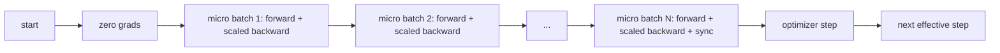
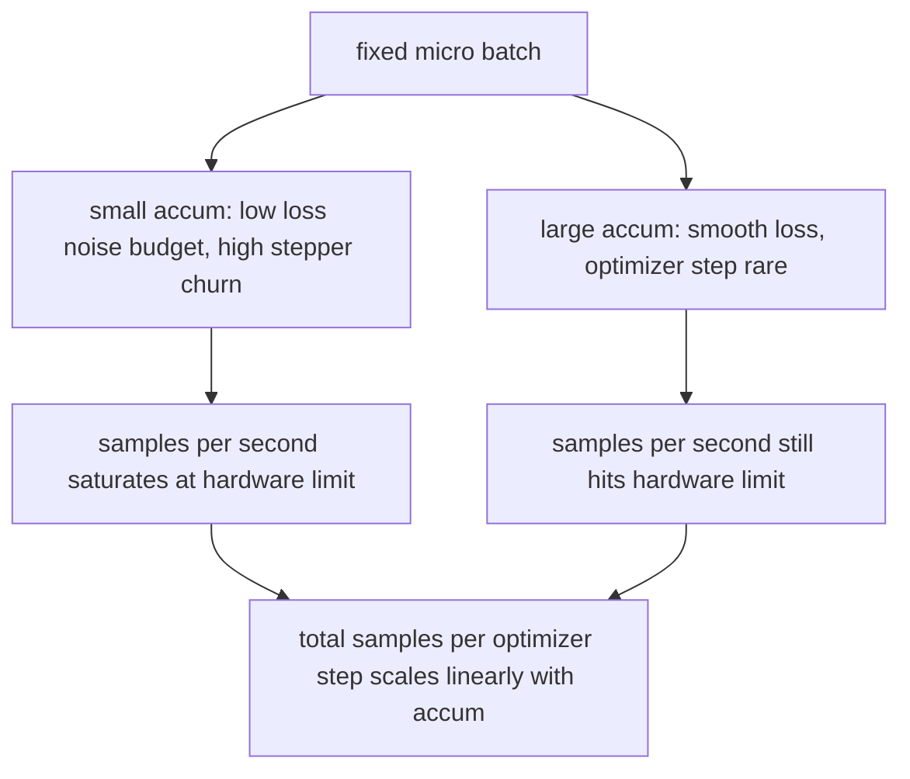

# 梯度累积

> 在你负担不起的有效批量上进行训练，一次一个 micro-batch。缩放损失，暂缓优化器步进，让梯度不断累积。

**Type:** Build
**Languages:** Python
**Prerequisites:** Phase 19 lessons 42 to 45
**Time:** ~90 minutes

## 学习目标

- 推导有效批量恒等式：`effective_batch = micro_batch * accum_steps`。
- 实现按 micro-batch 的损失缩放，使累积梯度等价于一次全批量反向传播。
- 在最后一个 micro-batch 之前跳过优化器同步（sync-on-last-step）。
- 读懂吞吐量-有效批量曲线，并解释收益递减现象。

## 问题

你希望以 512 的有效批量进行训练，因为损失曲线更平滑，而且优化器步进在这个尺度上更有意义。而手头的加速器只能容纳 32 个样本，再多就内存不足。加大批量不是一个选项。缩小模型也不是一个选项。业界从 2017 年起就一直使用的技巧是：运行 16 次反向传播，让梯度在参数缓冲区中累积，只有当计数达到目标时才执行一次优化器步进。

风险在于，损失不再是原来大批量下的那个数值。将 16 个 mini-batch 的交叉熵朴素相加，得到的是一次全批量损失的 16 倍。如果不做缩放，梯度方向是正确的，但幅值是错误的，优化器步进会大 16 倍。修复方法只是一次除法，但也容易被遗忘。

## 概念



契约很短：

- 每个 micro-batch 的损失在 `backward()` 之前除以 `accum_steps`。PyTorch 默认将梯度累加到 `param.grad` 中；除法把累加值拉回到正确的量级。
- 优化器步进在每个有效批量触发一次，即最后一个 micro-batch 的反向传播之后。在累积中途步进会使后续整个训练所依赖的每个参数产生偏差。
- 优化器状态（动量缓冲区、Adam 的一二阶矩）每个有效步进更新一次，而不是每个 micro-batch 更新一次。否则指数移动平均会看到错误的频率，并提前耗尽学习率调度。
- 在单设备上，这只是记账工作。在多节点集群上，同样的模式会将非最后的 micro-batch 包裹在 `no_sync` 上下文中，跳过梯度 all-reduce；最后一个 micro-batch 一次性归约全部累积梯度，而不是支付 N 次网络开销。

### 代码中的等价性证明

```python
loss = criterion(model(x_full), y_full)
loss.backward()
opt.step()
```

等价于

```python
for x, y in chunks(x_full, y_full, n):
    scaled = criterion(model(x), y) / n
    scaled.backward()
opt.step()
```

差别仅在浮点求和顺序。循环结束时，累积梯度缓冲区与一次全批量反向传播得到的张量相同。课程代码在 `equivalence_check` 中用小于 1e-4 的最大绝对差值对此进行断言。

### 开销去了哪里

每个 micro-batch 需要一次前向和一次反向。使用累积是以时间换内存。`outputs/accum-curve.json` 中的吞吐量曲线展示了在固定 micro-batch 下，有效批量增大时会发生什么：



没有免费的午餐。将 `accum_steps` 加倍，每个优化器步进的墙钟时间也加倍。改变的是梯度估计的方差：在相同的墙钟预算下，你做了更少的优化器步进，但每一步都在更多样本上取了平均。文献把大批量和小批量视为不同的优化问题；而本课的内容是机制性的，不是统计性的。

```figure
cc-grad-accumulation
```

## 动手实现

`code/main.py` 是可运行的产物。它做三件事。

### 第 1 步：等价性检查

`equivalence_check()` 用相同种子构建同一网络的两份副本。一份在单次前向中看到 16 个样本的批量。另一份看到四个 4 样本的分块，损失除以四。该函数在优化器步进之前比较梯度缓冲区，之后比较参数。断言为 `max_abs_diff < 1e-4`。

### 第 2 步：sync-on-last-step 模式

`train_one_optimizer_step` 遍历 micro-batch。对除最后一个之外的每个 micro-batch，它进入 `no_sync_context(model)`。在单进程中该上下文是空操作；在 DDP 上这正是跳过梯度 all-reduce 的地方。记账逻辑无论如何都一样。一个 `sync_counter` 记录我们离开 no_sync 作用域的次数；对于 N 个 micro-batch，每个有效步进计一次，而不是 N 次。

### 第 3 步：吞吐量曲线

`sweep_effective_batches` 用固定的 micro-batch 和一组累积步数运行同一模型。对每种配置，它记录：

- `samples_per_sec`：总样本数除以墙钟时间
- `median_step_ms`：每个有效步进的中位数（第 50 百分位）
- `sync_calls`：执行的集合通信点数
- `avg_loss`：整个扫描中各优化器步进的平均值

输出写入 `outputs/accum-curve.json`，可在 notebook 中复用。

运行它：

```bash
python3 code/main.py
```

脚本先打印等价性差值，然后是扫描表格，最后是 JSON 路径。退出码为零。

## 使用它

在生产训练中，梯度累积隐藏在一个旋钮后面。PyTorch 的模式是 `accumulation_steps = effective_batch // (micro_batch * world_size)`。你在这里不允许使用的框架包装了同样的循环，但步骤相同：缩放损失，在非最后的 micro 上跳过同步，累积，步进一次。

实践中的三种模式：

- micro-batch 大小的选择以占满设备内存为准。更小会浪费加速器周期，更大则会崩溃。
- 有效批量的选择取决于学习率调度。大的有效批量需要相应缩放的学习率和 warmup；这就是自 2017 年以来广为讨论的线性缩放规则。
- 累积次数是两者之间的桥梁，也是你在运行时唯一可以自由调节、无需重写数据加载器的旋钮。

## 交付它

`outputs/skill-gradient-accumulation.md` 记录了这份配方，方便同事直接引入新的仓库：损失除以 `accum_steps`，在非最后的 micro 上跳过优化器同步，每个有效批量执行一次优化器步进，将吞吐量对有效批量的关系以 JSON 形式记录，使权衡可见。

## 练习

1. 用 `--num-steps 100` 重新运行扫描，并绘制样本每秒对有效批量的曲线。曲线在哪里变平？
2. 添加一个错误缩放的变体（不做除法），并在第 1 步展示参数与参考值的差值。
3. 将 SGD 换成 AdamW，并确认优化器状态每个有效步进更新一次，而不是每个 micro-batch 更新一次。
4. 引入一个真实的 `DistributedDataParallel` 包装器，并把 `no_sync_context` 路由到它的方法。确认 sync_calls 每个有效批量减少 N-1。
5. 修改等价性检查以比较两种不同的 micro 划分方式（2×8 对 4×4），并解释你需要放宽到什么容差。

## 关键术语

| 术语 | 人们怎么说 | 实际含义 |
|------|-----------------|------------------------|
| Micro batch | 你做前向的批量 | 单次前向传播中能放进内存的切片 |
| Accum steps | 每步的反向传播次数 | 在一次优化器步进之前累加的反向传播次数 |
| Effective batch | 那个批量 | micro batch × accum steps × 数据并行 world size |
| Loss scaling | 除以 N | 每个 micro-batch 的除法，使累加梯度等价于全批量 |
| Sync on last | 跳过其余 | 只在窗口内最后一次反向传播时执行梯度集合通信 |

## 延伸阅读

- 关于 `DistributedDataParallel.no_sync` 的 PyTorch 文档，即 sync-on-last-step 技巧的生产版本。
- Goyal et al., 2017，关于大批量训练的线性缩放，这是关注有效批量的经典原因。
- PyTorch issue tracker 上关于梯度累积与混合精度反缩放交互的讨论。
- Phase 19 lessons 42 to 45 介绍了本课所假设的模型、数据加载器、优化器和训练器脚手架。
- Phase 19 lesson 47 介绍了 checkpoint 与恢复，使长时间的累积运行能够在墙钟上限内存活。