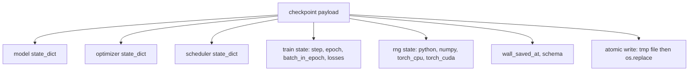
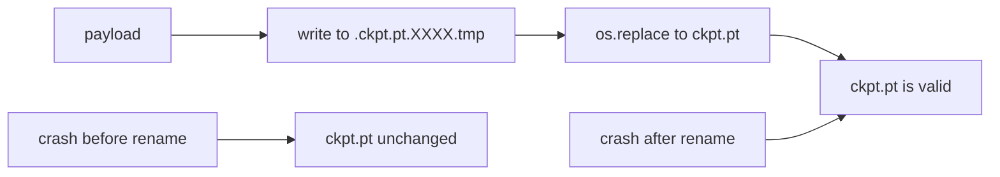
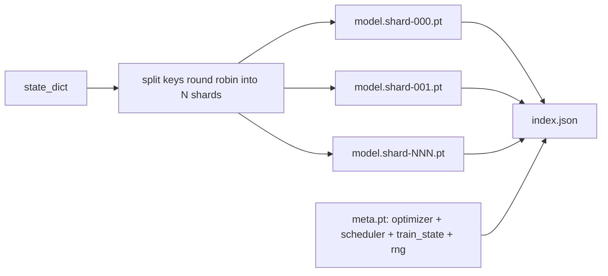

# 检查点保存与恢复

> 训练中断会导致整个运行报废；检查点让训练得以继续。以原子方式保存模型、优化器、调度器、损失历史、步数计数器和 RNG 状态，这样无论何时被杀掉，磁盘上都会留下一个有效的文件。

**Type:** Build
**Languages:** Python
**Prerequisites:** Phase 19 第 42 到 45 课
**Time:** 约 90 分钟

## 学习目标

- 将完整训练状态捕获到单一载荷中，并可在全新进程中重新加载。
- 实现原子保存：先写入临时文件再重命名，确保崩溃时绝不会留下半写的文件。
- 恢复 Python、NumPy 和 PyTorch 的 RNG 状态，使恢复后的损失与不中断的基线一致。
- 为无法放入单个文件的大模型构建分片检查点布局，包含哈希校验的分片和一个 JSON 索引。

## 问题所在

你设置了一个 18 小时的训练任务，但墙钟上限是 4 小时。在第 11 小时时，集群因为某个职位比你高的人批准了内核升级而重启。没有检查点，你只能从头开始。没有恢复功能，你还会丢失花掉前 11 小时才学到的优化器状态；即使模型权重幸存，AdamW 的动量也没有了，下一步会朝训练轨迹早已越过的方向猛跳。

正确的产物是一个包含继续训练所需一切的单个文件：模型参数、优化器状态、调度器状态、用于绘图的损失历史、当前的步数、轮次和轮内批次计数器，以及每个随机性来源的 RNG 状态。没有 RNG 状态，恢复后的损失曲线就是另一条曲线。相同的模型、相同的数据，但不同的打乱方式、不同的 dropout 掩码、仪表盘上不同的数字。

原子保存是这份契约的另一半。直接写入最终文件名意味着写入中途崩溃会留下损坏的文件，恢复时读到的就是垃圾数据。先写入同一目录下的临时文件再重命名，意味着写入中途崩溃时之前的良好文件不会受影响。重命名在 POSIX 文件系统上是原子操作。

## 核心概念



### 五个状态桶

| 桶 | 为什么重要 |
|--------|----------------|
| 模型 | 权重和缓冲区；模型本身是什么。 |
| 优化器 | 动量和自适应矩；没有它们，下一步就变成了另一个优化问题。 |
| 调度器 | 学习率在曲线上的位置；余弦调度对此尤其敏感。 |
| 训练计数器 | 步数、轮次、轮内批次，以及绘制仪表盘的损失历史。 |
| RNG 状态 | dropout、数据打乱以及模型内部任何采样的确定性。 |

### 原子保存



两条规则。第一，临时文件与目标文件位于同一目录，这样重命名保持在同一文件系统内；跨设备的重命名不是原子操作。第二，临时文件名每次尝试都唯一，这样两个写入者不会互相覆盖。

### 分片检查点

当模型变大后，单文件载荷会变得加载太慢、检查太麻烦，而且当网络共享在读取中途出问题时会非常痛苦。解决方案是将参数状态拆分成多个分片，并写入一个将它们关联起来的小索引。



索引记录分片数量、每个分片的 sha256，以及元文件的 sha256。任何哈希不匹配时加载器都会大声报错。分片可以放在不同的物理磁盘上；元文件很小，最先读取。

### 恢复从轮次中间继续

直接跳到下一个轮次开头的恢复会浪费几分钟到一天不等的时间。解决方案是 `(epoch, batch_in_epoch)` 加上 RNG 状态。加载后，训练循环将随机数生成器快进越过当前轮次已消耗的批次，并从 `batch_in_epoch` 继续。本课代码正是这样做的；其断言是恢复后的损失轨迹与不中断的基线在 1e-4 以内一致。

```figure
cc-atomic-checkpoint
```

## 动手构建

`code/main.py` 提供四个原语和一个演示驱动程序。

### 第 1 步：捕获并恢复 RNG 状态

`capture_rng_state` 返回一个字典，包含 Python 的 `random.getstate`、NumPy 的 `np.random.get_state`，以及 PyTorch CPU 和 CUDA 的 RNG 字节。所有内容都保存为普通的 Python 数字、元组和列表（NumPy 的关键数组通过 `tolist()` 转换），以便第 3 步的加载器无需反序列化任意对象就能读回。`restore_rng_state` 执行相反操作。CPU 张量是一个 uint8 字节缓冲区，PyTorch 的 RNG 知道如何使用它。

### 第 2 步：原子保存

`atomic_save` 将载荷写入目标目录中的临时文件，然后 `os.replace` 将其替换为最终文件名。`atomic_write_json` 对分片索引执行同样的操作。

### 第 3 步：完整检查点往返

`save_checkpoint` 将模型、优化器、调度器、训练状态和 RNG 打包成一个字典。`load_checkpoint` 执行相反操作并返回一个 `TrainState`。schema 字段是升级挂钩：未来格式变更时提升版本字符串，加载器据此分发。

`load_checkpoint` 调用 `torch.load(..., weights_only=True)`。`.pt` 文件采用 pickle 格式；若对不可信文件使用 `weights_only=False`，反序列化过程可能执行文件中指定的任意代码。仅加载权重的模式接受张量和基本容器，并拒绝其他对象，因此第 1 步将 RNG 状态保存在普通列表中。完整性检查使用 `ValueError`，而不是 `assert`，因为 `python -O` 会移除断言。请使用 PyTorch 2.6 或更新版本：更早版本的 `weights_only=True` 存在已知绕过方式（CVE-2025-32434），本课依赖的安全保证只适用于 2.6 及之后的版本。

### 第 4 步：分片变体

`save_sharded_checkpoint` 将参数键轮流分配到 N 个分片中，用各自的原子保存写入每个分片，写入一个包含优化器、调度器和训练状态的元文件，并写入带有各分片 sha256 的 JSON 索引。`load_sharded_checkpoint` 在合并前校验每个分片，并拒绝解析后位于检查点目录之外的分片路径。

### 第 5 步：恢复演示

`run_resume_demo` 训练一个小模型 `total_steps`，在 `interrupt_at` 保存检查点，然后继续训练。第二个进程恢复检查点并运行剩余步骤。该函数返回中断点之后两条损失轨迹之间的最大绝对差。恢复 RNG 后，这个差值为零或浮点噪声。

运行它：

```bash
python3 code/main.py
```

单文件和分片演示都断言最大差值小于 1e-4。结果摘要写入 `outputs/resume-demo.json`。

## 使用它

生产级训练栈将检查点作为训练器的一部分交付。其形态是一样的：模型 + 优化器 + 调度器 + 计数器 + RNG，以原子方式写入，按步数命名以便轻松找到最新版本。分片布局支持通过并行读取加载大模型；正是 index.json 使这成为可能。

需要强制执行的四个模式：

- **使用 `weights_only=True` 加载。** 从共享盘或网络下载的检查点属于不可信输入；仅加载权重可防止恶意文件在恢复训练的机器上执行代码。
- **schema 是载荷中的一个字符串。** 迁移逻辑根据它分支。没有它，你无法在不破坏旧运行的情况下演进格式。
- **对每个分片做 sha256。** 静默截断的下载是最糟糕的 bug；加载器要么快速失败，要么拖延到很晚才失败。
- **保持合理的检查点节奏。** 每 N 步和每隔一分钟保存一次，以先到的条件为准。否则，长时间运行后发生崩溃会浪费整个保存间隔的工作。

## 上线使用

`outputs/skill-checkpoint-save-resume.md` 是任何新训练脚本的配方：载荷结构、原子写入、RNG 捕获、分片索引。把这个技能放进代码仓库，在定期保存的位置接入 `save_checkpoint`，在启动时接入 `load_checkpoint`，运行就能在被杀掉后存活。

## 练习

1. 将轮流分配分片改为按参数组分片（以 `.weight` 结尾的层与以 `.bias` 结尾的层）。每种布局在什么情况下更合适？
2. 扩展保存循环，只保留最近 K 个检查点并清理更旧的。磁盘较小时，合适的 K 是多少？
3. 添加一个 `--ckpt-every-seconds` 标志，触发基于墙钟间隔而非仅步数的保存。
4. 添加一个在启动时运行的校验和验证路径，扫描目录中的每个检查点，并报告哪些已损坏。
5. 实现一个 `migrate_v1_to_v2` 函数，向载荷添加新字段并提升 schema 字符串。让加载同时兼容两个版本。

## 关键术语

| 术语 | 人们的说法 | 实际含义 |
|------|-----------------|------------------------|
| 原子保存 | "写完就祈祷" | 在同一目录写入临时文件，然后用 os.replace 重命名为目标名 |
| 状态字典 | "那些权重" | 模型参数和缓冲区，按参数名作为键 |
| 分片检查点 | "大模型文件" | 多个文件，每个分片一个，外加一个元文件和带 sha256 的 JSON 索引 |
| RNG 状态 | "随机种子" | 为 python random、numpy、torch CPU、torch CUDA 捕获的状态；不只是种子 |
| 轮中恢复 | "重启" | 快进 RNG 并从同一轮次的下一个批次继续 |

## 延伸阅读

- POSIX `rename` 语义，即 `os.replace` 所依赖的原子性声明的基础。
- PyTorch 关于 `torch.save` 和 `torch.load` 的文档，包括用于跨设备恢复的 `map_location`，以及加载不可信文件时使用的 `weights_only`。
- Phase 19 第 46 课介绍梯度累积，本课的检查点载荷可跨其保存。
- Phase 19 第 48 课介绍分布式封装器，本方案可兼容其状态字典格式。
- Linux 内核 `fsync` 文档，介绍原子重命名背后的持久性保证。
