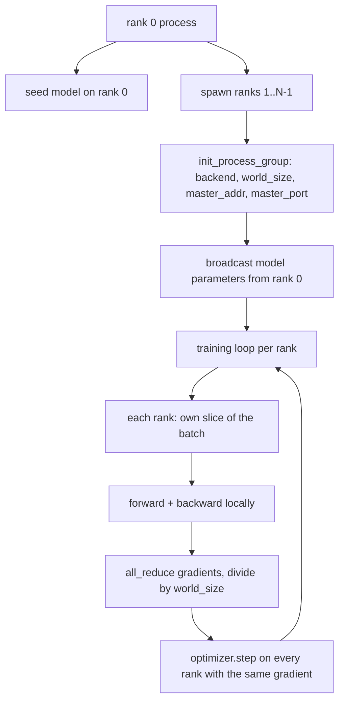
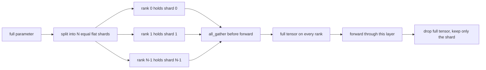

# 从零实现 Distributed Data Parallel 与 FSDP

> 多卡训练就是两个集合通信操作加一条规则。启动时广播参数，反向传播后平均梯度，绝不允许各 rank 对当前步数产生分歧。

**Type:** Build
**Languages:** Python
**Prerequisites:** 第 19 阶段第 42 到 45 课
**Time:** 约 90 分钟

## 学习目标

- 在 N 个 rank 上用 `gloo` 后端搭建进程组，无需特殊硬件。
- 实现一个最小化的 DDP 封装：构造时广播参数，反向传播后 all-reduce 梯度。
- 证明对每个 rank 的梯度做 all-reduce 后的结果，与单进程在拼接输入上计算出的梯度一致。
- 勾勒 FSDP 参数分片：每个 rank 持有一个分片，前向传播时聚合出完整张量，用完后丢弃。

## 问题

模型能放进一块设备。数据集放不下。优化预算要求你每秒看到 N 倍的样本。第一个杠杆是数据并行：每个 rank 在批次的不同分片上运行同一个模型，然后在优化器步进前对梯度取平均。第二个杠杆是 FSDP:模型同样放不进一块设备，所以每个 rank 只持有每个参数的一部分，并在前向传播中逐层重建完整张量。

痛点在于簿记。如果参数在各 rank 间漂移，整个训练在无声中被破坏。如果你平均了梯度却没平均损失，仪表盘就在说谎。如果集合通信后端无法就拓扑达成一致，训练将永远挂起。解决方案是亲手写一遍集合通信操作，并且永远不要信任你无法复现的封装。

本课在 CPU 上运行，不假设有 CUDA。`gloo` 后端随每个 PyTorch 构建一起发布，并支持 `torch.multiprocessing` worker;在多 GPU 节点上，同样的代码只需切换到 `nccl`,结构不变。

## 概念



### 两个关键的集合通信操作

| 集合通信操作 | 作用 | 时机 |
|------------|--------------|------|
| `broadcast` | 将一个张量从一个 rank 复制到所有其他 rank | 参数初始化、调度器状态、任何一对多同步 |
| `all_reduce` | 对所有 rank 上的张量求和(或均值、最大值)，每个 rank 都得到结果 | 反向传播后的梯度平均 |
| `all_gather` | 每个 rank 贡献一个张量，每个 rank 得到拼接结果 | logits 收集、FSDP 参数 unshard |

DDP 的契约是：构造时 `broadcast`,反向传播后 `all_reduce`。FSDP 概念实现则在每个层的前向传播之前加上 `all_gather`。

### 梯度平均等价于单进程梯度

一个模型在 N 个 rank 上各训练 B 个样本组成的批次，必须产生与单进程在 N*B 样本批次上训练相同的梯度。诀窍在于：对各 rank 的梯度求和再除以 N,得到的是平均损失的梯度，这正是带 mean reduction 的交叉熵在完整批次上会产生的结果。本课代码用 `max-abs-diff < 1e-3` 在手动 all-reduce 梯度与参考单进程梯度之间验证这一点。

### FSDP 概念实现



内存收益是精确的：参数占用的每个 rank 内存降为 1/N。代价是聚合操作，每次前向传播都要付出。生产级 FSDP 会将聚合与前一层计算重叠，因此实际耗时远小于朴素估算。本课对每个参数做完整往返，并断言重建结果与原张量逐位相等。

### CPU 与 gloo 后端

CUDA 是生产目标，但同样的代码路径在 CPU 上也存在。`gloo` 是 CPU 集合通信后端。它比 GPU 上的 `nccl` 慢几个数量级，但 API 接口完全相同。本课的进程组用 `backend="gloo"` 初始化，rank 通过 `torch.multiprocessing` 而非 `torchrun` 启动；两者最终都落到相同的 `torch.distributed` 调用上。在多 GPU 节点上，唯一的变化是 `backend="nccl"`、设备张量，以及用 `torchrun` 启动。

```figure
cg-allreduce-ring
```

## 动手实现

`code/main.py` 是可运行产物。

### 第 1 步：搭建进程组

```python
os.environ["MASTER_ADDR"] = "127.0.0.1"
os.environ["MASTER_PORT"] = str(port)
dist.init_process_group(backend="gloo", rank=rank, world_size=world_size)
```

`MASTER_ADDR` 与 `MASTER_PORT` 是会合点：每个 rank 都拨向同一主机上的同一端口。本课通过“绑定后关闭”的技巧选择空闲端口，避免多个训练共享一台机器时发生冲突。

### 第 2 步：构造时广播

`MinimalDDP.__init__` 遍历每个参数和缓冲区并调用 `dist.broadcast(tensor, src=0)`。rank 0 上的值成为权威初始化。没有这一步，每个 rank 会用自己的随机种子初始化，各 rank 从第一步就分道扬镳。

### 第 3 步：反向传播后 all-reduce 梯度

```python
def all_reduce_grads_(module, world_size):
    for p in module.parameters():
        if p.grad is None:
            p.grad = torch.zeros_like(p.data)
        dist.all_reduce(p.grad.data, op=dist.ReduceOp.SUM)
        p.grad.data.div_(world_size)
```

每个 rank 最终得到相同的平均梯度。优化器步进现在成为所有 rank 上同一输入的函数，这正是参数在整个训练过程中保持同步的原因。

### 第 4 步：证明等价性

`manual_all_reduce_matches_single_process` 在 rank 0 上构建同样的模型，并将 all-reduce 后的梯度与单进程在拼接输入上计算出的梯度进行比较。最大绝对差约为 1e-8。

### 第 5 步：FSDP 往返

`fsdp_round_trip_sketch` 将每个参数展平，填充到 `world_size` 的倍数，切片，all-gather,再去填充。每个 rank 的重建结果都与原张量相等。这就是 unshard 步骤；其逆操作(前向传播后重新分片)只需从聚合张量中切下一片。

运行：

```bash
python3 code/main.py
```

默认 world size 为 2。两个 CPU 进程被启动，通过 `gloo` 相互通信，并以零退出。输出 `outputs/ddp-demo.json` 记录了每个 rank 的参数和、all-reduce 后的梯度范数、FSDP 往返结果，以及手动梯度与参考梯度的差值。

## 使用它

生产训练栈调用的是同样的原语。PyTorch 的 `DistributedDataParallel` 增加了：反向传播后的梯度钩子，使 all-reduce 与反向传播重叠；分桶 all-reduce,将多个小梯度合并为一次集合通信；以及第 46 课使用的 `no_sync` 上下文。

PyTorch 的 FSDP 增加了：每层一个扁平参数视图，使每个 rank 持有一段连续缓冲区；将下一层的 unshard 与当前层计算重叠；以及可选的分片 CPU offload。

形态保持不变：启动时广播，反向传播后归约，参数放不下时进行分片。

## 交付它

`outputs/skill-distributed-fsdp-ddp.md` 包含新训练脚本的配方：用 `gloo`(CPU)或 `nccl`(GPU)启动进程组，将模型包进一个在构造时广播、反向传播后归约的 DDP 壳，并可选地用 FSDP 概念实现中的 all_gather 模式对参数分片。

## 练习

1. 用 `--world-size 4` 运行，确认参数差在整个训练过程中保持在 1e-3 以下。
2. 将手动平均替换为 `dist.all_reduce(op=dist.ReduceOp.AVG)`,并测量耗时差异。
3. 给 DDP 封装添加一个反向传播后的钩子，使 all-reduce 与反向传播的其余部分重叠；测量耗时改进。
4. 实现 FSDP 重新分片步骤：前向传播后，用本地分片替换完整张量。确认每个 rank 的内存占用下降。
5. 在 CUDA 机器上将后端切换为 `nccl`。记录哪些环境变量改变了，哪些保持不变。

## 关键术语

| 术语 | 人们怎么说 | 实际含义 |
|------|-----------------|------------------------|
| Backend | "gloo 或 nccl" | 实现集合通信操作的库；gloo 用于 CPU,nccl 用于 GPU |
| World size | "总 rank 数" | 组中的进程数量；组是集合通信操作的作用单元 |
| Rank | "worker id" | 组内的进程标识符，从零开始编号 |
| All-reduce | "对梯度求和" | 对所有 rank 上的张量求和，每个 rank 最终得到相同结果 |
| Unshard | "聚合参数" | 通过 all_gather 从各 rank 的分片重建完整张量 |

## 延伸阅读

- PyTorch `torch.distributed` 文档，涵盖本课所依赖的集合通信语义。
- `gloo` 库的集合通信操作列表，与基于 CUDA 的 `nccl` 原语在形态上完全一致。
- 第 19 阶段第 46 课，介绍用 `no_sync` 包裹 DDP all-reduce 的梯度累积模式。
- 第 19 阶段第 47 课，介绍能兼容 DDP 与 FSDP 训练的检查点布局。
- PyTorch FSDP 文档，即此处所勾勒的参数分片的生产级实现。