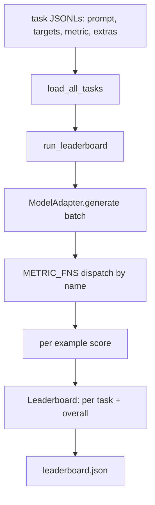
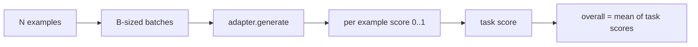

# 语言模型评测框架

> 一个在你无法定义的任务上表现良好的模型，只是碰巧表现良好。这个框架把任务定义、指标、运行器和排行榜合而为一，形态短小、可替换。

**Type:** 构建
**Languages:** Python
**Prerequisites:** 第 19 阶段第 42 至 45 课
**Time:** 约 90 分钟

## 学习目标

- 将任务定义为 JSONL 文件，每个示例包含 `prompt`、`targets`、`metric` 以及可选的 `extras`。
- 实现五个指标：精确匹配、rouge-l F1、可执行检查、多选、子串包含。
- 构建一个运行器，按任务分批处理示例，并分发给可替换的模型适配器。
- 输出一个可复现的排行榜 JSON，包含各任务得分、延迟以及总体平均值。

## 问题所在

每周都有新的语言模型发布。营销宣传说它表现良好。诚实的问题是：在什么方面表现良好？诚实的答案是你自己编写的排行榜，因为厂商的排行榜正是他们针对调优过的那个。

如果仓库里没有框架，你就只能凭感觉比较两个模型。有了框架，你就可以在固定的任务集上、用固定的指标，对可 diff 的 JSON 输出按得分进行比较。框架是昨天那次运行与今天那次运行之间的契约。没有它，性能回退就会悄悄上线。

陷阱在于把框架过拟合到单一模型上。解决办法恰恰是把陷阱反着用：框架要小到十五分钟内能读完，任务要小到能随仓库一起发布，指标要从零开始编写以便同事可以审计，适配器是唯一存放模型特定代码的地方。换掉适配器，排行榜随之变化；换掉任务，排行榜随之变化。除此之外什么都不应该变。

## 核心概念



### 任务规范

每个示例是 JSONL 的一行：

```json
{"id": "arith-00", "prompt": "compute: 2 + 2", "targets": ["4"], "metric": "exact_match"}
```

对于需要评分辅助数据的指标，`extras` 携带附加载荷：

```json
{
  "id": "code-00",
  "prompt": "python: write a function f that doubles its input",
  "targets": ["ok"],
  "metric": "code_exec",
  "extras": {"io_pairs": [[1, 2], [3, 6]]}
}
```

一个任务就是 `outputs/tasks/` 目录下的一个 `.jsonl` 文件。文件名即任务名。一个文件中的所有示例共用一个指标。

### 五个固定测试任务

| 任务 | 指标 | 测试内容 |
|------|--------|---------------|
| arithmetic | exact_match | 确定性答案的 token 级正确性 |
| summary | rouge_l | 相对一行参考摘要的最长公共子序列 F1 |
| code-exec | code_exec | 可执行测试：预测的函数必须满足一组输入-输出对 |
| multiple-choice | multiple_choice | 预测的首字母必须匹配一个允许的字母 |
| generation | substring_contains | 自由格式文本必须包含至少一个目标子串 |

### 指标契约

每个指标都是从 `(prediction, targets, extras) -> float in [0.0, 1.0]` 到得分的函数。框架对所有示例的得分求平均得到任务得分，再对任务得分求平均得到总体得分。指标函数都很小：

- `exact_match`：小写化、合并空白、相等比较。
- `substring_contains`：相同的归一化，子串测试。
- `multiple_choice`：首字符大写。
- `rouge_l`：LCS 长度分别除以预测与参考的长度，再取精确率和召回率的 F1。
- `code_exec`：在受限命名空间中执行预测，对每个输入-输出对调用 `f(x)`，统计匹配数。

code_exec 指标在裁剪过 builtins 的命名空间中运行预测。本课的测试断言 `import os` 会报错，因为命名空间中没有 `os`；代码预测无法访问文件系统。

### 模型适配器

```python
class ModelAdapter(Protocol):
    def generate(self, prompts: Sequence[str]) -> List[str]: ...
    @property
    def name(self) -> str: ...
```

适配器是接缝。本课提供 `ToyAdapter`，一个确定性的模式匹配器，能对五个固定任务中的每个提示返回正确答案。真实的适配器则调用模型并返回其输出。框架不关心是哪一种。

### 运行器

`run_task` 每次处理 `batch_size` 个提示，并分发给指标函数。`run_leaderboard` 遍历所有任务并求平均。`write_leaderboard` 输出带有 schema 字符串的 JSON，这样未来的格式变更不会悄悄破坏仪表盘。



```figure
eval-harness-matrix
```

## 动手构建

`code/main.py` 是可运行的产物。

### 第 1 步：生成固定测试任务

`seed_fixture_tasks(target_dir)` 写入五个 `.jsonl` 文件。当目录为空时，`main.py` 首次运行会生成它们。

### 第 2 步：加载任务

`load_all_tasks(task_dir)` 读取每个 `.jsonl`，返回一个从任务名到 `Example` 记录列表的字典。以 `#` 开头的注释行和空行会被跳过，以便贡献者可以在文件中添加注释。

### 第 3 步：实现指标

每个指标都是带单元测试的小函数。本课的测试套件包含 13 个用例，覆盖归一化、部分重叠、代码执行和不安全代码的拒绝。

### 第 4 步：编写运行器

`run_task` 迭代各批次，产出包含得分、正确数、总数和延迟的 `TaskResult`。`run_leaderboard` 遍历所有任务，产出包含总体平均值的 `Leaderboard`。

### 第 5 步：输出 JSON

`write_leaderboard` 序列化排行榜。`--include-per-example` 标志会导出每条示例记录，这样当得分变化时，你可以对比本次预测与上一次运行的差异。

运行它：

```bash
python3 code/main.py
```

脚本在首次运行时生成固定测试数据，用玩具适配器（它能答对所有固定任务）评分，并写入 `outputs/leaderboard.json`。使用玩具适配器时总体得分为 1.0；`test_main.py` 中的存根适配器测试表明，当适配器无法回答时，同一个框架会产生 0.0。

## 使用它

要接入真实模型，编写一个适配器。其形态：

```python
class HttpAdapter:
    name = "vendor.v1"

    def __init__(self, endpoint, api_key):
        self.endpoint = endpoint
        self.api_key = api_key

    def generate(self, prompts):
        out = []
        for prompt in prompts:
            response = http_post(self.endpoint, prompt, self.api_key)
            out.append(response["text"])
        return out
```

在 `main()` 顶部把 `ToyAdapter` 换成 `HttpAdapter`。框架、任务、指标和排行榜保持不变。

在真实项目中发布框架时需要执行三个模式：

- **固定任务文件。** 排行榜 JSON 要么携带哈希固定的任务内容，要么把 JSONL 文件一并保存；否则任务文件变化时得分随之变化，而你无法分辨是哪一个变了。
- **对比预测而不只是得分。** `--include-per-example` 标志让你能看到得分下降当天模型的实际输出。
- **限制批大小。** 真实适配器有速率限制。较小的批大小能让框架在不同厂商之间保持兼容。

## 发布它

`outputs/skill-lm-eval-harness.md` 包含完整配方：JSONL 任务规范、五个指标、可替换适配器、分批运行器、带 schema 字符串的排行榜 JSON。`outputs/tasks/` 中的任务文件就是固定测试数据；可以把它们复制到真实项目中作为起点。

## 练习

1. 添加第六个任务，并使用你从零编写的自定义指标（类似 BLEU 的重叠度、类似 BLEURT 的参考评分，任何有清晰契约的东西）。
2. 扩展 `code_exec`，使其捕获 stdout 并接受一组期望的 stdout 作为目标。
3. 添加一个排行榜 diff 命令：给定两个 `leaderboard.json` 文件，打印哪些任务发生了变化以及变化幅度。
4. 限制每个示例的延迟。给适配器调用加上超时包装；在排行榜中单独显示一个 `timeouts` 列。
5. 在排行榜中用 sha256 固定任务内容，以便未来的读者能验证他们评分的是同样的任务。

## 关键术语

| 术语 | 人们的说法 | 实际含义 |
|------|-----------------|------------------------|
| 任务规范 | "评测格式" | JSONL 文件，每个示例含 prompt、targets、metric 以及可选的 extras |
| 指标 | "你怎么评分" | 从 (prediction, targets, extras) 到 [0, 1] 中一个浮点数的函数 |
| 适配器 | "模型客户端" | 具有 generate(prompts) -> list[str] 方法的对象；唯一的模型特定代码 |
| 排行榜 | "记分板" | 包含各任务得分、总数、延迟和总体平均值的 JSON |
| 代码执行指标 | "跑一下检查" | 在受限命名空间中执行预测，与输入-输出对进行比较 |

## 延伸阅读

- 原版 lm-evaluation-harness，作为生产级参考，规模大得多但形态相同。
- HuggingFace 的 lighteval，同一契约的另一种实现。
- 第 19 阶段第 46 课讲解训练栈中使用的梯度累积模式，该栈正是框架评分的对象。
- 第 19 阶段第 47 课讲解你所评分的 checkpoint 格式；把 checkpoint 的哈希固定在排行榜中。
- 第 19 阶段第 48 课讲解产生被测模型的分布式训练栈。