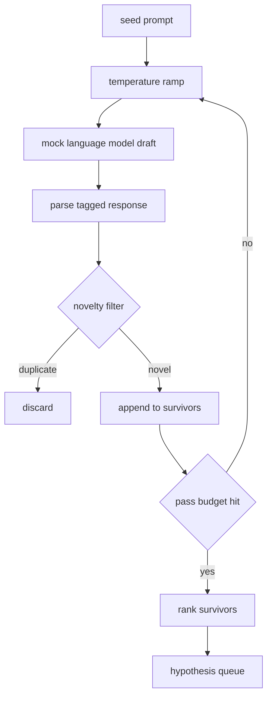

# 假设生成器

> 一个同一个问题问两次的研究代理就是在浪费 token。诀窍在于迫使每个草稿落到新的地方。

**Type:** Build
**Languages:** Python
**Prerequisites:** Phase 19 Track A 第 20-29 课
**Time:** ~90 分钟

## 学习目标
- 用种子提示驱动采样器，并将其输出转换为带类型的假设记录。
- 每一轮提高采样器温度，使下一个草稿进一步偏离上一个。
- 用一个小型嵌入模型和余弦距离阈值过滤近似重复项。
- 用一个融合新颖性、具体性和可测试性的评分函数对幸存者排序。
- 保持每一步确定性，使相同的种子总是产生相同的队列。

## 为什么先生成、再过滤

只问一个模型一次的规划器只能得到一个假设。这对教学示例来说没问题，但对研究循环来说是错误的形态。循环想要一个有深度、经过排序的队列，这样当第一个假设失败时，运行器已经准备好下一个，而无需再付出一次完整采样。

两个想法结合产生这个队列。第一个是温度递增：每一轮经过采样器时都把温度调高一档，从而鼓励后面的草稿发散。第二个是新颖性过滤：每个草稿生成后，生成器测量它与每个先前幸存者的嵌入距离，并拒绝落在簇内的任何内容。

本课附带一个模拟语言模型，它为固定的提示返回预先编排的 token 序列。这个模拟足以走通完整路径：种子提示输入、应用温度递增、解析候选、运行新颖性过滤、输出排序后的队列。

## Hypothesis 形状

```text
Hypothesis
  id             : int           (monotonic within a run)
  text           : str           (the claim)
  variables      : list[str]     (what changes between conditions)
  metric         : str           (what the runner will measure)
  baseline_ref   : str | None    (which paper or run the comparison cites)
  draft_pass     : int           (which sampler pass produced this)
  temperature    : float         (the sampler setting at draft time)
  novelty_score  : float         (distance from prior survivors, 0..1)
  rank_score     : float         (weighted sum used for ordering)
```

`variables` 和 `metric` 不是自由文本。解析器从带标签的响应中提取它们。第五十二课的运行器在构建实验配置时直接读取这些字段。

`baseline_ref` 是可选的，但建议提供。第五十三课的评估器需要一个基线来比较。如果假设省略了它，评估器会退回到同一指标的上一次运行。

```figure
cg-novelty-ramp
```

## 架构



这个循环很直白。有趣之处在于每个方框都有一个硬性契约。

## 温度递增

从 `t_min` 开始，到 `t_max` 结束，步长为 `(t_max - t_min) / (n_passes - 1)`。每一轮以当前温度调用采样器，产生从 `GeneratorConfig.schedule()` 开始的 `n_passes` 个等距值。模拟模型通过在一小组按 `(prompt, temp_bucket)` 索引的脚本化响应之间切换来体现温度。这些桶是开区间，因此温度的小变化会选择不同的桶并产生不同的草稿。在生产环境中，采样器将是一个真实模型，并将 `temperature=t` 传入。

默认调度是从 `0.2` 到 `1.2` 的六轮。六轮足以填满队列，而不必为新颖性过滤器本来就会拒绝的样本买单。低于 `0.2` 时，模型只会复述种子。高于 `1.2` 时，响应往往偏离主题并无法通过解析器。

## 新颖性过滤器

每个草稿被解析后，生成器对其文本进行嵌入，并与每个已接受的假设进行比较。嵌入是一个经过归一化到单位长度的小型哈希词袋。两个单位向量之间的余弦距离为 `1 - dot(a, b)`。如果一个草稿到任何先前幸存者的最小距离大于 `novelty_threshold`，则通过。默认值为 `0.25`。

哈希嵌入并不花哨。它是确定性的、零依赖，并且足以捕获最明显的情况：两个草稿共享大部分名词。生产部署会换成一个小型句子模型。接口保持不变。

## 排序得分

```text
rank_score = w_novelty * novelty_score
           + w_specificity * specificity_score
           + w_testability * testability_score
```

三个子得分。`novelty_score` 是到先前幸存者的最小嵌入距离。`specificity_score` 是假设中具体变量的数量除以目标数量。`testability_score` 在假设同时指定指标和基线时为 1，只有指标时为 0.5，否则为 0。

默认权重是 `0.4`、`0.3`、`0.3`。这些权重存放在生成器配置中，因此后续课程无需分叉代码即可调整它们。

## 模拟语言模型

```python
class MockLLM:
    def sample(self, prompt: str, temperature: float, seed: int) -> str:
        ...
```

给定一个 `(prompt, temperature, seed)` 三元组，采样器是确定性的。模拟模型维护一个按 `(prompt_signature, temperature_bucket)` 索引的脚本化响应表。如果表中没有某个键的条目，采样器返回一个无法通过解析器的回退结果。回退路径由其中一个测试覆盖。

种子被混入响应中，因此相同的 `(prompt, temperature)` 组合配合不同的种子会产生不同的草稿。在测试中我们固定种子以保持结果可复现。在真实部署中，种子将来自系统时钟或计数器。

## 输出队列

输出是一个按 `rank_score` 降序排序的 `Hypothesis` 记录列表。第五十二课的运行器弹出队首、运行实验，第五十三课的评估器写回一个裁定。如果裁定表明假设是错的，运行器弹出下一个。

队列是有限的。当队列为空时，编排器可以扩大种子提示并再次运行生成器，或者停止并报告预算耗尽。

## 如何阅读代码

`code/main.py` 定义了 `Hypothesis`、`MockLLM`、`HypothesisGenerator` 和一个确定性演示。生成器暴露一个单一的 `run(seed_prompt)` 方法，返回排序后的队列；轮数从 `GeneratorConfig.n_passes` 读取，而不是作为参数传入。嵌入是 token 的哈希词袋。新颖性过滤器是一个单一函数。排序得分是一个单一函数。没有任何东西依赖 `numpy`；嵌入计算只用标准库，因此本课保持可移植性。

`code/tests/test_generator.py` 覆盖了线性路径、重复拒绝路径、解析器失败路径、温度递增边界以及排序顺序。

## 本课在课程中的位置

第五十课产生队列。第五十一课取队首并运行文献检索来确认或反驳它。第五十二课取同一队首并运行一个真实实验。第五十三课读取两个输出并写回裁定。这四课组成一个没有人类参与的研究循环；人类可以在任何边界介入。