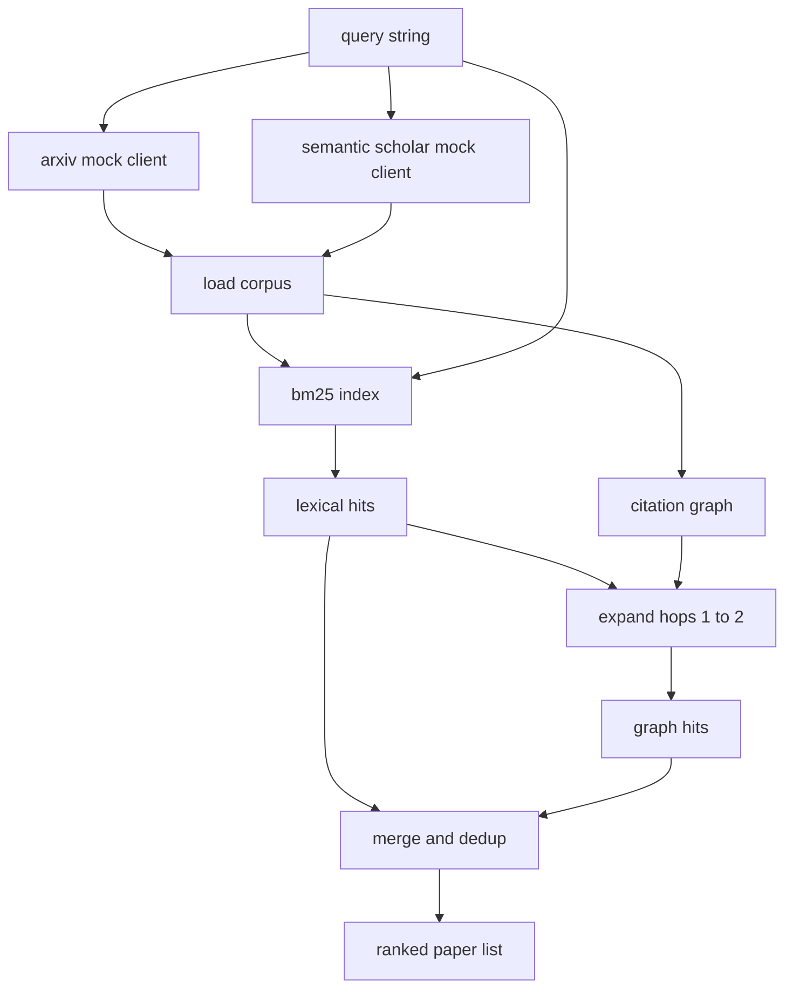

# 文献检索

> 提出一个假设很便宜。要知道是否已经有人证明过它,才是昂贵的部分。在 runner 启动沙箱之前,先构建能回答这个问题的检索层。

**Type:** Build
**Languages:** Python
**Prerequisites:** Phase 19 Track A lessons 20-29
**Time:** ~90 minutes

## 学习目标
- 用下游循环将要读取的字段建模一个小的论文记录。
- 仅使用标准库数据结构,基于摘要构建 BM25 索引。
- 遍历引用图,找出词汇搜索遗漏的论文。
- 通过稳定的论文 id 对词汇检索和图检索两轮结果去重。
- 将两个模拟外部 API 封装在同一个客户端之后,使上游调用点在真实端点接入时保持不变。

## 为什么要两轮检索

对摘要进行关键词搜索会返回与查询共享词汇的论文。这覆盖了大部分范围,但会漏掉两种情况。第一种是奠基性论文使用了不同的词汇;例如,查询 "sparse attention" 会漏掉一篇题为 "block selection in transformer routing" 的论文。第二种是相关论文是一篇引用了已知锚点的后续工作;找到锚点并向前遍历,比暴力扫描整个摘要池更高效。

本课构建这两轮检索。基于摘要的 BM25 捕捉词汇命中。引用图遍历从一个种子集合向前和向后扩展一到两跳。并集按论文 id 去重,并用一个小的组合分数排序。

## Paper 数据形状

```text
Paper
  id          : str           (stable identifier, "p001" for the mock corpus)
  title       : str
  abstract    : str
  year        : int
  authors     : list[str]
  references  : list[str]     (paper ids this paper cites)
  citations   : list[str]     (paper ids that cite this paper)
  source      : str           (which mock api supplied it, "arxiv" or "s2")
```

references 和 citations 字段构成了有向引用图。两个模拟 API 返回的字段有重叠但不完全相同,因此语料加载器在 `id` 上取并集。

```figure
cg-citation-hops
```

## 架构



检索客户端拥有两轮检索和合并逻辑。调用者传入一个查询,得到一个排序列表,其中每个条目都带有解释排序依据的每篇论文分数字段(`bm25_score`、`graph_distance`、`recency_score`、`final_score`)。

## 从零实现 BM25

该实现是标准 Okapi BM25,使用默认参数 `k1=1.5`、`b=0.75`。索引由两个字典组成:`term -> doc_frequency` 和 `term -> list of (doc_id, term_count)`。文档长度是摘要的词元数。平均文档长度在构建索引时计算一次。查询打分是对查询词项的 `idf * tf_norm` 求和,其中 `tf_norm` 是标准 BM25 的长度归一化词频。

分词器是 `lower` 然后按非字母数字字符切分。不做词干提取。生产系统会换入一个小型词干提取器。接口保持不变。

```text
idf(t)      = log((N - df + 0.5) / (df + 0.5) + 1.0)
tf_norm(t)  = (f * (k1 + 1)) / (f + k1 * (1 - b + b * dl / avgdl))
score(d, q) = sum over t in q of idf(t) * tf_norm(t)
```

## 引用图遍历

图从语料库构建一次。前向边从一篇论文指向其参考文献。后向边从一篇论文指向其被引。遍历是以 BM25 最高命中为种子的广度优先搜索,上限为两跳。

两跳是一个刻意设定的上限。一跳太浅;智能体常常需要直接的祖先或后代。三跳会在连通图上使结果规模爆炸,并且容易偏离主题。本课将跳数上限暴露为配置项,以便下游循环可以收紧它。

## 去重与排序

两轮检索返回重叠的集合。合并以论文 id 为键。每篇论文的最终分数是加权混合。

```text
final_score = w_bm25 * bm25_score_norm
            + w_graph * graph_score
            + w_recency * recency_score
```

`bm25_score_norm` 是 BM25 分数除以合并集合中的最大 BM25 分数(因此该字段取值在零到一之间)。`graph_score` 对直接词汇命中取一,一跳取 `0.6`,两跳取 `0.3`,其余取零。`recency_score` 是一个线性斜坡,从语料库最小年份的零到最大年份的一。

默认权重为 `0.5`、`0.3`、`0.2`。权重是可配置的;陈旧的主题可以调低时效性权重,而快速演进的主题可以调高它。

## 模拟语料库

语料库包含一百篇论文,由 `build_corpus()` 生成。每篇论文都有一个手写的标题和摘要,属于五个主题之一:注意力稀疏化、检索增强、低秩适配器、数据集蒸馏和评估框架。references 和 citations 的连线使每个主题形成一个连通子图,并带有少量跨主题边。

两个模拟 API 客户端(`ArxivMockClient`、`SemanticScholarMockClient`)读取同一语料库,但暴露不同的字段。Arxiv 返回 title、abstract、year、authors。Semantic Scholar 额外返回 references 和 citations。检索客户端在 id 上取并集;跨客户端字段不一致的处理留待后续课程。

## 第 52 课和第 53 课读取什么

第五十二课的 runner 读取 `paper.id`、`paper.title` 以及摘要的前三句话作为实验的上下文。第五十三课的评估器读取 `paper.year` 和 `paper.references`,以便将基线归因到具体论文。

检索客户端返回一个 `RetrievalResult`,同时包含排序列表和每查询指标:命中数、平均分、最高分、总耗时。runner 会记录这些指标,以便下游的可观测性环节绘制质量随时间变化的曲线。

## 如何阅读代码

`code/main.py` 定义了 `Paper`、`ArxivMockClient`、`SemanticScholarMockClient`、`BM25Index`、`CitationGraph`、`RetrievalClient` 以及一个确定性演示。模拟客户端和语料库在同一个文件中,以便本课保持可移植性。BM25 实现是一个类,六十行。图遍历是一个方法。

`code/tests/test_retrieval.py` 覆盖词汇检索路径、图检索路径、合并、去重和空查询。

## 本课在整体中的位置

第五十课产生一个假设。第五十一课检索文献,看该假设是否已被解决。第五十二课在未解决的情况下运行实验。第五十三课同时读取检索结果和实验指标来撰写结论。检索客户端是四个阶段中最便宜的一个,在编排器中首先运行。