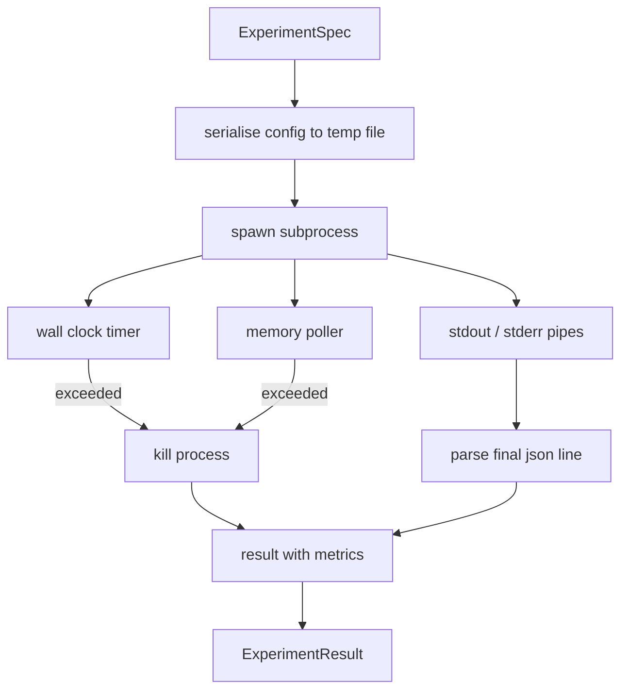

# 实验运行器

> 循环的可信度取决于其测量的诚实程度。构建一个运行器：接收一个 spec,在沙盒子进程中执行,并输出评估器可以信任的 json 指标数据块。

**Type:** Build
**Languages:** Python
**Prerequisites:** Phase 19 Track A lessons 20-29
**Time:** ~90 minutes

## 学习目标
- 将实验编码为带类型的 spec,运行器可将其序列化到子进程。
- 以硬性墙钟超时和软性内存上限启动子进程,并将两者都作为终止条件呈现。
- 将 stdout、stderr 和结构化指标数据块捕获到单一结果记录中。
- 构建消融表,在固定基础 spec 上每次扫描一个配置旋钮。
- 在给定种子的情况下保持每个结果确定性,使评估器在多次运行中看到相同的数字。

## 为什么使用子进程

研究循环会运行不受信任的代码。假设来自采样器,实验脚本也来自同一路径;把其中任何一个当作安全的进程内代码,就是在招致可能拖垮编排器的崩溃。子进程是该语言提供的最简单的隔离方式:独立进程、独立地址空间,以及父进程侧的信号处理。

这里的运行器并不实现完整的沙箱。没有 cgroup,没有 seccomp 过滤器,没有命名空间重映射。它拥有的是一个墙钟超时、一个轮询内存增长的循环,以及在触及任一限制时终止进程的 kill 路径。这就是每个更精细的沙箱都要扩展的运行时契约。本课保持这个契约足够小,可以一口气读完。

## ExperimentSpec 的结构

```text
ExperimentSpec
  spec_id        : str            (stable id, "exp_001")
  hypothesis_id  : int            (link back to the queue from lesson 50)
  script_path    : str            (path to the python script to run)
  config         : dict           (passed to the script as one json arg)
  seed           : int            (deterministic seed for the experiment)
  wall_timeout_s : float          (hard timeout, killed on exceed)
  memory_cap_mb  : int            (soft cap, polled; killed on exceed)
  metric_keys    : list[str]      (which fields the evaluator will read)
```

脚本存放在磁盘上;运行器将配置写入一个临时文件路径,脚本从该路径读取。脚本应在 stdout 上打印一行 json,其键是 `metric_keys` 的超集。stdout 上的其他内容会被捕获,但被指标解析器忽略。

```figure
cg-runner-limits
```

## 架构



运行器是一个类,只有一个主方法。轮询器是一个小线程,每隔一个轮询间隔唤醒一次,并在可用时从 proc 文件系统读取子进程 `psutil` 的等价物;在平台不支持时退化为无操作。

## 为什么要软性内存上限

硬性内存上限需要 `resource.setrlimit`,且只在 POSIX 上可用。本课提供一种可移植的方法:从平台轮询常驻内存集大小,如果超过上限就 kill 子进程。该上限是软性的,因为轮询器有非零的间隔;进程可能在两次轮询之间飙升超过上限,然后回落。运行器记录观察到的最大 RSS,以便评估器能看到运行距离限制有多近。

在没有进程检查支持的系统上,轮询器记录一次性警告并自我禁用。墙钟超时仍然生效。本课的测试覆盖这两条路径。

## 捕获 stdout 和 stderr

运行器在完成时读取两个已排空的管道。stdout 逐行扫描;最后一行能被解析为 json 且包含所有必需的 `metric_keys` 的行被当作指标数据块。更早的 json 行作为 `intermediate_metrics` 保留在结果中;评估器可以用它们绘制学习曲线。

stderr 原样捕获到结果中。运行器从不因非零退出码而抛出异常;而是将该码记录在结果中。任何非零退出都被标记为 `"crash"`,即使脚本已打印指标,因此评估器默认将部分运行的实验视为失败。

## 消融表

```python
def ablate(base: ExperimentSpec, knob: str, values: list[Any]) -> list[ExperimentSpec]:
    ...
```

给定一个基础 spec 和一个旋钮名称,该辅助函数为每个值返回一个 spec,其中 `config[knob]` 被覆盖。每个 spec 会得到一个派生的 `spec_id`(`f"{base.spec_id}_{knob}_{value}"`)。运行器附带一个 `AblationRunner`,按顺序运行它们并返回以旋钮值为键的 `AblationTable`。

为什么一次只动一个旋钮。全因子扫描会指数级膨胀,产生评估器无法解读的结果。一次一个旋钮产生评估器可以绘制的清晰坐标轴。本课仅通过调用方组合重复的单旋钮消融来支持多旋钮扫描。

## 确定性

每个 spec 都携带一个种子。运行器通过配置字典将种子转发给脚本(`config["__seed"] = spec.seed`)。`code/experiments/` 中的模拟实验脚本遵循该种子,并在多次运行中产生相同的指标。第五十三课的评估器依赖于此;没有确定性,"回归"可能只是不同的随机初始化。

## 模拟实验脚本

本课附带一个实验脚本:`code/experiments/sparsity_experiment.py`。它是一个真实脚本,读取其配置文件,用 numpy 随机过程模拟一个小型训练运行,并打印 json 指标数据块。该脚本支持用于测试超时的 `sleep_s` 旋钮和用于测试内存轮询器的 `allocate_mb` 旋钮。

该模拟并没有训练任何真实的东西。它是一个模仿训练循环形状的数值计算:一条损失曲线、一个最终的困惑度、一个墙钟时间。本课的重点是运行器,而不是模拟。真实的实验脚本会导入一个模型。

## 结果结构

```text
ExperimentResult
  spec_id              : str
  hypothesis_id        : int
  exit_code            : int
  terminal             : "ok" | "timeout" | "oom" | "crash"
  wall_time_s          : float
  peak_rss_mb          : float | None
  metrics              : dict
  intermediate_metrics : list[dict]
  stdout_tail          : str
  stderr_tail          : str
```

评估器首先读取 `metrics` 和 `terminal`。如果 terminal 不是 `"ok"`,该实验计为失败运行,评估器的判定自动生成。否则,指标会通过显著性检验。

## 如何阅读代码

`code/main.py` 定义了 `ExperimentSpec`、`ExperimentResult`、`ExperimentRunner`、`AblationRunner` 以及一个确定性演示。子进程管理是一个类。内存轮询器是一个小线程。消融辅助函数是一个单独的函数。

`code/experiments/sparsity_experiment.py` 是测试中使用的模拟实验。它从 argv 读取其配置文件路径,并在完成时输出一行 json 指标。

`code/tests/test_runner.py` 覆盖成功路径、超时路径、崩溃路径、消融表,以及跨两次运行的确定性检查。

## 本课在整体中的位置

第五十课生成假设。第五十一课过滤掉文献中已有定论的假设。第五十二课对其余假设运行实验。第五十三课读取结果,运行显著性检验,并写入编排器按假设 id 存储的判定。