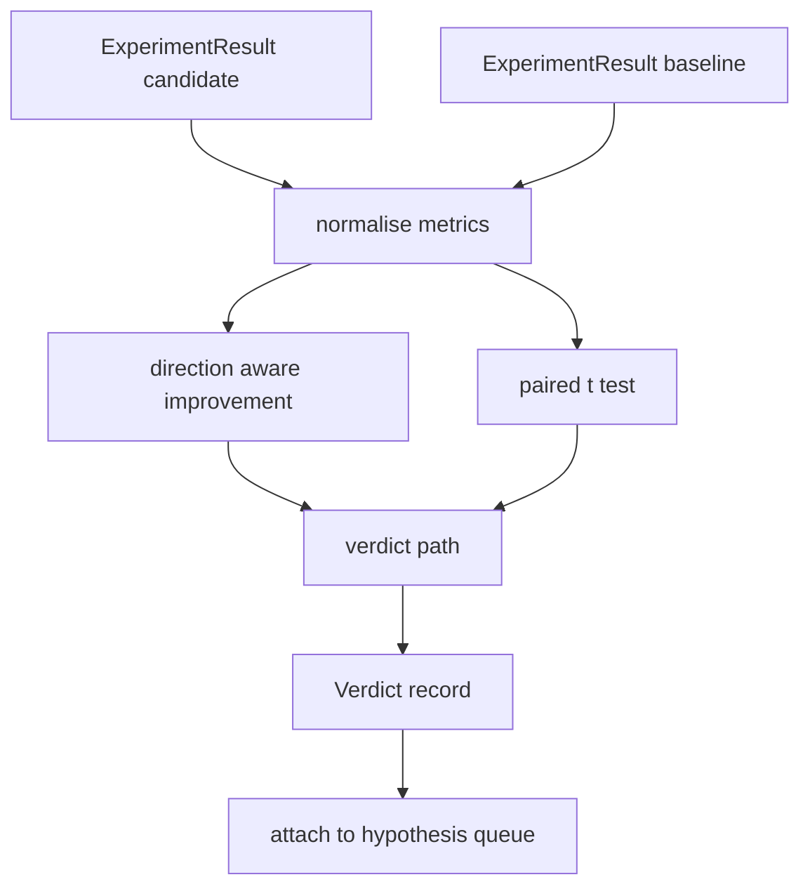

# 结果评估器

> 运行器产出了数字。评估器判断这些数字是提升、回退还是噪声。构建判定路径，将指标转化为一行结论。

**Type:** Build
**Languages:** Python
**Prerequisites:** Phase 19 Track A lessons 20-29
**Time:** ~90 minutes

## 学习目标
- 使用方向感知的提升计算和固定阈值，将候选运行与基线进行比较。
- 从零实现对按种子划分的指标的配对 t 检验，并读取所得的 p 值。
- 对对数尺度的指标进行归一化，使下游报告能将其与线性指标混合。
- 输出每个假设的判定结果，供编排器附加到第五十课的队列上。
- 保持每一步都是纯函数，使相同输入总是产生相同判定。

## 为什么使用配对检验

运行器给出的单个数字无法说明改动是否真实。相同配置在不同种子下会得到不同的困惑度。改动可能只是噪声。正确的比较是配对的：相同种子、相同数据，分别用候选配置和基线配置各运行一次。每个种子贡献一个差值。这些差值的均值就是效应量。这些差值的标准误就是噪声底线。

本课从零实现该检验。没有使用 `scipy.stats`。所需数学足够少，一屏就能读完。

```text
diffs    = [a_i - b_i for i in seeds]
mean     = sum(diffs) / n
variance = sum((d - mean) ** 2 for d in diffs) / (n - 1)
t_stat   = mean / sqrt(variance / n)
df       = n - 1
p_value  = two_sided_p(t_stat, df)
```

双侧 p 值使用正则化不完全贝塔函数。本课提供了一个使用 Lentz 连分数的小型实现。整个实现只用六十行标准库数学代码。

## 方向感知的提升

有些指标越大越好(准确率、吞吐量)。有些指标越小越好(损失、困惑度、运行时间)。评估器在每个指标上携带一个 `direction` 字段。

```text
if direction == "higher_is_better":
    improvement = (candidate - baseline) / abs(baseline)
elif direction == "lower_is_better":
    improvement = (baseline - candidate) / abs(baseline)
```

提升是带符号的。在越大越好的指标上，负的提升意味着候选配置更差。判定路径同时读取符号和幅度。

一个平坦阈值(`improvement_threshold=0.02`,百分之二)决定改动是否大到值得称之为提升。低于该阈值时，无论 p 值如何，判定都是"噪声";用户无法感知的改动，循环并不关心。

```figure
cg-paired-verdict
```

## 架构



评估器运行三个相互独立的计算，并在判定路径中将它们汇合。每个计算都是一个无共享状态的纯函数。

## 对数归一化

困惑度相对于损失是指数级的。损失下降 0.1 对应困惑度的大幅下降。直接比较两个配置的困惑度没问题，但要在同一份报告中与线性指标混合时，就需要归一化。

本课对任何 `scale` 字段为 `"log"` 的指标，在计算提升之前先取自然对数。阈值随后在对数空间中应用。困惑度从 32 降到 28,在越小越好的指标上是 `log(28) - log(32) = -0.133`,远高于百分之二的阈值。

```text
if scale == "log":
    a = log(candidate)
    b = log(baseline)
else:
    a = candidate
    b = baseline
```

`scale="linear"`(默认值)的指标跳过该变换。同一条代码路径处理两种情况。

## 按种子配对检验

第五十二课的运行器为每次运行输出一个最终的指标数据块。对于配对检验，评估器需要候选配置每个种子一个数据块，以及基线配置每个种子一个数据块。编排器在一系列种子下分别用两种配置运行同一实验，并将两个 `ExperimentResult` 记录列表交给评估器。

评估器按种子配对(种子位于 `result.metrics["seed"]` 中)并遍历所请求的指标。如果两个列表中的种子不匹配，评估器抛出 `PairingError`。编排器应当重新运行。

## Verdict 数据结构

```text
Verdict
  hypothesis_id          : int
  metric                 : str
  direction              : "higher_is_better" | "lower_is_better"
  scale                  : "linear" | "log"
  candidate_mean         : float
  baseline_mean          : float
  improvement            : float       (signed, fraction; see direction rules)
  p_value                : float | None  (None if n < 2)
  significance_threshold : float
  improvement_threshold  : float
  verdict                : "improved" | "regressed" | "noise" | "failed"
  rationale              : str
```

判定路径是一个小型决策表：

```text
1. If any candidate result has terminal != "ok": verdict = "failed"
2. else if |improvement| < improvement_threshold:  verdict = "noise"
3. else if p_value is None or p_value > significance: verdict = "noise"
4. else if improvement > 0:                          verdict = "improved"
5. else:                                             verdict = "regressed"
```

rationale 是一行人类可读的句子，编排器可以将其与 hypothesis id 一起记录。

## 如何阅读代码

`code/main.py` 定义了 `MetricSpec`、`Verdict`、`Evaluator`、t 统计量和不完全贝塔辅助函数，以及一个确定性演示。t 检验完全用标准库数学实现；numpy 仅用于读取指标列表以及计算均值和方差。

`code/tests/test_evaluator.py` 覆盖提升路径、回退路径、噪声路径(小幅提升)、噪声路径(样本量过小)、failed 终止路径、对数归一化路径、t 检验与已知参考值的对比，以及配对错误。

## 本课在整体中的位置

第五十课生成了假设队列。第五十一课过滤掉文献已有定论的内容。第五十二课在候选和基线配置下跨种子运行了实验。第五十三课读取这些运行结果并写入判定。编排器将四者串联起来：

```text
for hypothesis in queue:
    literature = retrieval.search(hypothesis.text)
    if literature_settles(hypothesis, literature):
        attach(hypothesis, verdict="settled")
        continue
    candidates = runner.run_all(specs_for(hypothesis))
    baselines  = runner.run_all(baseline_specs_for(hypothesis))
    metric_spec = MetricSpec("perplexity", direction=LOWER, scale=LOG)
    verdict = evaluator.evaluate(hypothesis.id, metric_spec, candidates, baselines)
    attach(hypothesis, verdict)
```

该编排器不在本课中；四课只需借助各自定义的 dataclass 即可组合成它，无需任何额外的粘合代码。