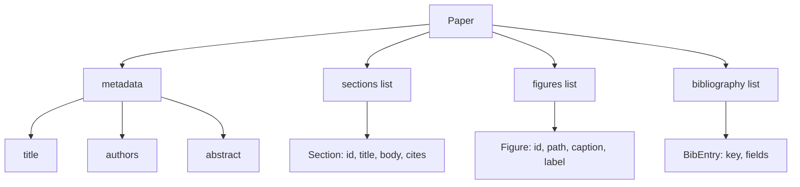
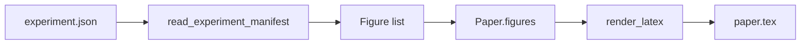
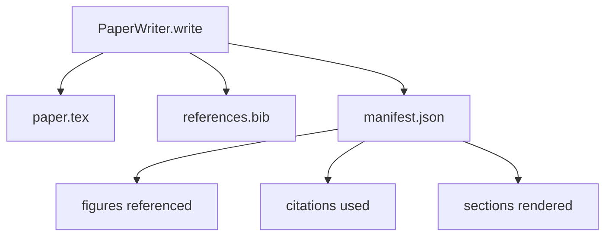

# 论文写作器

> LaTeX 骨架是研究者与排版器之间的契约。如果契约被破坏,文档就无法编译,而且失败是响亮的。先搭建骨架,再填充内容。

**Type:** Build
**Languages:** Python
**Prerequisites:** Phase 19 lessons 50-53
**Time:** ~90 minutes

## 学习目标

- 把研究论文视为具有已知章节图的结构化工件,而不是自由格式的文档。
- 生成一个 LaTeX 骨架,在撰写任何正文之前就声明其摘要、章节、图槽位和参考文献键。
- 通过确定性的槽位机制,将实验输出中的图(路径和标题)注入骨架。
- 接入一个模拟的正文生成器,从结构化大纲填充每个章节,使 harness 无需模型即可测试。
- 输出单个 `paper.tex` 加上 `references.bib` 加上一个列出所有被引用的图和所有被使用的引用的清单。

```figure
ch-paper-skeleton
```

## 为什么先搭骨架

以正文形式起步的草稿会累积结构性债务。引言里长出了本应属于相关工作部分的三段内容。一个图在被定义之前就被引用了。参考文献中最终出现了指向同一篇论文的三个键。等到作者察觉时,重写的成本已经高于写作的成本。

骨架逆转了这一点。结构被预先声明为数据。章节是带有名称和顺序的槽位。图是带有 id 和标题的槽位。参考文献键在顶部与其指向的条目一起声明。正文被逐一生成到这些槽位中。harness 可以在任何正文写出来之前验证:每个图都有槽位,每个引用都有条目,每个章节都出现在目录中。

这与前面课程应用于计划、工具调用和轨迹的纪律相同。结构就是契约。

## Paper 的形状



每个字段都是普通的 Python 数据。渲染器是一个从 `Paper` 到 LaTeX 字符串的纯函数。harness 可以在渲染前内省论文:统计章节数,列出缺失的图文件,检查每个 `\cite{key}` 是否有对应的 `BibEntry`。

## 渲染契约

渲染器保证三个性质。第一,骨架中的每个图槽位都输出一个 `\begin{figure}` 块,带有形如 `fig:<id>` 的稳定标签。第二,每个章节都输出一个 `\section{}`,带有形如 `sec:<id>` 的稳定标签,以使交叉引用生效。第三,参考文献输出一个 `\bibliography` 块,其 `references.bib` 恰好包含论文中声明的条目,不多不少。

违反其中任何一条都是渲染错误,而不是警告。骨架就是契约;静默丢弃某个图的渲染就是契约破坏。

## 从实验注入图

本课程前面的章节以 JSON 清单的形式产生实验输出。每个清单携带一组带有路径和简短标题的工件。论文写作器读取该清单并生成 `Figure` 记录。



注入是确定性的。图的 id 由实验名加单调递增计数器派生。标题来自清单。路径相对于论文的输出目录进行规范化,这样即使实验输出位于磁盘上的其他位置,LaTeX 也能编译。

## 模拟的正文生成器

本课不调用模型。一个 `MockProseGenerator` 读取大纲形状并确定性地生成正文。大纲形状是每个章节一个简短字符串。生成器将该字符串扩展为两段短文,并把章节标题编织进去。生成的正文仅在大纲声明时才提及图和引用。

这足以测试写作器的所有行为。真实实现会将生成器替换为模型调用。包裹它的 harness 不变。这就是将正文生成器声明为可调用对象的价值:测试替换为确定性实现,生产替换为模型实现,流水线的其余部分完全相同。

## 清单输出

写作器向输出目录写入三个文件。



下游的评估器或批评循环读取的是清单。它不解析 LaTeX;它读取清单。下一课的批评循环以该清单为输入并产出反馈列表。这就是为什么清单属于契约的一部分,而 LaTeX 不属于。

## 验证门

写作器在写入任何文件之前运行四道门。

1. 每个图的 id 在论文内唯一。
2. 每个章节的 `cites` 字段引用的参考文献键都在论文中声明。
3. 摘要非空。
4. 标题非空。

任何一道门失败都会抛出 `PaperValidationError`,并给出精确的原因。harness 将该原因作为失败模式呈现。没有部分写入:要么三个文件全部输出,要么一个都不写。

## 如何阅读代码

`code/main.py` 定义了 `Paper`、`Section`、`Figure`、`BibEntry`、`PaperValidationError`、`MockProseGenerator`、`PaperWriter`,以及一个 `render_latex` 函数。`write` 方法接受一个输出目录并输出 `paper.tex`、`references.bib` 和 `manifest.json`。`read_experiment_manifest` 辅助函数将一组实验清单转换为 `Figure` 记录。

`code/tests/test_paper_writer.py` 覆盖:无章节的骨架渲染、包含两个章节和两个图的完整渲染、缺失引用门、重复图 id 门、清单内容,以及 LaTeX 字符串契约(每个章节输出一个 `\section{}`,每个图输出一个 `\begin{figure}`)。

## 进一步扩展

真实实现会想要两个扩展。第一,多格式渲染:同一个 `Paper` 形状可以编译为用于博客文章的 Markdown 和用于预览的 HTML。渲染器变成 `Paper` 上的策略。第二,引用富化:给定本地 DOI 缓存,写作器根据引用键获取 BibTeX 条目。两者都有价值,都可以在不触及骨架契约的情况下添加。

骨架就是赌注。章节、图和引用被声明为数据,正文被生成到槽位中,清单与 LaTeX 一同输出。所有其他改进都在其上叠加。