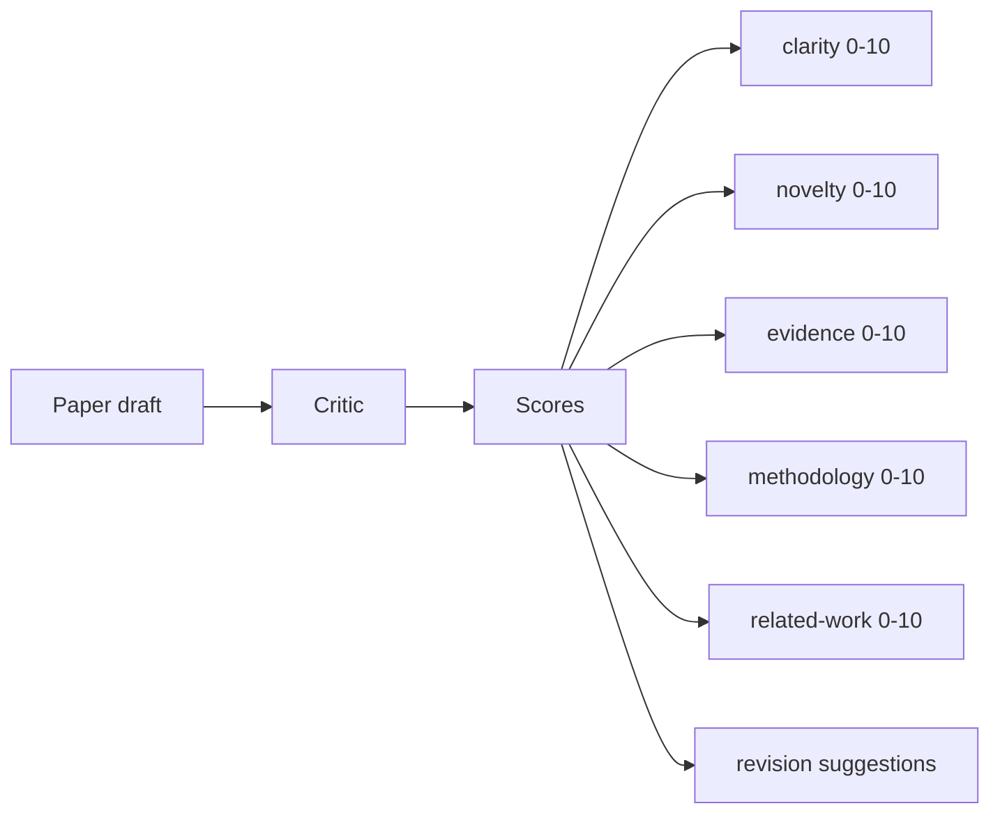
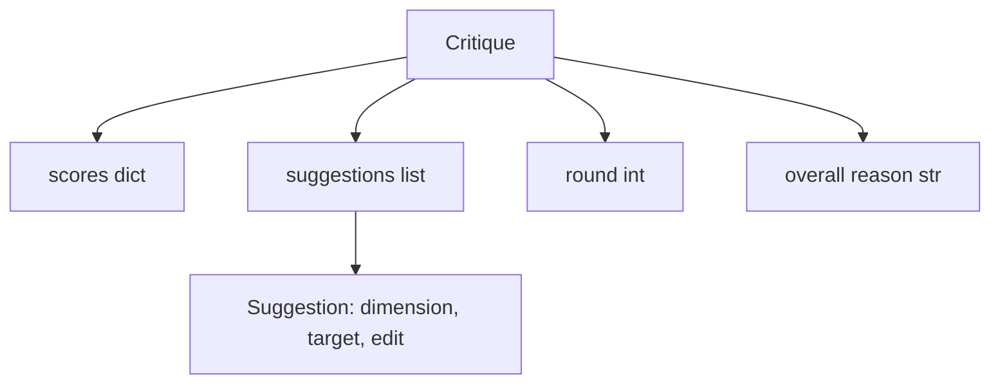
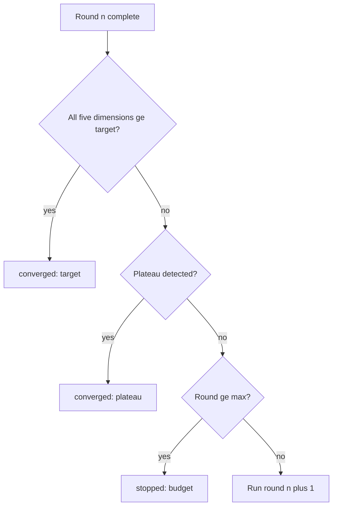
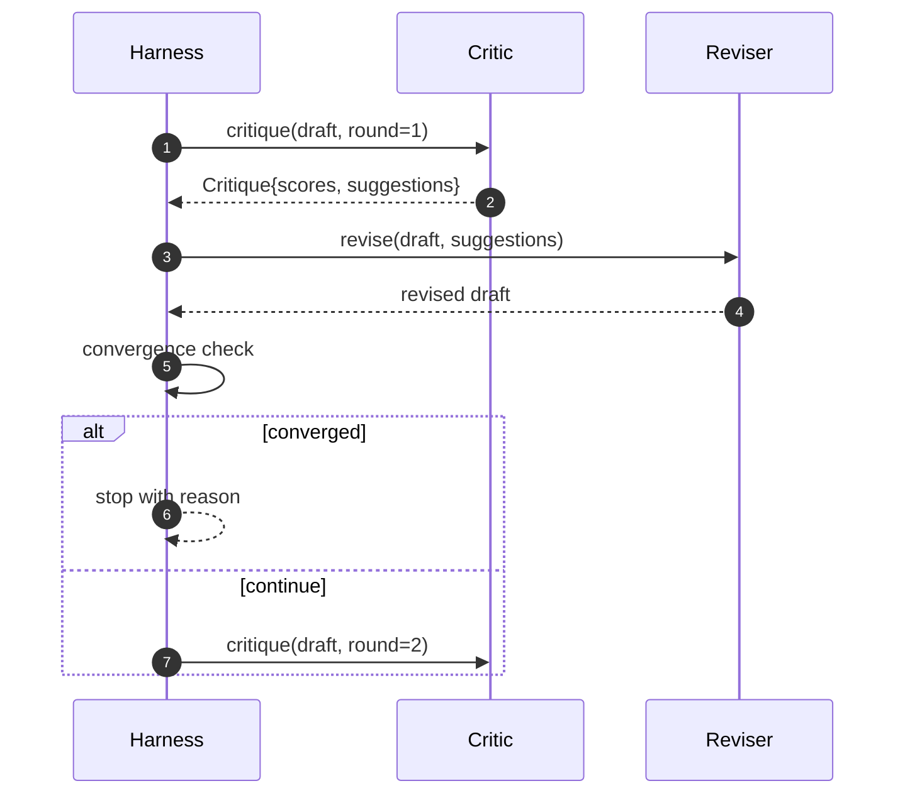

# 评审循环

> 一次就返回"看起来不错"的评审器是有问题的。永远返回"需要改进"的评审器也是有问题的。有意思的评审器是会收敛的那个，而收敛需要你主动设计。

**Type:** Build
**Languages:** Python
**Prerequisites:** 第 19 阶段第 50-53 课
**Time:** ~90 分钟

## 学习目标

- 在五个固定维度上对论文草稿评分：清晰度、新颖性、证据、方法论、相关工作。
- 将每一轮的批评意见作为结构化的修订 diff 应用，而不是自由发挥的重写。
- 通过比较各轮次之间的得分来检测收敛；在平台期、达到目标或预算耗尽时停止。
- 使用最大迭代次数预算来限制轮数，避免不收敛的评审器无限运行。
- 输出每轮的 trace，使仪表盘或下一阶段能够渲染得分轨迹。

```figure
ch-critic-converge
```

## 为什么是五个固定维度

自由发挥的评审器是一个返回一段建议文字的模型。下一轮的修订把这段文字当作背景上下文。重写是否解决了批评意见无法验证，因为批评意见本身从未有过结构。

五个维度给了测试框架一份契约。



得分是一个向量。测试框架观察每个维度在各轮次间的变化。一次提高了清晰度却拖垮了证据分的修订，在证据维度上是一次回归，收敛检查能看到这一点。纯模型的评审器无法提供这种保证。

## Critique 的数据结构



每条建议都携带它所改进的维度、它所针对的章节，以及一条修订器可以执行的 `edit` 指令。修订器同样是一个可调用对象。本课附带一个确定性修订器，它将编辑指令解释为向章节追加内容的操作。模型驱动的修订器则会将同一字段解释为提示词。契约不变。

## 收敛规则，按顺序

当以下三个条件中的任何一个触发时，评审循环终止。



目标是最严格的情况：五个维度（clarity、novelty、evidence、methodology、related_work）中的每一个都必须达到 `>= target_score`（默认 `8.0`），循环才能返回成功。一个维度偏弱的高均值是不够的。平台期检测将当前轮次的均值与上一轮次的均值进行比较。如果改进幅度连续两轮低于 `plateau_epsilon`（默认 `0.1`），循环以 `plateau` 退出。预算是轮数的硬性上限（默认 `5`），触发时以 `budget` 退出。

顺序很重要。目标优先于平台期，平台期优先于预算。如果第三轮在同一迭代中既达到了目标、又触发了平台期条件，结果是 `target`，而不是 `plateau`。

## 为什么平台期检测要跨两轮运行

一轮的平台期是噪声。真实的评审器即使面对固定的草稿，每次迭代返回的得分也会略有不同，因为确定性评分仍然取决于哪些建议被应用以及应用的顺序。要求连续两轮平台期可以过滤掉这种噪声。如果测试框架报告了平台期，说明草稿确实停止了改进。

## 本课的确定性评审器

本课不调用模型。附带的评审器是一个可调用对象，它基于三个信号对草稿评分：平均章节正文长度（清晰度）、图表数量和引用数量（证据），以及论文元数据中的 `originality_tag` 字段（新颖性）。修订器知道如何推高每个分数。

```text
clarity      grows when the average section body length increases
novelty      grows when originality_tag is set to "high"
evidence     grows when a section's figure_refs is non-empty
methodology  grows when a section titled "Method" exists with body
related-work grows when a section titled "Related Work" exists with body
```

修订器将每条建议解释为一次定向追加。第一轮之后，测试框架可以观察到得分上升。测试利用这一性质来断言循环在缩小差距。

## 完整的循环契约



测试框架拥有轮次计数器、trace 和收敛检查。评审器拥有得分。修订器拥有 diff。三者互不触碰彼此的状态。

## Trace 输出

每一轮输出一条 trace 事件，包含轮次编号、得分向量、建议数量和收敛判定。完整的 trace 与最终草稿一起返回。下游仪表盘可以据此渲染每轮得分图表。下一课的迭代调度器读取 trace 来决定该分支是否值得保留。

## 防御坏评审器的预算

一个产出的建议永远无法改进得分的评审器会把循环锁定在最大迭代上限。trace 使这一点可见：五轮，得分持平，判定为 `budget`。用户会将其解读为评审器的 bug，而不是草稿的 bug。另一种做法——只展示最终草稿——掩盖了诊断。trace 优先的设计则将其暴露出来。

## 如何阅读代码

`code/main.py` 定义了 `Critique`、`Suggestion`、`Critic` 协议、`Reviser` 协议、`CriticLoop`，以及一个返回确定性评审器和配套修订器的 `make_deterministic_critic_pair` 工厂。包含一个最小的 `Paper` 结构，使本课可以独立运行。

`code/tests/test_critic_loop.py` 覆盖：第一轮之后的单调改进、在调优过的草稿上达到目标收敛、两轮持平后的平台期检测、没有任何建议改进时的预算耗尽、修订器对建议的应用，以及 trace 的结构。

## 进一步拓展

真实实现会需要的两个扩展。第一，维度权重：工作坊论文对新颖性的权重高于方法论；期刊则相反。收敛检查变为加权平均。第二，成对评审器：一个评审器打分，另一个评审器在修订器看到建议之前对建议进行裁决。两者都增加价值，且都组合在相同的 `Critique` 结构上。

核心赌注是得分向量。一旦批评意见结构化，其他所有改进——收敛规则、仪表盘、成对评审器——都可以在不需要改变循环的情况下直接加入。