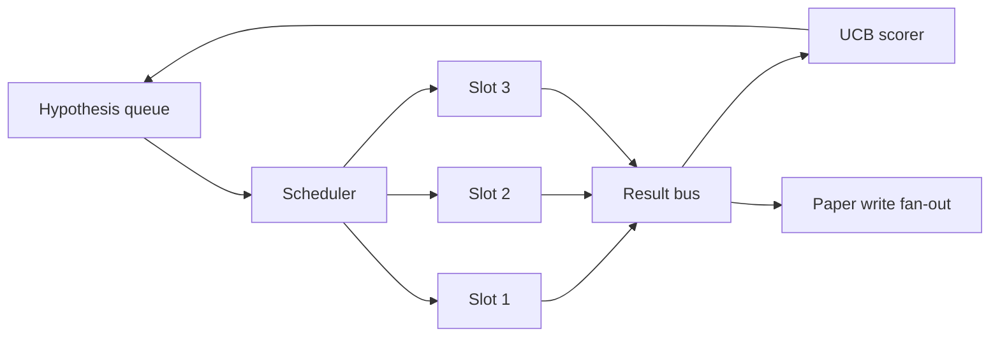
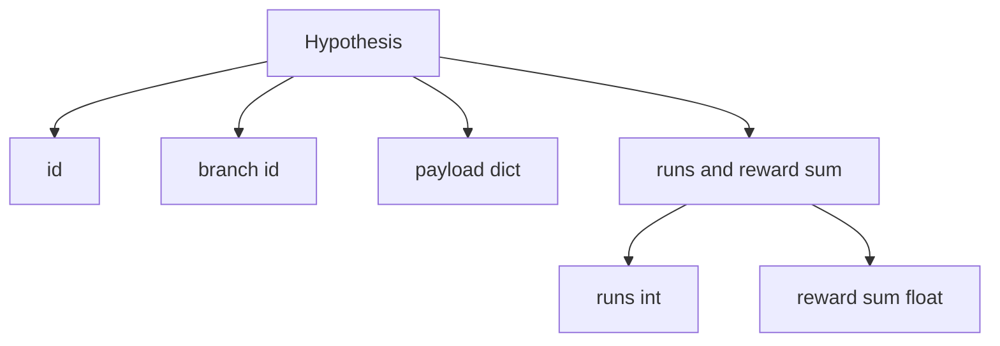
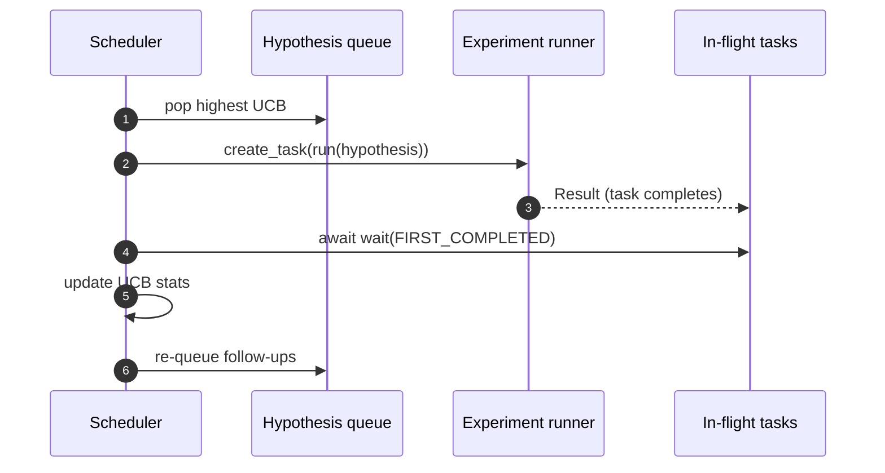

# 迭代调度器

> 没有调度器的研究循环只是一个妄想的队列。调度器是循环决定停止探索什么的地方，而这个决定就是整个游戏的关键。

**Type:** Build
**Languages:** Python
**Prerequisites:** Phase 19 lessons 50-53
**Time:** ~90 minutes

## 学习目标

- 将研究工作流建模为一个假设队列，为并行的实验槽提供输入，其结果再回馈到队列中。
- 使用 asyncio 并发运行多个实验，使调度器能够保持所有槽位繁忙。
- 用 UCB 为每个假设分支评分，使调度器能够剪除低收益分支而不放弃探索。
- 将已完成的结果分发到论文撰写阶段和重新入队阶段，使高收益分支衍生出后续假设。
- 提供每次迭代的追踪记录，包含分支评分、槽位占用情况和剪枝决策。

```figure
ch-ucb-scheduler
```

## 为什么是调度器，而不是工作清单

扁平的工作清单按提交顺序运行任务。当每个任务相互独立时，这没问题。但研究任务并非相互独立：实验三的发现会改变实验四和实验五的优先级。能够读取结果回馈并对队列重新排序的调度器，在单位算力内能完成更多有用的工作。

有趣的设计选择是评分规则。贪婪的评分器总是选择当前的领先者，从不探索。均匀的评分器从不利用。UCB（置信上界）是中间路径：利用领先者，同时为尝试较少的分支保留容量。

## 系统结构



队列保存假设。当某个槽位空闲时，调度器选择 UCB 最高的假设。每个槽位异步运行一个实验。完成的实验将结果发送到总线上。总线更新来源分支的 UCB 统计数据，并在某分支的收益超过阈值时分发到论文撰写阶段。

## Hypothesis 的结构



`branch` 是 UCB 统计数据的键。多个假设可能共享一个分支（分支是研究方向；假设是该方向内的一次尝试）。`runs` 是该分支已完成实验的次数，`reward_sum` 是累积奖励。UCB 会同时读取这两者。

## UCB 评分

本课使用的 UCB 公式是经典的 UCB1。

```text
ucb(branch) = mean_reward(branch) + c * sqrt( ln(total_runs) / runs(branch) )
```

`total_runs` 是所有分支已完成实验的总次数。`c` 是探索权重；本课默认为 `sqrt(2)`。运行次数为零的分支会得到 `+inf`，因此未尝试过的分支总是被优先调度。平均奖励高的分支会保持高评分，直到其他分支赶上；而一个运行多次却没有多少奖励的分支，会被运行次数较少的替代分支超越。

剪枝门槛与选择器是分离的。当某个分支的平均奖励在至少 `prune_after_runs` 次尝试（默认 `3`）后低于绝对下限（默认 `0.2`）时，剪枝会将其从后续调度中移除。这使队列保持有界。

## 使用 asyncio 的并行槽位

调度器使用 `asyncio.create_task` 驱动实验。每个任务运行实验执行器（一个 `async def` 可调用对象），返回一个 `Result`。主循环使用 `asyncio.wait(..., return_when=asyncio.FIRST_COMPLETED)` 等待在途任务集合，并在每次完成时触发评分更新。



三个槽位并发运行。主循环从不在单个实验上阻塞。一旦有槽位空闲，调度器就立即启动新任务，直到队列变空且没有在途任务为止。

## 分发：论文触发器

当某分支的平均奖励超过 `paper_threshold`（默认 `0.7`）且该分支尚未产出论文时，调度器会将一个 `paper.trigger` 事件分发到输出列表。在下游，第五十四课的论文撰写器会接收该事件。本课中该触发器被捕获为列表，以便测试可以对其进行断言。

## 分发：后续假设

当高收益结果出现时，调度器可以调用用户提供的 `expander` 在同一分支上生成一个或多个后续假设。扩展器是一个从 `Result` 到 `list[Hypothesis]` 的纯函数。本课提供了一个确定性的扩展器，为任何奖励超过论文阈值的结果生成两个后续假设。

## 预算

两个预算保护调度器免于失控循环。

```text
max_experiments    : total count of experiments run across all branches
max_seconds        : wall-clock cap (asyncio time)
```

当任一预算触发时，调度器停止调度新任务，等待在途任务完成，并返回最终追踪记录。追踪记录中包含一个 `stop_reason`。

## 追踪记录与最终报告

每个调度决策（选择、派发、结果、剪枝、分发）都会发出一个事件。最终报告汇总每个分支的统计数据、总运行次数、总耗时以及触发的论文触发器。下一课的端到端演示将读取此报告来驱动论文撰写器。

## 如何阅读代码

`code/main.py` 定义了 `Hypothesis`、`Result`、`BranchStats`、`IterationScheduler`，以及一个 `make_deterministic_runner` 工厂，它返回一个具有可预测奖励的 asyncio 实验执行器。执行器会睡眠固定的 `delay_ms`（默认 `5ms`），以便并发可被观察到。

`code/tests/test_scheduler.py` 覆盖以下内容：UCB 优先选择未尝试的分支、并行槽位占用、超过阈值时的论文触发器、低收益尝试后的分支剪枝、分发后续假设，以及预算退出（实验次数和挂钟时间两者）。

## 进一步扩展

真实实现会需要三个扩展。第一，跨会话持久化 UCB 统计数据：当前的统计数据保存在内存中；真实的调度器会对其进行检查点保存，使重启后已花费的探索预算得以保留。第二，多目标评分：每个结果发出一个向量而非标量奖励，UCB 变成 Pareto 式的选择器。第三，上下文老虎机：选择器以假设特征（长度、复杂度）为条件，使相似的假设共享探索。

调度器是让研究超越工作清单的地方。一旦 UCB 接入且槽位并行运行，所有其他改进都可以在其上叠加。