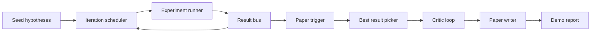
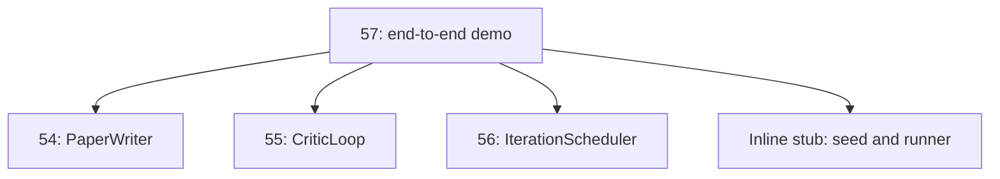
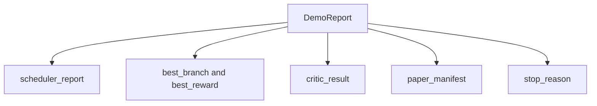

# 端到端研究演示

> 演示是你之前写下的每一份契约都必须组合起来的地方。只要其中任何一份泄漏,演示就是抓住它的那堂课。

**Type:** Build
**Languages:** Python
**Prerequisites:** Phase 19 lessons 50-53
**Time:** ~90 minutes

## 学习目标

- 端到端地串联自动研究循环:假设种子、实验运行器、调度器、评审循环、论文写作器。
- 通过普通的 Python 导入(而非框架)组合前四节 Track D 课程中的原语。
- 运行循环直至自终止结束,并输出一份单一的演示报告,列出每个阶段的输出。
- 保持演示的确定性,以便测试套件能够断言最终形态。
- 在任一阶段的契约被破坏时,暴露出明确的失败模式,使下一阶段不会带着损坏的输入继续运行。

```figure
ch-research-pipeline
```

## 这里组合了什么



五个阶段。种子是包含三个假设的列表。调度器用三个并行槽位跨这些假设运行六个实验。总线报告一个或多个论文触发。选择器挑选唯一最佳结果。评审循环基于该结果构建的草稿进行迭代。论文写作器输出最终的 LaTeX、BibTeX 和清单。

## 为什么用导入而非复制

前面每节课都附带一个 `main.py`,其中包含公开的 dataclass 和函数。演示通过将 `sys.path` 调整到每节课的父目录来导入它们。这不是框架接线;它与前面课程中测试文件已经使用的导入方式完全相同。



内联桩替代第五十到五十三节课:一个小型的种子假设生成器和一个同步的奖励函数。用户可以通过调整两个导入,将内联桩替换为那些课程中的真实原语。

## 确定性保证

该演示在构造上是确定性的。实验运行器使用带种子的 numpy。评审循环的修订器按固定顺序遍历固定维度。论文写作器的文本生成器是第五十四节课中的那个 mock 版本。调度器的 UCB 选择器以迭代顺序打破平局,而非随机选择。

给定相同的种子,演示输出相同的报告。测试通过运行演示两次并比较清单来断言这一性质。

## 演示报告的形态



每个字段都原封不动地来自上游阶段。演示不转换任何输出;它只是组合它们。这正是该演示所承载的测试。

## 失败模式处理

每个阶段要么成功,要么抛出带类型的错误。

```text
Scheduler ........ returns SchedulerReport with stop_reason
                   in {queue_empty, max_experiments, deadline}
Best-result pick . raises NoTriggerError if no paper trigger fired
Critic loop ...... returns LoopResult with status converged or stopped
Paper writer ..... raises PaperValidationError on contract break
```

任一阶段的失败都会以带类型的异常短路演示。测试钉死了这一契约:`test_no_triggers_raises_typed_error` 和 `test_best_picker_raises_when_no_triggers` 断言当没有任何分支触发时,选择器抛出 `NoTriggerError` / `BestResultError`,且写作器从不被调用。

## 最佳结果选择器

调度器按分支发出论文触发。选择器挑选所有触发中平均奖励最高的分支。平局时按分支 id 的字母顺序打破,以保证演示的确定性。选择器是一个小的纯函数;测试用固定的调度器报告钉死它。

## 串联评审循环

第五十五节课中的评审循环作用于一个 `MiniPaper`。演示通过以下方式从被选分支构建一个 `MiniPaper`:用分支 id 填充摘要,播种两个章节(Introduction 和 Results),并根据分支的平均奖励设置 `originality_tag`(若 `>= 0.8` 则为高,若 `>= 0.6` 则为中,否则为低)。

然后修订器将草稿迭代至收敛。输出进入论文写作器。

## 串联论文写作器

第五十四节课中的论文写作器作用于完整的 `Paper` 形态,包含图表和参考文献。演示通过 `mini_to_full_paper` 升级收敛后的 `MiniPaper`,它为被选分支附加一张图表,以及一个由评审建议的引用键并集构成的小型合成参考文献。演示添加的每一条引用也会加入参考文献列表,以便验证通过。

## 如何阅读代码

`code/main.py` 定义了 `BestResultError`、`NoTriggerError`、`DemoReport`、`pick_best_branch`、`build_mini_paper`、`mini_to_full_paper` 和 `run_demo`。顶部的导入一次性调整 `sys.path`,并从相应课程中导入 `PaperWriter`、`CriticLoop` 和 `IterationScheduler`。

`code/tests/test_e2e.py` 覆盖:演示端到端运行并输出所有五个字段均已填充的报告、两次运行间的确定性、无分支越过阈值时的 NoTriggerError、写作器契约被破坏时的 PaperValidationError、论文清单包含被选分支的图表,以及调度器停止原因是预期值之一。

## 进一步拓展

在演示变绿之后,有三个值得接入的扩展。第一,持久状态:每个阶段的结果写入一个小的 JSON 存储,使重启后无需重新运行廉价阶段即可恢复。第二,仪表盘:调度器和评审循环的追踪事件渲染为单一时间线。第三,真实模型调用:将 mock 的文本生成器和确定性评审替换为模型驱动的版本;接线方式不变。

演示的任务是证明组合即架构。五节课,四个导入,一份报告。下次你添加一个阶段时,接线恰好只增长一行。