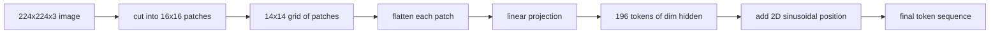

# 视觉编码器的Patch划分

> 一个读取像素的视觉模型需要一个针对像素的分词器。Patch嵌入就是这个分词器。将图像切分成方形网格,把每个方块展平,通过一个线性层投影,再加上一个2D位置信号,让Transformer知道每个方块在原图中的位置。

**Type:** Build
**Languages:** Python
**Prerequisites:** Phase 19 第30-37课(Track B 基础)
**Time:** 约90分钟

## 学习目标

- 将图像分词为固定长度的patch嵌入序列。
- 实现一个基于 `Conv2d` 的patch投影,其数学效果与"unfold后再线性层"一致。
- 构建确定性的2D正弦位置嵌入,使token顺序编码空间位置。
- 在合成测试数据上验证patch数量、嵌入形状,以及 `Conv2d`/unfold 的等价性。

## 问题

Transformer吃的是向量序列。而图像是一个3通道网格。把每个像素都当作一个token会使序列长度爆炸:一张224x224的RGB图像有150,528个token,12层的Transformer在注意力计算上根本负担不起。把整张图像当作一个巨大的扁平向量则会丢掉局部性,而注意力层无法从中恢复。编码器前端的任务是将像素网格压缩成几百个token,每个token概括一个方形区域。

Patch嵌入用一个线性投影解决了这个问题。一张224x224的图像按16x16切分后,得到一个14x14的网格,共196个patch。每个patch从 `(3, 16, 16) = 768` 个像素值展平为一个向量,然后一个线性层将其映射到模型的隐藏维度。Transformer看到的是196个维度为 `hidden` (通常是768)的token,外加一个CLS token。这是网络其余部分能够处理的序列长度。

## 核心概念



### 为什么用patch而不是像素

注意力计算对序列长度是二次复杂度。196个token的序列在每个头每层需要 `196 * 196 = 38,416` 个注意力分数;150,528个token的序列则需要 `150,528 * 150,528 = 22.6 billion` 个。Patch带来了约59万倍的注意力计算量削减,而单个16x16的区域已经包含足够的信息用于高层视觉任务。代价是丢失了单个patch内部的细粒度空间细节,这就是为什么当下游需要精细定位时,多模态系统通常会增加一个高分辨率分支。

### 为什么一个线性投影就够了

每个patch被当作独立的向量。投影学习一组基:边缘检测器、颜色滤波器、简单纹理。单个线性层很小(ViT-Base为 `768 * 768 = 589,824` 个参数)且训练快。存在更深的卷积stem("hybrid" ViT),但扁平线性投影是标准做法,大多数现代开源权重编码器都采用这一结构。

### `Conv2d` 技巧

无padding的 `Conv2d(in_channels=3, out_channels=hidden, kernel_size=patch_size, stride=patch_size)` 在数值上与"unfold后再线性层"结果相同,因为每个输出位置都是patch像素与一个滤波器的点积。卷积就是patch投影,大多数生产代码库都这样实现,因为它在GPU上更快,还少一次reshape。

### 位置嵌入

token经过投影后不携带任何顺序信息。2D正弦嵌入为每个token提供一个固定的信号,编码其 `(row, col)` 位置。嵌入维度的一半用多个频率的sin/cos编码行位置;另一半编码列位置。该编码是确定性的,因此可以在不重新训练的情况下更换分辨率,并且能干净地插值到训练时从未见过的网格。

| 组件 | 形状 | 参数量 |
|-----------|-------|------------|
| Patch投影(`Conv2d`) | `(hidden, 3, patch, patch)` | `3 * P * P * hidden + hidden` |
| 位置嵌入(固定) | `(num_patches, hidden)` | 0(计算得出,非学习) |
| CLS token(学习) | `(1, hidden)` | `hidden` |

以224分辨率的ViT-Base/16为例:投影有590,592个参数,CLS token有768个,正弦位置为0。下一课(第59课)将在这个前端之上叠加一个12层的Transformer。

### 等价性作为正确性检验

Patch步骤有两种写法:一个 `Conv2d` 投影,以及显式的"unfold后再线性层"。相同权重下它们必须产生相同的输出。如果不一致,则unfold的数学有误,编码器的其余部分就建立在流沙之上。本课的测试就是检验这一等价性。

```figure
ch-patch-tokenizer
```

## 动手构建

`code/main.py` 实现:

- `PatchEmbed`,一个封装 `Conv2d` 用于patch投影的 `nn.Module`。
- `sinusoidal_2d(grid_h, grid_w, dim)`,一个无状态函数,构建2D位置表。
- `VisionFrontEnd`,将patch嵌入、CLS前插和位置相加组合成一次前向传播。
- 一个 `synthesize_image(seed)` 辅助函数,从 `numpy.random` 构建确定性的224x224x3测试数据。
- 一个演示脚本,将一张测试图像通过前端并打印输出形状、CLS token范数,以及位置嵌入的一行。

运行:

```bash
python3 code/main.py
```

输出:224x224的测试图像被分词为形状为 `(1, 197, 768)` 的序列。第一个token是CLS;接下来的196个是patch token。位置嵌入的范数在同一行内是均匀的,这正是正弦编码的特征。

## 实际应用

同样的patch前端出现在每一个现代视觉-语言模型中:CLIP ViT-L/14、SigLIP、DINOv2、Qwen-VL系列和InternVL系列,都始于一个 `Conv2d` patch投影加位置信号。各系列之间的差异在下游(CLS还是无CLS池化、register token、patch大小14 vs 16、通过插值位置实现动态分辨率)。本课的前端是所有这些模型赖以构建的基础。

## 测试

`code/test_main.py` 覆盖:

- patch数量与 `(image_size / patch_size) ** 2` 一致
- 输出形状与 `(batch, num_patches + 1, hidden)` 一致
- `Conv2d` 投影在小型测试数据上等于手工的unfold-then-linear
- 正弦位置表在多次调用间是确定性的
- CLS token在batch维上广播而不发生泄漏

运行:

```bash
python3 -m unittest code/test_main.py
```

## 练习

1. 将正弦位置替换为可学习的 `nn.Parameter`,并在一个小型合成分类任务上比较第一个epoch的损失。固定分辨率下可学习位置占优;训练后改变分辨率时正弦编码占优。

2. 将 `Conv2d` 换成显式的 `nn.Unfold` 加 `nn.Linear`,并断言输出在浮点容差内一致。同一数学,两种写法。

3. 增加对非正方形patch大小的支持(例如宽幅输入用32x16),并验证位置表能处理非正方形网格。

4. 在batch size为1、8、64下对patch步骤进行性能分析。patch投影很少是瓶颈;下游的注意力层才是主导。

5. 将前端作为冻结的特征提取器,在一个4类合成形状数据集(圆形、正方形、三角形、星形)上训练。CLS token的输出应该可以线性分离。

## 关键术语

| 术语 | 含义 |
|------|---------------|
| Patch | 图像的一个方形子区域,通常为14x14或16x16 |
| Patch嵌入 | 将一个展平的patch线性投影到隐藏维度 |
| 序列长度 | patch分词后的token数量,通常再加上CLS |
| 正弦位置 | 编码2D网格坐标的固定sin/cos信号 |
| CLS token | 前插到序列中作为池化头的可学习向量 |

## 延伸阅读

- An Image is Worth 16x16 Words(ViT, 2021),了解原始的patch嵌入框架。
- Attention Is All You Need(2017),了解此处改编为2D的正弦位置公式。
- DINOv2论文,了解register token,你可以将其作为练习6添加。