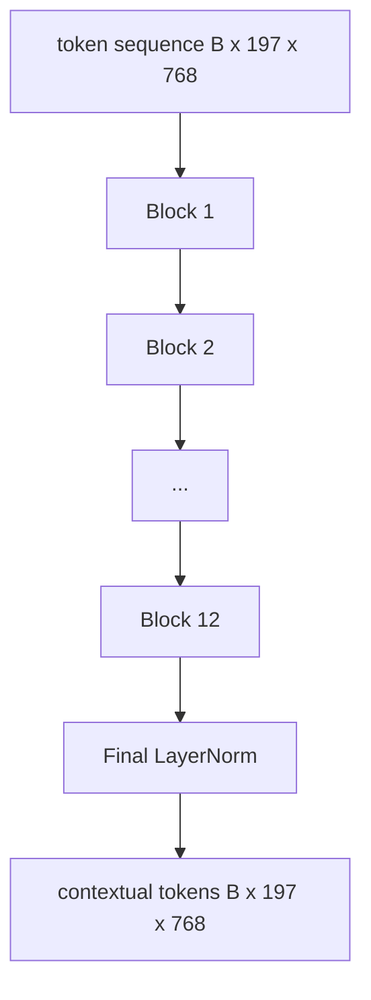
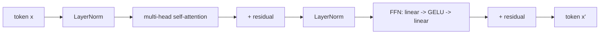

# Vision Transformer 编码器

> 仅靠 patch 本身是无法“看懂”图像的。一个 12 层、带 12 个注意力头的 pre-LN transformer 会将 patch token 序列转换为上下文相关的 token 序列，而 CLS token 则在最终的隐藏状态中汇聚整幅图像的特征。本课是所有现代视觉-语言模型的引擎室。

**Type:** Build
**Languages:** Python
**Prerequisites:** Phase 19 第 30-37 课（Track B 基础）
**Time:** 约 90 分钟

## 学习目标

- 实现一个带多头自注意力和前馈子层的 pre-LN transformer 块。
- 堆叠 12 个块、每块 12 个头，组成一个 ViT-Base 编码器。
- 将第 58 课的 patch 前端接入编码器并运行一次前向传播。
- 验证 CLS token 聚合了来自每个 patch 的信息。

## 问题

Patch 嵌入产生一个 197 个 token 的序列，每个 token 都是一个对其他 patch 毫无感知的向量。一张猫的图片需要每个 patch 知道哪些 patch 包含胡须、哪些包含背景、哪些包含眼睛。Transformer 正是逐层构建这种感知的机制。没有它，patch 前端就只是一个聪明的分词器，毫无理解能力。

标准配方是深度 12 层、宽度 12 头、pre-LayerNorm 放置方式、GELU 激活，以及 4 倍的前馈扩展。这一配方是 CLIP ViT-L、SigLIP、DINOv2、Qwen-VL 系列、InternVL 以及 2025-2026 年所有其他开源权重视觉编码器的骨干。该配方足够稳定，你可以阅读这些论文中的任意一篇并默认采用这种块结构，除非论文中明确说明不同。

## 概念





### Pre-LN 与 post-LN

原始 Transformer 将 LayerNorm 放在残差之后。Pre-LN（LayerNorm 位于每个子层之前）是所有现代视觉-语言模型采用的版本，因为它无需学习率预热技巧即可稳定训练。区别仅在前向传播中的一行代码，但在 12 层以上的深度下，梯度流动有着天壤之别。

### 多头自注意力

每个头将 token 向量投影到自己的 `(query, key, value)` 三元组，维度为 `head_dim = hidden / num_heads`。取 `hidden = 768` 和 `heads = 12` 时，每个头的维度为 `dim = 64`。12 个头并行进行注意力计算，然后它们的输出拼接回 768 维并经过一个输出投影。多头的关键在于：一个头可以学习“关注猫眼”，另一个头学习“关注背景梯度”，互不干扰。

### 为什么前馈扩展是 4 倍

FFN 的结构是 `hidden -> 4 * hidden -> hidden`，中间使用 GELU。因子 4 是经验值，自 2017 年以来在语言和视觉 transformer 中一直沿用。更小（2 倍）会欠拟合；在固定数据预算下更大（8 倍）会过拟合。MLP 是模型存储大部分所学事实的地方，更宽的中间层正是它们所在之处。

| 组件 | ViT-Base 规模下的参数量 |
|-----------|------------------------------|
| 每块的 qkv 投影 | `3 * 768 * 768 = 1.77M` |
| 每块的输出投影 | `768 * 768 = 590K` |
| 每块的 FFN（4 倍扩展） | `2 * 768 * 4 * 768 = 4.72M` |
| 每块的 LayerNorm | `4 * 768 = 3K` |
| 每块总计 | 约 7.1M |
| 12 个块 | 约 85M |
| 加上前端 | 总计约 86M |

ViT-Base 是一个 86M 参数的编码器。以 2026 年的标准来看这很小（SigLIP-So400M 是 400M，Qwen-VL 的 ViT 是 675M），但架构在宽度和深度之外完全相同。

### 是否使用因果掩码？

Vision Transformer 是仅编码器且双向的：token `i` 可以对任意成对的 token `j` 进行注意力计算。不使用掩码。第 61 课解码器一侧的交叉注意力会使用因果掩码，但在视觉编码器内部，注意力是完全连接的。

### CLS token 学到了什么

CLS token 起始为一个可学习参数，本身没有任何 patch 内容，并通过注意力在每一个块中不断积累信息。到最后一层时，CLS 行向量是整幅图像的向量摘要；下游的头部将这个单一向量投影为类别 logits、对比学习嵌入，或供文本解码器使用的交叉注意力键。

```figure
ch-cls-funnel
```

## 动手实现

`code/main.py` 实现了：

- `MultiHeadSelfAttention`，包含 `qkv` 和输出投影、缩放点积注意力计算，以及形状断言。
- `FeedForward`，4 倍扩展的 GELU MLP。
- `Block`，一个 pre-LN 块，带残差地组合注意力和前馈子层。
- `ViT`，一个由 12 个块组成的堆叠，末尾带一个最终 LayerNorm。
- `VisionEncoder`，将第 58 课的 `VisionFrontEnd` 接入 `ViT` 堆叠，并暴露一个 `forward()`，返回上下文序列和汇聚后的 CLS 向量。
- 一个演示，将合成的 224x224 测试图像送入完整编码器，并打印输入形状、输出形状、参数量，以及每隔一层输出的 CLS 范数。

运行它：

```bash
python3 code/main.py
```

输出：测试图像被编码为一个 `(1, 197, 768)` 张量。CLS 范数随层数叠加逐渐上升，然后在最终 LayerNorm 处趋于稳定。总参数量报告为约 86M。

## 使用它

这里定义的编码器，除宽度和深度外，与 2025-2026 年所有开源权重 VLM 内部的块堆叠相同。差异在于：

- **宽度和深度。** ViT-Large 是 `hidden=1024, depth=24, heads=16`；SigLIP So400M 是 `hidden=1152, depth=27, heads=16`。块相同。
- **汇聚头。** CLS 汇聚（本课）vs 平均汇聚（SigLIP）vs 注意力汇聚（后续 VLM）。
- **位置处理。** 固定正弦编码（第 58 课）vs 可学习 1D vs ALiBi vs 2D RoPE。块的数学计算不变。
- **Register token。** DINOv2 在前面添加了 4 个额外的可学习 token。只需一行代码。

这个块堆叠是基底。接下来的课程（60-63 课）将建立在它之上。

## 测试

`code/test_main.py` 覆盖：

- 单个块保持形状，且对输入 batch 大小不变
- 注意力分数沿 key 轴求和为 1（softmax 合理性检验）
- 残差路径已正确连接（零输入仍通过 CLS token 产生非零输出）
- 4 层堆叠的前向传播产生正确形状
- 梯度从 CLS 输出流动到 patch 投影

运行它们：

```bash
python3 -m unittest code/test_main.py
```

## 练习

1. 添加 register token（在 CLS 之后前置 4 个可学习向量）并重新运行。通过最后一层 softmax 分布的熵比较注意力图的平滑度。

2. 将 pre-LN 换成 post-LN，并在一个合成形状分类器上训练一个 epoch。观察哪一个在没有学习率预热的情况下训练稳定。

3. 将因果掩码实现为一个 `attn_mask` 参数，使同一个块可以被复用为解码器块。掩码形状为 `(seq, seq)`，下三角。

4. 使用 `torch.profiler` 在 batch 大小 1、8、64 下对前向传播进行性能分析。占用墙钟时间的主要是 MLP 层，而非注意力。

5. 将一个注意力头的 q-k-v 投影替换为低秩 LoRA 适配器，冻结其余部分，并验证梯度只流向你预期的位置。

## 关键术语

| 术语 | 含义 |
|------|---------------|
| Pre-LN | LayerNorm 应用于每个子层之前而非之后 |
| 自注意力 | 序列中的每个 token 对同一序列中的所有其他 token 进行注意力计算 |
| 多头 | 隐藏维度被拆分到 `H` 个独立的注意力头上 |
| FFN 扩展 | 前馈层先扩展到 `4 * hidden` 再收缩回去 |
| CLS 汇聚 | 使用第一个 token 的最终隐藏状态作为图像摘要 |

## 延伸阅读

- An Image is Worth 16x16 Words（ViT, 2021），了解编码器配方。
- DINOv2（2023），了解 register token 和自监督预训练目标。
- SigLIP（2023），了解平均汇聚变体以及第 62 课使用的 sigmoid 对比损失。