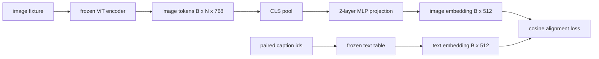

# 用于模态对齐的投影层

> 视觉编码器生成图像 token。文本解码器消费文本 token。二者处于不同的向量空间中。一个小型两层 MLP 将图像 token 投影到文本嵌入空间中，并通过针对配对描述文本的余弦对齐损失使两个空间趋于一致。这个投影是视觉-语言模型中最小的组成部分，也是对迁移最关键的部分。

**Type:** Build
**Languages:** Python
**Prerequisites:** Phase 19 lessons 30-37 (Track B foundations)
**Time:** ~90 minutes

## 学习目标

- 构建一个两层 MLP 投影，将图像特征映射到文本嵌入空间中。
- 构建一个模拟的文本嵌入表(无预训练分词器，无真实语料库)。
- 计算投影后的图像 token 与配对描述文本嵌入之间的余弦对齐损失。
- 在冻结视觉编码器和冻结文本表的情况下，仅训练投影层。

## 问题

你有一个视觉编码器(lessons 58-59),输出维度为 `vision_hidden = 768` 的 token。你有一个文本解码器，希望搭建在其上，其嵌入维度为 `text_hidden = 512`(换成其他数字同样合理)。解码器期望接收文本形状的 token。而图像 token 并非文本形状：它们位于编码器在纯视觉预训练期间学到的一组基中，与解码器的词向量没有任何关系。

两层 MLP 投影(线性、GELU、线性)弥合了这一差距。它足够小(约 `768 * 1024 + 1024 * 512 = 1.3M` 参数)，可以在单个 GPU 上几分钟内完成训练，并且它是对齐阶段唯一需要学习的部分。视觉编码器保持冻结。文本嵌入表保持冻结。只有投影层在更新。这正是 LLaVA 在 2023 年采用的方案，BLIP-2 将其重构为 Q-Former,此后每个开源权重的 VLM 都以某种形式采纳了这一方案。

## 概念



### 投影前的池化

视觉编码器输出 197 个 token。文本侧只有一个描述文本级别的嵌入。要对齐它们，每个样本需要一个图像级别的向量。CLS 池化是最简单的方式：取编码器的第一个 token 并进行投影。对所有 197 个 token 做平均池化是另一种选择，也是 SigLIP 所使用的方式。无论哪种方式，都是将 197 个向量池化为一个。

### 为什么是两层而不是一层

单个线性投影可以旋转和缩放，但如果两个空间存在曲率不匹配，它无法修正基。两个线性层之间的 GELU 为投影提供了一个非线性弯折，经验上这足以将 CLIP 风格的特征对齐到语言模型嵌入。更深的投影(LLaVA-NeXT 使用了 GLU;Qwen-VL 使用了一叠注意力层)是扩展；两层 MLP 是标准基线，也是 BLIP-2 的 Q-Former 投影头底层所采用的方案。

| 层 | 形状 | 参数量 |
|-------|-------|------------|
| fc1 | `(vision_hidden, projection_hidden)` | `768 * 1024 + 1024` |
| activation | GELU | 0 |
| fc2 | `(projection_hidden, text_hidden)` | `1024 * 512 + 512` |

对于一个 `768 -> 1024 -> 512` 的投影头，约 130 万参数。

### 余弦对齐损失

对齐并不意味着 `image_emb == text_emb`。对齐意味着 `image_emb` 在联合空间中与 `text_emb` 方向相同。余弦损失为 `1 - cos_sim(image, text)`,取值范围为 0(完全对齐)到 2(方向相反)。训练使每个配对的该值趋向于零。Lesson 62 将其推广到对比批次(InfoNCE),其中每张图像必须比批次中任何其他描述文本更接近自己的描述文本；本课使用逐配对版本，以便动态过程清晰可见。

### 冻结编码器是关键

视觉编码器有 86M 参数。文本表还有几百万参数。用模拟语料库从头训练所有这些是不切实际的。冻结两者意味着投影的 130 万参数是唯一变化的部分，而在合成配对上进行几百步训练就足以将损失降下来。这正是所有基于适配器的 VLM 的运行模式：笨重的部分保持冻结，轻量的桥梁负责训练。

```figure
ch-projection-bridge
```

## 构建它

`code/main.py` 实现：

- `MLPProjector(in_dim, hidden_dim, out_dim)`,带 GELU 激活的两层线性 MLP。
- `MockTextEmbedding(vocab_size, dim)`,一个由种子确定初始化的冻结嵌入表。
- `make_pair(seed, vocab_size)`,合成一个(图像， 描述文本)配对样本。描述文本是短的 id 序列；描述文本嵌入是对 token 嵌入做平均池化得到。
- `cosine_alignment_loss(image_emb, text_emb)`,逐配对的 `1 - cos_sim` 目标函数。
- 一个训练循环，在 32 个合成配对(循环使用)上训练投影 200 步，视觉编码器和文本表保持冻结，每 25 步打印一次损失。

运行：

```bash
python3 code/main.py
```

输出：训练报告显示初始损失约 1.07,在 200 步内降至约 0.80,表明仅投影层就能将图像 token 拉向文本空间。还会打印每个配对的最终余弦相似度。

## 使用它

相同的模式出现在每个开源权重的 VLM 中：

- **LLaVA 1.5.** 从 CLIP-ViT-L 隐藏层到 LLaMA 嵌入维度的两层 GELU MLP 投影。冻结视觉编码器，冻结 LLM,仅训练投影层(然后在第二阶段解冻 LLM)。
- **BLIP-2.** Q-Former 将 32 个可学习的查询 token 通过交叉注意力作用于图像 token,然后投影到 LLM 嵌入维度。Q-Former 末端的投影头与本课 MLP 是类似的角色。
- **MiniGPT-4.** 从 BLIP-2 Q-Former 输出到 Vicuna 嵌入维度的单线性投影。
- **Qwen-VL.** 带多层结构的交叉注意力适配器，但最后的组件同样是到 LM 嵌入维度的投影。

形状各异，但角色相同：池化图像 token,投影到文本嵌入维度，独立训练。

## 测试

`code/test_main.py` 覆盖：

- 投影器输出形状与配置的 `out_dim` 匹配
- 冻结的文本嵌入表中 `requires_grad` 参数为零
- 余弦损失在相同向量上为零，在反平行向量上为 2
- 一次反向传播后投影器有梯度流动
- 训练循环在 step 0 和 step 200 之间降低了损失

运行：

```bash
python3 -m unittest code/test_main.py
```

## 练习

1. 将 CLS 池化替换为对 196 个 patch token 的平均池化，并比较 200 步后的最终损失。平均池化在合成数据上通常收敛更快；CLS 在自然图像上样本效率更高。

2. 给余弦损失添加一个可学习的标量温度(`cos / tau`),观察 `tau` 过小(梯度噪声)或过大(损失在高位停滞)时会发生什么。

3. 将两层 MLP 换成单线性层，并量化损失差距。非线性在自然图像特征上影响更大，在合成特征上影响较小。

4. 给投影器权重添加小的 L2 惩罚，观察它与余弦对齐的相互作用(余弦是尺度不变的，因此惩罚主要是缩小未使用的方向)。

5. 持久化投影器权重，然后重新加载并在没有视觉编码器反向传播的情况下运行推理，验证部署时只需要投影器。

## 关键术语

| 术语 | 含义 |
|------|---------------|
| 模态对齐 | 使图像和文本嵌入在一个共享空间中可比较的行为 |
| 投影头 | 将一个空间映射到另一个空间的小模块，通常是 2 层 MLP |
| 余弦相似度 | 点积除以 L2 范数的乘积 |
| 冻结编码器 | 视觉(或文本)模型的所有参数都带有 `requires_grad=False` |
| 模拟语料库 | 使用的合成配对，使训练不依赖数据集下载 |

## 延伸阅读

- LLaVA 论文，了解两阶段训练(先投影，再解冻 LM)。
- BLIP-2 论文，了解 Q-Former 作为可学习投影的替代方案。
- Qwen-VL 技术报告，了解交叉注意力适配器作为更深的投影头。