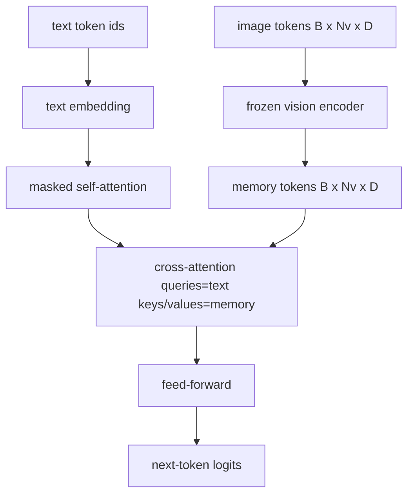
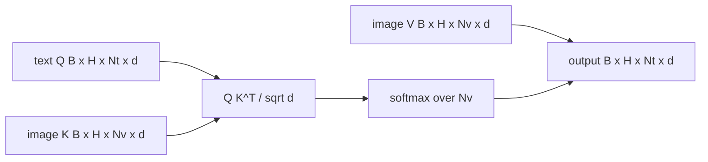

# 交叉注意力融合

> 投影层将一个图像向量与一个描述向量对齐。真正的视觉-语言解码器需要每个文本 token 都能注意到每个图像块 token，这样模型才能把每个词锚定到某个区域上。交叉注意力就是实现这种锚定的机制。文本发出查询（query）；视觉的键（key）和值（value）作出回应。本课将构建交叉注意力模块、带因果掩码的文本自注意力，以及保证二者合法性的掩码形状。

**Type:** Build
**Languages:** Python
**Prerequisites:** Phase 19 第 30-37 课（Track B 基础）
**Time:** ~90 分钟

## 学习目标

- 实现多头交叉注意力，其中查询流为文本，键/值流为视觉。
- 组合一个解码器块：因果自注意力 + 交叉注意力 + 前馈网络。
- 正确处理掩码形状：自注意力使用因果掩码，交叉注意力不使用掩码。
- 使用批量文本 token 和固定的图像 token 池运行一次前向传播。

## 问题

将图像 token 和文本 token 拼接成一个序列是一种融合选项（早期融合，即 Chameleon 和 Emu3 采用的路线）。交叉注意力是另一种（晚期融合，由 Flamingo 引入并被此后所有 Flamingo 风格的解码器沿用）。在晚期融合中，文本解码器仅在纯文本 token 上运行，并在每一层通过交叉注意力访问图像流。

晚期融合有两个优势。第一，文本流保持纯净，模型保留纯文本能力。第二，图像流对每张图像只计算一次，并在每个解码步骤中复用，因此即使生成长描述，代价也很低。其代价是每个块多出一个注意力子层。

## 概念





### 掩码形状

解码器块内的两种注意力需要不同的掩码：

| 注意力 | 查询长度 | 键长度 | 掩码 | 原因 |
|-----------|--------------|------------|------|-----|
| 自注意力 | `Nt`（文本） | `Nt`（文本） | 因果掩码：下三角 `(Nt, Nt)` | 自回归过程中文本 token 不得向前看 |
| 交叉注意力 | `Nt`（文本） | `Nv`（视觉） | 无掩码 | 整张图像对所有文本位置可见 |

本课包含一个形状校验函数，使混淆两者的错误以 `ValueError` 的形式暴露出来，而不是表现为悄然损坏的损失曲线。

### 为什么交叉注意力不用掩码

图像在生成任何文本之前已被完整观测。描述中的 token `t` 可以注意到图像的任意图像块；图像块之间不存在时间顺序。某些 Flamingo 变体在交错多张图像和多个文本段时会添加逐样本的掩码模式，但对于单张图像加一段描述，交叉注意力可以看到全部内容。

### 键/值缓存

图像的键和值在解码开始时计算一次并保存在缓存中。每个新的文本 token 直接使用缓存而无需重新计算。这正是描述生成在推理时快速的原因：繁重的 ViT 只运行一次；交叉注意力在每一步都复用其键和值。本课会暴露该缓存并测试缓存命中路径。

### 块的组合

一个解码器块的运行流程：pre-LN -> 自注意力 -> 残差 -> pre-LN -> 交叉注意力 -> 残差 -> pre-LN -> 前馈网络 -> 残差。三个子层，各有一个 LayerNorm。Flamingo 论文在交叉注意力上增加了一个可学习的门控，使模型可以选择不使用图像路径，代价是训练时的稳定性；本课采用的标准基线不使用门控。

```python
class DecoderBlock:
  def forward(self, text_tokens, image_tokens, text_mask, cross_mask):
      text_tokens = text_tokens + self.self_attn(self.ln1(text_tokens),
                                                 mask=text_mask)
      text_tokens = text_tokens + self.cross_attn(self.ln2(text_tokens),
                                                  image_tokens,
                                                  mask=cross_mask)
      text_tokens = text_tokens + self.ffn(self.ln3(text_tokens))
      return text_tokens
```

```figure
ch-crossattn-fan
```

## 动手构建

`code/main.py` 实现了：

- `CrossAttention(hidden, heads)`，多头交叉注意力，带有独立的 `q` 和 `kv` 投影。
- `CausalSelfAttention(hidden, heads)`，标准解码器中的带掩码自注意力。
- `DecoderBlock`，用 pre-LN 残差组合三个子层。
- `VisionLanguageDecoder`，四层解码器，由模拟视觉编码器输出和一个小的文本嵌入表驱动。
- `causal_mask(length)`，返回 `(length, length)` 的下三角布尔张量。
- 一个演示，输入一批长度为 10 的两条文本序列，图像记忆长度为 197，并打印输出形状、自注意力掩码形状，以及每个位置的交叉注意力输出范数。

运行它：

```bash
python3 code/main.py
```

输出：解码器产生一个 `(2, 10, text_vocab)` 的 logits 张量。掩码形状为 `(10, 10)`。KV-cache 复用检查确认缓存路径与未缓存路径的 logits 完全一致。

## 实际应用

交叉注意力出现在两大生产系统中：

- **Flamingo 和 IDEFICS。** 每隔 K 个语言模型块插入一个交叉注意力子层，语言模型保持冻结。视觉-语言适配器就是交叉注意力块加上它的门控。
- **BLIP-2。** Q-Former 使用来自一组固定的 32 个查询 token 的交叉注意力作用于图像特征，然后将这些查询投影到 LM 嵌入空间。

本课中该块的形状可直接映射到这两者。掩码纪律（自注意力用因果掩码，交叉注意力不用）也相同。

## 测试

`code/test_main.py` 涵盖：

- 因果掩码是下三角的，且匹配预期的布尔形状
- 无论键长度如何，交叉注意力输出形状均为 `(B, Nt, hidden)`
- KV-cache 路径与未缓存路径在浮点容差内一致
- 文本流与图像流之间的形状不匹配会抛出清晰的 `ValueError`
- 完整的解码器前向传播产生正确的批量和序列形状

运行它们：

```bash
python3 -m unittest code/test_main.py
```

## 练习

1. 为交叉注意力残差添加一个可学习的 tanh 门控（Flamingo 技巧），并验证训练能从接近零的初始门控收敛。门控从 0 开始；模型在混入图像流之前先恢复纯文本行为。

2. 实现交错注意力，让同一个解码器消费多张图像和多个文本段。构建逐样本的交叉注意力掩码，使文本段 2 无法注意到图像 1。

3. 在 `Nt=64, Nv=576`（更高分辨率下的 24x24 网格）下，对交叉注意力层与自注意力层进行性能分析。交叉注意力的开销为 `Nt * Nv`，并在高图像分辨率下占据主导。

4. 在交叉注意力图上添加查询侧 dropout，并在演示中测量描述的多样性（描述样本的方差随交叉注意力图中的 dropout 而增加）。

5. 将交叉注意力层替换为 Q-Former 风格的注意力块，其中固定的 32 个 token 查询池在每层对图像特征进行一次注意力计算。

## 关键术语

| 术语 | 含义 |
|------|---------------|
| 晚期融合 | 文本和视觉保留在各自的流中；交叉注意力在每个块中连接它们 |
| 交叉注意力 | Q 来自一个流，K 和 V 来自另一个流 |
| 因果掩码 | 下三角布尔掩码，防止自回归过程中向前看 |
| KV cache | 图像的键和值存储一次，并在每个解码步骤中复用 |
| 记忆 token | 解码器所访问的冻结图像 token |

## 延伸阅读

- Flamingo (2022)，带门控交叉注意力的经典晚期融合设计。
- BLIP-2 (2023)，Q-Former，一个伪装成可学习查询池的交叉注意力块。
- IDEFICS (2023)，Flamingo 配方的开源权重复现。