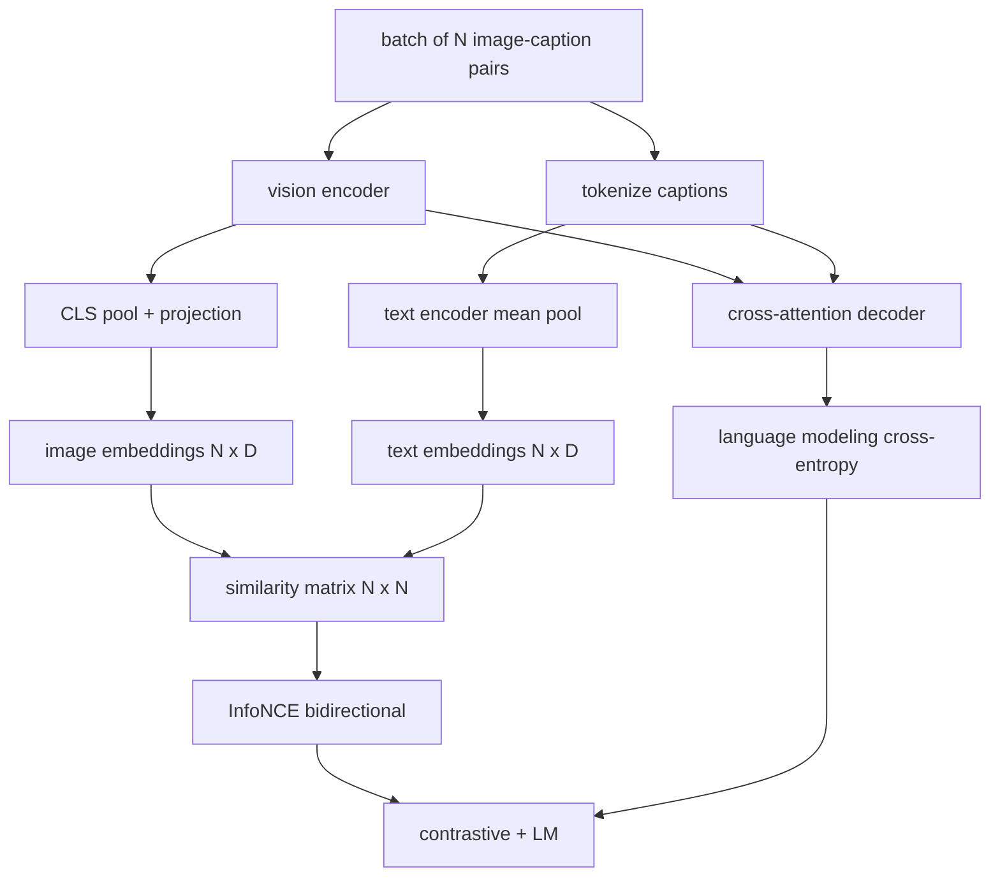

# 视觉-语言预训练

> 编码器、投影器和解码器已经连接完毕。现在将它们一起训练。两个目标驱动学习：一个对比图像-文本损失(InfoNCE),它在联合嵌入空间中将匹配的样本对拉近；一个语言建模损失，要求解码器为每张图像生成描述。两者结合，教会网络既能为一段描述找到正确的图像，也能为一张图像撰写描述。

**Type:** Build
**Languages:** Python
**Prerequisites:** 第 19 阶段第 30-37 课(Track B 基础)
**Time:** 约 90 分钟

## 学习目标

- 在一批图像-描述对上实现 InfoNCE 对比损失。
- 将对比损失与自回归语言建模损失组合。
- 合成一个 200 对的模拟图像-描述语料库，无需下载真实数据集。
- 运行 50 步的演示训练循环，观察两个损失同步下降。

## 问题

视觉-语言模型需要两种能力。它必须排序：给定一段描述，在众多图像中找到正确的那一张。它必须生成：给定一张图像，撰写一段描述。只针对一种能力进行预训练，得到的是半个系统。CLIP 在排序上表现出色，但无法生成描述。GPT-4V 能生成描述，但排序需要使用单独的检索头。多目标预训练可以一次训练同时获得两者。

InfoNCE 负责排序部分。对于一批 N 个样本对，模型将这 N 个匹配对视为正样本，将 `N^2 - N` 个不匹配对视为负样本，然后对由此得到的 `(N, N)` 相似度矩阵应用交叉熵损失。LM 损失负责生成部分：以图像为条件的标准下一词元预测。两个损失均可微，并且可以共享编码器、投影器和解码器的权重。

## 概念



### 一段话讲清 InfoNCE

将 N 个图像嵌入按行堆叠，N 个文本嵌入也按行堆叠。两者都做 L2 归一化。计算 `N x N` 矩阵 `S = I T^T / tau`,其中 `tau` 是可学习的温度参数。对角线元素是匹配对；非对角线元素是负样本。应用交叉熵，目标 `argmax` 沿对角线分布：第 `i` 行的最高值应出现在第 `i` 列。沿列方向对称地做同样的操作。总损失取两者的平均值。这就是八行代码实现的 CLIP 损失。

### 温度很重要

温度 `tau` 控制 softmax 的尖锐程度。太小(例如 `tau = 0.01`)时，梯度只来自最难的负样本，训练会不稳定。太大时，softmax 变平，梯度消失。CLIP 将 `tau` 作为参数学习；本课的演示也是如此。

### 语言建模损失

解码器通过交叉注意力消费图像记忆词元，并在每个位置预测下一个文本词元。损失是以下一位置为目标的标准交叉熵。填充位置在损失中被屏蔽。

### 组合损失

`total = contrastive + lm_weight * lm` 其中 `lm_weight` 是一个标量(通常为 1.0)。两个损失的梯度共同回传到编码器和投影器；只有解码器接收 LM 损失的梯度。这正是 CoCa、BLIP 和 SigLIP 风格模型都采用的多任务配方，只是权重各有不同。

| 组件 | 损失面 | 影响范围 |
|-----------|--------------|---------|
| InfoNCE | 联合空间中的样本对排序 | 编码器 + 投影器 + 文本头 |
| LM | 以图像为条件的词元预测 | 编码器 + 投影器 + 解码器 |
| 组合 | 多任务 | 整个堆栈 |

### 为什么 50 步足够用于演示

模拟语料库是一个合成的 200 对数据集，包含随机图像和随机的描述 id。在批大小为 16 的 50 步 SGD 之后，即使绝对值仍高于真实数据模型所能达到的水平，两个损失也会明显下降。演示的意义在于确认梯度通路端到端正常工作，并且添加 LM 损失不会破坏对比目标的稳定性。

```figure
ch-infonce-diagonal
```

## 动手实现

`code/main.py` 实现了：

- `MultimodalModel`,组合一个小型 ViT 编码器、MLP 投影器、一个微型文本侧编码器(对嵌入 id 取平均池化)，以及第 61 课的交叉注意力解码器。
- `info_nce_loss(image_emb, text_emb, temperature)`,双向的 CLIP 风格对比损失。
- `lm_loss(logits, target_ids, padding_id)`,带掩码的下一词元交叉熵。
- `make_mock_corpus(seed, n_pairs)`,返回 200 个确定性的(图像， caption_ids)对。
- 一个训练循环，运行 50 步，批大小为 16,使用 Adam 优化器和一个可学习的对数温度参数。每 5 步打印两个损失。

运行：

```bash
python3 code/main.py
```

输出：对比损失从约 `ln(16) = 2.77` 降至 2.4 左右；LM 损失从随机均匀基线 `ln(512) ≈ 6.24` 降至约 4.7。两者的下降都证明梯度连接正确。真实模型会训练数百万步；动态是一样的。

## 实际应用

这与以下系统所采用的损失配方相同：

- **CLIP(2021)。** 仅使用图像-文本对比损失，另有一个基于冻结编码器的描述探针。
- **CoCa(2022)。** 在一个模型中同时使用图像-文本对比损失和图像描述生成 LM 损失。这正是本课构建的模式。
- **BLIP(2022)和 BLIP-2。** 对比损失加上 LM 损失，再加上图像-文本匹配头。三个损失组合在一起。
- **SigLIP(2023)。** 用 sigmoid 成对损失替换 InfoNCE;角色相同，函数形式不同。
- **LLaVA 系列。** 两阶段训练：第一阶段是对齐(在冻结 LM 上用余弦损失)，第二阶段在解冻 LM 的情况下加入 LM 损失。第 60 课对应第一阶段；本课对应第二阶段。

## 测试

`code/test_main.py` 涵盖：

- InfoNCE 损失在图像/文本行方向上是对称的
- 当相似度矩阵是对角线上具有较大正数的完美对角矩阵时，InfoNCE 损失返回 0
- LM 损失能正确屏蔽填充位置
- 模型前向传播能无错误地产生两个损失
- 5 步训练循环能降低组合损失

运行测试：

```bash
python3 -m unittest code/test_main.py
```

## 练习

1. 用 SigLIP 风格的 sigmoid 成对损失替换 InfoNCE,并在模拟语料库上比较收敛情况。

2. 添加一个难负样本挖掘步骤：每隔一个批次，从上一个批次中选取最难的 非对角线样本对并追加。训练并检查对比损失是否下降更快。

3. 在联合嵌入之上添加一个图像-文本匹配二元头(对/错：这两个匹配吗？)作为第三个损失，复现 BLIP 的三头设置。

4. 用从马尔可夫链中采样的描述 id 序列替换模拟语料库，其转移矩阵以图像哈希为条件。描述生成损失应进一步下降，因为存在真正可学习的信号。

5. 分别用 `lm_weight = 0` 和 `lm_weight = 1` 训练同一模型。比较对比损失；LM 损失不应使排序目标退化。

## 关键术语

| 术语 | 含义 |
|------|---------------|
| InfoNCE | 噪声对比估计：在相似度矩阵上应用交叉熵 |
| 温度 | 控制对比 softmax 尖锐程度的标量 |
| 难负样本 | 模型容易混淆的非对角线样本对，对采样很有用 |
| LM 损失 | 描述生成侧的标准下一词元交叉熵 |
| 联合嵌入空间 | 投影后图像向量和文本向量共存的共享空间 |

## 延伸阅读

- CLIP 论文：原始对比配方的出处。
- CoCa 论文：在一个模型中结合对比损失和描述生成。
- SigLIP 论文：sigmoid 成对损失变体，以及它为何具有更好的扩展性。