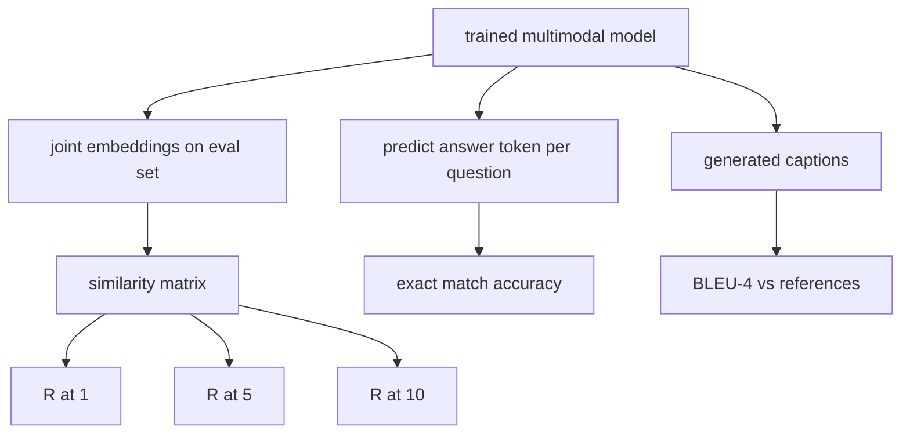

# 多模态评估

> 训练只是循环的一半，另一半是度量。本课从基础组件出发构建三个评估面：图像-文本检索(以 R@1、R@5、R@10 报告)、视觉问答(以精确匹配准确率报告)、图像描述生成(以 BLEU-4 报告)。每个指标都是作用于模型输出的一个函数,配套的合成评估套件可在几秒内运行完毕。

**Type:** Build
**Languages:** Python
**Prerequisites:** Phase 19 lessons 58-62 (Track E foundations: encoder, transformer, projection, cross-attention fusion, pretraining)
**Time:** ~90 minutes

## 学习目标

- 从图像与文本嵌入之间的相似度矩阵计算 Recall@K。
- 从一个将 (图像, 问题) 对映射到固定答案词表的模型计算精确匹配 VQA 准确率。
- 不借助任何外部库,从生成序列与参考序列计算 BLEU-4。
- 在第 62 课训练出的模型之上构建合成评估套件,并运行全部三项评估。

## 问题所在

人们往往在训练损失趋于平稳时就宣布多模态模型完成。训练损失衡量的是在训练分布上的拟合程度,它并不能衡量模型能否在保留批次中对配对排序、回答问题,或写出人类可接受的描述。有三个标准的评估面:

- **检索 (R@1, R@5, R@10)。** 为查询描述构建联合嵌入;按余弦相似度对评估池中的每张图像排序;报告匹配图像是否落在前 1、前 5、前 10 之内。对称形式(图像到文本)以相同方式运行。
- **视觉问答 (精确匹配)。** 给定 (图像, 问题),模型输出一个答案 token。精确匹配对每个样本只有一比特:预测答案是否等于参考答案?在评估集上取平均。
- **描述生成 (BLEU-4)。** 生成一条描述。针对参考描述计算 1-gram 到 4-gram 精确率的几何平均,并施加简短惩罚。多参考是标准形式(一张图像,多条参考描述)。

每个指标都是一个薄函数。本课用代码把它们全部构建出来,使数学具体化,并让评估面始终处于你的掌控之下。真实的基准套件(MS-COCO、VQA v2、GQA、OK-VQA)可以接入相同的函数形态。

## 概念



### 由相似度矩阵计算 Recall@K

构建图像嵌入与文本嵌入之间的 `(N, N)` 余弦相似度矩阵。对每一行,按相似度降序排列各列。Recall@K 是对角线列索引落在前 K 位之内的行的比例。对称的 Recall@K(文本到图像)在转置矩阵上计算。两个数值都要报告。对于一个 N=100 的评估,R@1 = 0.6 意味着 100 条描述中有 60 条将正确图像检索为首位匹配。

### VQA 精确匹配

对每个 (图像, 问题, 答案),编码图像、嵌入问题、通过 decoder 融合,并读出下一个 token。将预测的 token id 与参考 id 比较,相等即正确。在评估集上取平均。真实的 VQA 数据集每个问题附带多个人工标注的答案,并使用软准确率公式(10 位标注者中至少 3 位一致记 1.0,低于此按比例缩放);为清晰起见,本课使用单答案精确匹配。

### BLEU-4

```text
BLEU-4 = BP * exp(mean(log p1, log p2, log p3, log p4))
```

其中 `p_n` 是修正的 n-gram 精确率(生成 n-gram 中出现在任一参考中的截断计数,除以生成 n-gram 总数),`BP` 是简短惩罚:

```text
BP = 1                if generated length > reference length
   = exp(1 - r/g)     otherwise, where r is reference length and g is generated
```

当某些 `p_n` 为零时,小样本需要平滑处理。本实现采用 Chen 和 Cherry 的"方法 1"(对任何零计数,分子和分母各加 1),这是低计数情形下最安全的默认选择。

### 合成评估套件

在第 62 课使用的相同模拟语料模式基础上,用一个保留的随机种子在内存中构建一个 50 样本的评估套件。套件由三个列表组成:

- `pairs`:50 个 (image, caption_ids) 对,用于检索。
- `vqa`:50 个 (image, question_ids, answer_id) 三元组。
- `caps`:50 个 (image, [reference_caption_ids, ...]) 条目,每张图像最多 3 条参考。

该套件由种子确定且与训练语料不相交,因此指标是在模型从未见过的数据上计算的。将套件持久化为 JSON 留作练习(见下文)。

| 指标 | 范围 | 随机基线 (N=50) |
|--------|-------|------------------------|
| R@1 | 0 到 1 | 0.02 (1 / N) |
| R@5 | 0 到 1 | 0.10 |
| R@10 | 0 到 1 | 0.20 |
| VQA EM | 0 到 1 | 1 / vocab |
| BLEU-4 | 0 到 1 | 小但非零 |

对于在合成数据上的 50 步训练,指标预计不会很高;它们只需高于随机基线,这正是演示所检验的。

```figure
ch-recall-window
```

## 构建它

`code/main.py` 实现:

- `recall_at_k(sim_matrix, k)`,对两个方向返回 `[0, 1]` 中的浮点数。
- `vqa_exact_match(predictions, references)`,返回 `int` 相等性上的均值。
- `bleu4(generated, references, smoothing=True)`,支持多参考。
- `build_eval_suite(seed, n_samples, vocab_size, max_len)`,返回三个确定性的评估列表。
- `evaluate(model, suite)`,运行全部三个指标并返回一个由数值组成的 `dict`。
- 一个演示:加载第 62 课刚初始化的多模态模型,对其进行评估,然后训练 50 步并再次评估,打印前后指标。

运行它:

```bash
python3 code/main.py
```

输出:前后指标对照表显示检索从接近随机提升至模型学到的信号,VQA 提升到高于随机水平,BLEU-4 也有提升(合成数据的结构足以带来 4-gram 精确率的提升)。

## 使用它

每个指标都直接对应一个生产级基准:

- **检索。** MS-COCO 5K val、Flickr30K、ImageNet zero-shot 都是基于同一相似度矩阵的 R@K 问题。将合成评估替换为真实文件,函数签名不变。
- **VQA。** VQA v2、GQA、OK-VQA 使用相同的精确匹配形态(VQA v2 使用软准确率而非单答案 EM)。
- **BLEU-4。** MS-COCO captioning、NoCaps、Flickr30K captioning 都使用 BLEU-4 加上 CIDEr 和 METEOR。添加 CIDEr 只需再写一个函数。

对于真实基准,将 `build_eval_suite` 换成真实的数据加载器,保留函数体即可。数学与具体基准无关。

## 测试

`code/test_main.py` 覆盖:

- recall@k 在完美的单位相似度矩阵上返回 1.0,在翻转后的矩阵上对 k < N 返回 0.0
- recall@k 遵守 `k <= N` 上界
- bleu4 在生成结果与某条参考完全一致时返回 1.0
- bleu4 在词表完全不相交时返回 0.0
- vqa 精确匹配等于相等对的比例
- build_eval_suite 返回预期数量的对、vqa 条目和 caption 条目

运行它们:

```bash
python3 -m unittest code/test_main.py
```

## 练习

1. 为 captioning 指标添加 CIDEr。CIDEr 对 n-gram 使用 TF-IDF 加权,会奖励信息量大的 token。

2. 实现软准确率 VQA:每个问题对应多个人工答案,只要任一匹配则准确率为 `min(human_count / 3, 1)`。复现 VQA v2。

3. 为 `bleu4` 添加 NaN 安全变体,能处理空的生成序列而不崩溃。

4. 在 R@K 之外同时计算平均倒数排名 (MRR)。MRR 对正确项落在 top K 之外的具体位置敏感;R@K 只对它是否落在 top K 之内敏感。

5. 在训练过程中的五个检查点(step 0、10、20、30、40、50)对模型运行评估并绘制学习曲线。确认指标轨迹与损失轨迹一致。

## 关键术语

| 术语 | 含义 |
|------|---------------|
| R@K | 正确匹配落在前 K 个结果中的查询比例 |
| 精确匹配 | 最简单的 VQA 评分:预测答案等于参考答案 |
| BLEU-4 | 1- 到 4-gram 精确率的几何平均,带简短惩罚 |
| 多参考 | captioning 指标接受每张图像的多条参考描述 |
| 保留集 | 评估集从一个与训练语料不相交的种子采样 |

## 延伸阅读

- VQA v2 论文,了解软准确率公式与数据集统计。
- CIDEr 论文,了解 TF-IDF 加权的 n-gram captioning。
- BLEU 原始论文 (Papineni et al., 2002),了解平滑变体。
- MS-COCO captioning 评估脚本,是标准的参考实现。