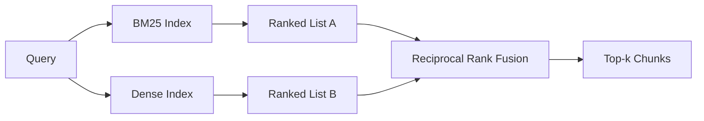

# BM25 与稠密向量的混合检索

> 词法检索和语义检索在相反的查询分布上失效。基于倒数排名融合的混合检索不是插值，而是投票——而且在每一类查询上，投票都胜出。

**Type:** Build
**Languages:** Python
**Prerequisites:** 第 11 阶段课程 04(embeddings)、06(RAG);第 19 阶段 Track B 基础(课程 20-29);第 19 阶段课程 64(chunking strategies)
**Time:** 约 90 分钟

## 学习目标
- 基于 Robertson 和 Sparck Jones 的公式从零实现 BM25,支持字段加权、文档长度归一化以及可调的 k1 和 b。
- 在确定性 mock embedding 之上构建稠密检索器，使整个流程可离线运行。
- 严格按照 Cormack、Clarke 和 Buettcher 于 2009 年发表的公式实现倒数排名融合(RRF),并解释为什么它优于按分数加权的插值。
- 调节 RRF 的 k 常数和各模态的权重，并在小型测试语料上读取其权衡关系。

## 问题所在

当查询携带语料库中逐字存在的字面标识符时，词法检索胜出。对 `AbortMultipartOnFail` 的查询可通过 BM25 在微秒内返回正确的 Go 函数。同一查询经嵌入后，会落在三个相似度簇的边界上，稠密检索器会把错误的文件排在第一位。

当查询被改写成远离语料库字面词的形式时，稠密检索胜出。询问"如何处理被取消的上传”的用户从未输入 abort 或 multipart 这样的词。BM25 返回的是关于“上传大文件”的文档块，因为那个页面包含 uploads 这个词。稠密检索则能找到摘要中提到取消的 abort 函数。

两者之间的选择不是静态的。查询分布才是变量。生产环境的 RAG 系统要从同一个端点同时处理两类查询，因此检索必须同时应对两者。这就是混合检索。合并步骤是必须做对的部分。

## 核心概念



### 一段话讲清 BM25

BM25 通过对查询词求和来给查询-文档对打分：每一项是逆文档频率因子乘以一个饱和的词频因子，后者包含长度归一化修正。两个旋钮。`k1` 控制词频饱和；默认值 1.5 是文献推荐值，没有基准测试不应改动。`b` 控制文档长度的影响程度；默认值 0.75 表示较长的文档会被惩罚，但不是线性惩罚。

IDF 公式采用平滑化的 Robertson 和 Sparck Jones 定义，即 `log((N - df + 0.5) / (df + 0.5) + 1)`。对数内的加一操作保证当一个词出现在超过一半的语料中时 IDF 仍为正。这在停用词技术上很罕见的小语料中很重要。

字段加权可以告诉 BM25,在符号名上的匹配比在正文中的匹配更重要。实现方式是在索引时对词数乘以一个系数，而不是在打分时处理。这样数学公式保持不变，也避免了为每个字段单独打分。

### 一段话讲清稠密检索

用 embedding 模型把每个 chunk 嵌入为固定维度的向量。查询时，嵌入查询，按相似度对所有 chunk 做余弦排序，返回 top-k。决定质量的是模型这个变量。检索算法本身只有两行：点积和排序。

本课使用确定性的基于哈希的 embedding,让你无需网络调用就能读懂融合数学。哈希把以 token 为键的偏移量累加到一个 96 维向量中并归一化。余弦排名在多次运行间是确定性的，这正是测试套件所要求的。

### 倒数排名融合：已发表的公式

两个排序列表。对出现在任一列表中的每个候选，累加其倒数排名贡献。2009 年的论文使用 `1 / (k + rank)`,默认 k 等于 60。按总分排序。这就是全部算法。

文献中 k = 60 的常数并非任意选取。当 k = 60 时，排名 1 的贡献是 1 / 61,排名 10 的贡献是 1 / 70。贡献衰减缓慢，因此靠后的候选仍然能投票。更小的 k 会让头部结果占主导。更大的 k 会把贡献曲线拉平。

我们的实现中有两个可调旋钮。`k` 常数。以及一对各模态的权重，当你有先验证据表明某一模态在你的语料上更好时，可以据此提升 BM25 或稠密检索。把排名贡献乘以权重是最简单且有原则的实现；它保持了排名衰减的形状，并且不依赖尺度。

### 为什么融合优于按分数加权的插值

BM25 分数无界且依赖语料。余弦相似度有界于 -1 到 1。线性组合 `alpha * bm25 + (1 - alpha) * cosine` 需要针对每个语料调节 alpha,而且每次重建索引都会失效。基于排名的融合不会。两个排名在不同模态间是可比的。自 2010 年以来，文献中的 RRF 基线在所有公开的 TREC 评测中都胜过分数插值。

这和你在 Vespa 与 Weaviate 文档中看到的 RankFusion 与 RRF 之争是同一个论点。他们得出了同样的结论：除非有非常强的证据支持插值分数，否则坚持基于排名的方法。

```figure
rrf-fusion
```

## 动手构建

`code/main.py` 实现了：

- `tokenize(text)` - 一个快速的正则分词器。
- `BM25Index` - 带字段加权，含 `add` 和 `search`,k1、b 可调。
- `mock_embed`、`DenseIndex` - 与课程 64 相同的确定性 embedding,保证 chunk 可比较。
- `rrf(rankings, k, weights)` - 文献中的融合方法，支持多模态权重。
- `HybridRetriever` - 结合 BM25 与稠密检索。
- 一个演示 `main()`,加载一个小型测试语料，运行三个分别针对各检索器强项与弱项的查询，并打印每个模态产生的排名以及融合后的列表。

运行：

```bash
python3 code/main.py
```

并排阅读演示输出。字面标识符查询位于 BM25 排名 1、稠密排名 4、RRF 排名 1。改写查询位于 BM25 排名 6、稠密排名 1、RRF 排名 1。模糊查询位于 BM25 排名 3、稠密排名 3、RRF 排名 1。融合不是平局裁决；它是在每一类查询上都胜出的系统。

## 调节旋钮

| 旋钮 | 默认值 | 何时调大 | 何时调小 |
|------|---------|----------------|------------------|
| BM25 k1 | 1.5 | 词在文档中重复出现，且你希望词频更重要 | 文档很短且词重复是噪声 |
| BM25 b | 0.75 | 长文档确实每词信息量更少 | 文档长度与主题不相关 |
| RRF k | 60 | 靠后的候选应继续投票 | 头部结果应占主导 |
| BM25 weight | 1.0 | 你的语料包含字面标识符且查询会匹配它们 | 你的查询是用户改写过的 |
| Dense weight | 1.0 | 查询被改写过 | 查询是字面的 |

通过在你的留出查询集上重新运行课程 68 的评测框架来调参，而不是凭直觉。

## 演示会掩盖的失败模式

**词表外 token。** BM25 的 IDF 从语料计算得出，因此只出现在查询中的词贡献为零。稠密 embedding 会为同一个词“幻觉”出一个向量。对语料外的标识符，稠密模态会返回看似合理但错误的近邻。融合可以吸收这一点，因为 BM25 返回空、其排名贡献自动消失，但前提是你要按文档而非按 chunk 去重。

**停用词主导。** 用 "the" 这个词查询 BM25 会得到对整个语料的均匀排名。在索引器中过滤停用词，或者接受高 IDF 词自然占据主导。

**模态间内容完全相同。** 如果语料足够小，使得 BM25 的 top-1 同时也是稠密检索的 top-1,RRF 会给出相同的 top-1 和相同的近邻。这是正确行为，不是失败，但会让融合看起来不存在。在评测中加入一对对抗性查询来验证融合确实在起作用。

## 如何使用

生产模式：

- 在进程内索引 BM25;瓶颈是词频词典，而不是向量。
- 将稠密向量索引到独立的存储(本课使用扁平列表；生产环境应使用 HNSW)。
- 并行运行两个查询；融合是对并集的常数时间合并。
- 持久化每条命中的模态，让下游重排序器能看到是哪个模态为它投了票。

## 上线衔接

课程 66 取本课融合后的 top-k 并用 cross-encoder 重排序。课程 68 用 precision、recall、MRR 和 nDCG 评估整个流水线。本课的混合检索器是课程 69 端到端系统的第一阶段。

## 练习

1. 把 `mock_embed` 替换为你所用服务商的真实模型。重新运行演示，报告稠密检索在改写查询上的排名变化。
2. 增加第三个模态：单独索引 chunk 摘要，并作为第三个排名列表参与融合。测量其增益。
3. 在 10、30、60、100、200 之间扫描 RRF 的 k。绘制课程 68 的 recall@k 曲线。报告曲线在你的语料上达到峰值时的 k 值。
4. 正确实现 BM25F(按字段的长度归一化，而非乘法技巧)，并在一个符号匹配最重要的语料上进行比较。

## 关键术语

| 术语 | 人们怎么说 | 实际含义 |
|------|-----------------|------------------------|
| BM25 | “词法检索” | 带有 idf x 饱和 tf x 长度归一化的概率排序 |
| RRF | “排名融合” | 对各排名列表求 1 / (k + rank) 之和；默认 k = 60 |
| k1 | "TF 饱和" | 控制重复词多快停止增加分数 |
| b | “长度惩罚" | 0 表示忽略文档长度，1 表示完全归一化 |
| Field weighting | “符号加权" | 索引时重复 token,以提升该字段的匹配 |
| Rank-based vs score-based fusion | “为什么 RRF 胜过线性融合" | 排名在各模态间可比；分数则不可比 |

## 延伸阅读

- Cormack, Clarke, Buettcher, "Reciprocal Rank Fusion outperforms Condorcet and individual rank learning methods", SIGIR 2009
- Robertson, Walker, Beaulieu, Gatford, Payne, "Okapi at TREC-3"(BM25 的原始论文)
- [Vespa: Hybrid Retrieval with BM25 and Embeddings](https://docs.vespa.ai/en/tutorials/hybrid-search.html)
- [Weaviate: Hybrid Search](https://weaviate.io/developers/weaviate/search/hybrid)
- 第 11 阶段课程 06 - RAG 基础
- 第 19 阶段课程 64 - 此处被索引的 chunker
- 第 19 阶段课程 66 - 消费融合后 top-k 的 cross-encoder 重排序器