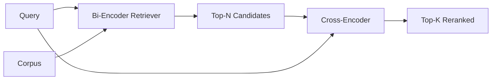

# Cross-Encoder 重排序器

> 双编码器(bi-encoder)分别独立地编码查询和文档。交叉编码器(cross-encoder)将它们拼接在一起并同时读取两者。交叉编码器是最聪明的阅读者,也是最慢的。把它作为双编码器 top-k 结果的第二阶段使用,它的开销是值得的。

**Type:** Build
**Languages:** Python
**Prerequisites:** Phase 11 lesson 06(RAG)、Phase 11 lesson 07(advanced RAG);Phase 19 Track B foundations(lessons 20-29);Phase 19 lesson 65(为本阶段提供输入的混合检索)
**Time:** 约 90 分钟

## 学习目标
- 从输入形状、参数量和单次查询成本上区分双编码器检索器与交叉编码器重排序器。
- 从零实现一个小型交叉编码器,作为一个 transformer 块,接收打包的 (query, document) 序列并输出一个相关性标量。
- 搭建一个两阶段"先检索后重排"流水线:用廉价的检索器取回 top-N,用交叉编码器把 N 个结果重排为 top-K,返回 K 个。
- 在一个小型测试语料上测量延迟与质量的权衡,并为给定的延迟预算选择合适的 N。

## 问题

双编码器把查询和文档映射到同一向量空间,并按余弦相似度排序。两个编码彼此从不见面。模型必须把文档中所有有用的信息压缩进单个向量,而对查询一无所知。这很快——索引时每个文档编码一次,查询时每个查询编码一次——而且这是在语料库规模上排序的唯一可行方式。

代价是精度。两篇整体主题相同的文档,即使其中一篇能回答查询而另一篇不能,它们的嵌入也可能几乎完全相同。双编码器无法区分它们。

交叉编码器通过把查询和文档放在一起阅读来解决这个问题。模型接收 `[query] [SEP] [document]` 作为单个序列,在拼接处运行完整的注意力机制,并输出一个相关性标量。文档的每个 token 都可以关注查询的每个 token。模型在完整上下文中决定分数。

代价是吞吐量。双编码器编码一次、无限次查询,而交叉编码器要对每个 (query, document) 对运行一次。对一个 1000 万文档的语料库来说,这意味着每次查询要进行 1000 万次前向传播。在请求预算内根本不可行。

解决方案是分阶段。用双编码器检索 top-N。用交叉编码器把 N 个结果重排为 top-K。N 很小(50 到 200),交叉编码器的质量提升集中在最关键的地方。总延迟保持在请求预算内。总质量就是交叉编码器的质量,上限受制于双编码器在 N 处的召回率。

## 概念



### 交叉编码器的输入形状

标准打包方式是 `[CLS] query_tokens [SEP] document_tokens [SEP]`。CLS 位置的输出被送入一个线性头,输出相关性标量。一些实现使用平均池化而非 CLS;差异很小。关键在于模型对每个对只输出一个数字。

一个 2200 万参数的交叉编码器(即已发布的 `ms-marco-MiniLM-L-6-v2` 权重级别)是典型的生产选择。更小的模型损失质量的速度快于节省延迟的速度。更大的模型(如 5.68 亿参数的 `bge-reranker-v2-m3`)则保留用于离线重排序,或用于 K 很小的首页重排序。

### 为什么本课训练一个微型模型

真实的交叉编码器是微调过的编码器 transformer。在生产环境中,你加载一个检查点并直接运行。本课的目标是让你看清模型的形状和延迟-质量曲线的形状,而不是训练一个最先进的排序器。所以我们构建一个小的 `nn.Module`,包含一个 transformer 块、多头注意力(默认 4 个头)和一个回归头。它由随机种子确定性地初始化,因此演示无需磁盘上的权重即可复现。

这个玩具模型从测试语料中学习到正确的模式:相关的查询-文档对的预测分数高于不相关的对。端到端流水线对双编码器的输出进行重排,且重排后的 top-k 与金标准标签相关。

### 延迟 vs 质量

两阶段流水线只有一个可调参数:N。在留出的查询集上将 N 从 5 扫描到 100,你就会得到曲线。

| N | 第 2 阶段的 Recall@1 | 每次查询的交叉编码器前向传播次数 | 延迟 |
|---|--------------------|---------------------------------------|---------|
| 5 | 0.62 | 5 | 低 |
| 20 | 0.81 | 20 | 中 |
| 50 | 0.86 | 50 | 高 |
| 100 | 0.86 | 100 | 极高 |

上面的数字是形状示意,并非本测试语料的实测值。但形状是真实的。在 20 到 50 个候选附近总有一个拐点,重排提升在此处饱和。过了拐点,你付出的代价毫无回报。

根据评测曲线加上延迟预算来选择 N。交叉编码器无法把召回率提升到双编码器在 N 处的召回率之上,所以过低的 N 限制的是质量,而不仅是延迟。

```figure
rerank-funnel
```

## 动手构建

`code/main.py` 实现了:

- `CrossEncoder` - 一个小的 `torch.nn.Module`:token 嵌入、一个带多头注意力和前馈网络的 transformer 块、输出单个标量的平均池化头。
- `tokenize_pair(query, document)` - 把两个字符串打包成带类型 id 的单个 id 序列以标记边界,确定性且仅用标准库。
- `train_tiny(pairs)` - 在人工标注的 (query, document, relevance) 三元组列表上进行一轮监督训练,使模型在测试语料上产生合理的分数。
- `rerank(query, candidates, top_k)` - 生产接口。
- `pipeline(query, retriever, top_n, top_k)` - 两阶段流程。
- 一个演示用 `main()`,按 lesson 65 的模式加载语料,检索 top-N,重排为 top-K,并排打印两个列表,并报告每个阶段的延迟。

运行它:

```bash
python3 code/main.py
```

输出显示双编码器的 top-N、交叉编码器的 top-K,以及一份计时摘要。交叉编码器每次调用耗时更长,但不会在整个语料库上运行。两阶段总延迟保持在请求预算内,同时选出了双编码器排名第二或第三的那个答案。

## 演示会掩盖的失败模式

**交叉编码器不是对称的。** `rerank(q, d)` 和 `rerank(d, q)` 的分数不同。永远先输入查询。如果不小心调换了顺序,召回率会崩塌。

**N 太低暴露不了 bug。** 如果你设 N = K,交叉编码器无法重新排序;它只能重新加权。提升看起来是零。N 至少取 K 的三倍。

**训练数据泄漏进评测。** 如果人工标注的训练对包含了评测查询,重排效果看起来会好得不真实。即使在测试语料上,也要严格分开训练集和评测集。

**生产权重大小可观。** 一个 2200 万参数的交叉编码器在 float32 下是 88MB。在承诺 100ms 以内的 p95 之前,先规划模型服务器的内存。

**批处理很重要。** 真实的交叉编码器把 N 个候选放在一个批次中运行。本课在 `_batch_encode` 中就是这么做的,它用 `torch.tensor(...)` 构建批量的 id 和类型 id 张量,并运行一次前向传播。不做批处理,延迟会乘以 N。

## 使用它

生产模式:

- 把双编码器、交叉编码器和 N 绑定在一起。改动其中任何一个都会使评测失效。
- 按 (query, document_id) 哈希缓存重排序器的输出。同一查询对稳定语料的重排结果是相同的;缓存命中带来免费的延迟削减。
- 记录排名第 1 的交叉编码器分数。如果某查询的 top-1 分数低于语料特定的阈值,这是一个域外命中;把"我不确定"这一信号呈现给 LLM。

## 发布它

Lesson 68 端到端地评测这个两阶段流水线。Lesson 69 把这个重排序器接到 lesson 65 的混合检索器之后、答案生成器之前。重排序器是端到端系统的第二阶段。

## 练习

1. 将 N 从 5 扫描到 50,并绘制重排输出的 recall@1。找到本测试语料上的拐点。
2. 把交叉编码器训练十个 epoch 而不是一个。测量每个 epoch 上正负对的分数间隔。
3. 用 CLS-token 头替换平均池化。比较两者在本测试语料上的收敛情况。
4. 添加第二个交叉编码器头,预测二值的"该答案是否在文档中"标签。推理时同时使用两个头:一个用于排序,一个用于阈值判定。
5. 把确定性的模拟双编码器替换为 lesson 65 的那一个,并串联两个阶段。测量 top-K 相对于仅用双编码器的变化。

## 关键术语

| 术语 | 人们怎么说 | 实际含义 |
|------|-----------------|------------------------|
| 双编码器(Bi-encoder) | "向量检索器" | 独立编码查询和文档;用余弦相似度排序 |
| 交叉编码器(Cross-encoder) | "重排序器" | 联合编码 (query, doc);输出一个相关性标量 |
| 两阶段流水线 | "先检索后重排" | 廉价检索器返回 N 个,昂贵重排序器保留 K 个 |
| N(候选预算) | "重排池" | 交叉编码器每次查询打分的候选数量 |
| 平均池化头 | "最后一层隐状态取平均" | 把编码器最后一层输出平均成一个向量 |

## 延伸阅读

- Nogueira, Cho, "Passage Re-ranking with BERT", 2019 - 交叉编码器排序器的经典论文
- Reimers, Gurevych, "Sentence-BERT: Sentence Embeddings using Siamese BERT-Networks", 2019 - 关于双编码器与交叉编码器的对比
- [SentenceTransformers Cross-Encoders documentation](https://www.sbert.net/examples/applications/cross-encoder/README.html)
- [BGE Reranker v2 model card](https://huggingface.co/BAAI/bge-reranker-v2-m3)
- Phase 19 lesson 65 - 为本重排阶段提供输入的混合检索器
- Phase 19 lesson 68 - 衡量本次重排所带来提升的评测