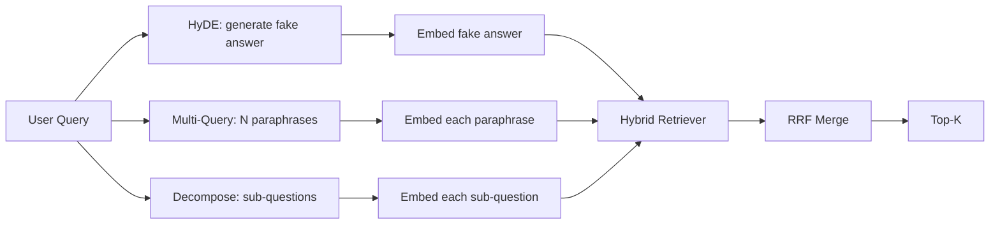

# 查询重写：HyDE、Multi-Query 与分解

> 用户输入的查询并不是你的检索器想要的查询。重写在检索之前弥合这一差距，让索引看到的东西更接近答案本来的样子。

**Type:** Build
**Languages:** Python
**Prerequisites:** Phase 11 lessons 04（embeddings）、06（RAG）；Phase 19 Track B 基础（lessons 20-29）；Phase 19 lessons 64 和 65
**Time:** 约 90 分钟

## 学习目标
- 实现 Hypothetical Document Embeddings（HyDE）：生成一个假答案，对其进行嵌入，用该向量而非查询向量进行检索。
- 实现 multi-query 扩展：将一个查询改写为 N 个同义改写，逐一检索，用倒数排名融合（RRF）合并并集。
- 实现查询分解：把一个复杂问题拆分为若干子问题，按子问题检索，再合并。
- 在同一 fixture 上正面比较这三种重写器，并解释每种策略何时占优。
- 接入一个 mock LLM，使其产生确定性的、贴合 fixture 的输出，从而让重写循环离线运行。

## 问题所在

用户输入“上传失败且预算耗尽时我们团队会怎么做？”。语料库中有一篇文档写着“AbortMultipartOnFail 会在 S3 multipart 上传进行中失败时中止上传，并在上传失败时扣减每个 bucket 的重试预算”。查询和文档之间没有共享任何名词短语。BM25 检索不到。bi-encoder 把这篇文档排在第三或第四，因为查询向量落在了嵌入空间中偏向“已取消任务”文档的区域，而不是“中止上传”文档的区域。第 66 课的两阶段 rerank 只有在文档进入 top-N 时才能挽救答案；如果它连 top-N 都没进，reranker 根本看不到它。

解决办法是在查询进入检索器之前先重写它。2023 年的论文"Precise Zero-Shot Dense Retrieval without Relevance Labels"（Gao et al.）提出了 HyDE：让 LLM 撰写一篇能回答该查询的文档，对这篇假设文档做嵌入，并把它的嵌入作为检索向量。假设文档之所以落在嵌入空间的正确区域，是因为它是以语料库的语气写成的；而查询向量不是。

与 HyDE 配套的有两种姊妹技术。Multi-query 扩展（微软 GraphRAG 使用的术语）生成查询的 N 个同义改写，逐一检索，然后合并。分解（在 2024 年 Stanford DSPy 工作中以"subquery decomposition"之名流行）把“上传失败且预算耗尽时我们团队会怎么做”拆成两个问题：“上传失败时会发生什么”和“重试预算耗尽时会发生什么”。两次检索，一个合并结果，答案的两部分都触手可及。

本课实现全部三种，并在同一个 fixture 语料库上运行。

## 概念



### HyDE 详解

HyDE 用 LLM 撰写的假设文档向量替换用户的查询向量。提示词很短：

```
You are a domain expert. Write a one-paragraph passage that answers the question
below. Use the same vocabulary and phrasing the documentation in this domain would
use. Do not refuse. Do not say you do not know.

Question: {user_query}

Passage:
```

作为事实答案，LLM 的回答是错的，因为 LLM 并不了解你的语料库。但这无所谓。检索器不关心事实正确性，只关心词元分布。假设段落中包含"abort""multipart""bucket""budget"这些词，因为这个主题的文档段落本来就会这么写。对这段文字做嵌入，向量就会落在真实段落附近。

在生产环境中，把假设文档限制在两三句话以内。过长的假设会积累噪声，过短则会丢失 HyDE 所依赖的词汇信号。

### Multi-query 扩展详解

为用户查询生成 N 个同义改写。最简单的提示词：

```
Rewrite the following question in {N} different ways. Each rewrite must preserve
the original intent. Number them 1 to {N}. Do not add explanations.
```

为每个改写检索 top-k。用 RRF（与第 65 课相同的算法）合并 N 个排序列表。廉价、可并行、确定性强。

当用户的措辞只是众多同样合理的问法之一，而任何一个改写都问得更好时，multi-query 占优。当所有改写同样糟糕——因为原始查询在本质上就差——它就失效。

### 分解详解

单次检索无法满足多维度的问题。分解让 LLM 把问题拆成子问题，系统再按子问题检索。提示词：

```
The following question may require information from multiple distinct topics.
Decompose it into a list of sub-questions. Each sub-question must be answerable
independently. If the question is already atomic, return it unchanged.

Question: {user_query}
```

按子问题检索，然后合并。分解适用于包含并列结构、多从句比较或两个不相关主题的问题。对原子性问题是错误的工具；此时分解器的任务就是返回原问题本身，而不是编造假子问题。

### 为什么三种都要有

三者互补。HyDE 弥合查询与语料库之间的词元差距。Multi-query 覆盖同义改写的差异。分解覆盖多主题查询。生产系统会同时运行三者并按查询选择策略（第 69 课的端到端系统展示了这个选择器）。

## Mock LLM

本课离线运行。mock LLM 是一张以用户查询为键的小型查找表，外加一个兜底逻辑。查找表包含：

- 每个 fixture 查询：一篇手写假设段落、三个同义改写和一个分解。
- 未知查询：一种确定性变换：提取查询的内容词，通过同义词表扩展，返回结果。

重要的是 mock 的形态，而不是数据本身。生产环境中用真实模型调用替换 mock，检索器不用改。

```figure
cd-hyde-vector
```

## 动手构建

`code/main.py` 实现了：

- `MockLLM` —— 上述的确定性替身。
- `HyDERewriter` —— 调用 LLM 撰写假设文档，以 `RewriteResult` 的形式返回重写器输出，包含假设文本和检索器应使用的查询。
- `MultiQueryRewriter` —— 调用 LLM 生成 N 个同义改写，返回查询列表。
- `DecomposeRewriter` —— 调用 LLM 做分解，返回子问题。
- `retrieve_with_rewriter` —— 接收一个重写器和一个检索器，执行重写并融合结果。
- 一个 demo：在 fixture 上运行三种重写器，打印哪种策略最先返回 gold answer 文档。

检索器形态沿用第 65 课（hybrid BM25 + dense）。融合同样是 RRF。唯一的新形态是重写器接口，它很小。

运行：

```bash
python3 code/main.py
```

输出是各策略的排名和最终总结。HyDE 在措辞不匹配的查询上胜出。Multi-query 在同义改写差异的查询上胜出。分解在多主题查询上胜出。兜底方案（不重写）至少在其中一个上失败。

## Demo 会掩盖的失败模式

**HyDE 把语料库特有的标识符幻觉写错。** 模型编造了一个函数名。假设文本在正确文档上的 BM25 分数崩塌，因为编造的名字成了索引中不存在的高权重词元。限制假设文本的长度，并在融合中降低 BM25 的权重。

**Multi-query 的所有改写趋同。** 弱模型产出三个几乎相同的改写。N 次检索返回同样的 top-k。RRF 合并不比单次检索好。在改写提示词中加入显式的多样性指令，并用 Jaccard 检测重复。

**分解过度拆分。** 分解器把原子性问题变成一个列表。各次检索都返回同一文档，但排名下降。合并结果比原始查询更差。在扇出之前加一道“这些子问题是否足够不同”的检查。

**延迟成倍增加。** HyDE 需要一次 LLM 调用。Multi-query 需要一次 LLM 调用生成 N 个改写，再进行 N 次检索。分解需要一次 LLM 调用做分解，再进行 M 次检索。检索可以并行，但 LLM 调用是延迟的下限。

## 使用它

生产模式：

- 按查询长度做策略选择：原子性短查询用 multi-query，复杂多从句查询用分解，术语密集的查询用 HyDE。
- 按查询哈希缓存重写器输出。很多查询会重复出现。
- 三者并行运行，用 RRF 把三组结果融合为一组。代价是三次 LLM 调用加一次融合；质量是三种策略覆盖面的并集。

## 上线

第 69 课把这个重写阶段接在第 65 课的检索器和第 66 课的 reranker 之前。第 68 课评估重写器给检索召回带来的提升。

## 练习

1. 实现 RAG-Fusion（multi-query 的 2024 年变体），让重写器的改写刻意多样化，然后由 rerank 步骤（第 66 课）选出最终列表。
2. 增加第四种策略：step-back prompting（让 LLM 给出更一般化的问题，先检索它，再收窄）。在 fixture 上进行比较。
3. 通过增加一个“问题是否原子性”的判断头来训练分解器识别原子性查询。测量拆分过度率的前后变化。
4. 用真实模型调用替换 mock LLM。在你的技术栈上测量每种策略的延迟。
5. 为每个改写增加置信度分数。丢弃低于阈值的改写。测量对召回的影响。

## 关键术语

| 术语 | 人们的说法 | 实际含义 |
|------|-----------------|------------------------|
| HyDE | “假文档检索” | LLM 撰写答案；对它做嵌入并检索，而非检索查询本身 |
| Multi-query | “同义改写扩展” | 查询的 N 个改写；检索 N 次，用 RRF 合并 |
| 分解 | “子查询拆分” | 多主题查询拆成子问题，分别检索 |
| 原子性查询 | “单一主题” | 不编造假子问题就无法分解 |
| Step-back | “抽象化查询” | 问更一般的问题，检索，再收窄 |

## 延伸阅读

- Gao, Ma, Lin, Callan, "Precise Zero-Shot Dense Retrieval without Relevance Labels"（HyDE），2023
- Microsoft Research, "Multi-Query Expansion for Retrieval"
- Stanford DSPy, "Subquery Decomposition for Multi-Hop QA"
- [LlamaIndex query transformations documentation](https://docs.llamaindex.ai/en/stable/optimizing/advanced_retrieval/query_transformations/)
- Phase 11 lesson 07 - 高级 RAG 模式
- Phase 19 lesson 65 - 本重写器所服务的检索器
- Phase 19 lesson 68 - 衡量重写器提升的评估