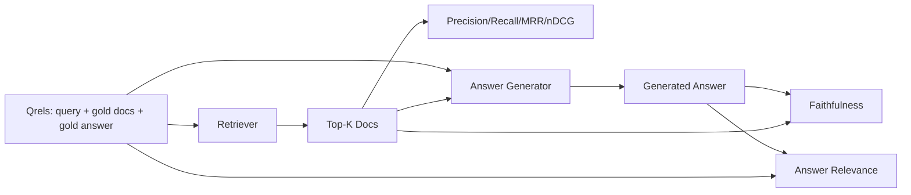

# RAG 评估：Precision、Recall、MRR、nDCG、忠实度、答案相关性

> 如果你不能同时评估检索和答案，你就无法上线这套系统。两者不是同一个指标，同一个 prompt 在不同的轴上会失效。

**类型：** 构建
**语言：** Python
**前置条件：** Phase 11 课程 06（RAG）、10（评估）；Phase 19 Track B 基础（课程 20-29）；Phase 19 课程 64、65、66、67
**时间：** 约 90 分钟

## 学习目标
- 基于 gold qrels 计算四个检索指标：precision@k、recall@k、MRR（平均倒数排名）和 nDCG@k。
- 计算两个答案级指标：忠实度（每一条声明都有检索到的上下文支撑）和答案相关性（答案是否回应了问题）。
- 构建一个 eval 可端到端读取的 fixture qrels 文件（查询、gold 文档 id、gold 答案文本）。
- 读懂指标数值，诊断流水线在哪个环节失效：检索、排序、生成，还是事实依据（grounding）。

## 问题

一个 RAG 系统至少有四个活动部件：chunker、retriever、reranker、generator。任何一个都可能是错误答案的根源。没有分阶段指标，你就是盲飞。

用户报告了一个错误答案。是因为 chunker 把答案片段切断了？是因为 retriever 没有把该 chunk 包含进 top-k？是因为 reranker 把正确的 chunk 推到了第一位之后？还是因为 generator 忽略了 chunk 并编造了内容？仅凭答案本身你无法判断。你需要：

- 检索指标来评估 retriever 输出的内容。
- 排序指标来评估正确的 chunk 在排序中的位置。
- 忠实度来评估 generator 是否停留在检索到的上下文之内。
- 答案相关性来评估答案是否至少回应了问题。

本课在一个 fixture qrels 文件之上构建全部六个指标。该 eval 是离线且确定性的；在生产环境中，你可以把模拟的 LLM-as-judge 换成真实的。

## 概念



### Precision@k

在 retriever 返回的 top-k 个文档中，有多大比例属于 gold 集合？如果 gold 有三个文档，而 top-3 返回了其中两个和一个错误的，则 precision@3 为 2 / 3。当检索到不相关 chunk 的代价很高时使用 precision（generator 会浪费 token 在它上面，或该 chunk 会污染答案）。

### Recall@k

在 gold 文档中，有多大比例出现在 top-k 中？如果 gold 有三个文档，而 top-5 包含全部三个，则 recall@5 为 1.0。当漏掉答案的代价很高时使用 recall（你宁可多看到一个错误的 chunk，也不愿完全错过答案 chunk）。

在生产 RAG 中，人们通常引用的指标是 recall@k。生成阶段可以很容易地丢弃不相关的 chunk；但它无法从从未见过的 chunk 中发明出答案。

### MRR（Mean Reciprocal Rank，平均倒数排名）

对每个查询，在排序列表中找到第一个相关文档的位置。倒数排名为 1 / 位置。在查询集上取平均。MRR 是衡量 retriever 把最佳答案放到顶部能力的一个单一数值摘要。

MRR 对第 1 位赋予很重的权重。gold 文档排在第 1 位的查询贡献 1.0。第 2 位贡献 0.5。第 10 位贡献 0.1。该指标由列表的顶部主导。

### nDCG@k

Normalized Discounted Cumulative Gain（归一化折损累计增益）。完整公式为每个检索到的文档分配一个增益（相关通常为 1，不相关为 0），按位置的对数进行折损，求和，再除以理想 DCG（如果排序完美你会得到的 DCG）。取值范围 0 到 1。

nDCG 支持分级相关性：gold 可以写 "doc A 是 3，doc B 是 2，doc C 是 1"。MRR 和 recall@k 把一切都压平为二值。当语料库中每个查询有多个部分相关的文档时，使用 nDCG。

### 忠实度

对于生成答案中的每一条声明，检查该声明是否被检索到的上下文支撑。标准实现使用一个 LLM-as-judge prompt，输入 (claim, context) 并返回是或否。该指标是通过的声明所占的比例。

忠实度捕捉 generator 的失败模式：模型编造内容。即使 retriever 返回了正确的 chunk，一个会幻觉的 generator 也是坏的。忠实度也被称为 groundedness、support、attribution。

本课使用一个确定性的模拟 judge 实现忠实度，它检查每条声明的 token 是否以某个阈值与检索到的上下文重叠。在生产环境中，你换成真实的模型调用。指标的结构是一样的。

### 答案相关性

答案是否真的回应了问题？忠实度问的是“答案是否扎根于上下文？”。答案相关性问的是“答案是否扎根于问题？”。一个忠实但跑题的答案在忠实度上得分高，在相关性上得分低。一个简短、切题但忽略上下文的答案在相关性上得分高，在忠实度上得分低。

标准实现同样使用 LLM-as-judge：输入 (question, answer)，询问答案是否回应了问题。本课实现了一个 token 重叠加 judge 的替代方案。

## Fixture qrels

```python
{
  "qid": "q1",
  "query": "what is the abort threshold for multipart uploads",
  "gold_doc_ids": ["d1", "d3"],
  "gold_answer_substring": "three failed parts",
  "graded_relevance": {"d1": 3, "d3": 2},
}
```

每个查询携带：
- 查询字符串，
- 一个 gold 文档 id 集合（用于 precision / recall / MRR），
- 一个分级相关性字典（用于 nDCG），
- gold 答案子串（作为每个 qrel 上的参考元数据保留；本课中的忠实度是通过把提取的声明与检索到的上下文进行评判来计算的，而不是与这个子串对比）。

在生产环境中，这些需要人工标注。本课附带一个手工构建的 fixture，使 eval 开箱即用。

```figure
ci-rag-metric-ladder
```

## 动手构建

`code/main.py` 实现了：

- `precision_at_k(retrieved, gold, k)` - 字面定义。
- `recall_at_k(retrieved, gold, k)` - 字面定义。
- `mean_reciprocal_rank(retrieved_list_of_lists, gold_list)` - 查询上的均值。
- `ndcg_at_k(retrieved, graded_relevance, k)` - 基于二值或分级增益的 DCG / IDCG。
- `extract_claims(answer)` - 把答案拆分成句子形态的声明。
- `faithfulness(claims, context_texts, judge)` - 被判定为有支撑的声明比例。
- `answer_relevance(question, answer, judge)` - 判断答案是否回应了问题。
- `MockJudge` - 确定性的 token 重叠 judge，使 eval 可离线运行。
- `evaluate_pipeline(pipeline_fn, qrels, ks)` - 运行所有指标的编排器。
- 一个演示，针对 qrels 运行三种流水线变体（chunker 基线、混合检索、混合 + 重排）并打印指标表。

运行它：

```bash
python3 code/main.py
```

输出在单一指标表中显示每个变体的 precision@k、recall@k、MRR、nDCG@k、忠实度和答案相关性。混合检索行在 recall 上胜过 chunker 基线；重排行在 MRR 上胜过混合检索。

## 读懂指标以诊断故障

| 症状 | 可能原因 | 修复什么 |
|---------|-------------|-------------|
| recall@k 低，precision@k 低 | Chunker 切断了答案或 retriever 找不到它 | Chunker 边界（课程 64）或 retriever 模态（课程 65） |
| recall@k 尚可，MRR 低 | 正确的 chunk 在 top-k 中但不在第 1 位 | Reranker（课程 66） |
| MRR 高，忠实度低 | 即便上下文正确，generator 仍编造内容 | 生成 prompt；强制引用或拒答 |
| 忠实度高，相关性低 | 答案有据可依但跑题 | 查询改写器（课程 67）或生成 prompt |
| 四项全高，用户仍然抱怨 | Eval 集不具代表性 | 用真实用户查询扩充 qrels |

## 演示会掩盖的失败模式

**LLM-as-judge 偏差。** 模型会把自己的输出评判得比实际更忠实。judge 使用的模型家族应与 generator 不同，或对样本进行人工评估。

**Qrels 腐化。** 随着语料库变化，gold 答案会漂移。2024 年 1 月对 q1 而言是 gold 的文档，到了 2024 年 10 月可能不再是正确答案，因为团队重命名了函数。安排季度性的 qrels 审查。

**忠实度微观检查会漏掉宏观声明。** 逐句的忠实度可能通过，但整个答案的结构具有误导性。在自动化指标之上增加样本级的定性审查。

**Recall@k 会掩盖单查询失败。** 90% 的平均 recall 可能掩盖某一类查询总是失败。按查询类别（字面、改述、多主题）切分 qrels，并报告每个切片的指标。

## 使用它

生产模式：

- 每次更改 retriever 或 generator 时运行 eval。把 recall@k 的回退当作测试失败来对待。
- 按查询持久化指标轨迹。当用户抱怨时，查找匹配的 qrels 条目，看看它是否本应被捕获。
- 对 qrels 分层：20 个查询的冒烟集在 CI 中运行；200 个的回归集每晚运行；2000 个的深度集每周运行。

## 上线它

课程 69 将组装整条流水线（chunker、retriever、reranker、generator），并对端到端系统运行本 eval。

## 练习

1. 增加第五个检索指标：hit-rate@k。将其与 recall@k 比较。解释它们何时不同。
2. 实现分级忠实度：0（无支撑）、1（部分支撑）、2（完全支撑）。相应地更新指标。
3. 把模拟 judge 换成真实的模型调用。在 fixture 上测量模拟 judge 与真实 judge 之间的分歧。
4. 增加查询类别切片（"literal"、"paraphrased"、"multi-topic"）。报告每个切片的指标。
5. 增加“答案长度”指标，并将其与忠实度做相关性分析。绘制曲线。

## 关键术语

| 术语 | 人们怎么说 | 实际含义 |
|------|-----------------|------------------------|
| Precision@k | "检索结果中的命中率" | top-k 中属于 gold 的比例 |
| Recall@k | "gold 中的命中率" | gold 出现在 top-k 中的比例 |
| MRR | "首个命中的位置" | 第一个相关文档的 1 / 排名的均值 |
| nDCG@k | "分级排序质量" | top-k 的 DCG 除以理想 DCG |
| 忠实度 | "Groundedness" | 答案声明被检索上下文支撑的比例 |
| 答案相关性 | "它回应了问题吗？" | 答案是否匹配问题的意图 |
| Qrels | "gold 标注" | 查询及其 gold 文档和答案的标注集合 |

## 延伸阅读

- Buckley, Voorhees, "Evaluating Evaluation Measure Stability", SIGIR 2000 - 排序指标的经典论文
- Jarvelin, Kekalainen, "Cumulated Gain-based Evaluation of IR Techniques" - nDCG 论文
- [Ragas: Automated Evaluation of RAG Pipelines](https://docs.ragas.io)
- [Anthropic, Evaluating RAG](https://www.anthropic.com/news/evaluating-rag)
- Phase 11 课程 10 - 评估框架基础
- Phase 19 课程 64-67 - 本课评估的组件
- Phase 19 课程 69 - 本 eval 所评估的端到端流水线