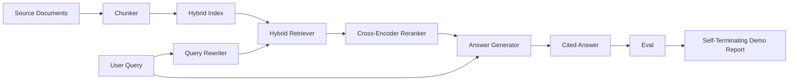

# 端到端 RAG 系统

> 六节课的组件。一条流水线。一个评估循环。一个自终止演示。这就是你要交付的系统。

**Type:** Build
**Languages:** Python
**Prerequisites:** Phase 11 lessons 06 (RAG), 10 (evaluation); Phase 19 Track B foundations (lessons 20-29); Phase 19 lessons 64, 65, 66, 67, 68
**Time:** ~90 minutes

## 学习目标
- 将分块器、混合检索器、查询改写器、交叉编码器重排器和答案生成器组合成单一的端到端流水线。
- 实现一个按分块锚点引用其论断的答案生成器，并带有低置信度时拒答的回退机制。
- 在组装好的流水线上运行 lesson 68 的评估，证明分阶段构建在每个指标上都优于相同组件各自独立运行的效果。
- 构建一个自终止的 CLI 演示，用于摄取固定语料库、运行固定的查询集，并以摘要报告零状态退出。

## 问题所在

六个组件各自独立运行证明不了什么。分块器可以在语料库上胜过召回率@5，但在系统层面却输掉召回率@5，因为检索器无法对分块器输出的内容进行排序。重排器可以在合成候选池上提升 MRR，却会在真实 bi-encoder 候选上失败，因为在重排预算内 bi-encoder 的召回率太低。查询改写器可以在单个查询上把黄金文档排上来，却在下一个查询上失效，因为 LLM mock 返回了一个退化的假设性查询。

集成测试是整条流水线在相同的固定 qrels 上使用相同指标端到端运行，由一个将所有内容连接在一起的编排文件完成。这就是本节课要构建的内容。如果集成流水线上的指标在每个阶段的独立演示之上胜出，你就证明了系统的价值。

## 概念



### 接线选择

流水线是一个小图。每个阶段都是一个具有清晰签名的函数。

| 阶段 | 输入 | 输出 |
|-------|-------|--------|
| 分块器 | 文档文本 | Chunk 记录列表 |
| 检索器 | 查询字符串 | Top-N Chunk 记录 |
| 改写器（可选） | 查询字符串 | 改写列表 + 假设查询 |
| 重排器 | 查询，候选 | 带交叉编码分数的 Top-K Chunk 记录 |
| 生成器 | 查询，Top-K Chunk 记录 | 带引用的答案字符串 |

当每个签名都稳定时，组合就非常直接。本节课的 `Pipeline` 类持有五个阶段和一个按顺序运行它们的 `query` 方法。每个阶段都可替换：传入不同的分块器、检索器、改写器、重排器或生成器，流水线依然可以运行。

### 带引用的答案生成器

生成器是最后一个阶段，也是最容易出问题的。本节课提供一个确定性的 mock 生成器，它：

1. 获取 Top-K 重排后的分块。
2. 选择最多两个文本与查询内容词重叠度最高的分块。
3. 输出一个答案，该答案是每个被选中分块中一句话的拼接，每句话后面跟一个 `[doc_id:chunk_index]` 锚点。
4. 如果没有分块的重叠度超过拒答阈值，则输出 "I do not know" 且不带引用。

在生产环境中，用真实的 LLM 调用替换 mock，使用如下提示模板：

```
You are answering a question using only the snippets below.
Cite every claim with the anchor in parentheses.
If the snippets do not answer the question, say "I do not know".

Question: {query}

Snippets:
{enumerated chunks with anchors}

Answer:
```

低置信度拒答路径正是交叉编码器 rank-1 分数被记录的全部原因。如果它低于语料库阈值，生成器就拒答。这是对抗幻觉答案的安全阀。

### 自终止演示

演示端到端运行所有内容。它打印单个查询的每阶段分解，在四个固定 qrels 上运行评估，打印指标表，并且当所有 lesson 68 指标达到演示中设定的阈值时以状态零退出。如果任何指标低于阈值，演示以非零状态退出，并给出指明失败指标的消息。

这就是 CI 冒烟测试的形态。流水线离线运行，快速且确定。阈值在固定数据上故意设得很紧，因此六节课中任何一节的回归都会导致演示失败。

```figure
rag-pipeline-flow
```

## 动手构建

`code/main.py` 实现了：

- `Chunk` - 贯穿所有阶段的记录（在 lesson 64 的结构上扩展了 chunk_index 和源 doc_id）。
- `Chunker` - 从 lesson 64 中选择一种策略（默认为递归分割）。
- `HybridIndex` - 打包 lesson 65 中的 BM25 + 稠密检索 + RRF。
- `Rewriter`（可选） - 根据查询长度和连词的存在，从 lesson 67 中选择 HyDE、multi-query 或 decomposition 之一。
- `Reranker` - lesson 66 中训练好的交叉编码器，使用更小的固定训练集以便在几秒内收敛。
- `Generator` - 带引用和低置信度拒答的确定性 mock 生成器。
- `Pipeline` - 用一个返回 `Result(answer, top_k, latency_ms_per_stage)` 的 `query(question)` 方法组合五个阶段。
- `run_demo()` - 摄取语料库，运行三个固定查询，运行评估，打印结果，并按阈值设置退出码。

运行它：

```bash
python3 code/main.py
```

输出是一条打印的查询轨迹、完整的评估表和最终的通过/失败状态。在固定数据上返回退出码 0。

## 演示会掩盖的失败模式

**分块器边界漂移。** 如果在评估 qrels 标注过程和演示之间更换了分块器策略，黄金文档 id 就不再对齐。把分块器策略锁定在 qrels 文件中。演示包含一个标明分块器的头部。

**重排器训练集泄漏进评估。** Lesson 66 中的 14 个训练三元组包含与评估查询相似的查询。在生产环境中，应严格隔离评估查询。演示中的评估查询刻意与重排训练集不相交。

**Mock 生成器掩盖幻觉风险。** mock 不会产生幻觉，因为它只输出来自检索分块的文本。本节课指出了这一点，并将生产环境的替换路径指向真实模型。

**无流式输出。** 流水线在每个阶段结束时返回完整答案。生产系统会流式输出生成器的内容。流式输出不在本课范围内；答案级指标无论如何都在最终字符串上计算。

**延迟为离线设定。** mock LLM 调用是常数时间。真实的 LLM 调用占主导。在请求范围内规划延迟预算；本节课的每阶段计时只测量 CPU 工作。

## 应用它

生产模式：

- 将流水线文件置于一个具有显式阶段接口的编排器之下。避免把接线代码散落在仓库各处。
- 在每次涉及某个阶段的合并之前运行评估。如果评估下降，合并就不落地。
- 为每次 CI 运行持久化指标轨迹，以便将回归归因于某个阶段的更换。
- 添加一个 20 个查询的冒烟集（回归集的子集），要求在 30 秒内运行完；完整回归集每晚运行。

## 交付它

本节课中的流水线文件是 Phase 19 的 Track F 后续课程所假定的形态。后续课程将在其上添加摄取自动化、增量重索引、遥测和服务层。检索、重排、改写和评估这两半在这里已经完成。

## 练习

1. 在改写器内部添加每查询策略选择器：使用 lesson 67 的启发式规则（长度、连词、术语比例）来选择 HyDE、multi-query 或 decomposition。
2. 在环境变量标志之后为生成器添加真实的 LLM 调用。默认使用 mock。测量延迟差。
3. 扩展演示，使其接受一个加载真实语料库的 `--corpus path` 标志。重新运行评估和阈值检查。
4. 为分块器添加一个 `--strategy` 标志。测量每种策略对端到端召回的贡献。
5. 添加一个流式生成器接口并将其接入评估。确认 faithfulness 是在最终字符串上计算的，而不是在流式前缀上。

## 关键术语

| 术语 | 人们的说法 | 实际含义 |
|------|-----------------|------------------------|
| Pipeline | "RAG pipeline" | 从摄取到带引用答案的组合阶段 |
| Citation anchor | "来源链接" | 附加到每个论断的 (doc_id, chunk_index) 引用 |
| Refuse-on-low-confidence | "I do not know" | 当重排器 top-1 分数低于阈值时生成器不返回答案 |
| Smoke set | "CI eval" | 在每次 PR 检查中运行的最小 qrels 子集 |
| Stage interface | "函数签名" | 流水线每个阶段稳定的输入和输出类型 |

## 延伸阅读

- [Anthropic, Building search and retrieval](https://www.anthropic.com/news/contextual-retrieval)
- [Pinterest, MCP internal search](https://medium.com/pinterest-engineering) - 参考生产架构
- [Ragas: Automated Evaluation of RAG Pipelines](https://docs.ragas.io)
- Phase 11 lesson 06 - RAG 基础
- Phase 19 lessons 64-68 - 此处组合的各组件