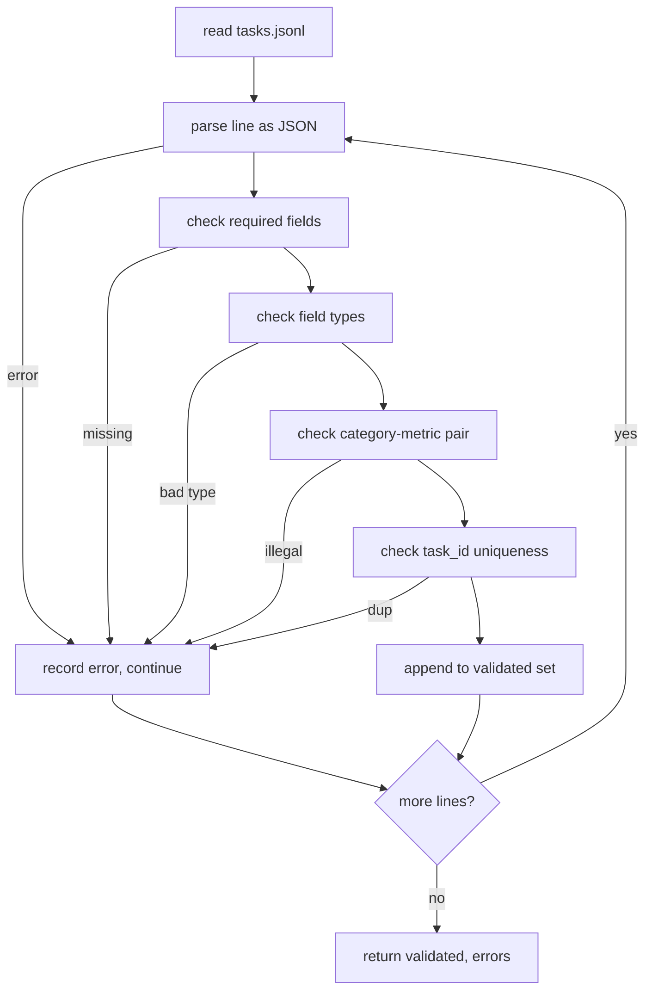

# 任务规范格式

> 评测框架的价值取决于其任务所遵守的契约。在编写任何评分函数之前，先冻结 JSONL 格式与指标词汇表。

**Type:** 构建
**Languages:** Python
**Prerequisites:** 第 19 阶段 Track B 基础
**Time:** 约 90 分钟

## 学习目标

- 定义一个 JSONL 任务记录模式，用同一种格式覆盖算术、多选题、代码执行、分类和自由文本摘要。
- 固定一个封闭的指标名称词汇表，使后续课程（71-73 课）能够基于单一字段进行分发。
- 将 few-shot 示例和后处理规则规定为任务的一部分，而非运行器的一部分，从而确保相同的提示词在各模型间产生相同的目标。
- 实现一个严格的校验器，在格式错误的记录到达运行器之前将其拒绝。
- 交付一套 10 个任务的固定测试集，覆盖规范中的每一个分支，让校验器有真实的内容可以检验。

```figure
ci-task-spec-gate
```

## 为什么要冻结规范

研究型代码库积累评测脚本的速度会快于积累测试的速度。六个月后，每个 notebook 都有自己的 JSON 格式，每个指标都被重复实现了两次，任何结果都无法跨运行比较。解决办法很朴素：选定一个模式，编写一个校验器，拒绝其他一切。这就是本课程所做的事情。

这个格式借鉴了 BIG-bench、HELM 以及 lm-eval 风格框架的思路，但字段名是我们自己定的。每个字段只有唯一一个所有者：运行器读取任务，指标读取目标，后处理步骤规范化生成结果。任何字段在流水线中途都不可变。

## 记录格式

一个任务是单行上的一个 JSON 对象。框架读取 `tasks.jsonl` 并独立校验每一行。坏行只会中止该条记录，而不是整个运行。

```json
{
  "task_id": "arith_001",
  "category": "arithmetic",
  "prompt": "Compute the result. Question: 17 + 24\nAnswer:",
  "targets": ["41"],
  "metric_name": "exact_match",
  "few_shot_examples": [
    {"prompt": "Question: 2 + 2\nAnswer:", "completion": "4"}
  ],
  "post_process": "strip_whitespace",
  "metadata": {"difficulty": "easy"}
}
```

必填字段为 `task_id`、`category`、`prompt`、`targets`、`metric_name`、`post_process`。`few_shot_examples` 和 `metadata` 是可选的。未知的顶层字段会导致校验失败。

## 字段规则

`task_id` 是不含空白字符的字符串。校验器在整个文件范围内强制其唯一性。

`category` 必须是 `arithmetic`、`mcq`、`code_exec`、`classification`、`summary` 之一。类别决定了哪一对指标和后处理规则是合法的。`code_exec` 任务必须使用 `metric_name = code_exec`，而 `mcq` 任务必须使用 `metric_name = exact_match`，并与单字符目标进行比较。

`targets` 是非空字符串。校验器禁止尾部空白字符，并拒绝提示词正文中已包含 few-shot 块的记录。few-shot 的渲染发生在运行器中，而非作者端。

`targets` 是非空的字符串列表。对于 `exact_match`，任何匹配的元素都算命中。对于 `f1` 和 `rouge_l`，得分最高的目标胜出。对于 `mcq`，该列表必须恰好包含一个元素。

`metric_name` 必须是 `exact_match`、`f1`、`bleu_4`、`rouge_l`、`accuracy`、`code_exec` 之一。词汇表是封闭的。新增指标需要新增一节课程，并在此处新增一个条目。

`few_shot_examples` 是 `{prompt, completion}` 对的列表。校验器将该列表限制为最多八项，以保持提示词长度有界。

`post_process` 必须是 `none`、`strip_whitespace`、`lower`、`extract_letter`、`extract_code_block`、`extract_first_line` 之一。每条规则只有一种确定性行为。校验器禁止组合使用规则。

## 校验器行为



校验器返回两个列表：通过校验的记录，以及包含出错行、被违反的规则和问题字段的错误记录。若错误列表非空，运行器将拒绝启动，除非显式设置了 `--allow-bad-tasks` 标志。

## Few-shot 渲染

运行器将 few-shot 示例用空行分隔，拼接在提示词前面。同一代码路径对所有模型通用，因此唯一的差异来源就是模型本身。作者只需编写一次示例，而不是每个提供商写一次。

```python
def render(task):
    parts = []
    for ex in task.get("few_shot_examples", []):
        parts.append(ex["prompt"] + " " + ex["completion"])
    parts.append(task["prompt"])
    return "\n\n".join(parts)
```

## 后处理规则

后处理步骤在生成之后、指标计算之前运行。它是确定性且无状态的。

- `none` 原样返回字符串。
- `strip_whitespace` 去除字符串首尾的空白字符。
- `lower` 将字符串转为小写。
- `extract_letter` 返回第一个匹配 `[A-E]` 的字符，用于多选题。
- `extract_code_block` 返回第一个三反引号围栏块的内容，用于代码执行。
- `extract_first_line` 返回第一个非空行，用于摘要分类。

需要此列表之外规则的任务应放到新课程中。

## 本课程不做什么

它不评分，不调用模型，也不运行代码。这些分别在第 71、72 和 75 课中实现。本课程冻结的是它们都将遵守的契约。

这 10 个任务的固定测试集包含两个算术任务、两个多选题任务、两个代码执行任务、两个分类任务和两个摘要任务。校验器对全部 10 个任务均通过。另有一个单独的固定测试集（`tasks_bad.jsonl`）会触发每一条规则，校验器恰好返回对应数量的错误。

## 如何阅读代码

`main.py` 定义了 `TaskSpec`、`validate_task`、`validate_file` 以及一个 CLI 入口。固定测试集加载器是 `load_fixtures`。渲染和后处理辅助函数与校验逻辑放在一起，这样第 75 课的运行器只需导入单个模块。

先从头到尾阅读 `main.py`，然后阅读 `code/tests/test_spec.py`。测试固定了每一条校验规则和每一种后处理行为。`main.py` 底部的演示会对随附的固定测试集进行校验并打印摘要。

## 延伸

真实评测套件的增长方式，就像模式不断增长列一样，类别会不断增加。稳妥的做法是：拒绝在不新增指标、后处理规则和至少一个固定测试任务的情况下新增类别。把规范当作数据库迁移来对待——每次变更都要经过评审、版本化并附带测试。本课程的校验器就是这道关卡。