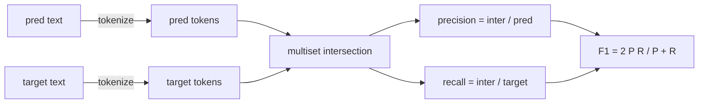
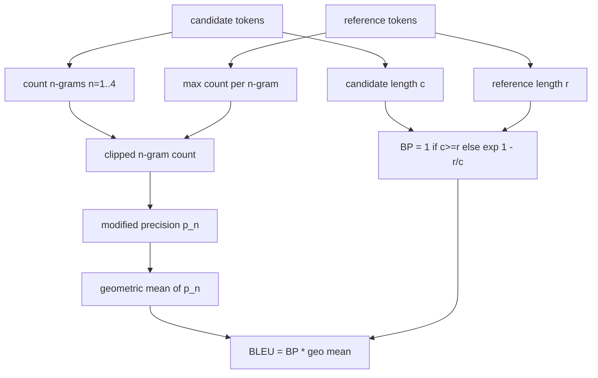

# 经典指标

> BLEU、ROUGE-L、F1、exact-match、accuracy。这五个指标仍然占已发表 LLM 评测数字中的大多数。从第一性原理实现每一个，这样你才能知道这些数字的含义。

**Type:** Build
**Languages:** Python
**Prerequisites:** Phase 19 Track B 基础，lesson 70
**Time:** ~90 min

## 学习目标

- 使用明确的分词规则实现 token 级别的 exact-match、F1 和 accuracy。
- 从零实现 BLEU-4：修正的 n-gram 精确率、对 n 等于 1 到 4 取几何平均、简短惩罚。
- 使用最长公共子序列实现 ROUGE-L，并以 F-beta 组合精确率与召回率。
- 基于 lesson 70 的 metric_name 字段进行分发，使 runner 保持与具体指标无关。
- 用来自手算示例的参考向量固定行为，而不是依赖第三方库。

```figure
cd-bleu-overlap
```

## 为什么要重新实现

你会读到一篇论文报告 BLEU 28.3，另一篇报告 BLEU 0.283。你会发现 ROUGE-L 分数在两个库之间相差十分，因为一个会转小写截断而另一个不会。摆脱困惑最快的方法是自己写这些指标，然后指出决定 tokenizer 的那行代码和应用平滑的那行代码。之后，比较论文间的数字就变成了读指标设置，而不是争论库的问题。

标准库加 numpy 就够了。BLEU 是计数加一个 clamp。ROUGE-L 是动态规划。F1 是 token 的集合交集。最难的部分是选定一个 tokenizer 并坚持使用它。

## 分词

Tokenizer 是 `re.findall(r"\w+", text.lower())`。转小写、按字母数字连续段切分、丢弃标点。本课中的每个指标都使用这个完全相同的 tokenizer。Runner 无权选择。如果你换 tokenizer,你就是在跑另一个基准。

```python
TOKEN_RE = re.compile(r"\w+", re.UNICODE)
def tokenize(text):
    return TOKEN_RE.findall(text.lower())
```

这是一个有意为之的简化。生产环境会关心 CJK、缩写和代码标识符。本课的重点在于：tokenizer 是一份契约，而不是一个可调的旋钮。

## Exact match

```python
def exact_match(pred, targets):
    return float(any(pred.strip() == t.strip() for t in targets))
```

它对每个任务返回 1.0 或 0.0。在数据集上的聚合就是均值。这是算术、选择题和短分类任务的主力指标。

## Token 级 F1

为预测和目标建立 token 多重集。精确率是多重集交集除以预测的多重集。召回率是同一交集除以目标的多重集。F1 是调和平均。实现处理了空预测和空目标的边界情况。



对于多目标任务，我们取目标列表中的最佳 F1。这与文献中广泛报告的 SQuAD 风格行为一致。

## BLEU-4

BLEU 是经典的机器翻译指标，至今仍出现在摘要工作中。我们采用的公式是语料库级 BLEU-4,使用标准简短惩罚，并对修正 n-gram 计数做加一平滑，这样单个缺失的 4-gram 不会把分数压到零。

对每个候选-参考对，我们对 n 等于 1、2、3、4 计算修正 n-gram 精确率。修正精确率将候选的 n-gram 计数截断为该 n-gram 在任一参考中的最大计数，因此候选无法通过重复同一短语来抬分。四个精确率的几何平均再由简短惩罚包裹。



平滑规则是 Lin 和 Och 所称的方法 1:在取对数之前，给每个 n-gram 精确率的分子和分母各加一。当参考没有匹配的 4-gram 时，这避免了 `log 0`,并且在长候选上与未平滑的值保持接近。

## ROUGE-L

ROUGE-L 比较候选与参考 token 序列的最长公共子序列。LCS 在不要求连续的情况下捕捉词序，这也是它成为默认摘要指标的原因。我们用标准的动态规划表计算 LCS 长度，然后推导召回率为 `lcs / reference length`、精确率为 `lcs / candidate length`,并用 F-beta 组合，其中 beta 等于一即为对称的 F1 形式。

```python
def lcs_length(a, b):
    n, m = len(a), len(b)
    dp = numpy.zeros((n + 1, m + 1), dtype=int)
    for i in range(n):
        for j in range(m):
            if a[i] == b[j]:
                dp[i+1, j+1] = dp[i, j] + 1
            else:
                dp[i+1, j+1] = max(dp[i+1, j], dp[i, j+1])
    return int(dp[n, m])
```

numpy 表使实现清晰易读；纯 Python 列表也可以。选择使用 ROUGE-L 的任务为每个任务支付 O(n m) 的代价。对于典型的摘要长度，这低于一毫秒。

## Accuracy

对于多目标分类任务，accuracy 退化为与单个归一化目标的 exact-match。我们将其暴露为独立函数，这样分发器可以基于 `metric_name` 分发，而无需在 runner 内部做字符串比较。

## 分发契约

唯一入口是 `score(metric_name, prediction, targets)`。它返回一个 `[0, 1]` 中的浮点数。Runner 不根据指标名称分支。它把调用交出去并写入结果。这就是 lesson 75 将要接到 lesson 70 任务规范上的接口。

```python
def score(metric_name, pred, targets):
    if metric_name == "exact_match":
        return exact_match(pred, targets)
    if metric_name == "f1":
        return max(f1_score(pred, t) for t in targets)
    if metric_name == "bleu_4":
        return max(bleu4(pred, t) for t in targets)
    if metric_name == "rouge_l":
        return max(rouge_l(pred, t) for t in targets)
    if metric_name == "accuracy":
        return accuracy(pred, targets)
    raise ValueError(f"unknown metric_name: {metric_name}")
```

`code_exec` 将在 lesson 72 处理，并在那里接入分发器。

## 本课不做什么

它不调用模型。除了 lesson 70 的后处理规则已经做的之外，它不做更多生成结果的归一化。它不计算置信区间。它不做 BLEURT 或 BERTScore(这些需要模型，放在另一课)。重点是基线：五个指标、一个 tokenizer、一张分发表。

## 如何阅读代码

`main.py` 将每个指标定义为独立函数加上分发器。参考向量位于文件底部的 `_reference_examples` 块中。演示对八个示例运行分发器并打印各指标的分数。`code/tests/test_metrics.py` 中的测试固定参考向量并对每个边界情况施加压力(空预测、空参考、无共同 token、完全匹配、重复短语截断)。

从头到尾通读 `main.py`。函数按复杂度排序。exact_match 和 accuracy 各一行。F1 六行。BLEU 和 ROUGE-L 是重头部分，并对平滑规则和 LCS 递推式附有详细注释。

## 延伸阅读

经典指标是必要的，但不充分。它们奖励表层重叠而忽略含义。解决办法是在你信任经典基线之后，在其上叠加基于模型的指标(BLEURT、BERTScore、GEval)。那是后面的一课。现在：让这五个跑通，用测试固定它们，你就拥有了一套可审计、快速且可复现的指标栈。