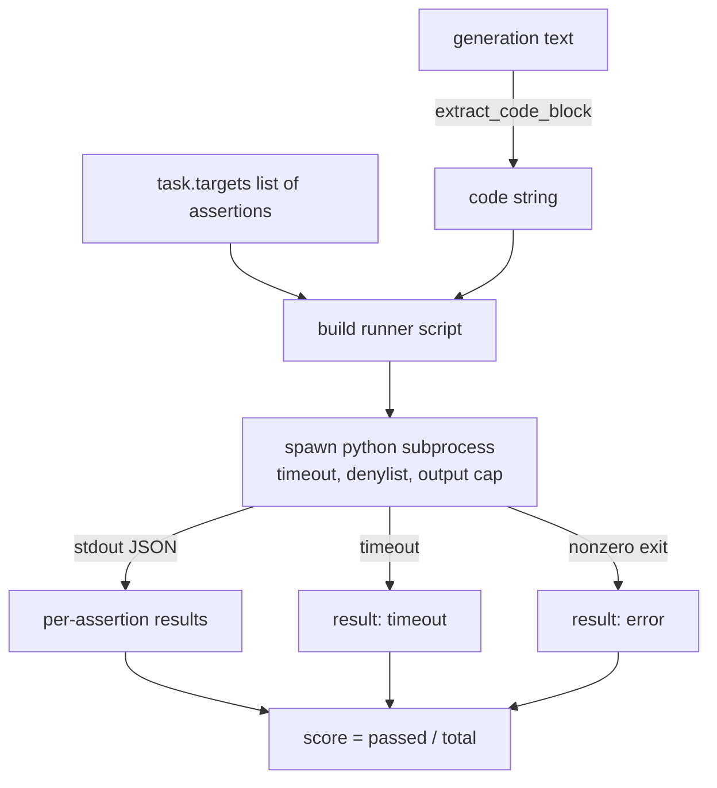
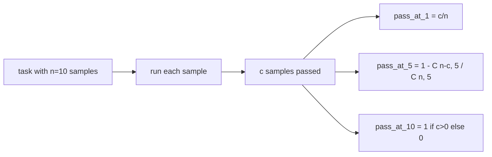

# 代码执行评测指标

> 生成的代码只有通过测试才算正确。评测框架需要提取代码、在不搞垮宿主机的前提下运行它，并诚实地统计通过率。本课构建的就是这一能力。

**Type:** Build
**Languages:** Python
**Prerequisites:** Phase 19 Track B 基础，第 70 和 71 课
**Time:** ~90 分钟

## 学习目标

- 从自由格式的生成结果中提取代码块，方式与第 70 课的后处理规则保持一致。
- 在隔离的子进程中执行候选代码，并施加挂钟超时、输出上限和导入黑名单。
- 以候选代码通过提供的断言字符串的比例作为任务得分。
- 对从同一模型采样多个生成结果的任务计算 pass-at-k。
- 将沙箱崩溃、语法错误和超时视为一等失败模式，并赋予运行器可记录的不同退出码。

```figure
sandbox-runner
```

## 为什么需要隔离的子进程

内联执行 `exec` 是安全与稳定性上的隐患。一段生成的 `while True: pass` 会让评测永远阻塞；一段生成的 `import shutil; shutil.rmtree('/')` 的后果正如其字面所示般灾难性。解决办法是为每个候选代码启动一个全新的 Python 解释器，把代码通过 stdin 传入，把断言结果写到 stdout,并在超时时杀掉进程。宿主评测进程保持运行。

HumanEval、MBPP、BigCodeBench 和 LiveCodeBench 等真实评测都使用子进程沙箱，其中一些再叠加 Docker。我们止步于子进程是有原因的：它可移植、只用标准库，并且能捕获对教学评测至关重要的失败模式。生产部署会再加上 seccomp、网络隔离和只读文件系统，关于加固的下一课不在这条轨道内。

## 代码执行任务的结构

一个 `code_exec` 任务在 `targets` 中携带断言字符串。运行器从生成结果中提取围栏代码块，围绕它构建测试套件，然后运行。



得分是 `[0, 1]` 中的一个分数。一个有三个断言、其中两个通过的任务得分为 0.667。无论失败原因是什么，运行器都返回相同的结构：子进程崩溃被映射为规范化的错误码，而不是让 Python 回溯冒泡到测试套件。

## 黑名单

黑名单基于导入实现。在运行候选代码之前，运行器脚本把对危险模块的导入改写为一个会抛出 `ImportError("denied")` 的桩模块。这份列表刻意保守：`os.system`、`subprocess`、`socket`、`requests`、`urllib`、`urllib.request`、`urllib.error`、`urllib.parse`、`ctypes`、`shutil`、`http.client`、`asyncio.subprocess`。

我们并不假装这是万无一失的。蓄意的对抗性代码可以逃出 Python 中任何进程内沙箱。黑名单只是最后一道防线；挂钟超时和输出上限才是真正承重的控制手段。

```python
DENIED = {
    "os.system": True,
    "subprocess": True,
    "socket": True,
    "shutil": True,
    "requests": True,
    "urllib": True,
    "ctypes": True,
}
```

我们通过在候选代码前插入 `import sys`,以及一个将 `os.system` monkey-patch 为直接抛异常的守卫，来包装候选代码。完整模板位于 `main.py`。

## 挂钟超时

每个子进程默认有三秒的挂钟时间预算。运行器使用 `subprocess.run(..., timeout=t)`。如果超时触发，运行器捕获 `TimeoutExpired`,杀掉进程，并为该任务记录 `timeout` 退出原因。该任务得分为零，运行器继续处理下一个。

超时可通过 `task.metadata.timeout_s` 按任务配置。耗时较长的单元测试可以申请更多时间；第 70 课的验证器把上限定为三十秒，以保证测试套件规模可控。

## 输出上限

子进程可能用输出淹没 stdout,耗尽宿主内存。运行器把 stdout 流式写入缓冲区，一旦累计总量超过 256 KB 就立刻杀掉子进程。结果记录为 `exit_code = error`,详情字符串为 `"output overflow"`。实践中，当一个生成结果意外写出了一个会不断打印的死循环时，就会出现这种情况。

## Pass-at-k

Pass-at-k 是 HumanEval 等评测采用的无偏估计量。给定每个任务 `n` 个独立样本，其中 `c` 个通过，那么从这 `n` 个样本中抽取的规模为 `k` 的样本集至少包含一个通过解的概率为：

```
pass_at_k(n, c, k) = 1 - C(n - c, k) / C(n, k)
```

当 `n - c < k` 时，分子无定义，此时值为 `1`。实现直接处理了这个边界情况。我们暴露 `pass_at_k(n, c, k)`,供第 74 课的排行榜层使用。



## 退出码

运行器对每个任务返回以下五种结果之一：

- `pass`:所有断言均通过。
- `assertion_fail`:代码运行了，但至少一个断言失败。
- `syntax_error`:代码无法导入，或存在 SyntaxError。
- `timeout`:挂钟时间耗尽。
- `error`:任何其他崩溃，包括命中黑名单和输出溢出(溢出会以详情 `"output overflow"` 呈现)。

得分仍然是一个分数。退出码只是元数据。后续课程可以自行决定把超时计为零还是计为缺失数据。

## 本课不做的事

它不给你一个真正的沙箱。它不运行来自开放网络的不可信代码。它不处理有状态的任务，比如文件 I/O 或网络调用——那些需要容器或 microVM。本课的重点是这份契约：隔离的子进程、黑名单、超时、输出上限、清晰的退出码体系，以及 pass-at-k 的数学。

## 如何阅读代码

`main.py` 定义了 `extract_code`、`run_candidate`、`score_code_exec` 和 `pass_at_k`。子进程运行器脚本以字符串形式构建，并作为 `-c` 传给全新的 Python 解释器。`code/tests/test_exec.py` 中的测试覆盖了四种退出码，并以取自 HumanEval 风格的示例验证 pass-at-k。

从头到尾通读 `main.py`。运行器模板是承重的部分。盯着断言循环看，直到你能预测它会写回给父进程的 JSON 信封为止。

## 进一步延伸

子进程结构跑通之后，下一个问题是可移植性。不同 Python 版本在 Windows 上对 SIGKILL 的处理方式不同。最干净的解决办法是把运行器放进 Docker 镜像。再下一步，是用真正的单元测试文件替换断言字符串，让评测与生产 CI 的做法一致。到那时就不要再管断言字符串叫测试了——它们是玩具测试，只会以玩具的方式失败。