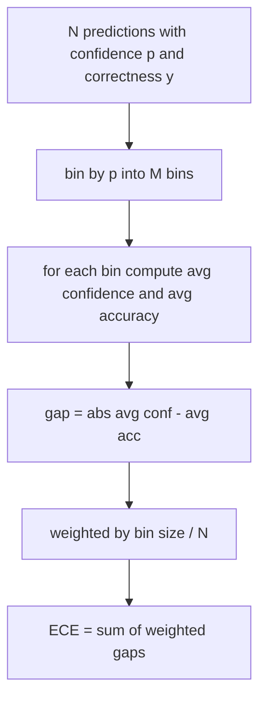
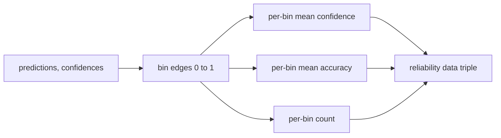

# 困惑度与校准

> 如果你的模型在一千个答案上都说 90% 置信，却只答对了六百个，那它的校准就很差。校准是可信评估的一半，另一半是困惑度，它告诉你模型认为留出文本是否合理。

**Type:** Build
**Languages:** Python
**Prerequisites:** Phase 19 Track B 基础、第 70 和 71 课
**Time:** ~90 分钟

## 学习目标

- 基于模型适配器提供的 token 负对数概率，在留出语料上计算 token 级困惑度。
- 基于分箱后的预测概率，计算分类器或多选题评估的期望校准误差(ECE)。
- 计算 Brier 分数(相对正确性指示量的均方误差)，并解释它在哪些方面做到了 ECE 做不到的事。
- 构建绘制置信度-准确率曲线所需的可靠性图数据。
- 将这三者接入评估框架，使运行器能够把 `perplexity`、`ece` 和 `brier` 数值附加到模型报告中。

```figure
cd-reliability-diagram
```

## 困惑度告诉你什么

困惑度是每 token 平均负对数似然的指数化结果。越低越好。困惑度为 1 意味着模型对每个真实 token 都赋予概率 1。困惑度等于词表大小意味着模型是均匀分布、什么都没学到。真实数值介于两者之间:2026 年一个强的基座模型在 WikiText-103 上大约是 8 到 12;差的模型在同一段文本上会超过 50。

框架本身不计算对数概率，它们来自模型适配器。框架只做聚合:它接收一个逐 token 对数概率列表和一个每序列 token 数列表，返回语料级困惑度。

```python
def perplexity(neg_log_probs, token_counts):
    total_nll = sum(neg_log_probs)
    total_tokens = sum(token_counts)
    return math.exp(total_nll / total_tokens)
```

实现处理零 token 的边界情况，并断言负对数概率非负。一个常见错误是忘记取负:适配器返回 `log p` 而不是 `-log p` 会产生低于 1 的困惑度，这是不可能的。该函数会将其捕获为契约违规。

## ECE 度量什么

期望校准误差按置信度把预测分到固定数量的箱中，然后测量各箱之间置信度与准确度的平均差距，并按箱大小加权。



标准公式在 `[0, 1]` 上使用十个等宽箱。实现支持任意正整数箱数。我们暴露一个 `bins` 参数，让运行器可以在论文惯例(10)和对比惯例(15)之间选择。

ECE 受箱数和样本量影响而有偏。十个箱、一百个预测时，你无法区分 0.02 的 ECE 和随机噪声。实现会连同 ECE 一起返回非空箱的数量，这样运行器可以在样本过少时拒绝报告单个数字。

## Brier 分数做到了 ECE 做不到的事

ECE 只关心平均差距。一个在一半箱上过度自信、在另一半箱上信心不足的模型，可能 ECE 很低但局部校准很差。Brier 分数针对每个预测度量相对真实结果的平方误差，因此它直接惩罚离散程度。

对于二元结果，Brier 为 `mean((p_i - y_i)^2)`。它可分解为可靠性、分辨率和不确定性。我们同时计算分数和分解结果。运行器报告标量，但将分解结果记录到仪表盘日志中。

```python
def brier(p, y):
    return float(np.mean((p - y) ** 2))
```

## 可靠性图数据

可靠性图在每个箱中绘制预测置信度对经验准确度。对角线代表完美校准。该函数返回三个数组:每箱平均置信度、每箱平均准确度、每箱计数。绘图代码在下游;本课止步于数据形态。



返回的元组正是调用层绘制图形或计算自定义 ECE 变体(adaptive ECE、sweep ECE 等)所需的内容。我们返回 numpy 数组,这样下游代码不必自行转换。

## 置信度来源

框架不假设置信度来自 softmax。它接受每个预测在 `[0, 1]` 中的任意数值。对于多选题任务,自然的置信度是 `softmax over option log-likelihoods`。对于自由文本,自然的置信度是模型自报告的概率或平均对数似然的指数。评估只消费这个数字,它从何而来是适配器的职责。

## 边界情况

- 所有预测都错:ECE 等于平均置信度,Brier 很高,困惑度就是模型对该文本的看法。
- 所有预测都以高置信度正确:ECE 接近零,Brier 接近零。
- p=0.5 的完全不确定预测器:ECE 是 0.5 减去准确度,Brier 是 0.25 减去一个修正项。
- 空输入:ECE、Brier 和可靠性返回 `0.0`(或零填充数组)。困惑度在零 token 情况下返回 `NaN`。这些路径都不会发出警告;运行器检查这些值并决定报告还是跳过。

这些情况都固化在测试中。真实模型在真实基准上不会触发它们,但有 bug 的适配器或过小的样本会触发,运行器不应崩溃。

## 调度

校准不是像 F1 那样的按任务指标,而是按模型的报告。运行器在整个评估过程中累积 `(confidence, correct)` 对,并一次性计算 ECE、Brier 和可靠性数据。困惑度则是在单独的留出文本语料上计算,与逐任务打分分开。

接口是:

```python
report = CalibrationReport.from_predictions(confidences, correct)
report.ece          # float
report.brier        # float
report.reliability  # tuple of three numpy arrays
report.populated_bins  # int
```

`PerplexityResult.from_token_nll(neg_log_probs, token_counts)` 返回困惑度和每 token 平均负对数似然。

## 本课不做什么

它不调用模型,不实现 softmax,不从输出 token 估计置信度(那是适配器的职责),也不做温度缩放或 Platt 缩放——那些是事后修正,属于另一课。本课的目的是让这三个数字(困惑度、ECE、Brier)可信且可复现。

## 如何阅读代码

`main.py` 定义了 `perplexity`、`expected_calibration_error`、`brier_score`、`reliability_diagram` 以及 `CalibrationReport` / `PerplexityResult` 数据类。演示在已知真实结果的合成预测上运行:一个校准良好的模型、一个过度自信的模型和一个信心不足的模型。`code/tests/test_calibration.py` 中的测试固定了每个边界情况以及合成预测器的参考值。

从头到尾阅读 `main.py`。函数顺序从标量到向量再到报告。每个函数都有包含数学公式和契约的简短 docstring。

## 延伸阅读

校准是已发表评估中最被忽视的维度。大多数排行榜只报告一个准确度数字就完事。一个在准确度上获胜但在 Brier 上落败的模型,作为生产部署不如一个准确度低几个点但可靠报告自身不确定性的模型。一旦校准的基础设施就位,可以在留出的验证切片上添加温度缩放,重新计算 ECE,观察差距缩小。那是单独的一课,但地基就在这里。