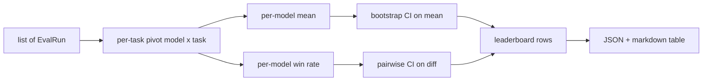
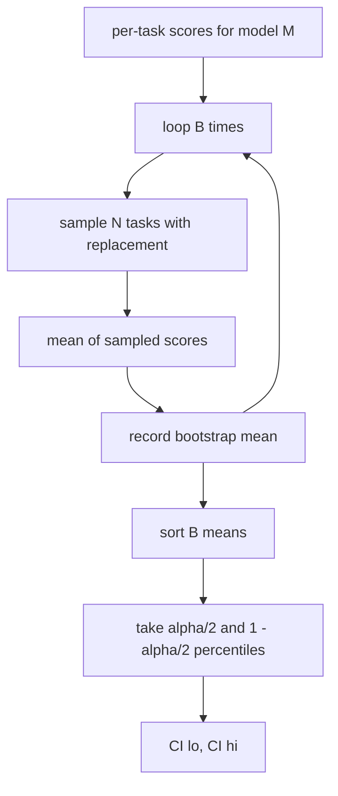

# 排行榜聚合

> 单任务的分数很简单。跨异构任务的按模型排名则更难。而在千次预测规模的排行榜上做统计显著性检验,是所有人都跳过的部分。本课不跳过它。

**Type:** Build
**Languages:** Python
**Prerequisites:** Phase 19 Track B foundations, lessons 70, 71, 73
**Time:** ~90 min

## 学习目标

- 将多个模型、多个任务的按任务分数聚合为整洁的按模型行。
- 对异构分数进行归一化,使通过率和 BLEU 值不会过度影响聚合结果。
- 按均值和按胜率对模型排名,并解释何时使用哪种汇总方式。
- 为每个模型的平均分以及两两差异计算 bootstrap 置信区间。
- 将排行榜输出为 JSON 报告和 markdown 表格,以便 lesson 75 的 runner 粘贴到 CI 评论中。

```figure
ci-leaderboard-ci
```

## 输入的形态

聚合器消费一个 `EvalRun` 记录列表:

```python
@dataclass
class EvalRun:
    model_id: str
    task_id: str
    metric_name: str
    score: float          # in [0, 1]
    category: str
```

lesson 75 的 runner 会为每个 `(model, task)` 对输出一条记录。聚合器不关心分数是如何产生的。它假定归一化已经完成:每个分数都在 `[0, 1]` 之内。

## 输出

输出三张表:



排行榜行包含:`model_id`、`mean_score`、`mean_ci_lo`、`mean_ci_hi`、`win_rate`、`tasks_completed`,以及一个可选的 `categories` 映射用于按类别均值。

## 归一化

如果一个任务的分数在 `[0, 1]` 内,另一个在 `[0, 100]` 内,后者会悄无声息地主导均值。聚合器会验证每个输入分数都落在 `[0, 1]` 之内,否则拒绝本次运行。修复应该在上游进行:指标本应已经返回一个比例值。Lesson 71 到 73 都强制执行了这一约定。

## 均值与胜率

这两种排名方案服务于不同的目标。

均值是一个模型各任务分数的平均值。它是排行榜报告的头号数字。它对离群值和任务不均衡敏感。

胜率统计的是一个模型在同一任务上击败所有其他模型的频率。对每个任务,分数最高的模型获胜(平局各计一半)。胜率等于获胜次数除以该模型有分数的任务数。它对离群值和量纲差异不太敏感,但会丢失信息。

```python
def win_rate(model_id, runs_by_task, all_models):
    wins, total = 0, 0
    for task_id, runs in runs_by_task.items():
        scores = {r.model_id: r.score for r in runs if r.model_id in all_models}
        if model_id not in scores:
            continue
        total += 1
        best = max(scores.values())
        if scores[model_id] >= best:
            wins += 1
    return wins / total if total else 0.0
```

本 harness 同时报告两者。lesson 75 的 runner 默认按均值排名;胜率的 markdown 列就在那里,以备用户偏好使用。

## Bootstrap 置信区间

按模型均值附带通过对任务进行 bootstrap 重采样估计的置信区间。我们以有放回方式重采样任务 id,计算重采样集合上的均值,重复 `B` 次,并取水平为 `alpha` 的百分位区间。



对于两两比较,我们对按任务差异 `score_A - score_B` 进行 bootstrap,取百分位区间并报告。用户据此判断区间是否排除零。如果排除,则差异在 alpha 水平上显著;如果不排除,排行榜将这两个模型视为打平。

底层辅助函数(`bootstrap_mean_ci`、`bootstrap_pairwise_diff`)默认 `B=1000`;公开聚合器(`aggregate`、`pairwise_diffs`)默认 `b=500`,以保证演示和测试运行迅速。默认 alpha 为 0.05。本课的 bootstrap 仅用纯 numpy 实现,不使用 scipy。

## 类别

如果设置了 `EvalRun.category`,聚合器还会报告按类别均值。这就是每个排行榜上标着 `math`、`reasoning`、`code`、`safety` 的那一列。它让 runner 能够发现某个模型整体不错但在代码上较弱——这是头号均值所掩盖的信息。

## Markdown 渲染

排行榜渲染为 markdown 表格:

```text
| Rank | Model | Mean | 95% CI | Win rate | Tasks |
|------|-------|------|--------|----------|-------|
| 1    | gpt   | 0.78 | 0.74-0.82 | 0.62 | 50 |
| 2    | claude| 0.75 | 0.71-0.79 | 0.34 | 50 |
| 3    | random| 0.10 | 0.07-0.13 | 0.04 | 50 |
```

表格按平均分排序。置信区间渲染到小数点后两位。过长的模型 id 会被截断为二十个字符。

## 本课不做的事

它不运行模型。它不调用指标层。它不实现自适应 ECE 或其他校准变体;那些属于 lesson 73。它不实现任务加权。这里每个任务权重相同。生产环境的排行榜会对任务加权;我们通过 `weight` 字段保留该钩子,但聚合器会忽略它。如有需要,可在后续课程中添加加权。

## 如何阅读代码

`main.py` 定义了 `EvalRun`、`LeaderboardRow`、`aggregate`、`bootstrap_mean_ci`、`bootstrap_pairwise_diff` 和 `render_markdown`。演示构建了一个包含三个模型、十二个任务的合成套件,进行聚合,并打印排行榜和两两差异表。`code/tests/test_leaderboard.py` 中的测试固定了 bootstrap、markdown 渲染、胜率边界情况以及空输入行为。

从头到尾阅读 `main.py`。首先是数据形态(EvalRun、LeaderboardRow),其次是聚合器,然后是 bootstrap,最后是渲染。每个函数都有明确的职责约定。

## 进一步探索

自然的下一步是用配对任务显著性检验替代非配对 bootstrap。如果模型 A 和 B 都运行了相同的一百个任务,合适的检验是基于逐任务差异的配对 bootstrap,我们已实现该方法。再进一步,你会想要一个尊重任务族群的层次 bootstrap(数学题目之间并非相互独立;某类算术错误模式可能影响其中十道题)。那是后续课程的内容。本课的要点是把基础打牢,使评估报告出一个你能为之辩护的数字。