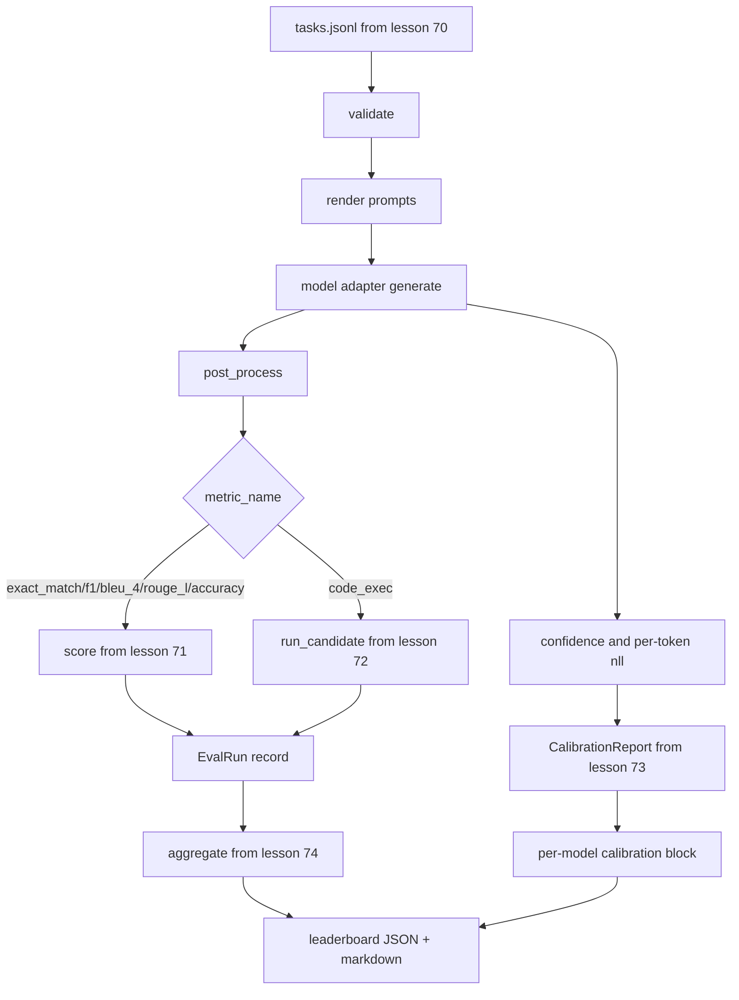

# 端到端评测运行器

> 五节课的组件，一节课把它们粘合起来。运行器读取第 70 课的任务规格，通过适配器调用模型，用第 71 课和第 72 课的方法评分，附带第 73 课的校准报告，并输出第 74 课的排行榜。演示程序自动终止。

**Type:** Build
**Languages:** Python
**Prerequisites:** 阶段 19 轨道 B 基础，第 70 至 74 课
**Time:** ~90 分钟

## 学习目标

- 定义一个 `ModelAdapter` 接口，任何模型（mock、本地、API）都能用少量方法满足。
- 在 fixture JSONL 文件上运行评测，通过 worker 池并行执行任务。
- 在一次遍历中组合指标层（exact_match、F1、BLEU-4、ROUGE-L、code_exec）与校准层。
- 输出每个模型的 `EvalRun` 记录，并直接喂给排行榜聚合器。
- 同时输出 JSON 报告和 markdown 表格；运行干净时以退出码零自终止，验证或运行时失败时以非零退出。

```figure
eval-grid
```

## 流水线



运行器是集成点。第 70 至 74 课每课拥有一个模块，由运行器组合。运行器不复制这些模块中的任何逻辑：它只导入它们。

## 适配器接口

适配器是运行器与任何模型之间的接缝。该接口刻意保持精简。

```python
class ModelAdapter:
    model_id: str

    def generate(self, prompt: str, task: TaskSpec) -> Generation: ...
```

`Generation` 是一个 dataclass，包含：

- `text`：模型的自由格式输出
- `confidence`：一个 `[0, 1]` 范围内的浮点数，表示模型对答案的自报概率
- `token_nll`：可选，生成 token 的负对数似然之和
- `token_count`：可选，生成的 token 数量

运行器中的 mock 适配器提供三种类型：`RuleBasedAdapter`（确定性，接近完美）、`NoisyAdapter`（过度自信，经常出错）和 `BiasedAdapter`（擅长一个类别，另一类别很糟）。演示程序在第 70 课的 fixture 上运行全部三个。

## 并行执行

运行器使用 `concurrent.futures.ThreadPoolExecutor` 对每个模型并行运行任务。worker 数量默认为八和任务数中的较小者。线程已足够，因为真实模型调用的瓶颈是网络 I/O。code-exec 路径在任务内部自行派生子进程，executor 只负责调度等待。

对于确定性测试，运行器暴露 `run_eval(adapters, tasks, parallel=False)`，使测试可以固定执行顺序。

## 单遍评分循环

对每个任务：

1. 渲染提示词（few-shot 前缀加上提示词主体）。
2. 调用适配器并对调用计时。
3. 按任务的规则对生成结果进行后处理。
4. 分发到指标层。
5. 用分数和指标元数据构建一条 `EvalRun` 记录。
6. 将 `(confidence, correct)` 对追加到校准缓冲区。

`correct` 信号对 exact_match 风格的指标（`exact_match`、`accuracy`、`code_exec`）为 `score >= 1.0`，对分级指标为 `score >= 0.5`。阈值存放在 `_correct_from_score` 中，运行器不提供公开覆盖。

## 聚合

每个任务都有结果后，运行器调用第 74 课的 `aggregate` 和 `pairwise_diffs`，以及第 73 课的 `CalibrationReport.from_predictions`。输出是一个 JSON 信封：

```json
{
  "leaderboard": [...],
  "pairwise": [...],
  "calibration": {
    "model_id_a": {"ece": 0.04, "brier": 0.10, "populated_bins": 8, ...},
    ...
  },
  "summary": {
    "tasks": 10,
    "models": 3,
    "wall_seconds": 1.2
  }
}
```

运行器还向 stdout 写入一个 markdown 表格，方便用户将结果粘贴到 PR 评审中。

## 自终止演示

演示程序在第 70 课的十个 fixture 任务上运行三个 mock 适配器。挂钟时间应在十秒以内。运行干净时退出码为零。

干净运行的标准是：

- 每个任务都在第 70 课下通过验证。
- 每个任务都在第 71 和 72 课下完成评分。
- 校准报告在第 73 课下聚合且无错误。
- 排行榜将规则适配器严格排在随机适配器之上。

若任何一条被破坏，运行器以非零退出，并在 JSON 信封中附带结构化错误。

## 本节课不做的事

它不调用真实模型。不实现 API key 流程或限流处理。不实现流式或部分生成；适配器每次调用返回一个生成结果。不做重试或缓存。这些关注点属于适配器层；运行器与指标无关、与提供商无关。

## 如何阅读代码

`main.py` 是集成所在。它通过一个小的 `_load_sibling` 辅助函数按相对路径从其他五个课程模块导入。dataclass `Generation`、`EvalReport` 和 `ModelAdapter` 在本地定义。mock 适配器位于文件底部。

从头到尾阅读 `main.py`。略读导入，然后看 `run_eval`，再看 `_score_one`，最后看适配器。末尾的演示是入口点。

`code/tests/test_runner.py` 中的测试固定了适配器接口、单遍循环、并行与串行的等价性、校准缓冲区以及 JSON 信封的结构。

## 进一步延伸

这个运行器只是下限。生产级评测系统会加入：以 `(task_id, model_id, model_version)` 为键的结果缓存、跟踪每次运行美元和 token 消耗的成本账本、对限流做退避的重试层、面向 pass-at-k 任务的采样策略，以及面向长套件的流式输出格式。每一个都是单一关注点，包裹运行器而不改变指标或聚合层。这种分离正是契约的意义所在。

在 mock 工作正常之后，为真实提供商添加一个适配器。选一个有免费额度的，写三十行胶水代码，看排行榜亮起来。然后再添加第二个提供商，让测试框架完成剩下的工作。