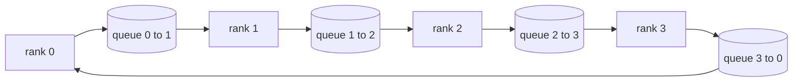

# 从零实现集合通信操作

> 支撑分布式训练的四个集合通信操作分别是 allreduce、broadcast、allgather 和 reduce_scatter。训练框架提供的所有其他原语都是对这四个操作的封装。在 `multiprocessing.Queue` 网格上实现一遍,用参考实现验证,剩下的本阶段内容就只是管道工作了。

**Type:** Build
**Languages:** Python
**Prerequisites:** Phase 19 Track C 第 42-49 课
**Time:** ~90 min

## 学习目标

- 实现两遍 ring allreduce(先 reduce-scatter 再 allgather),并证明每个 rank 的通信量为每元素 2(N-1)/N 字节。
- 在 `multiprocessing.Queue` 上的点对点发送之上构建 broadcast、allgather 和 reduce_scatter。
- 对相同输入,将每个原语与 `torch.distributed` gloo 参考实现进行比对验证。
- 从集群形态、延迟下限和带宽上限出发,论证选择 ring 还是 tree 的理由。

## 问题所在

N 个 rank 上的朴素 allreduce 会把张量发送到某个根 rank 共 N 次,再广播回来 N 次。每个 rank 的带宽开销按 O(N) 扩展,根 rank 成为瓶颈,时钟时间的下限是最慢链路延迟乘以 N。Ring allreduce 将其拆分为 2(N-1) 个大小为 T/N 的分块,使每个 rank 的字节数降为 2T(N-1)/N,与集群规模无关。Tree allreduce 在小规模 N 和高延迟链路上更优,因为其深度是 log2(N) 跳而非 2(N-1)。为集群形态选择错误的拓扑,最慢的 GPU 将决定每步耗时。

本阶段要读的每个分布式训练框架都依赖这四个原语。PyTorch DDP 对每个参数桶执行一次 allreduce 来同步梯度。ZeRO 用 reduce_scatter 分片优化器状态,用 allgather 广播更新后的参数。FSDP 将完整前向传播转换为 allgather 加 reduce_scatter。流水线并行需要 broadcast 在不同 stage 组之间传输激活值。如果无法实现这四个集合通信操作,你就无法推理训练为何停滞、梯度不匹配为何出现在 rank 3,或者为何更换拓扑会使流水线气泡加倍。

## 核心概念



### 两遍 ring allreduce

将张量拆分为 N 个等大小的分块,索引为 0..N-1。每个 rank 拥有与其 rank 编号相同的分块索引。第一遍 reduce-scatter 执行 N-1 步。在第 s 步,rank r 将分块 (r - s) mod N 发送给 rank (r + 1) mod N,并从 rank (r - 1) mod N 接收分块 (r - s - 1) mod N,将接收到的分块累加到本地副本中。N-1 步之后,rank r 拥有分块 r 的完整和。第二遍 allgather 再执行 N-1 步,沿环轮转完成的分块,直到每个 rank 都持有每个分块的完整和。

| 原语 | 每 rank 字节 | 步数 | 使用场景 |
|-----------|---------------|-------|-------------|
| Ring allreduce | 2T(N-1)/N | 2(N-1) | 大 T、高带宽同构集群 |
| Tree allreduce | T log2(N) | 2 log2(N) | 小 T 或高延迟链路 |
| Broadcast | T | log2(N) 树 | 参数初始化、标量配置 |
| Allgather | T(N-1)/N | N-1 | 分片前向传播、ZeRO unshard |
| Reduce_scatter | T(N-1)/N | N-1 | ZeRO 梯度分片 |

### 用队列网格替代 NCCL

NCCL 运行在 PCIe 和 NVLink 上,使用硬件卸载的归约操作。在 CPU 上没有这些条件。每个环边使用一个 `multiprocessing.Queue` 可以在单生产者单消费者的条件下提供有序的点对点投递。归约发生在用户空间,因此需要付出 Python 开销,但线路模式与 NCCL ring allreduce 完全相同。在队列版本上推理正确性,集群上的行为也随之确定。

### 与 gloo 比对验证

每个原语都附带单元测试,将其输出与在相同张量、相同 world size 下以 gloo 后端初始化的 `torch.distributed` 进行比对。如果 ring allreduce 与 gloo 的偏差超过 float32 epsilon,测试即失败。与参考实现比对验证是不可妥协的;没有它,原语看起来正确,直到真实训练运行的第 10000 步才暴露问题。

```figure
ci-ring-allreduce
```

## 动手实现

`code/main.py` 实现了:

- `Mesh` 类,将 N 个 `multiprocessing.Queue` 实例连成一个环,并为每个 rank 暴露 `send(dst, tensor)` 和 `recv(src)`。
- `ring_allreduce(mesh, rank, world_size, tensor)`,运行两遍算法。
- `broadcast(mesh, rank, world_size, tensor, src)`,通过对数树实现。
- `allgather(mesh, rank, world_size, tensor)`,使用 N-1 次轮转。
- `reduce_scatter(mesh, rank, world_size, tensor)`,作为 allreduce 的前半部分。
- `_gloo_reference(op, world_size, tensor)`,将相同输入通过 gloo 运行 `torch.distributed`,进行逐字节相等的比对。

运行:

```bash
python3 code/main.py
```

输出:比较队列网格与 gloo 输出的逐原语验证表,随后是证明 2T(N-1)/N 扩展规律的每 rank 字节计数器。

## 生产环境中的实践模式

以下三种模式使这些原语足够健壮,可以投产。

**在 allreduce 之前对梯度分桶。** 一个 1B 参数的模型有数万个梯度张量。对每个张量单独执行 allreduce 要付出 N 倍的延迟下限。DDP 将梯度分桶为 ~25 MB 的块,并对每个桶执行一次 allreduce;小张量搭在大张量的便车上。没有分桶,延迟开销将主导每步耗时。

**通信与计算重叠。** 反向传播按逆序逐层计算梯度。最后一层的梯度一就绪,就启动它的 allreduce,同时下一层继续计算。PyTorch DDP 通过 bucket-ready 钩子实现这一点。当网络有空闲带宽时,重叠可将可见通信时间减半。

**按消息大小而非信仰选择 ring 或 tree。** NCCL 内置拓扑检测器,对超过 ~1 MB 的消息选择 ring,以下选择 tree。交叉点是带宽与延迟的权衡:超过 1 MB 时,带宽项 2T(N-1)/N 占主导,ring 更优;低于 1 MB 时,log2(N) 的跳数占优。硬编码一种拓扑会在错误的消息大小上损失吞吐量。

## 实际应用

生产模式:

- **PyTorch DDP。** 在反向传播后对分桶梯度调用 `dist.all_reduce`。桶大小可调;对于 100Gbit 以太网,默认 25 MB 是合理的。
- **DeepSpeed ZeRO。** 执行 reduce_scatter 分片梯度,执行 allgather 在前向传播前重构完整参数。本课的原语正是 ZeRO 调用的操作。
- **FSDP。** 前向传播以 allgather 开始以 unshard 该层,计算后用 reduce_scatter 归约并丢弃 unshard。相同的原语,不同的调度。

## 投产使用

在第 77-81 课中使用队列网格原语。第 77 课将 allreduce 接入 DDP。第 78 课将 reduce_scatter 接入 ZeRO。第 79 课将 broadcast 接入流水线激活值。第 81 课将四者组合成端到端演示。

## 练习

1. 添加 tree allreduce 变体,并按消息大小在 ring 和 tree 之间切换。测量交叉点。
2. 添加 `recv_timeout_ms`,使停滞的 rank 触发超时错误而不是永久挂起。
3. 将四个原语的 `multiprocessing.Queue` 替换为 TCP 套接字。相同的测试,真实的线路。
4. 添加带宽检测钩子,使每 rank 字节计数器记录到 JSONL。
5. 在 4 个 rank 上比较 ring 与 tree 对大小为 1KB、1MB、16MB 的张量的实际耗时。用实验数据论证交叉点。

## 关键术语

| 术语 | 人们怎么说 | 实际含义 |
|------|------------------------|
| Allreduce | "跨 rank 求和" | 调用结束后,每个 rank 持有相同的归约张量 |
| Ring | "快速拓扑" | N-1 个大小为 T/N 的分块沿环流动两圈 |
| Tree | "对数拓扑" | 归约沿二叉树进行;深度为 log2(N) 跳 |
| Allgather | "拼接分片" | 每个 rank 最终拥有其他所有 rank 的分片 |
| Reduce_scatter | "拆分求和" | 每个 rank 最终只拥有一个分块的和 |
| Bucket | "融合小张量" | 将 N 个小的 allreduce 合并为一个大的 |

## 延伸阅读

- [PyTorch Distributed: NCCL collectives](https://pytorch.org/docs/stable/distributed.html#collective-functions)
- [Horovod ring allreduce paper](https://arxiv.org/abs/1802.05799)
- [NCCL topology and algorithm selection](https://docs.nvidia.com/deeplearning/nccl/user-guide/docs/index.html)
- [Patarasuk and Yuan, Bandwidth optimal allreduce algorithms](https://www.cs.fsu.edu/~xyuan/paper/09jpdc.pdf)
- Phase 10 Lesson 05 - 分布式训练概述
- Phase 19 Lesson 77 - 在这些原语之上接入 DDP