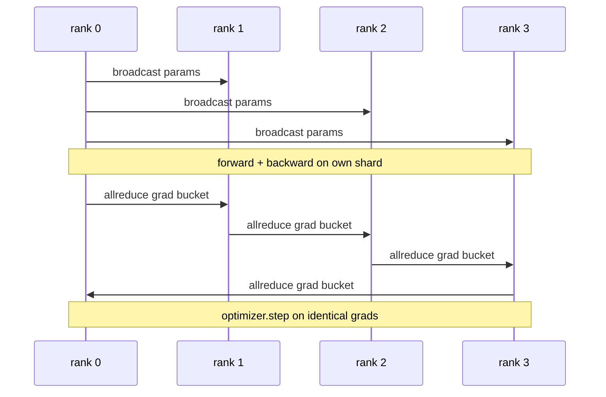

# 从零实现数据并行 DDP

> DistributedDataParallel 是构建在 allreduce 之上的一个 hook。包装一个模型，从 rank 0 广播初始参数使每个 rank 的起点完全一致，在每个参数上安装一个对其梯度发起 allreduce 的反向 hook，剩下的就是梯度下降。整个模式只需 200 行代码。

**Type:** Build
**Languages:** Python
**Prerequisites:** 第 19 阶段 Track C 第 42-49 课
**Time:** ~90 分钟

## 学习目标

- 实现一个 `DistributedDataParallel` 形态的包装器，广播初始参数并在反向传播后对梯度做 allreduce。
- 使用 `torch.multiprocessing.spawn` 基于 gloo 后端和基于文件方式的 rendezvous，启动 N 个 CPU rank。
- 通过在相同数据上顺序训练同一个模型，并证明逐步参数等价，来验证梯度同步的正确性。
- 论证桶(梯度融合)和重叠(反向传播期间的通信)是把一个可用的 DDP 变成生产级 DDP 的两项关键改进。

## 问题

一个 10 亿参数、带 12 GB 激活值的模型放不进单张消费级 GPU。即使放得下，训练也要数周。数据并行把批次切分到 N 个 rank，每个 rank 在自己的分片上计算前向和反向，且每一步都对所有 rank 的梯度求和，使全部 N 份副本保持一致。求和后的梯度才是优化器步进所用的梯度。

没有梯度同步，N 个副本在第 2 步就会发散。模型不再是"用更多数据训练的一个模型"，而是恰好共享初始权重的 N 个独立模型。梯度同步做得不好(每个参数一次 allreduce、无重叠、无分桶)时，网络成为瓶颈，GPU 空转等待网络传输。DDP 的技艺在于让梯度同步相对于计算几乎免费。标准的 PyTorch DDP 通过梯度分桶、将 allreduce 与下一层的反向传播重叠、以及在 NVLink 上使用 NCCL 来做到这一点。我们可以在 CPU 上用 gloo 实现这三点，并学到相同的经验。

## 概念



### DDP 需要的三种操作

| 阶段 | 集合通信 | 原因 |
|-------|-----------|-----|
| 初始化 | 从 rank 0 广播 | 每个 rank 从相同的参数开始 |
| 反向传播后 | 对每个梯度做 allreduce | 平均梯度才是优化器步进所用的梯度 |
| 偶尔 | 广播 buffer | Batchnorm 的运行统计保持同步 |

### 为什么是均值而不是和

Allreduce-SUM 除以 world_size 得到平均梯度。均值对 world_size 不变：在一个 rank 上调好的学习率在四个 rank 上同样适用，因为每步的梯度幅值不变。不除的 Allreduce-SUM 会迫使你每次改变集群规模都重新调学习率。DDP 包装 SUM 再做除法；本课也照此实现。

### 为什么要对梯度分桶

一个 Transformer 有数千个参数张量。每个张量一次 allreduce 要成千上万次支付 gloo 的延迟下限。DDP 将梯度分组到约 25 MB 的桶中，每个桶只发起一次 allreduce。线路上传输的总字节数相同，但延迟被摊销到整个桶上。对本课的小模型我们把所有东西放进一个桶；可以迁移的是这种结构。

### 为什么固定种子

每个 rank 必须用 `torch.manual_seed(seed + rank)` 做打乱，但用 `torch.manual_seed(seed)` 做参数初始化。共享同一种子意味着每个 rank 看到相同的批次顺序(使数据并行失效)；参数使用特定 rank 的种子意味着初始参数会相差浮点 epsilon，梯度同步也无法再使副本保持一致。种子模式弄错，参数等价性测试在第 1 步就会失败。

```figure
ci-ddp-grad-sync
```

## 动手实现

`code/main.py` 实现了：

- `MiniMLP`: 一个 3 层 MLP，小到几秒内即可收敛，大到足以暴露接线问题。
- `DistributedDataParallel(model, world_size)`: 在构造时广播参数，返回一个包装器，其 `sync_grads` 将累计的 allreduce-summed 梯度除以 world_size。
- `worker(rank, world_size, ...)`: 完整训练循环，包含基于 gloo 的 `torch.distributed` 初始化、前向、反向、同步、步进。
- `_reference_single_process_loop(...)`: 在单个 rank 上顺序训练同一模型于同一数据，供测试在每个步骤之后验证字节级相等的参数等价性。

运行：

```bash
python3 code/main.py
```

输出：一张逐步训练表，对比单进程的损失和参数校验和与 4 个 rank 上的 DDP 运行。两条路径产生到浮点 epsilon 精度一致的损失曲线，证明梯度同步是正确的。

## 生产环境中的实用模式

三种模式足以让 DDP 达到可上线的强度。

**查找未使用的参数。** 某些前向路径会条件性地跳过参数(提前退出、mixture-of-experts 路由)。被跳过的参数没有梯度，但 DDP 的 bucket-ready hook 仍在等待它们，导致 allreduce 死锁。`find_unused_parameters=True` 让 DDP 在 reduce 之前检查哪些参数获得了梯度。代价是每步一次图遍历，所以除非你的前向有分支，否则不要开启。

**静态图优化。** 当前向在各步之间保持稳定时，`static_graph=True` 允许 DDP 预先计算桶调度。这一优化在大规模下很重要：每步节省几毫秒，在 10000 步上会累积成显著收益。

**梯度累积需要小心。** 对 K 个微批次累积梯度而每个微批次不同步，可带来 10 倍的吞吐提升。DDP 提供 `no_sync()` 作为上下文管理器，用于暂停反向后的 allreduce。忘记这个管理器，你就会白白做 K 次 allreduce；吞吐量跌回谷底。

## 使用它

生产环境模式：

- **PyTorch DDP.** 标准实现。`torch.nn.parallel.DistributedDataParallel(model)` 实现了分桶、重叠以及 no_sync 上下文。
- **HuggingFace Accelerate.** 增加了一个启动器，处理 `torchrun` 环境变量和模型包装。底层是相同的 DDP。
- **Megatron-LM 数据并行.** 将 DDP 与张量并行结合用于大模型；其数据并行部分就是同样的反向后 allreduce 模式。

## 发布它

第 78 课(ZeRO sharding)用 reduce_scatter 取代逐参数 allreduce，使每个 rank 只存储自己的优化器状态分片。第 81 课将 DDP 与 ZeRO 组合成端到端演示。

## 练习

1. 添加可配置大小的梯度桶，并在更深的模型上测量其相对逐参数 allreduce 的加速比。
2. 将 `no_sync()` 实现为上下文管理器，并验证在 K 个微批次上的梯度累积与单进程基线一致。
3. 添加一个 `find_unused_parameters` 模式，使前向有时跳过某一 MLP 层；不加该标志时运行应当死锁。
4. 将 gloo 替换为仅用 `torch.distributed.barrier()` 的同步，体会基于 allreduce 和基于 barrier 的同步之间的差异。
5. 对于 batch size 1、16、256，测量梯度同步开销占步时长的比例，并解释其扩展规律。

## 关键术语

| 术语 | 人们怎么说 | 实际含义 |
|------|----------------|------------------------|
| DDP | "数据并行" | 每步广播参数并对梯度做 allreduce 的包装器 |
| Bucket | "融合梯度" | 将 N 次小的 allreduce 合并为一次大的 |
| Overlap | "隐藏通信" | 在后面的层仍在计算反向时发起 allreduce |
| no_sync | "累积" | 为梯度累积跳过反向后的 allreduce |
| find_unused | "分支前向" | 在 reduce 之前检测没有梯度的参数 |

## 延伸阅读

- [PyTorch DistributedDataParallel 文档](https://pytorch.org/docs/stable/generated/torch.nn.parallel.DistributedDataParallel.html)
- [PyTorch DDP 内部机制教程](https://pytorch.org/tutorials/intermediate/ddp_tutorial.html)
- [Li et al, PyTorch Distributed: Experiences on Accelerating Data Parallel Training](https://arxiv.org/abs/2006.15704)
- 第 19 阶段第 76 课 - DDP 所依赖的集合通信
- 第 19 阶段第 78 课 - ZeRO sharding 用 reduce_scatter 取代逐参数 allreduce