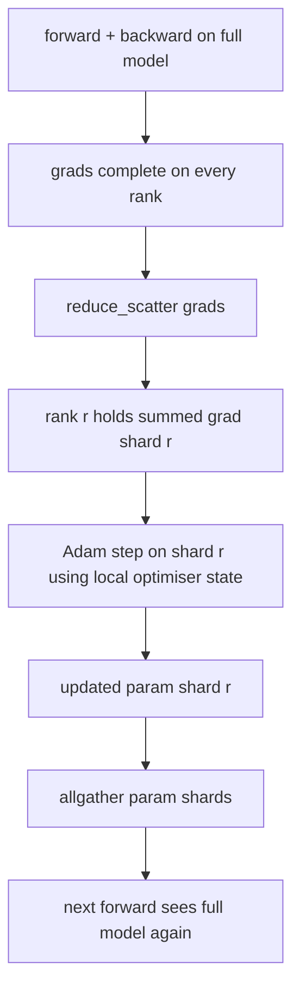

# ZeRO 优化器状态分片

> Adam 为每个参数存储两个动量估计，均为 float32。一个 7B 参数的模型携带 56 GB 的优化器状态。ZeRO stage 1 将其分片到 N 个 rank 上；每个 rank 拥有 1/N 的优化器。本地 step 完成后，更新后的参数分片广播回来，每个 rank 重建完整模型，下一步开始。收益是训练栈中最大单项内存分配的线性下降。

**Type:** Build
**Languages:** Python
**Prerequisites:** Phase 19 Track C lessons 42-49
**Time:** ~90 min

## 学习目标

- 将优化器状态（一阶动量、二阶动量、fp32 主副本）分片到 N 个 rank 上，使每个 rank 拥有 1/N。
- 使用 reduce_scatter 只向每个 rank 交付其分片的梯度总和，然后用 allgather 将更新后的参数分片广播回去。
- 计算对比原生 DDP 时 stage 1、stage 2、stage 3 的内存节省表。
- 从模型规模和带宽预算出发，论证选择 stage 1、stage 2 还是 stage 3 的理由。

## 问题所在

原生 DDP 复制一切：参数、梯度和优化器状态在每个 rank 上都完整存在。对于 fp16 的 7B 参数模型，这意味着每个 rank 有 14 GB 参数、14 GB 梯度和 28 GB 优化器状态。优化器状态是最大的一项，也是最容易分片的，因为它只在 step 期间被访问，前向和反向期间不会。

ZeRO stage 1 对优化器状态进行分片。每个 rank 持有 1/N 的 Adam 动量。反向传播之后，ZeRO 不再做全局 allreduce 并在本地 step，而是进行 reduce_scatter，使每个 rank 只收到其分片的梯度总和。该 rank 对其主参数分片应用优化器 step。更新后的参数分片随后通过 allgather 广播回来，使每个 rank 都拥有下一次前向所需的完整模型。优化器内存下降 N 倍。每 step 的网络流量与 DDP 相同：一次 reduce_scatter 加一次 allgather 在带宽上等于一次 allreduce。内存收益，吞吐不变。

## 核心概念



### ZeRO 的各个阶段

| 阶段 | 分片内容 | 每 rank 内存 | 每 step 通信 |
|-------|----------------|------------------|---------------|
| DDP | 无 | params + grads + optim | 1x allreduce |
| ZeRO-1 | 优化器状态 | params + grads + optim/N | 1x reduce_scatter + 1x allgather |
| ZeRO-2 | 优化器 + 梯度 | params + grads/N + optim/N | 1x reduce_scatter + 1x allgather |
| ZeRO-3 | 优化器 + 梯度 + 参数 | params/N + grads/N + optim/N | 1x allgather per layer + 1x reduce_scatter per layer |

Stage 1 是最廉价的收益，因为优化器状态在内存预算中占主导。Stage 2 需要梯度分片累加逻辑，但带宽相同。Stage 3（FSDP）在每次前向和反向中支付逐层通信，以换取参数分片的内存下降。本课完整实现 stage 1。

### 内存计算，真实数字

对于一个有 P 个参数、使用 Adam 混合精度训练的模型：

| 项目 | 原生 | ZeRO-1 | 原因 |
|------|---------|--------|-----|
| fp16 参数 | 2P bytes | 2P bytes | 前向需要 |
| fp16 梯度 | 2P bytes | 2P bytes | 反向需要 |
| fp32 主副本 | 4P bytes | 4P/N bytes | 只有优化器使用 |
| fp32 一阶动量 | 4P bytes | 4P/N bytes | 只有优化器使用 |
| fp32 二阶动量 | 4P bytes | 4P/N bytes | 只有优化器使用 |
| 总计 | 16P bytes | 4P + 12P/N bytes |   |

在 N=8 时：原生 16P，ZeRO-1 为 5.5P，下降 65%。在 N=64 时：原生 16P，ZeRO-1 为 4.19P，下降 74%。

### 为什么 reduce_scatter 胜过先 allreduce 再分片

Allreduce 让每个 rank 都得到完整的梯度总和。如果你只需要分片 r，那么被 reduce 的梯度中有 (N-1)/N 在 rank r 上是浪费的。Reduce_scatter 只交付每个 rank 拥有的分片；每 rank 字节数与 allreduce 相同（因为 allreduce 就是 reduce_scatter + allgather），但后半部分被稍后的参数分片 allgather 所替代。净网络流量与 DDP 相同，内存却被分割了。

```figure
cd-zero-shard
```

## 动手实现

`code/main.py` 实现了：

- `flatten_params(module)` 和 `unflatten_into(module, flat)`，将模型的参数打包成一个连续张量并可解包回去。扁平布局使得按 rank 分片成为简单的切片操作。
- `ZeroOptimizer(model, world_size, rank, lr)`，持有该 rank 的主副本分片和 Adam 动量。
- `step()`，对扁平梯度运行 reduce_scatter，对该 rank 的分片应用 Adam，然后 allgather 更新后的参数。
- 一个演示：训练一个 3 层 MLP 20 步，并在原生 DDP 基线旁打印每步的内存预算。

运行：

```bash
python3 code/main.py
```

输出：每步 loss，以及显示 ZeRO-1 在每个 rank 上只持有 1/N 优化器状态、而 DDP 持有完整副本的内存表。

## 生产环境中的实践模式

三种模式让 ZeRO 足够健壮以便上线。

**分片检查点很重要。** ZeRO-1 的优化器状态分散在各 rank 上；检查点必须记录哪个 rank 拥有什么。Lesson 80 构建了分片检查点清单，用于在相同 world size 下恢复 ZeRO 运行。没有它，保存的状态在重启时无法读取。

**混合精度是关键。** ZeRO 是一种混合精度技术；被分片的正是 fp32 主副本。在没有混合精度的情况下运行 ZeRO，会为 fp32 主副本付出内存代价，却没有相应的 fp16 前向收益。生产运行总是将 ZeRO 与 autocast 或 bf16 权重配对使用。

**Stage 1 是近乎免费的收益。** 按带宽计，通信与 DDP 完全相同。内存节省与 N 呈线性关系。唯一的成本是优化器分片的簿记工作。生产栈默认使用 stage 1，除非参数分片内存也是问题；那时 stage 2 或 3 用通信换内存。

## 使用它

生产工具：

- **DeepSpeed ZeRO。** 参考实现。`deepspeed_config.json` 选择 stage 1/2/3 及分片大小。
- **PyTorch FSDP。** PyTorch 原生的等价物。`ShardingStrategy.SHARD_GRAD_OP` 是 ZeRO-2；`FULL_SHARD` 是 ZeRO-3。
- **HuggingFace Accelerate。** 在统一的配置下封装 DeepSpeed 和 FSDP。

## 上线衔接

Lesson 79（流水线并行）是正交的分片轴：不是对同一模型的优化器状态分片，而是流水线将层分片到各 rank。Lesson 81 在端到端演示中组合 DDP + ZeRO。

## 练习

1. 扩展到 ZeRO-2，对梯度分片：每个 rank 只存储其分片的梯度，方法是在反向传播后将非分片部分置零。
2. 添加一个内存分析器，在 rank 0 上打印实际的 fp32 字节使用量，并与公式预测对比。
3. 测量原生 DDP 与 ZeRO-1 的每步墙钟时间，并分解为前向、反向、通信。
4. 在 ZeRO-1 下实现梯度裁剪：L2 范数必须通过对本地范数平方做 allreduce 在所有分片上计算。
5. 用 allreduce 代替 reduce_scatter 实现"naive ZeRO"，测量网络耗时差异。用数据论证 reduce_scatter 的选择。

## 关键术语

| 术语 | 人们怎么说 | 实际含义 |
|------|----------------|------------------------|
| ZeRO-1 | "对优化器分片" | 每个 rank 持有 1/N 的 fp32 主副本 + Adam 动量 |
| ZeRO-2 | "梯度也分片" | 每个 rank 在 reduce_scatter 后还丢弃非分片梯度 |
| ZeRO-3 | "对参数分片" | 每个 rank 持有 1/N 的 fp16 参数；前向时逐层 allgather |
| 主副本 | "fp32 权重" | 优化器更新所作用的高精度参数副本 |
| Reduce_scatter | "切分总和" | 只向每个 rank 交付其分片的梯度总和 |

## 延伸阅读

- [Rajbhandari et al, ZeRO: Memory Optimizations Toward Training Trillion Parameter Models](https://arxiv.org/abs/1910.02054)
- [DeepSpeed ZeRO 文档](https://www.deepspeed.ai/tutorials/zero/)
- [PyTorch FSDP 文档](https://pytorch.org/docs/stable/fsdp.html)
- Phase 19 Lesson 76 - 本课所依托的 reduce_scatter 和 allgather
- Phase 19 Lesson 80 - ZeRO 状态必须使用的分片检查点