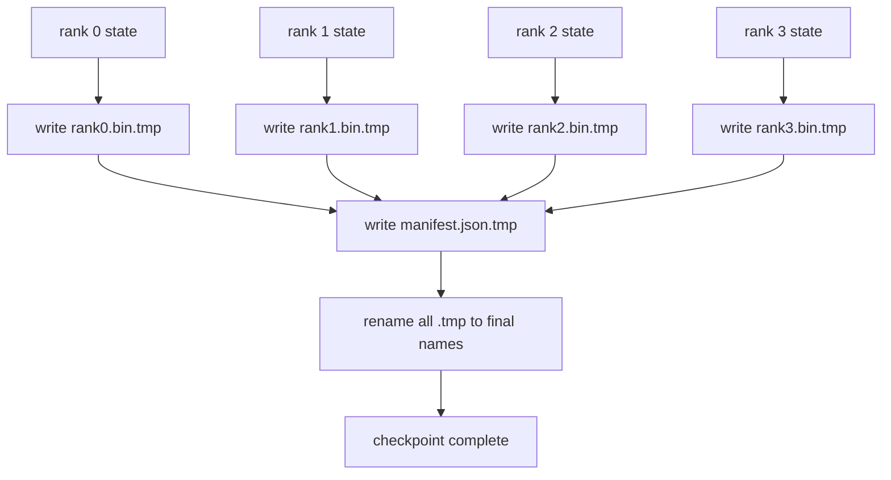

# 分片检查点与原子恢复

> 一个 70B 参数的训练任务每隔几小时就会因节点故障而暂停。检查点格式决定了你是损失 30 分钟还是 30 小时。分片检查点让每个 rank 并行写入自己的分片，并在一个清单（manifest）中记录所有权关系。恢复时，每个 rank 从自己的文件加载自己的分片，在相同的 world size 下重建状态，优化器步进就像什么都没发生过一样。原子写入可以防止写了一半的检查点污染下一次恢复。

**Type:** Build
**Languages:** Python
**Prerequisites:** Phase 19 Track C 第 42-49 课
**Time:** ~90 min

## 学习目标

- 将多 rank 检查点保存为每 rank 一个分片文件，外加一个记录哪个 rank 拥有什么的清单。
- 使用原子写入模式（先写到临时路径再重命名），确保写入中途崩溃绝不会产生写了一半的检查点。
- 从清单恢复，在每个 rank 上验证 fp16 参数和 ZeRO 优化器状态的字节级一致。
- 让清单模式能防御三种故障模式：world size 变化、分片数量不匹配和部分写入。

## 问题所在

普通检查点将所有参数和优化器状态读入 rank 0，汇聚（gather），然后写入单个文件。对一个 70B 模型来说，这是 1.1 TB 的状态通过一个 rank 的网络端口。写入会阻塞所有其他 rank，因为它们在空闲等待汇聚完成。IO 带宽受限于最慢的单块 GPU 的网络链路，而不是聚合带宽。在真实集群上，先汇聚后写入这一步可能比之前一个小时的训练时间还长，也就是说这个任务每天训练能产出的检查点不到一个。

分片检查点反转了这个模式：每个 rank 并行地把自己的分片写到自己的文件里。清单记录哪个 rank 拥有哪个分片，这样恢复时就能把每个分片放回它原来的位置。聚合写入带宽随集群规模扩展。一个通过单个 rank 写需要 4 小时的 1 TB 检查点，通过 64 个 rank 只需要 4 分钟。此外，清单为不兼容的恢复提供了契约：world size 变化可被检测到，部分写入可被检测到，加载路径可以大声报错而不是静默地使用过期数据。

## 核心概念



### 清单模式

```json
{
  "world_size": 4,
  "step": 1234,
  "wall_clock_seconds": 4521,
  "shards": [
    {"rank": 0, "path": "rank0.bin", "sha256": "...", "param_shard_offset": 0, "param_shard_numel": 65536},
    {"rank": 1, "path": "rank1.bin", "sha256": "...", "param_shard_offset": 65536, "param_shard_numel": 65536}
  ],
  "schema_version": 1
}
```

有三个字段是承重的。`world_size` 让不同 world size 下的恢复大声失败，而不是静默损坏。每个分片的 `sha256` 能捕捉部分写入或损坏写入。每个分片的 `param_shard_offset` 和 `param_shard_numel` 让加载器能在正确的位置重建扁平参数张量。

### 原子写入

标准模式：把每个分片写到 `<name>.tmp`，把清单写到 `manifest.json.tmp`，对每个文件 fsync，然后重命名。同一文件系统内的 POSIX rename 是原子的；要么新文件完整存在，要么旧文件仍在。在最后一次重命名之前崩溃，前一个检查点仍然是生效的那个。没有原子写入时，崩溃可能留下一个部分写入的分片和一个已存在的、指向它的清单，恢复时加载会损坏优化器状态。

### 模式必须防御的三种故障模式

| 故障 | 症状 | 防御 |
|---------|---------|---------|
| World size 变化 | 用 N=4 的清单在 N=8 上恢复 | 清单中 world_size 不匹配，大声失败 |
| 分片数量不匹配 | 恢复时看到的 rank*.bin 文件少于清单中的分片数 | 枚举分片，逐一验证存在 |
| 部分写入 | 分片文件在刷盘中途被截断 | 加载时进行 sha256 校验 |

每种防御都尽早拒绝错误的加载；否则就是静默损坏，在 100 步之后 loss 变成 NaN 时才暴露。

### 为什么用每 rank 文件，而不是一个大文件

通过 `O_APPEND` 并发写一个文件在 POSIX 上对字节对齐的写入是可行的，但实践中单个分片内的偏移跨越 MB 级的区域，锁竞争成为主导。每 rank 文件没有竞争，并且当底层文件系统是并行文件系统（Lustre、GPFS）时还能受益于条带化。生产级栈（DeepSpeed、FSDP、NeMo）出于这个原因都使用每 rank 文件。

```figure
ci-sharded-checkpoint
```

## 动手实现

`code/main.py` 实现：

- 一个 `ShardManifest` dataclass，包含上述模式外加 `to_json`/`from_json`。
- 一个 `save_sharded(state_dict_per_rank, dir, step)`，使用原子"先临时后重命名"模式将每个 rank 的二进制状态写到自己的文件，然后写入清单。
- 一个 `load_sharded(dir, expected_world_size)`，读取清单，验证每个分片的 sha256，并返回每 rank 的状态字典。
- 一个往返测试：构建每 rank 状态，保存，加载，断言字节级一致。

运行它：

```bash
python3 code/main.py
```

输出：写入 4 个分片文件加清单，然后重新加载并进行字节级一致校验。

## 生产环境中的实践模式

以下三种模式能让检查点足够健壮，可以投入生产。

**异步写入。** 生产级栈在单独的线程或进程中发起检查点写入，让训练继续进行。屏障设在下一个检查点处：在上一次保存完成之前不开始下一次保存。DeepSpeed 的 `async_io` 标志正是这样做的。本课保持写入为同步，以便步骤清晰可见。

**先写本地快速磁盘，再异步上传。** 先写到本地 NVMe（快），然后异步上传到 S3 或 GCS。两层模式让集群内的检查点保持快速恢复能力，同时把持久副本传送到集群外用于归档。清单记录本地路径；上传清单记录远程路径。

**轮换很重要。** 生产运行保留最近 K 个检查点（通常 3-5 个）并轮换掉最旧的。没有轮换，磁盘会在运行中途被填满，下一个检查点写入就会失败。有了轮换，下一次保存先删除最旧的，释放空间预算。

## 使用方式

生产模式：

- **DeepSpeed 检查点。** `deepspeed.save_checkpoint(tag=step)` 写入每 rank 文件和一个指向活动 tag 的 `latest` 文件。
- **PyTorch FSDP 检查点。** `torch.distributed.checkpoint` 保存分片状态，并用一个 `Planner` 决定每 rank 的布局。
- **NeMo。** 用统一的 `save_to_checkpoint` API 封装 DeepSpeed 和 FSDP，并添加元数据。

## 上线实战

第 81 课会保存端到端 DDP+ZeRO 运行的分片检查点，并在相同 world size 上重新加载它，以证明恢复契约成立。

## 练习

1. 添加异步写入：在另一个线程中启动保存，让训练继续。在下一次保存之前阻塞，直到上一次完成。
2. 添加 `last_5_steps` 轮换：保留最近的 5 个检查点，在保存新检查点之前删除最旧的。
3. 为内层循环的重新加载添加一个仅 CRC 的快速验证路径（轮换会把一个检查点变成新的活动检查点，此时无需完整 sha256 校验）。
4. 添加跨 world size 加载：通过读取清单，从 N=4 重新分片到 N=8，即拼接后再重新分片。
5. 添加上传到假 S3（第二个目录）并写入上传清单。实现两层存储策略的防御。

## 关键术语

| 术语 | 人们怎么说 | 实际含义 |
|------|----------------|------------------------|
| 分片检查点 | "每 rank 保存" | 每个 rank 并行写入自己的分片文件 |
| 清单 | "索引" | 记录分片路径、偏移和 sha256 的 JSON 文件 |
| 原子写入 | "tmp 后 rename" | 先写到 .tmp 再 POSIX rename，崩溃时前一个文件仍然生效 |
| 部分写入 | "截断的分片" | 写入中途崩溃产生损坏的分片；sha256 能捕捉到它 |
| 轮换 | "保留最近 K 个" | 写入新检查点前删除最旧的，以限制磁盘占用 |

## 延伸阅读

- [DeepSpeed 检查点](https://deepspeed.readthedocs.io/en/latest/model-checkpointing.html)
- [PyTorch torch.distributed.checkpoint](https://pytorch.org/docs/stable/distributed.checkpoint.html)
- [POSIX rename 原子性](https://pubs.opengroup.org/onlinepubs/9699919799/functions/rename.html)
- Phase 19 第 78 课 - 本检查点所针对保存的 ZeRO 状态
- Phase 19 第 81 课 - 端到端演示对保存状态进行往返验证