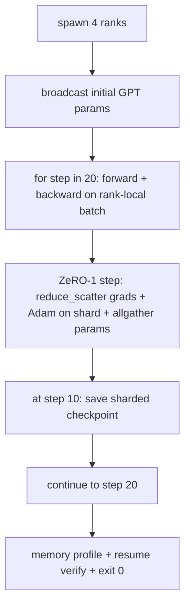

# 端到端分布式训练

> 第 76 到 80 课各自构建了一个组件。这是整合：一个微型 GPT 在 4 个模拟 rank 上训练，使用 DDP 进行梯度同步，ZeRO-1 进行优化器状态分片，并在中途保存分片检查点。演示运行 20 步，自行终止，打印损失曲线和内存概览，并写入可恢复的检查点。

**Type:** Build
**Languages:** Python
**Prerequisites:** 第 19 阶段 Track C 第 42-49 课
**Time:** ~90 分钟

## 学习目标

- 将 DDP（第 77 课）、ZeRO-1（第 78 课）和分片检查点（第 80 课）组合成一个训练循环。
- 在 4 个模拟 rank 上，于小型合成语料库上训练一个 2 层 transformer 语言模型，共 20 步。
- 打印每步损失表、每个 rank 的内存概览，以及一个检查点清单（在相同 world size 下重启后可逐字节一致地恢复）。
- 论证这一组合的合理性：每个组件在前面的课程中都已被独立测试过，本节课证明它们可以正确组合。

## 问题所在

结业项目是对各组件能否协同工作的证明。第 76 课实现了集合通信。第 77 课将它们封装为 DDP。第 78 课用 reduce_scatter 分片优化器状态。第 79 课分析了流水线。第 80 课保存了分片检查点。每课都独立存在并拥有各自的测试。而真实的训练运行会同时使用所有原语；如果组合出错，损失会发散、检查点无法恢复，或者每个 rank 的内存不减反增。

本节课运行端到端演示并验证四个不变量：(a) 损失在 20 步内于浮点噪声范围内单调下降；(b) 每个 rank 在每一步持有相同的参数范数；(c) 每个 rank 的优化器内存等于 ZeRO-1 公式的 12P/N 字节；(d) 第 10 步的检查点在重启后逐字节一致地加载。演示会自行终止：20 步、单条命令、退出码 0。

## 概念



### 微型 GPT

模型刻意做得很小：2 个 transformer 块、嵌入维度 32、4 个注意力头、词表 64、序列长度 16、批量 4。几千个参数。足以触发每一条接线决策（多头注意力走标准的掩码路径；LayerNorm 有需要同步的权重；LM head 是独立的投影回词表的线性层）。又足够小，使 20 步在 4 个 CPU rank 上几秒内完成。

### 组合规则

| 课程组件 | 它负责什么 | 它留给循环什么 |
|--------------|--------------|----------------------------|
| DDP broadcast | 初始参数同步 | 构造时调用一次 |
| ZeRO-1 step | 梯度同步、主副本更新、参数广播 | 每步调用一次，替代 optimiser.step |
| 分片检查点 | 持久化每个 rank 的状态、带 sha256 的清单 | 在 rank 0 上调用，状态通过 allgather 收集 |
| 训练循环 | 前向、反向、损失日志 | 按顺序调用上面三项 |

循环不感知 reduce_scatter 或 rendezvous 文件。ZeRO 和检查点模块只暴露循环可组合的窄接口。

### 为什么是微型 GPT 而不只是 MLP

第 77 课的 MLP 足以验证梯度同步。微型 GPT 增加了三件事：词表上独立的 LM head（本课为清晰起见不与嵌入绑定；完整 GPT 通常将 head 与词嵌入绑定权重）、softmax+交叉熵作为损失（比 MSE 有更多数值边界情况），以及非对称前向（嵌入，然后每层的注意力再 MLP）。结业项目若仍用 MLP，会掩盖组合是否正确处理 LayerNorm 或嵌入层的梯度形状。

### 自行终止意味着退出码 0

循环运行固定的 20 步然后退出。不需要 `while True`，不需要人工干预，也不从外部状态恢复。一个可以无人值守运行、结束后留下完整日志的结业项目，就是一个证明系统接线正确的结业项目。如果任何组件死锁，演示永远不会返回，测试框架会捕获它。

```figure
ci-distributed-assembly
```

## 动手构建

`code/main.py` 实现了：

- `MiniGPT`：带掩码自注意力和独立 LM head 的 2 层 transformer。
- `make_corpus(seed, total_tokens)`：确定性的下一词预测数据。
- `_train_worker`：每个 rank 启动一个；广播初始参数、运行循环、调用 ZeRO 步，并在第 10 步写入分片检查点。
- `verify_resume`：主运行结束后，在进程内重新加载第 10 步检查点，并逐字节断言保存的主分片与内存快照一致。
- `main`：编排整个演示，打印损失表、内存概览和验证结果。

运行方式：

```bash
python3 code/main.py
```

输出：一个 20 行的损失表、一个 4 行的每 rank 内存概览、一个检查点清单，以及成功时的一行 "RESUME VERIFIED"。

## 生产环境中的实践模式

三种模式用于真实运行的组合。

**每 K 分钟检查点，而非每 K 步。** 步耗时随序列长度和微批数量而变化。以 10 分钟为节奏的检查点无论模型大小如何都能覆盖相同的计算量。本课为简单起见采用基于步数的策略；生产环境使用基于时钟时间的策略。

**及早检测发散。** 生产运行在 backward 后加入 NaN 守卫和损失尖峰检测器；如果损失在一步内跳升超过 2 倍，就回滚到上一个检查点，而不是让优化器走进退化状态。本课的损失曲线是平滑的，守卫不会被触发，但钩子保留在原处。

**跨 rank 聚合内存概览。** 真实运行中每 rank 内存因 rank 而异（拥有最大流水线阶段的 rank 持有更多激活值）。生产环境记录各 rank 的最大值加均值；本课打印每个 rank 的数值以展示公式吻合。

## 使用它

生产模式：

- **DeepSpeed。** 将 DDP + ZeRO + 流水线 + 激活检查点整合在一个配置下。本课的组合就是缩小版的 DeepSpeed 形态。
- **PyTorch FSDP。** 原生等价物。`FullyShardedDataParallel` 配合 `ShardingStrategy.SHARD_GRAD_OP` 即为 ZeRO-2。
- **NeMo 和 Megatron-LM。** 为超大规模模型添加张量并行；否则组合形态相同。

## 交付它

整个轨道到此结束。这 6 课合起来是真实团队在采用 DeepSpeed 之前会构建的分布式训练子系统；该抽象已在 gloo 上得到验证，失败模式也已被演练。第 17 阶段（基础设施与生产）是将此推向真实集群的地方。

## 练习

1. 添加注意力头的张量并行切分，并验证损失与单 rank 基线一致。两个 rank：每 rank 一半的注意力头，对注意力输出做 allreduce。
2. 添加跨 4 个微批的梯度累积，并证明其梯度等于一个大批量的梯度。
3. 添加从第 10 步恢复的路径，实际继续训练到第 20 步，并产生与原始运行相同的最终损失。
4. 将指标导出（损失、梯度范数、步耗时）为 JSONL，以便事后可视化这次运行。
5. 添加一个 NaN 守卫，在损失尖峰时回滚到上一个检查点，并用一步 LR 乘数强制制造尖峰以演练回滚。

## 关键术语

| 术语 | 人们怎么说 | 实际含义 |
|------|----------------|------------------------|
| 端到端 | "把所有东西接起来" | 一次运行组合所有组件，而不是每个组件一个单元测试 |
| 内存概览 | "每 rank GB 数" | 每个 rank 为参数、梯度、优化器状态持有的字节数 |
| 恢复契约 | "保存和加载" | 检查点一次往返后每 rank 状态逐字节一致 |
| 自行终止 | "有界运行" | 固定步数、完成时退出码 0、无人工介入 |

## 延伸阅读

- [DeepSpeed 端到端训练教程](https://www.deepspeed.ai/getting-started/)
- [PyTorch FSDP 进阶教程](https://pytorch.org/tutorials/intermediate/FSDP_advanced_tutorial.html)
- [Megatron-LM 训练脚本参考](https://github.com/NVIDIA/Megatron-LM)
- 第 19 阶段第 76-80 课 - 本课组合的每一个组件
- 第 17 阶段 - 将组合推向真实集群