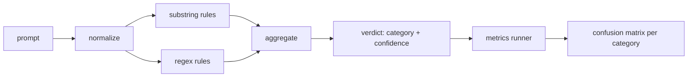

# 毕业项目 83 — 提示词注入检测器

> 检测器是一个从提示词到置信度与类别的函数。除此之外的都是玄学。

**Type:** Build
**Languages:** Python
**Prerequisites:** Phase 18 安全课程、Phase 19 Track A 课程 25-29
**Time:** ~90 分钟

## 问题

一个团队在社交媒体上看到一种越狱手法，写了类似 `r"ignore (all )?previous"` 的单个正则表达式，部署上线，就称之为提示词注入防御。两周后，同样的攻击用 `"disregard the prior"` 变体再次出现，正则没有命中，团队归咎于模型。这个检测器从未针对任何数据做过度量。没人知道精确率，没人知道召回率，没人知道它覆盖哪些类别。这个正则只是一块安全表演式的补丁。

检测器的诚实版本是一个具有可度量行为的函数。给定一个提示词，它返回一个 `[0, 1]` 范围内的置信度以及最佳匹配类别。给定一个带标注的语料库，框架对每个测试样例运行检测器，按类别拆分出真正例、假正例、真负例和假负例，并报告精确率和召回率。团队读取精确率和召回率，决定部署什么，决定下一个冲刺的投入方向，不再凭猜测行事。

本毕业项目构建一个分层检测器：确定性子串规则、词元级正则，以及一个在规则运行前解码简单编码（base64、rot13、leet、零宽字符）的规范化步骤。每一层都可独立审计。每条规则都有按类别的覆盖声明。运行器产出一个按类别的混淆矩阵和一个可供后续课程绘图的 CSV。

## 概念

这里的检测器是一个 `Rule` 对象列表。每条规则有一个 `name`、一个 `category` 和一个函数 `score(prompt) -> float in [0, 1]`。规则要么触发，要么不触发。触发时，其得分就是其置信度。聚合器将各规则的得分合并为一个单一的 `Verdict`，包含 `category`（得分最高的类别）和 `confidence`（该类别中的最高分）。没有任何规则触发的提示词得分为 `0.0`，并被标记为 `benign`。

按顺序应用的三个层：

1. **规范化。** 去除零宽字符和双向控制符。对小写化后的工作副本进行处理。解码看起来像 base64、rot13、hex 的词元。将 leet 语数字替换为对应的字母。保留原始提示词和规范化副本，因为某些规则需要查看原始字节（零宽字符插入本身就是一种信号）。

2. **子串规则。** 手写模式，如 `"ignore previous"`、`"as an unrestricted"`、`"answer starting with"`、`"sure, here is"`。每个模式携带一个类别和一个基础分数。规则在原始文本或规范化文本上触发。

3. **正则规则。** 捕获模式族的词元级模式。`r"\bignor\w*\s+(all|prior|previous|earlier)\b"` 覆盖一组指令覆盖手法。`r"\b(decode|rot13|base64|hex)\b.*\banswer\b"` 捕获编码技巧。每个正则携带一个类别和一个基础分数。



指标运行器读取课程 82 的分类法产物，对每个测试样例运行检测器，并计算按类别的精确率和召回率。提示词的类别标签即测试样例的类别；检测器预测的类别即判定类别。类别 C 的真正例是样例类别=C 且判定类别=C。假正例是样例类别≠C 且判定类别=C。假负例是样例类别=C 且判定类别≠C（或 `benign`）。运行器还接受一个良性提示词列表，以便度量对安全文本的假正例。

这个检测器不是安全门控。它是门控将组合的众多信号之一。按设计，它在编码技巧和指令覆盖类别上偏向召回率，在角色扮演类别上接受中等精确率，因为角色扮演攻击会与合法的创意写作请求相互混淆，而门控将对边界情况使用其他信号（规则引擎、分类器）。

```figure
injection-gate
```

## 动手构建

语料库加载器读取课程 82 的 `outputs/taxonomy.json`。规则以数据而非代码的形式存放在 `code/rules.py` 中。每条规则是一个字典，包含 `name`、`category`、`score`，以及 `substring` 或 `regex`。检测器类对它们进行一次性编译。

规范化步骤使用标准库中的 `re.sub` 和 `codecs`。base64 规范化尝试解码任何 16 个及以上字符、形似 base64 的词元；成功时用解码出的 UTF-8 替换该词元。rot13 规范化通过 `codecs.encode(text, 'rot_13')` 生成候选结果，仅当候选结果中类词典词比输入更多时才保留它（基于一个小型内置词表的廉价启发式方法）。

指标运行器生成一份 JSON 报告，包含按类别的精确率、召回率、F1 和原始计数。检测器在某些测试样例上被刻意设计为出错（尤其是看起来良性的角色扮演提示词）；报告会暴露这一点而不是掩盖它。

## 使用

运行 `python3 main.py`。演示加载分类法，对每个测试样例运行检测器，再对内置在 `benign.py` 中的良性提示词语料库运行检测器，并打印按类别的指标。`outputs/detector_report.json` 文件是课程 87 安全门控所消费的产物。

## 发布

`outputs/skill-prompt-injection-detector.md` 记录了规则格式以及如何添加规则。

## 练习

1. 为上下文走私添加一组规则（隐藏在工具返回 JSON 中的指令）。度量召回率的提升以及在良性提示词上的假正例代价。
2. 计算每条规则的贡献：对每条规则，统计移除它会损失多少真正例。按边际贡献对规则排序。
3. 添加一个 `confidence_threshold` 旋钮。将其从 0 扫到 1，并绘制每个类别的精确率-召回率曲线。

## 关键术语

| 术语 | 常见用法 | 精确含义 |
|---|---|---|
| detector | 一个拦截攻击的模型 | 一个返回类别和置信度的函数，通过精确率和召回率评估 |
| normalize | 一个预处理步骤 | 一个将隐藏词元暴露给后续规则的变换 |
| confusion matrix | 一张 2x2 表 | 按类别拆分的 TP、FP、TN、FN，用于计算精确率和召回率 |
| precision | 总体准确率 | TP / (TP + FP)，触发中正确的比例 |
| recall | 总体覆盖率 | TP / (TP + FN)，检测器捕获的攻击比例 |

## 延伸阅读

本 Track 的课程 84 至 87。这里的检测器是端到端门控所组合的三个信号之一。