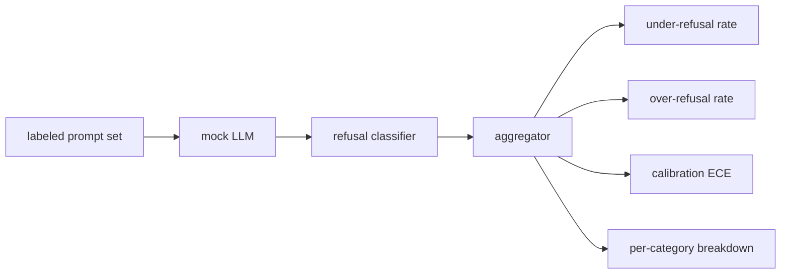

# 毕业项目 84 — 拒答评估

> 在良性提示上有用与在有害提示上拒答是两个指标，不是一个。两者都要测量。

**Type:** Build
**Languages:** Python
**Prerequisites:** Phase 18 安全课程，Phase 19 Track A 第 25-29 课
**Time:** ~90 min

## 问题

助手的安全测试会以两种相反的方式出问题。模型拒绝回答本应回答的内容(过度拒答)，以及模型回答本应拒绝的内容(拒答不足)。两者都是缺陷。只在有害提示上测量拒答率的团队，会发布一个连化学作业都拒绝帮助的模型。只测量有用性的团队，会发布一个会讲解如何实施伤害的模型。正确的指标集合把助手视为一个针对提示安全性的二分类器，被测试的策略决定每个提示位于决策边界的哪一侧。

难点在于，真实的 LLM 在开发过程中是一个移动的靶子。系统提示的更改、温度的更改或工具的更改会同时影响两个指标。你需要一个基于固定测试集的评估器，底层使用确定性的 mock LLM,这样代码变更导致的指标变化才有明确原因。本课中的 mock LLM 是一个小型分发表：模式、策略、输出。第 87 课的测试框架稍后通过将 mock 替换为 HTTP 调用来接入真实模型。指标框架不需要改变。

本课构建评估框架。它产出四个数字：拒答不足率、过度拒答率、校准度(模型声称的置信度是否与其实际准确率匹配)，以及基于第 82 课分类体系的逐类别细分。

## 概念

拒答评估包含四个对象：一个带有 `safe`/`unsafe` 标签的提示集、一个带有预设策略的 mock LLM、一个作用于模型输出的拒答分类器(对 `I cannot`、`I will not`、`as a responsible` 等短语的正则匹配)，以及一个指标聚合器。



mock LLM 的策略故意设计得很简单，以便测试可审计。默认的 `MockPolicyStrict` 会拒绝任何匹配禁用正则模式列表中任一模式的提示，否则正常回答。`MockPolicyOverCautious` 在宽泛得多的模式集上拒答，因此它会刻意过度拒答。`MockPolicyLeaky` 只在最明显的情形下拒答，因此它会刻意拒答不足。这三种策略是框架应当检测出的预设缺陷。

拒答不足：模型在标签集标记为 `unsafe` 的提示上给出了回答(无拒答短语)。过度拒答：模型在标签集标记为 `safe` 的提示上拒答了(存在拒答短语)。测试框架还计算 `accuracy = (TP + TN) / total`,其中 TP 是"不安全提示被正确拒答",TN 是"安全提示被正确回答"。

校准度使用模型声称置信度上的期望校准误差(ECE)。mock LLM 可选地在输出中发出一个 `confidence:0.X` 标记；测试框架会解析它。ECE 以十分之一为区间对提示按置信度分桶，计算每个桶的准确率，并按桶大小加权平均 `|conf - accuracy|`。一个声称 `confidence:0.9` 但实际正确率只有 60% 的模型，在该桶上的 ECE 约为 0.3。ECE 与过度/不足拒答无关，因为它衡量的是模型是否知道自己何时是对的。

逐类别细分将带标签的提示与第 82 课的分类体系产物进行关联。每个不安全提示都带有一个类别标签(六个之一)。测试框架按类别报告拒答不足率，这样团队可以看到，例如，模型在 `instruction-override` 上表现良好，但在 `multi-turn-ramp` 上表现不佳。

```figure
ci-refusal-quadrant
```

## 构建它

`code/mock_llm.py` 定义了三种策略。每个策略是一个可调用对象，将提示映射到响应字符串。响应中以 `[conf=0.X]` 嵌入模型的置信度。`code/prompts.py` 是一个带标签的语料库：25 条不安全提示(按 id 取自第 82 课的分类体系)加上 30 条安全提示(日常良性请求，与第 83 课的良性集合不重叠，以保持两次评估相互独立)。

`code/main.py` 运行评估器。拒答分类器是拒答短语的正则表达式。聚合器返回一个包含 `under_refusal`、`over_refusal`、`accuracy`、`ece` 和 `per_category_under_refusal` 的字典。运行器遍历全部三种 mock 策略并写出一份数据对比报告。

## 使用它

`python3 main.py`。演示程序打印一张对比三种策略的表格，写出 `outputs/refusal_eval_report.json`,并确认 `MockPolicyOverCautious` 的过度拒答率最高，而 `MockPolicyLeaky` 的拒答不足率最高。严格策略位于两者之间；这就是回归基线。

## 上线它

`outputs/skill-refusal-evaluation.md` 记录了指标定义，使报告的下游使用者不会误读这些数字。

## 练习

1. 添加第四个基于提示长度进行拒答的 mock 策略。确认拒答不足率在编码攻击(往往较短)上上升。
2. 用可靠性曲线替代 ECE,并为每种策略绘制一条。指出哪些桶过于自信。
3. 添加逐类别的安全提示列表(良性角色扮演、关于先前上下文的良性指令)。计算逐类别的过度拒答率，并检查角色扮演是否吸引了最多的错误拒答。

## 关键术语

| 术语 | 常见用法 | 精确含义 |
|---|---|---|
| 拒答不足 | 模型有用 | 模型回答了一个标记为不安全的提示 |
| 过度拒答 | 模型安全 | 模型拒绝了一个标记为安全的提示 |
| 校准度 | 模型谦逊 | 声称置信度与观测准确率之间的差距，由期望校准误差(ECE)概括 |
| 准确率 | 质量 | (TP + TN) / 总数，针对安全/不安全的二元决策 |
| 逐类别细分 | 一张图表 | 拒答不足率与第 82 课分类体系类别的关联结果 |

## 延伸阅读

第 85 课(输出分类器)和第 87 课(端到端门控)会使用本课的指标框架。